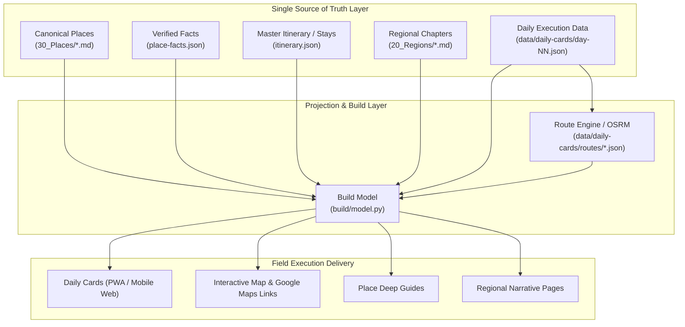

# SP-FR Guidebook Execution Synchronization Program
# EX-00 Target Execution Data Model & Architecture Specification

**문서 버전**: v1.0  
**기준 일자**: 2026-08-19  
**적용 범위**: Day 1–43 전체 일정, 8개 Region, 102개 Canonical Places, 234개 Day Stops, Daily Cards, Daily Route Maps, Bookings, Transport

---

## 1. 배경 및 설계 원칙

Place Content Enrichment Program(PC-06C ~ PC-14B)을 통해 102개 Canonical Place의 본문·참조·검색 무결성은 완벽히 격리·안정화되었다.
Execution Synchronization Program(EX-00 ~ EX-14)의 핵심 목적은 **"가이드북 원고"를 "모바일 현장 실행 운영 체계"로 동기화**하는 것이다.

### 4대 불변 원칙 (4 Immutable Principles)

1. **Place = 정보의 단일 정본 (SOT for Knowledge & Facts)**
   - 장소의 역사, 건축, 심층 해설, 공식 사실(운영시간, 요금, 공식 웹사이트)은 `source/CURRENT/30_Places/<slug>.md`와 `data/place-facts.json`이 유일한 정본이다.
   - Day 일정, Daily Card, Map에서 장문 설명을 중복 작성(duplicate long-form)하지 않는다.

2. **Day = 실행의 단일 정본 (SOT for Execution & Sequence)**
   - 날짜별 이동 순서(Stop sequence), 계획된 시작/종료 시각, 소요 시간, 교통편(Legs), 식사, 예약 시간, Plan B는 Day Layer(`data/daily-cards/day-NN.json`)가 정본이다.

3. **Daily Card = 모바일 실행 요약 프로젝션 (Projection for On-the-ground Mobile UX)**
   - Daily Card는 독립된 일정이 아니라 Day 데이터 모델의 모바일 최적화 뷰(Projection)이다.
   - 스마트폰 화면 1~2 스크롤 내에서 당일의 전체 동선, 핵심 타임라인, 필수 예약, 이동수단, 길찾기 링크를 직관적으로 제공한다.

4. **Map = 실제 이동 동선의 공간적 프로젝션 (Projection for Spatial Routing)**
   - 지도는 단순한 장소 핀(Pin)의 집합이 아니라, 당일의 실제 이동 순서 (`Stop 1 → Leg 1 → Stop 2 → Leg 2 → ...`)를 정확히 투영해야 한다.

---

## 2. 계층별 데이터 흐름 및 의존성 (Data Flow & Architecture)



---

## 3. 정본(SOT) 및 데이터 매트릭스

| 데이터 도메인 | 단일 정본 (SOT) | 부속/파생 데이터 | 소비자 (Consumers) | 동기화/검증 메커니즘 |
|---|---|---|---|---|
| **장소 심층 해설** | `source/CURRENT/30_Places/<slug>.md` | `why_go`, `dont_miss`, `body_md` | 장소 상세 페이지, 검색 색인 | `validate_place_canonical_model.py` (Overwrite 방지, 중복 방지) |
| **장소 공식 사실 (운영/요금/예약URL)** | `data/place-facts.json` | `Fact` 엔티티 (`confidence`, `verified_at`) | 장소 실용 정보, Daily Card 배지 | `build/guards/guard_freshness.py`, `content_guard.py` |
| **숙박 거점 및 체류 일정** | `source/CURRENT/10_Core/itinerary.json` | `stays` 배열 (`checkin`, `checkout`, `base`) | Trip 모델, Day 거점 매핑, 지도 | `build/model.py` (`load_trip`) |
| **일자별 실행 일정 (Stop Sequence)** | `data/daily-cards/day-NN.json` | `stops` 배열 (`order`, `start`, `end`, `category`) | Daily Card UI, Day별 지도 핀 순서 | `build/model.py`, `scripts/ex00_baseline_audit.py` |
| **구간별 이동 (Legs / Transport)** | `data/daily-cards/day-NN.json` | `legs` (`mode`, `duration`, `line`), `transport` | Daily Card 이동 탭, 지도 라우팅 | `build/render.py` |
| **지리 좌표 (Coordinates)** | `data/daily-cards/day-NN.json` (Stop) / `30_Places` (Place) | `lat`, `lng`, `address` | Day 지도, 전체 여정 지도, Google Maps 외부 링크 | `validate_place_canonical_model.py` (지역 바운딩 박스 검증) |
| **실제 경로 지오메트리 (Route Geometry)** | `data/daily-cards/routes/day-NN-*.json` | OSRM GeoJSON 폴리라인 | Day 지도 폴리라인 렌더러 | `scripts/daily-cards/cache_routes.py` |
| **고정 예약 제약 (Fixed Bookings)** | `source/OPERATIONS/110_Phase8_Reservation_and_Operations_Lock_Register_v1.0.md` + `data/place-facts.json` | `reservation` 필드 in Day Stops | Daily Card 예약 배지, 알림 | `build/guards/guard_conflict.py` |
| **식사 및 카페 (Meals)** | `data/daily-cards/day-NN.json` (`food`, `category="food"`) | 메뉴 추천, 식당 좌표 | Daily Card 식사 섹션 | `build/render.py` |
| **대응 계획 (Plan B)** | `data/daily-cards/day-NN.json` (`backup`, `needsReview`) | 우천/지연/휴관 대안 | Daily Card Plan B 카드 | `build/render.py` |

---

## 4. 핵심 엔티티 스키마 정의 (Entity Schemas)

### A. Day Execution Entity (`Day`)

```typescript
interface DayExecution {
  schemaVersion: "1.0";
  day: number;                  // 1 ~ 43
  date: string;                 // "2026-08-29" (ISO 8601)
  city: string;                 // "Barcelona" | "Nice" | "Nice → Aix"
  title: string;                // 당일 핵심 테마
  region: string;               // 그날 밤 숙박 지역 슬러그 ("barcelona", "luberon" 등)
  regions: string[];            // 이동일의 경우 거치는 지역 목록
  country: "es" | "fr" | "es-fr";
  sourceStatus: "authoritative" | "prototype-reviewed";
  startTime: string;            // "09:00"
  endTime: string;              // "21:30"
  totalDuration: string;        // "12h 30m"
  totalDistance: string;        // "15.4 km" | "185 km"
  fatigue: "1" | "2" | "3" | "4" | "5"; // 1(가벼움) ~ 5(최고강도)
  hotel: {
    name: string;
    id?: string;
    address?: string;
    checkIn?: string;
    checkOut?: string;
    lat?: number;
    lng?: number;
  };
  stops: Stop[];
  legs: Leg[];
  transport: string[];          // ["metro", "walk", "rental_car"]
  food: string[];               // 당일 추천 식사/메뉴 요약
  highlights: string[];         // 당일 3대 핵심 장면
  backup: string;               // Plan B 대안 (우천/지연 시)
  map: {
    zoom: number;
    center: [number, number];   // [lat, lng]
    routeCache?: string;        // "routes/day-04-driving-osrm.json" | null
  };
  needsReview?: string[];       // 현장 재확인 필요 항목
}
```

### B. Stop Entity (`Stop`)

```typescript
interface Stop {
  id: string;                   // Canonical Slug or Unique Stop ID
  place_ref?: string;           // Canonical Place Slug (있는 경우)
  order: number;                // 1, 2, 3... (방문 순서)
  start?: string;               // "10:30"
  end?: string;                 // "12:30"
  name: string;                 // 표시 장소명
  category: "culture" | "sight" | "food" | "hotel" | "transport" | "shopping" | "activity" | "cafe";
  lat?: number;                 // 위도 (WGS84)
  lng?: number;                 // 경도 (WGS84)
  address?: string;             // 좌표 불명 시 정확한 주소
  summary?: string;             // 현장 행동 요약 (1~2줄)
  menu?: string;                // 식당/카페의 경우 추천 메뉴
  reservation?: string;         // 예약 상태 ("10:30 확정 [CONFIRMED]", "현장 구매" 등)
  optional?: boolean;           // true인 경우 시간 부족 시 우선 삭제 가능
}
```

### C. Leg Entity (`Leg`)

```typescript
interface Leg {
  from: string;                 // 출발 Stop ID
  to: string;                   // 도착 Stop ID
  mode: "walk" | "metro" | "bus" | "train" | "drive" | "flight" | "taxi";
  duration?: string;            // "15 min", "1h 45m"
  distance?: string;            // "1.2 km", "120 km"
  line?: string;                // "Metro L3", "TER 86021", "TGV 12176"
}
```

---

## 5. Stop 분류 및 예외 규정 (Stop Classification Taxonomy)

모든 234개 Day Stop은 다음 8개 범주 중 하나로 명확히 분류된다.

1. **`PLACE` (정본 장소 스톱)**
   - 102개 Canonical Place (`30_Places/*.md`)와 1:1로 직접 연결되는 관광/문화/자연/핵심 스팟.
   - 장소 상세 가이드 및 팩트 시트와 직결.
2. **`ACCOMMODATION` (숙소 스톱)**
   - 체크인, 체크아웃, 짐 보관, 복귀, 야간 취침 스톱.
   - `hotel` 객체 및 `itinerary.json`의 `stays`와 연결.
3. **`TRANSPORT` (교통 허브 스톱)**
   - 공항 터미널, TGV/TER 기차역, 렌터카 영업소, 메트로 주요 환승역.
   - 고정 시간표 및 예약 PNR이 연계됨.
4. **`MEAL` (식사/카페 스톱)**
   - 점심, 저녁, 시장 내 식사, 유명 카페/비스트로 방문.
   - 정본 장소가 아니더라도 메뉴 및 운영시간 정보 제공.
5. **`REST` (휴식/완충 스톱)**
   - 슬로우 모닝, 세탁, 장보기, 공원 벤치 휴식, 일정 완충.
   - 장기 여행 피로 누적 방지.
6. **`EXERCISE` (운동 스톱)**
   - 아침 조깅, 야외 수영, 체육 활동.
7. **`BOOKING_EVENT` (행사/예약 이벤트 스톱)**
   - 경마 대회 (Prix de l'Arc), 축제, 공연, 오페라 등 시간 고정 이벤트.
8. **`OTHER` (기타 연결 스톱)**
   - 귀로 이동, 뷰포인트 경유, 짐 정리 등.

---

## 6. 지도 및 라우팅 상태 분류 (Map & Routing Taxonomy)

각 Day의 지도 완성도를 7개 상태(A~G)로 분류하여 추적 관리한다.

- **`A`**: 순서화된 정본 핀만 표시 (Ordered stop pins only, 경로선 없음)
- **`B`**: 핀 사이를 잇는 단순 시각 직선 (Visual straight lines)
- **`C`**: OSRM/실측 기반 도보 경로 지오메트리 (Actual walking route polyline)
- **`D`**: OSRM/실측 기반 렌터카 운전 경로 지오메트리 (Actual driving route polyline)
- **`E`**: 열차/대중교통 노선 연계 경로 (Actual public transport route)
- **`F`**: 외부 Google Maps 길찾기 다이렉트 딥링크 (Google Maps directions link)
- **`G`**: 지도 또는 경로 없음 (No map/route)

---

## 7. 자동화 및 거버넌스 가이드라인

1. **자동 생성 파이프라인 대상**:
   - `Day` 데이터로부터 `Daily Card HTML` 자동 렌더링.
   - `Day.stops` 좌표로부터 지도 GeoJSON 페이로드 및 Google Maps 검색/길찾기 URL 자동 생성.
   - `place-facts.json`으로부터 예약 현황 및 운영시간 배지 자동 추출.
2. **수동 편집 보호 대상**:
   - `30_Places/*.md` 장문 텍스트는 빌드 도구에 의해 자동 덮어쓰기되지 않음 (`Place Overwrite Protection`).
   - `91_Place_Registry_v1.0.md`의 수동 등급 및 분류 체계 보존.
3. **Phase별 이행 계획**:
   - **EX-01**: 43일 일정의 시간/운영시간/피로도 현실성 전수 감사 (Matrix 작성).
   - **EX-02 ~ EX-08**: 8개 권역별 Day Itinerary ↔ Daily Card ↔ Map ↔ Place 완전 동기화.
   - **EX-09 ~ EX-10**: 43개 Daily Card 및 Daily Route Map 전면 리빌드.
   - **EX-11 ~ EX-14**: 제약 동기화, 모바일 UX 감사, 43일 풀 시뮬레이션, 최종 전권 승인.

