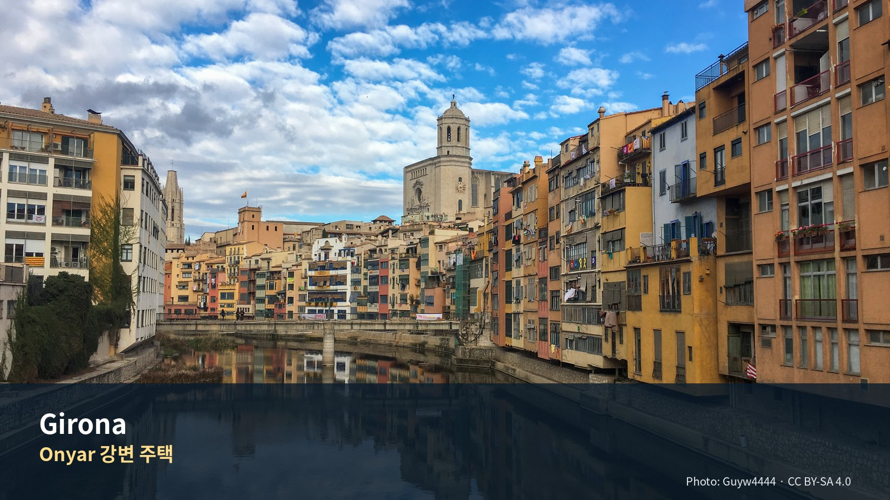

*Onyar 강변 주택 — Photo: Guyw4444, CC BY-SA 4.0; [원문](https://commons.wikimedia.org/wiki/File:The_houses_of_the_Onyar.jpg). 가이드북용으로 크롭·리사이즈.*


# Commercial Guide Module

> **중세도시의 저녁과 석조마을, 해안마을을 차량으로 잇는 3박**  
> Girona를 숙박 거점으로 두고 프랑스 카탈루냐와 Baix Empordà의 서로 다른 풍경을 비교하는 장

## Editor’s Verdict

| 항목 | 평가 |
|---|---|
| 여행 적합도 | ★★★★★ Jason·Julia의 생활형 여행에 최적화 |
| 예산 체감 | 중 |
| 일정 강도 | 차량일 2회로 다소 높음 |
| 예약 핵심 | 렌터카·주차 P0 · Peralada P1 |
| 우천 전환 | Girona 실내와 Collioure 체류 축소 |

## 놓치면 아쉬운 선택

| 등급 | 장소·경험 | 이 가이드북에서 추천하는 이유 |
|---|---|---|
| 필수 | **Girona 성벽과 대성당 권역** | 도착일 저녁과 이른 아침으로 나눠 도시의 높이와 골목을 읽는다. |
| 우선 추천 | **Collioure** | 시장·항구·야수파 풍경을 한 번에 경험하는 가장 성격이 뚜렷한 당일치기다. |
| 우선 추천 | **Pals–Peratallada–Calella** | 중세마을 두 곳과 해안마을 한 곳을 과밀하지 않게 연결한다. |
| 선택 | **Peralada 17:30** | Collioure 일정이 지연되면 가장 먼저 취소하는 시간지정 옵션이다. |

## 하루를 완성하는 네 가지 선택

| 시간·역할 | 추천 | 이용법 |
|---|---|---|
| 아침 | **Girona 성벽** | 단체관광 전 조용한 빛과 전망을 확보한다. |
| 점심 | **Peratallada** | 석조 골목 산책과 식사를 한 장소에 묶어 이동횟수를 줄인다. |
| 저녁 | **Plaça Independència 인근** | 차량일 뒤 숙소에서 가까운 곳으로 체력을 아낀다. |
| 스케치 | **Onyar 강변 또는 Calella 만** | 색면과 수평선이 분명해 짧은 스케치에 적합하다. |

## 이 지역의 Top 10

1. Onyar 강변
2. 대성당 계단
3. 성벽
4. 유대인 지구
5. Collioure 시장
6. 왕궁·항구
7. Peralada
8. Pals
9. Peratallada
10. Calella de Palafrugell

## 현장 메모

- **대표 촬영 장면:** Onyar 강변의 색색 주택과 다리
- **기념품 방향:** Empordà 식재료·지역 와인·소형 공예품
- **일정 삭제 원칙:** 선택 쇼핑·두 번째 카페·추가 내부관람부터 삭제하고 핵심 예약과 귀환 연결은 유지한다.
- **표시 기준:** 별점은 객관적 품질평가가 아니라 이 여행계획에서의 편집 추천도다.

---

# Chapter 05. 지로나·콜리우르·바이스 엠포르다
## 중세도시의 저녁, 프랑스 카탈루냐 해안마을, 석조마을과 코스타브라바

- 문서 버전: v1.1
- 상태: 일정 확정·1차 공식자료 검증 완료
- 체류기간: 2026-09-01 – 2026-09-04, 3박
- 여행자: Jason·Julia
- 차량: 바르셀로나에서 인수한 렌터카 사용
- 다음 거점: 니스
- 조사 기준일: 2026-07-30
- Julia의 수영: 선택 일정이며 숙소 선택조건이 아님

---


## Phase 10 공식정보 원칙

- 운영시간·요금·예약조건은 `OPERATIONS/116_Phase10_Official_Source_Fact_Verification_Register_v1.0.md`를 우선한다.
- 공식 페이지가 충돌하거나 날짜별 예약창이 필요한 항목은 계획가격이 아니라 **재확인**으로 본다.
- 날씨·화재통제·파업·교통은 전날 또는 당일 확인한다.

# Regional Context & Scheduled Place Dossiers

## 지역을 이해하는 다섯 개의 층

### 역사
로마 Gerunda, 중세 주교도시, 유대인 공동체의 번영과 추방, 근현대 카탈루냐 도시가 층층이 남아 있다.

### 경제
관광뿐 아니라 대학·식품산업·지역서비스의 중심이며, Costa Brava와 프랑스 국경권을 연결하는 교통거점이다.

### 사회
Barcelona보다 작고 보행친화적이며, 구시가지와 신시가지의 생활권이 분명하게 나뉜다.

### 문화
유대인 지구, 대성당, 성벽이 중세도시의 서사를 만들고, Empordà의 석조마을과 해안마을이 지역문화의 다양성을 보여준다.

### 이번 여행에서의 의미
도착일 저녁과 이른 아침은 Girona, 낮은 Collioure·Empordà에 배분하는 것이 가장 효율적이다.

## 일정에 포함된 장소별 상세 가이드

### 1. Girona Cathedral

**왜 중요한가**  
로마네스크 회랑과 세계적으로 넓은 단일 고딕 본당이 결합된 주교도시의 중심이다.

| 항목 | 실행정보 |
|---|---|
| 방문 방법 | Barri Vell 안쪽, 계단 접근. 숙소에서 도보. |
| 권장 관람법 | 계단의 축, 본당의 폭, 회랑의 조각을 순서대로 본다. |
| 권장 체류 | 60–75분 |
| 요금·예약 | 유료 통합권 가능. 공식사이트 확인. |
| 주의사항 | 계단과 경사, 늦은 도착 시 내부관람 불가. |
| 공식정보 | https://www.girona.cat/turisme/eng/monuments_catedral.php |

### 2. Girona Walls

**왜 중요한가**  
로마·중세 방어선이 산책로로 바뀐 곳으로 도시의 지형을 가장 잘 이해할 수 있다.

| 항목 | 실행정보 |
|---|---|
| 방문 방법 | 대성당 뒤편 여러 출입구. |
| 권장 관람법 | 한 방향으로 걷고 탑마다 모두 오르지 않는다. |
| 권장 체류 | 60–90분 |
| 요금·예약 | 무료. 9월 운영 약 08:00–21:00 확인. |
| 주의사항 | 노출된 구간, 비·강풍·한낮 더위. |
| 공식정보 | https://www.girona.cat/turisme/eng/monuments_muralla.php |

### 3. Collioure Château Royal

**왜 중요한가**  
마요르카 왕국과 프랑스 군사사의 층을 가진 해안요새다.

| 항목 | 실행정보 |
|---|---|
| 방문 방법 | Cap Dourats 등 외곽주차 후 항구 도보. |
| 권장 관람법 | 궁전보다 항구·성벽·국경도시의 전략적 위치를 본다. |
| 권장 체류 | 60분 |
| 요금·예약 | 유료. 계절별 운영시간 확인. |
| 주의사항 | 시장일 주차혼잡, 계단. |
| 공식정보 | https://www.tourisme-collioure.com/activites-collioure/les-sites-a-ne-pas-manquer-collioure/le-chateau-royal-collioure/ |

### 4. Chemin du Fauvisme

**왜 중요한가**  
Matisse와 Derain이 Collioure에서 실험한 강렬한 색채를 실제 풍경과 비교하는 야외코스다.

| 항목 | 실행정보 |
|---|---|
| 방문 방법 | 항구와 구시가지 곳곳의 복제패널을 따라 걷는다. |
| 권장 관람법 | 작품복제와 현재 풍경을 같은 시점에서 비교한다. |
| 권장 체류 | 45–75분 |
| 요금·예약 | 무료. |
| 주의사항 | 햇빛이 강해 오전 또는 늦은 오후 적합. |
| 공식정보 | https://www.tourisme-collioure.com/itineraire/chemin-du-fauvisme/ |

### 5. Pals Medieval Quarter

**왜 중요한가**  
평야 위 언덕마을로, 복원된 중세가로와 Empordà 조망이 강점이다.

| 항목 | 실행정보 |
|---|---|
| 방문 방법 | 외곽주차 후 오르막 도보. |
| 권장 관람법 | 골목보다 Josep Pla 전망대와 평야관계를 본다. |
| 권장 체류 | 60–75분 |
| 요금·예약 | 마을 무료. |
| 주의사항 | 관광버스 전 오전 방문. |
| 공식정보 | https://www.visitpals.com/en/find-out/medieval-village/stroll-through-the-medieval-area-of-pals-at-your-own-pace/ |

### 6. Peratallada

**왜 중요한가**  
암반을 파 만든 해자와 석조가로가 남아 있는 대표 중세마을이다.

| 항목 | 실행정보 |
|---|---|
| 방문 방법 | 마을 외곽 공식주차. |
| 권장 관람법 | 성문–골목–광장–점심을 한 흐름으로 본다. |
| 권장 체류 | 90–120분 |
| 요금·예약 | 마을 무료, 주차 유료 가능. |
| 주의사항 | 점심이 길어지면 Calella 시간이 줄어든다. |
| 공식정보 | https://www.visitperatallada.cat/en/venues/l/1149-medieval-elements-of-peratallada.html |

### 7. Calella de Palafrugell

**왜 중요한가**  
작은 만과 흰 어촌건축이 남아 있는 Costa Brava의 대표 해안마을이다.

| 항목 | 실행정보 |
|---|---|
| 방문 방법 | 외곽주차 후 해변 도보. |
| 권장 관람법 | Port Bo 아치, 해변, 짧은 Camí de Ronda만 본다. |
| 권장 체류 | 90–150분 |
| 요금·예약 | 마을·해안산책 무료. |
| 주의사항 | 주차혼잡, 긴 트레킹 금지. |
| 공식정보 | https://visitpalafrugell.cat/en/calella/ |


---

## 실행지도 · 현장 사용

- [대화형 HTML 지도](../../ASSETS/75_Execution_Maps/Girona_Execution_Map_v0.2.html)
- [GeoJSON](../../ASSETS/75_Execution_Maps/Girona_Execution_Map_v0.2.geojson)
- [KML](../../ASSETS/75_Execution_Maps/Girona_Execution_Map_v0.2.kml)
- 대상 일정: **Day 4–7**
- 숙소 핀은 현재 **후보 위치**이며 실제 예약주소가 아니다.
- 연결선은 일정상의 기준점 순서를 보여주는 개략선이다. 실제 도보·운전은 Google Maps에서 다시 계산한다.
- HTML 배경지도와 Google Maps 링크는 인터넷 연결이 필요하다.

# Layer 1. 한눈에 보는 실행 정보

## 1. Quick Reference

| 항목 | 확정 내용 |
|---|---|
| 여행 성격 | 지로나는 저녁·반나절, 낮에는 주변마을과 콜리우르 |
| 숙박 | 지로나 3박 |
| 기본 숙소 생활권 | 기차역–Plaça Catalunya–Gran Via Jaume I 사이 |
| Day 1 | 지로나 대성당·성벽·Onyar 강변 |
| Day 2 | 콜리우르 시장·왕궁·야수파 산책 → 페랄라다 |
| Day 3 | Pals → Peratallada → Calella de Palafrugell |
| Day 4 | 지로나 출발 → 니스 이동 |
| 필수 예약 | 페랄라다 17:30 박물관 투어, 필요 시 저녁식당 |
| 선택 예약 | 지로나 대성당 통합권, 콜리우르 왕궁 |
| 하루 피로도 | Day 1: 4 / Day 2: 4 / Day 3: 4 / Day 4: 이동방식에 따라 4–5 |
| 핵심 위험 | 차량 주차, 국경 통과, 콜리우르 혼잡, 해안마을 주차 |
| 우천 대체 | 지로나 실내박물관·페랄라다 박물관·콜리우르 왕궁 중심 |

## 2. 전체 일정표

| 날짜 | 요일 | 테마 | 핵심 동선 |
|---|---|---|---|
| 9/1 | 화 | 지로나 도착과 반나절 핵심 | 시체스 → 지로나 → 대성당 → 성벽 → Onyar 강변 |
| 9/2 | 수 | 프랑스 카탈루냐 | 지로나 → 콜리우르 → 페랄라다 → 지로나 |
| 9/3 | 목 | 중세마을과 해안마을 | 지로나 → Pals → Peratallada → Calella de Palafrugell → 지로나 |
| 9/4 | 금 | 니스 이동 | 렌터카·철도 구조에 따라 별도 확정 |

## 3. 동선 도식

```text
Day 1
Sitges
  ↓
Girona Cathedral → City Walls → Jewish Quarter → Onyar River

Day 2
Girona
  ↓ 약 1시간 10분
Collioure
  ↓ 약 1시간 5분
Peralada
  ↓ 약 40분
Girona

Day 3
Girona
  ↓ 약 40–45분
Pals
  ↓ 약 15분
Peratallada
  ↓ 약 25–30분
Calella de Palafrugell
  ↓ 약 50–55분
Girona
```

> 실제 주행시간은 교통·주차·국경 상황을 포함해 10–20분 여유를 둔다.

---

# 4. 이 일정이 Jason·Julia에게 맞는 이유

지로나 시내의 핵심은 대성당, 성벽, 유대인 지구, Onyar 강변에 밀집되어 있어 도착일 저녁과 매일의 저녁 산책으로 상당 부분을 볼 수 있다. 낮 시간을 주변지역에 배분하면 도시 하나를 깊게 보면서도 프랑스 카탈루냐와 코스타브라바의 대표 경관을 경험할 수 있다.

- **Jason:** 중세도시 구조, 야수파 미술, 석조마을, 해안 스케치
- **Julia:** 마을 산책, 시장, 해안마을과 카페
- **공통:** 하루에 성격이 다른 2–3개 장소만 배치
- **운전:** Day 2·3 모두 지로나에 저녁 전에 복귀
- **피로 관리:** 장거리 트레킹·박물관 과다 방문 제외

---

# 5. 숙소 전략

## 5.1 추천 생활권

### 1순위 — 기차역과 Plaça Catalunya 사이

추천 범위:

- Plaça Miquel Santaló
- Carrer de Joan Maragall
- Carrer Nou
- Gran Via de Jaume I 남부
- Plaça Catalunya 서쪽

**장점**

- 시체스에서 차량으로 진입하기 편함
- 지로나 구시가지까지 도보 약 10–20분
- 출발일 기차역·렌터카 영업소 접근
- 구시가지 내부보다 주차와 수하물 이동이 단순
- 슈퍼·빵집·카페 등 생활 편의

**단점**

- 대성당 바로 앞의 역사적 분위기는 약함
- 역 주변 일부 도로는 출퇴근 교통이 있음

### 2순위 — Gran Via Jaume I·Mercadal

**장점**

- Onyar 강과 구시가지가 가까움
- 저녁식사·산책에 편리
- 호텔 선택이 많음

**단점**

- 주차비와 진입 동선을 반드시 확인
- 구시가지 행사 시 교통 통제 가능

### 비추천 — Barri Vell 깊숙한 곳

구시가지 자체는 아름답지만 렌터카·짐·계단·진입제한을 고려하면 이번 일정에는 불리하다. 지로나 관광청은 구시가지 차량 진입이 제한되며 분기당 허용 횟수를 넘기면 과태료가 부과될 수 있다고 안내한다. 숙소 주차장에 차를 둔 뒤 도보로 움직이는 것이 원칙이다.

## 5.2 숙소 형태 추천

### 1순위: 주차 가능한 호텔

3박 동안 매일 차량을 사용하므로 주방보다 **전용 또는 확실한 주차, 24시간 프런트, 짐 보관**이 중요하다.

### 2순위: 아파트

다음 조건을 모두 충족할 때만 선택한다.

- 숙소 또는 인근 예약주차
- 셀프 체크인 절차가 명확
- 엘리베이터
- 구시가지 차량진입 없이 접근
- 세탁기·주방의 실익이 호텔 대비 충분

## 5.3 숙소 후보

### 1순위 후보 — Hotel Carlemany

- Plaça Miquel Santaló
- 기차·버스역에서 도보 약 5분
- 같은 건물 아래 Parking Maragall의 전용주차 이용 가능
- 체크아웃 12시, 무료 짐 보관
- 구시가지까지 도보 이동 가능

**왜 추천하는가:** 렌터카·기차역·도심관광을 가장 균형 있게 해결한다.

### 2순위 후보 — Gran Ultònia / Hotel Ultònia

- Gran Via Jaume I
- Mercadal과 Onyar 강변 접근이 좋음
- 실제 주차 가능 여부와 요금 확인 필요

### 3순위 후보 — Hotel Nord 1901

- 역사·상업 중심에 위치
- 일반 객실과 아파트 선택 가능
- 도심 정원과 수영장이 있으나 Julia의 수영 목적보다는 숙소 편의시설로 본다
- 차량 주차방식과 총비용 확인 필요

### 실속 후보

- Hotel Peninsular
- Hotel Europa
- Hotel Bestprice Girona

> 실제 숙소는 3박 총예산을 정한 뒤 주차비까지 포함한 총액으로 비교한다.

## 5.4 숙소 평가표

| 평가항목 | 가중치 |
|---|---:|
| 차량 진입·주차 | 25 |
| 구시가지 도보 접근 | 20 |
| 체크인·짐 보관 | 15 |
| 객실·엘리베이터·방음 | 15 |
| 기차역·렌터카 접근 | 10 |
| 비용 | 10 |
| 주방·세탁 | 5 |

---

# 6. Day 1 — 9월 1일 화요일
## 시체스에서 지로나 도착, 대성당과 성벽

### 오늘의 목표

도착 후 지로나를 “완주”하려 하지 않고, **도시를 이해하는 핵심 축**인 대성당–성벽–유대인 지구–Onyar 강을 본다.

### 권장 시간표

| 시간 | 일정 |
|---|---|
| 14:30 전후 | 시체스 출발 |
| 17:00 전후 | 지로나 도착·숙소 체크인 |
| 17:40 | 도보로 대성당 이동 |
| 18:00–18:50 | 지로나 대성당·보물관 |
| 18:50–19:50 | 성벽 산책 |
| 19:50–20:20 | 유대인 지구 골목·Rambla de la Llibertat |
| 20:20–20:40 | Onyar 강변·붉은 철교 |
| 21:00 | 저녁식사 |
| 22:30 | 숙소 복귀 |

## 6.1 필수 일정

### 지로나 대성당 — 필수

- 11–18세기에 걸친 복합 건축
- 고딕 단일 신랑의 폭이 23m
- 창조의 태피스트리와 Beatus 사본이 있는 보물관
- 9월 1일은 하계 운영기간으로 평일 10:00–19:00

**왜 추천하는가:** 지로나를 대표하는 건축이자 도시가 언덕 위에서 형성된 방식을 이해하는 출발점이다.

### 성벽 — 필수

- 9월 운영시간 08:00–21:00
- 대성당 주변에서 접근해 남쪽으로 걸으면 도시 전체를 내려다볼 수 있음
- 탑과 계단이 있으므로 편한 신발 필요

**적정 체류:** 45–60분

### Onyar 강변 — 우선 추천

- Pont de les Peixateries Velles
- 강변의 다채로운 주택
- 일몰 이후 조명이 들어오는 시간 추천

## 6.2 선택

- Arab Baths는 18:00에 닫으므로 도착이 빨라야 가능
- Jewish History Museum은 18:00 종료이므로 Day 1에는 제외
- Girona History Museum은 일정상 우선순위 낮음

## 6.3 지연 시 대체

### 18시 이후 도착

- 대성당 내부 제외
- 성벽 19:00–20:00
- 유대인 지구·Onyar 강변
- 대성당 내부는 9월 3일 오전으로 이동

### 19시 이후 도착

- Onyar 강변
- Rambla de la Llibertat
- 대성당 계단·외관
- 성벽은 다음 날 저녁 또는 Day 3 오전

## 6.4 저녁식사

### Casa Marieta — 기본 추천

- Plaça de la Independència
- 카탈루냐 전통요리
- 도착일 저녁에 찾기 쉬움
- 추천 주문: botifarra, 구운 고기, 카탈루냐식 채소·생선

### 대체

- Fonda Cal Ros — 카탈루냐 요리
- La Cerveseria del Barri Vell — 가벼운 타파스
- La Tasca — Rambla의 간단한 타파스

**예약:** 도착 지연 가능성을 고려해 21:00 전후 예약 또는 현장 대기 가능한 곳 선택

**피로도:** 4

---

# 7. Day 2 — 9월 2일 수요일
## 콜리우르 시장·왕궁·야수파 산책과 페랄라다

### 오늘의 테마

카탈루냐 문화권이 스페인 국경을 넘어 프랑스 남부까지 이어지는 모습을 본다. 콜리우르에서는 지중해 항구와 야수파 미술을, 귀로의 페랄라다에서는 성곽·수도원 컬렉션을 경험한다.

## 7.1 권장 시간표

| 시간 | 일정 |
|---|---|
| 07:00–07:40 | 숙소 아침 |
| 08:10 | 지로나 출발 |
| 09:20 전후 | Collioure Cap Dourats 주차 |
| 09:20–09:45 | 중심부까지 도보 이동 |
| 09:45–10:30 | 수요일 아침시장 |
| 10:30–11:40 | Château Royal |
| 11:40–12:50 | Chemin du Fauvisme |
| 13:00–14:15 | 점심 |
| 14:15–15:00 | 항구·교회 외관·Anchois 쇼핑 |
| 15:00–15:30 | 셔틀 또는 도보로 주차장 복귀 |
| 15:30 | 콜리우르 출발 |
| 16:35 전후 | 페랄라다 도착 |
| 16:40–17:20 | 구시가지 산책 |
| 17:30–18:25 | Museu de Peralada 가이드 투어 |
| 18:35 | 지로나 출발 |
| 19:15 전후 | 숙소 복귀 |
| 20:30 | 지로나 저녁 |

## 7.2 콜리우르 주차

### 기본: Parking du Cap Dourats

- 5–9월 혼잡기 공식 권장주차장
- 중심까지 도보 약 20분
- 9월 1–13일 평일 무료셔틀:
  - 10:00–16:00
  - 17:30–19:00
  - 약 30분 간격
- 시장을 10시 전에 보려면 오전에는 걸어 내려가는 편이 빠름
- 오후에는 셔틀로 주차장에 복귀

### 대체

- Parking du Glacis
- Parking du Château d’eau

중심주차장은 만차 가능성이 높으므로 Cap Dourats를 기본으로 한다.

## 7.3 콜리우르 시장 — 필수

콜리우르 전통시장은 **수요일과 일요일 오전** Place du Maréchal Leclerc에서 열린다. 9월 2일은 수요일이므로 일정과 정확히 맞는다.

살 것:

- 제철 과일
- 치즈·올리브
- 카탈루냐 직물·수공예
- Collioure 멸치 제품
- 이동 중 먹을 빵·간식

**왜 추천하는가:** 프랑스 관광지 방문을 단순한 명소 관람이 아니라 생활시장 체험으로 바꿔준다.

## 7.4 Château Royal — 필수

- 2026년 9–10월 매일 10:00–18:00
- 성인 €9
- 마요르카 왕국·아라곤·프랑스의 국경도시 역사를 보여주는 성곽
- 스페인 내전 이후 망명과 수용소 역사 전시 포함

**적정 체류:** 60–75분

## 7.5 Chemin du Fauvisme — 필수

- Matisse와 Derain이 1905년 작품을 그린 지점에 17점의 복제작을 설치한 순환 산책
- 난이도 쉬움
- 관광안내소에서 해설책자를 구입 가능

**Jason 추천 포인트**

- 원작 속 항구·교회·산의 현재 모습을 비교
- 20–30분 스케치 블록 가능
- 완전한 2시간 스케치 대신 짧은 현장 기록으로 운영

## 7.6 콜리우르 점심

### Le Jardin de Collioure — 사전예약형

- 생선·해산물·카탈루냐·지중해 요리
- 2026년 안내 기준:
  - 간단 메뉴 약 €29.50
  - 중간 메뉴 약 €39.50
  - 상위 메뉴 약 €49.50
- 고객용 전용주차가 있으나 Day 2 전체 동선상 Cap Dourats 주차 후 도보 접근을 기본으로 함

추천 메뉴:

- anchois marinés
- 생선구이
- seiches au Banyuls
- escalivade
- 운전 때문에 와인은 잔 단위 또는 생략

### 대체

- El Capillo
- Le Can Pla
- 항구 주변 생선·타파스 식당

## 7.7 현지 구매

### Anchois Roque

- 17 Route d’Argelès
- 2026년 월–토 08:00–19:00
- 멸치 오일절임·소금절임·anchoïade
- 숙소 냉장보관 여부 확인

## 7.8 페랄라다 — 조건부 필수

콜리우르에서 약 1시간 정도 남쪽으로 내려오며 지로나로 돌아가는 길에 자연스럽게 추가된다.

### 17:30 Museu de Peralada 투어

- 9월–6월 오전 10·11·12시, 오후 15:30·16:30·17:30
- 월요일 휴관
- 가이드 투어 약 55분
- 9월 2일 수요일 17:30 회차가 동선상 가장 적합
- 정원 투어는 9월 15일까지 오전에만 운영되므로 이번 일정에서는 박물관만 관람

### 마을 산책

- Plaça del Carme
- 성 외관
- 구시가지 골목
- 30–40분

### 취소 기준

다음 중 하나면 페랄라다 박물관을 취소하고 마을만 30분 본다.

- 콜리우르 출발이 15:40 이후
- 국경교통 정체
- 왕궁·점심 지연
- Jason·Julia 피로 누적

## 7.9 지로나 저녁

### Normal — 특별 저녁 후보

- Plaça de l’Oli
- 창작요리
- 콜리우르 장거리 운전일 이후에는 20:30 이후 예약

### Mimolet — 대체

- Carrer del Pou Rodó
- 창작요리
- 구시가지 북부

### 가벼운 선택

- Kulmado
- La Tabarra del Mimolet
- La Cerveseria del Barri Vell

**피로도:** 4
**총운전:** 약 3시간
**필수 예약:** Peralada 17:30

---

# 8. Day 3 — 9월 3일 목요일
## Pals·Peratallada·Calella de Palafrugell

### 오늘의 테마

비슷한 중세마을을 여러 곳 반복하는 것이 아니라, **전망형 중세마을–생활형 석조마을–어촌 해안마을**의 세 가지 성격을 비교한다.

## 8.1 권장 시간표

| 시간 | 일정 |
|---|---|
| 07:30–08:10 | Jason 선택 러닝 또는 산책 |
| 08:10–09:00 | 숙소 아침 |
| 09:15 | 지로나 출발 |
| 10:00–11:15 | Pals |
| 11:15–11:30 | Peratallada 이동 |
| 11:30–12:45 | Peratallada 산책 |
| 12:45–14:00 | Peratallada 점심 |
| 14:00–14:30 | Calella de Palafrugell 이동 |
| 14:30–16:00 | Port Bo·El Canadell·골목 |
| 16:00–17:00 | 해안길 짧은 구간 |
| 17:00–18:00 | 카페·해변 휴식 또는 이른 저녁 |
| 18:10 | 지로나 출발 |
| 19:05 전후 | 숙소 복귀 |
| 20:30 | 지로나 저녁 |

## 8.2 Pals — 우선 추천

### 볼 것

- Torre de les Hores
- Sant Pere 교회
- 고딕지구 골목
- Josep Pla 전망대
- Empordà 평야와 Medes Islands 방향 전망

공식 자율산책 코스는 약 **1시간 15분**, 난이도 낮음이다.

**왜 추천하는가:** 세 마을 중 지형과 전망을 담당한다. Peratallada와 건축이 비슷하지만 높은 지대에서 주변 평야를 내려다보는 경험이 다르다.

### 주차

- Abeurador 방향 주차장
- Ca la Pruna 인근
- 구시가지 진입보다 외곽주차 후 도보

### 체류 원칙

- 내부 박물관 추가 금지
- 전망대까지 보고 1시간 15분 내 종료
- 점심은 Peratallada로 이동

## 8.3 Peratallada — 필수

### 볼 것

- Plaça de les Voltes
- Plaça del Castell
- 성·궁전 외관
- 해자와 성벽
- 석조골목
- Sant Esteve 교회 외관

Peratallada는 현재 관광객이 방문하는 주요 공간이 외부 골목과 광장 중심이다. 내부 관람시설이 많지 않아 1시간–1시간 15분 산책과 점심을 결합하기 좋다.

### 주차

- Aparcament de Dalt
- Aparcament de l’Església
- Aparcament de Baix

2026년 9월 3일은 공식 유료주차 적용기간 밖일 가능성이 있으나, 운영조건은 출발 전 다시 확인한다. Aparcament de Dalt와 Baix에는 공중화장실이 있다.

### 점심

#### 1순위 후보

- La Roca
- El Pati
- L’Eixida

#### 가벼운 선택

- Bar del Poble
- La Vermuteria

**추천 메뉴**

- Empordà식 고기·채소요리
- 샐러드
- 지역 치즈
- 운전일이므로 와인은 생략 또는 한 잔 이하

## 8.4 Calella de Palafrugell — 필수

### 볼 것

- Port Bo
- Les Voltes
- Platja d’en Calau
- El Canadell
- Sant Roc 전망
- 해안마을 골목

Calella는 오래된 어촌구조와 작은 만이 이어지는 코스타브라바 대표마을이다.

### 주차

공식 관광정보의 후보:

- Chopitea 거리 주차건물
- C. Pi Roig
- Pg. de la Torre
- Port Pelegrí 인근

9월 초에도 주차가 혼잡할 수 있으므로 중심부보다 외곽주차 후 내려가는 것을 권장한다.

### 해안산책

#### 기본

Calella 중심–El Canadell–Punta d’en Blanc 방향을 왕복한다.

- 45–60분
- 계단과 일부 경사
- 긴 트레킹보다 해안경관 감상 위주

#### 선택

공식 GR-92의 Els Tres Pins–Sant Sebastià 구간:

- 편도 2.45km
- 약 40분
- 계단·경사·일부 도로구간

세 마을을 모두 방문하는 날에는 전체 구간 왕복보다 일부만 걷는다.

## 8.5 Calella 카페·이른 저녁

### El Tragamar — 전망과 휴식

- Platja del Canadell
- 시장·지중해 요리
- 10월 말까지 계절운영
- 해안산책 후 카페나 이른 저녁에 적합

### El Didal — 해산물

- Plaça del Port Bo
- 지역·해산물
- 10월 말까지 운영

### Calau — 타파스

- C. de les Voltes 2
- 11월 중순까지 계절운영
- 가벼운 간식에 적합

### Sa Jambina — 생선요리

- 생선·시장요리
- 예약형 저녁 후보
- 이번에는 지로나 복귀가 있으므로 우선순위 낮음

## 8.6 지로나 저녁

### Fonda Cal Ros

- 카탈루냐 요리
- Cort Reial
- 세 마을 운전일 후 전통식

### Casa Marieta

Day 1에 이용하지 않았으면 이 날 배치

### 간단한 디저트

- xuixo
- Girona 사과 디저트
- 초콜릿
- ratafia는 운전 종료 후 소량

**피로도:** 4
**총운전:** 약 2시간
**보행:** 약 4–6km

---

# 9. Day 4 — 9월 4일 금요일
## 지로나에서 니스로 이동

이 구간은 렌터카 반납구조가 확정되지 않아 두 가지 모듈로 유지한다.

## 모듈 A — 동일 차량으로 니스 이동

필수 확인:

- 스페인→프랑스 국경 이동 허용
- 프랑스 내 보험·긴급지원
- 니스 또는 프랑스 반납 가능 여부
- 국제 편도반납 수수료
- 유료도로·환경구역
- 차량 내 짐 보안

## 모듈 B — 지로나 반납 후 철도 이동

필수 확인:

- 렌터카 영업소 운영시간
- Girona→Perpignan 또는 Barcelona 경유 철도
- 수하물과 환승
- 니스 숙소 체크인 시간

## 출발 전 30분 옵션

출발이 늦다면 Mercat del Lleó에서 이동일 식품을 산다.

- 평일 07:00–14:00
- 햄·치즈·빵
- 과일
- 조리식품
- 생수

---

# Layer 2. 지역 이해와 선택 정보

# 10. 지로나를 이해하는 핵심

## 10.1 로마와 중세 성곽도시

지로나의 구시가지는 Força Vella로 불리는 옛 성곽과 언덕 위 종교시설을 중심으로 형성됐다. 성벽을 걸으면 도시방어·지형·신시가지의 관계가 한눈에 보인다.

## 10.2 유대인 지구

중세 지로나에는 중요한 유대인 공동체가 있었으며, Carrer de la Força 주변의 Call은 유럽에서 보존도가 높은 유대인 지구로 꼽힌다.

### Museum of Jewish History — 선택

- 9월–6월 화–토 10:00–18:00
- 일반입장 €6
- 중세 히브리 묘비 컬렉션
- 이번 일정에서는 시간상 제외하되, 비가 오거나 Day 3 출발을 늦출 때 대체

## 10.3 Onyar 강과 Mercadal

강 동쪽 Barri Vell과 서쪽 신시가지가 다리로 연결된다. 숙소는 서쪽 생활권에 두고 저녁마다 구시가지로 걸어 들어가는 방식이 가장 실용적이다.

---

# 11. 추천 등급

| 장소 | 등급 | Jason·Julia에게 추천하는 이유 |
|---|---|---|
| Girona Cathedral | 필수 | 도시의 종교·건축 중심 |
| City Walls | 필수 | 도시구조와 전망 |
| Onyar 강변 | 필수 | 저녁 산책과 대표경관 |
| Jewish Quarter | 우선 추천 | 지로나의 역사적 정체성 |
| Jewish History Museum | 선택 | 실내 역사 이해, 시간 필요 |
| Arab Baths | 선택 | 30분 내외의 밀도 높은 건축 |
| Collioure | 필수 | 프랑스 카탈루냐·야수파·해안시장 |
| Peralada | 우선 추천 | 귀로에 맞는 성곽·컬렉션 |
| Pals | 우선 추천 | 전망형 중세마을 |
| Peratallada | 필수 | 석조마을·점심·생활감 |
| Calella de Palafrugell | 필수 | 코스타브라바 대표 어촌 |
| Begur | 대체 | Pals 대체 후보, 추가 방문 금지 |
| Figueres | 비추천 | 달리 미술관을 넣으면 현재 일정이 과밀 |
| Cadaqués | 비추천 | 3박 일정에서 운전시간 과다 |

---

# 12. 운동과 휴식

## Jason

### 기본 러닝

**Parc de la Devesa–Ribes del Ter**

- 4–6km
- 평탄
- Day 3 아침 30–40분
- 나무그늘과 강변

### 대체

- 숙소 주변 Mercadal–Onyar–Devesa
- Day 2·3은 장거리 운전이 있으므로 강도 낮게

## Julia

수영은 선택이다.

- 지로나 시립 야외수영장은 2026년 9월 11일까지 운영 예정
- 숙소와 일정이 맞을 때만 1회 검토
- Day 2·3의 마을 일정이 우선이며 수영 때문에 숙소나 동선을 바꾸지 않음

## 스케치

### 1순위

- Collioure 항구·교회 외관: 20–30분
- Calella Port Bo: 20–30분

### 2순위

- Pals 전망대
- Girona Onyar 강변

완전한 2시간 스케치는 지로나 3박 일정에서는 배치하지 않고 짧은 현장스케치로 운영한다.

---

# 13. 음식·시장·카페

## 13.1 지로나에서 살 것

- xuixo
- Girona 사과
- 달콤한 botifarra
- Empordà 와인·카바
- ratafia
- 지역 치즈
- 절인 고기
- 올리브오일
- 버섯 제품

## 13.2 Mercat del Lleó

- 월–금 07:00–14:00
- 토·공휴일 전날 07:00–14:30
- 육류·생선·채소·조리식품 등 약 60개 매장
- 이동일 샌드위치 재료 구매에 적합

## 13.3 거리시장

Mercat de la Devesa:

- 화·토 09:00–13:30
- 9월–6월 Ribes del Ter
- 9월 1일 화요일 도착시간상 이용 불가

## 13.4 추천 식당 역할표

| 식당 | 역할 | 우선순위 |
|---|---|---|
| Casa Marieta | 도착일 전통식 | 우선 추천 |
| Normal | 특별한 창작요리 저녁 | 선택 |
| Mimolet | 구시가지 창작요리 | 선택 |
| Fonda Cal Ros | 전통 카탈루냐 요리 | 우선 추천 |
| La Cerveseria del Barri Vell | 피로한 날 타파스 | 대체 |
| Kulmado | 가벼운 타파스 | 대체 |

## 13.5 카페·빵집 후보

- Bar Cacao
- Forn Plis Plas
- 365 Obrador
- Rambla de la Llibertat 주변 제과점

추천 메뉴:

- xuixo
- café con leche
- cortado
- 오렌지주스
- 이동일용 bocadillo

---

# 14. 2026년 체류기간 이벤트

## 확정적으로 겹치는 전시

### Bòlit 전시 시리즈

- 2026-07-13–09-06
- Bòlit La Rambla, Pou Rodó, Sant Nicolau
- Jason이 현대미술을 더 보고 싶을 때 저녁 산책과 결합 가능

### Museum of Jewish History 특별전

- “Cavitas”
- 2026-07-17–10-04

### Visa pour l’Image 연계 사진전

- Girona House of Culture
- 2026-06-11–09-19

## 9월 2일 행사

Museum of Jewish History에서 오후 17:00 보드게임 행사가 있으나 콜리우르 일정과 충돌하므로 제외한다.

## 체류기간 이후

- Sea Otter Europe: 9/18–20
- Girona 여성 달리기: 9/27

---

# 15. 주차·운전·안전

## 지로나

- 구시가지 내부 주차 금지
- 숙소 주차장에 차를 두고 도보 이동
- Low Emission Zone과 렌터카 규정 확인
- 야간에는 차량 안에 짐을 두지 않음

## 콜리우르

- Cap Dourats 기본
- 수요일 시장 때문에 중심 일부 주차 제한
- 셔틀 종료시간 확인
- 국경 통과 시 여권과 렌터카 계약서 휴대

## Peratallada·Pals

- 구시가지 외곽 지정주차장
- 자갈·석조 노면
- 차량을 골목 안으로 넣지 않음

## Calella de Palafrugell

- 중심 해변 주변 주차난
- 외곽주차 후 도보
- 차 안에 보이는 짐을 남기지 않음

---

# 16. 우천·교통지연 대체안

## Day 1 비

- Cathedral
- Jewish History Museum
- Arab Baths
- 저녁 Onyar 강변은 비가 약할 때만

## Day 2 비

- Collioure 시장 축소
- Château Royal 체류 연장
- Peralada Museum 유지
- Chemin du Fauvisme는 비가 약할 때만

## Day 3 비

### 기본 대체

- Girona Museum of Jewish History
- Girona History Museum
- Bòlit 전시
- Mercat del Lleó
- Peratallada 점심

### 마을 방문 유지

- Pals 45분
- Peratallada 1시간+점심
- Calella는 해안산책 취소하고 카페만

## 교통지연 기준

- Day 2 콜리우르 출발 15:40 이후 → Peralada 박물관 취소
- Day 3 Pals 출발 11:30 이후 → 해안산책 30분으로 축소
- Calella 출발 18:30 이후 → 지로나 저녁을 간단식으로 변경

---

# 17. 예약 카드

## Girona Cathedral

- 날짜: 2026-09-01
- 목표입장: 18:00
- 종료기준: 19:00
- 통합권: Cathedral+Sant Feliu €7.50 / 미술관 포함 €12
- 이번 일정: 기본권 권장
- 지연대체: 9/3 오전

## Château Royal de Collioure

- 날짜: 2026-09-02
- 목표입장: 10:30
- 운영: 10:00–18:00
- 성인: €9
- 체류: 60–75분

## Museu de Peralada

- 날짜: 2026-09-02
- 회차: 17:30
- 투어: 약 55분
- 월요일 휴관
- 예약: 권장
- 취소조건: 콜리우르 지연 시 마을 외관만

## Day 3 점심

- 지역: Peratallada
- 목표시간: 12:45
- 후보: La Roca / El Pati / L’Eixida
- 예약: 여름·초가을에는 권장

---

# 18. 출발 전 최종 확인

- [ ] 바르셀로나 렌터카의 프랑스 국경 이동 허용
- [ ] 지로나 숙소 주차장 높이·요금·입출차
- [ ] Girona 구시가지 접근제한·ZBE
- [ ] Girona Cathedral 9/1 특별예배·마지막 입장
- [ ] Collioure Cap Dourats 셔틀 9/2 운영
- [ ] Collioure 왕궁 예약·전시
- [ ] Peralada 17:30 투어 예약
- [ ] Pals·Peratallada 주차운영
- [ ] Calella 주차장과 해안길 상태
- [ ] Girona→Nice 이동방식
- [ ] 모든 저녁식당 휴무일

---

---

# Layer 3. 상용 가이드북형 장소·음식 큐레이션

> Girona 챕터는 일정과 교통정보가 강한 반면, 장소와 식당의 서사적 소개가 상대적으로 짧았다. 아래 섹션은 각 방문지를 현장에서 선택하고 기억할 수 있도록 **정체성·관찰 포인트·체험 방식**을 보강한다.

### {{VISUAL:VIS-MAP-001|type=map|status=linked|strategy=execution-map}} Girona·Collioure·Baix Empordà 3박 권역 지도
- 설명: Girona 숙소권, Collioure–Peralada 북부축, Pals–Peratallada–Calella 남동부축과 주행시간을 표시한다.

### {{VISUAL:VIS-PHOTO-001|type=photo|status=travel-capture|strategy=direct-shot}} Girona 성벽에서 본 대성당과 구시가지
- 설명: 언덕 위 종교도시와 평지의 현대도시가 한 장에 들어오는 전망.

### {{VISUAL:VIS-PHOTO-002|type=diagram|status=editorial-ready|strategy=generated-diagram}} Collioure 항구와 Notre-Dame-des-Anges
- 설명: 야수파 화가들이 그린 항구의 색과 현재 풍경을 비교할 수 있는 대표 장면.

## 편집자가 고른 핵심 장소 7곳

### Girona Cathedral·성벽 — 도시를 위에서 읽고 아래로 내려오는 첫 코스

Girona의 매력은 개별 건축물보다 **언덕 위 대성당과 성벽, 아래쪽 Onyar 강** 사이의 높이 차에서 나온다. 대성당 내부를 본 뒤 성벽을 걸으며 도시 전체를 내려다보고, 저녁에 강변으로 내려오면 지형이 기억에 남는다.

- **놓치지 말 것:** 넓은 고딕 신랑, 대성당 계단, 성벽 탑의 전망, 구시가지 지붕
- **적정 체류:** 대성당 45–60분 + 성벽 45–60분
- **피로 시 축소:** 대성당 내부 또는 성벽 중 하나만 선택하고 Onyar 야경 유지

### Jewish Quarter — 관광골목이 아니라 중세 도시의 압축된 생활공간

좁고 가파른 골목은 장식이 아니라 제한된 공간에서 공동체가 살아간 흔적이다. 박물관을 모두 보지 않아도 계단, 안뜰, 돌벽의 높이와 빛을 관찰하면 충분하다.

- **좋은 시간:** 오전 일찍 또는 저녁
- **꼭 해볼 것:** 한 골목을 지도 없이 천천히 내려가 Rambla로 빠져나오기

### Onyar 강변 — Girona의 가장 쉬운 기억장치

색색의 주택과 붉은 철교는 도시의 대표 이미지이지만, 강 양쪽의 보행축과 광장이 어떻게 연결되는지도 본다. 해가 완전히 지기 전과 조명이 켜진 뒤의 색이 다르다.

- **스케치 포인트:** Pont de Pedra 또는 Pont de les Peixateries Velles 인근
- **적정 체류:** 20–40분

### Collioure — 국경의 항구이자 ‘그림 속 풍경을 걷는’ 도시

Collioure는 왕궁·교회·시장만 따로 보면 작은 관광지에 그치지만, Chemin du Fauvisme를 따라가면 Matisse와 Derain이 **항구의 강한 빛과 색을 어떻게 단순화했는지** 현장에서 비교할 수 있다.

- **놓치지 말 것:** 수요일 시장, Château Royal 성벽 전망, Notre-Dame-des-Anges 외관, Fauvism 복제작
- **꼭 체험할 것:** 현재 항구와 복제작의 구도를 나란히 비교하고 짧은 스케치 남기기
- **적정 체류:** 4–5시간

### Peralada — 화려한 성보다 조용한 귀족도시의 분위기

박물관 투어가 가능하면 컬렉션과 수도원 공간을 보고, 시간이 부족하면 마을광장·성 외관·돌길만 봐도 된다. Collioure의 바다와 Girona의 중세도시 사이에서 **짧고 차분한 완충지** 역할을 한다.

- **적정 체류:** 마을 30–45분, 박물관 포함 90분
- **취소 기준:** Collioure 출발 지연 또는 피로 누적

### Pals·Peratallada — 비슷해 보이는 두 석조마을의 차이

Pals는 높은 곳에서 Empordà 평야를 내려다보는 **전망형 마을**, Peratallada는 해자·성벽·광장과 식당이 이어지는 **생활형 골목마을**이다. 두 곳을 같은 방식으로 걷지 말고 Pals는 전망, Peratallada는 골목과 점심에 집중한다.

- **Pals에서:** Torre de les Hores, 전망대, 60–75분
- **Peratallada에서:** Plaça de les Voltes, 해자, 점심, 90–120분
- **피할 것:** 두 마을 모두에서 기념품상점과 카페를 반복 방문

### Calella de Palafrugell — 해변보다 작은 만과 어촌의 비례를 보는 곳

넓은 리조트 해변이 아니라 낮은 흰 집, 보트아치, 작은 만이 이어지는 구조가 핵심이다. Port Bo에서 시작해 El Canadell 또는 Llafranc 방향으로 짧게 걷고 카페에 앉으면 하루가 완성된다.

- **꼭 해볼 것:** Port Bo 아치 아래에서 바다 보기, 해안길 30–45분, 카페에서 30분 쉬기
- **적정 체류:** 2–3시간

## 꼭 체험할 것

1. **xuixo를 아침 또는 간식으로 한 번만 맛보기** — 달고 기름지므로 커피와 공유한다.
2. **Collioure 멸치 시식** — 소금절임과 오일절임의 차이를 물어보고 작은 포장을 고른다.
3. **Fauvism 현장 비교** — 그림 복제와 실제 항구를 같은 프레임으로 본다.
4. **Empordà 평야 전망** — Pals에서 마을보다 주변 농경지와 바다 방향을 오래 본다.
5. **Calella에서 아무 일정 없는 30분** — 사진·카페·바다만 남기는 완충시간.

## 식당 큐레이션

### Casa Marieta — 도착일에 가장 안정적인 Girona 전통식

위치가 이해하기 쉽고 메뉴가 폭넓어, 도착시간이 다소 변동돼도 대응하기 좋다. botifarra·구운 채소·생선 가운데 2개를 고르고, 이동일에는 무거운 코스보다 단품 중심으로 주문한다.

### Fonda Cal Ros — 카탈루냐 가정식에 가까운 선택

화려한 플레이팅보다 전통요리와 편안한 분위기를 원할 때 적합하다. Girona의 마지막 저녁이나 비 오는 날에 쓰기 좋다. 메뉴와 휴무는 예약 직전에 재확인한다.

### Normal — 특별한 한 끼를 원할 때만 선택

장거리 운전 뒤 의무적으로 가는 곳이 아니라, 컨디션이 좋고 창작요리를 경험하고 싶은 날에만 배치한다. 그날 점심을 가볍게 하고 저녁시간을 충분히 확보한다.

### Le Jardin de Collioure — 항구의 관광식당보다 계획 가능한 점심

Collioure의 혼잡한 중심에서 무작정 식당을 찾는 대신, 예약과 가격범위를 알고 들어갈 수 있다는 점이 강점이다. 멸치 전채와 생선·오징어 요리를 중심으로 주문하고 운전자는 와인을 생략한다.

### Peratallada 점심 — 식당 이름보다 ‘시간 통제’가 핵심

마을에서의 점심은 분위기가 좋지만 2시간 이상 길어지기 쉽다. 예약할 때 14시 출발 목표를 알리고, 전채 공유 + 메인 각 1개 정도로 제한한다. Calella 해안시간을 지키는 것이 더 중요하다.

## 현장 선택 규칙

- **비가 오면:** Girona 대성당·유대인박물관·Peralada 박물관 중심
- **운전피로가 크면:** Peralada 또는 Pals를 삭제
- **한 마을만 골라야 하면:** 골목·점심은 Peratallada, 전망은 Pals
- **한 번의 특별식:** Girona의 Normal 또는 Collioure 점심 중 하나만
- **가장 기억에 남을 장면:** Collioure 항구 또는 Calella Port Bo의 늦은 오후

# 19. 공식·주요 참고자료

1. Girona Tourism — Cathedral
   https://www.girona.cat/turisme/eng/monuments_catedral.php

2. Girona Tourism — City Walls
   https://www.girona.cat/turisme/eng/monuments_muralla.php

3. Girona Tourism — Museum of Jewish History
   https://www.girona.cat/turisme/eng/museus_call.php

4. Girona Tourism — Arab Baths
   https://www.girona.cat/web/turisme/cat/monuments_banysarabs.php

5. Girona Tourism — Accommodation
   https://girona.cat/turisme/eng/allotjaments.php

6. Girona Tourism — Restaurants and local products
   https://girona.cat/turisme/eng/gastronomia.php
   https://girona.cat/turisme/eng/restaurants.php

7. Girona City Council — Mercat del Lleó
   https://web.girona.cat/comerc/mercatlleo

8. Collioure Tourism — Parking and shuttle
   https://www.tourisme-collioure.com/mon-sejour/collioure-pratique/venir-a-collioure-et-se-deplacer-collioure/venir-en-voiture-collioure/

9. Collioure Tourism — Traditional market
   https://www.tourisme-collioure.com/agenda-collioure/les-marches-collioure/

10. Collioure Tourism — Château Royal
    https://www.tourisme-collioure.com/activites-collioure/les-sites-a-ne-pas-manquer-collioure/le-chateau-royal-collioure/

11. Collioure Tourism — Chemin du Fauvisme
    https://www.tourisme-collioure.com/itineraire/chemin-du-fauvisme/

12. Museu de Peralada — Hours
    https://www.museucastellperalada.com/en/visit/section/hours/

13. Visit Pals — Medieval route
    https://www.visitpals.com/en/find-out/medieval-village/stroll-through-the-medieval-area-of-pals-at-your-own-pace/

14. Visit Peratallada — Parking and historic centre
    https://www.visitperatallada.cat/en/parking-in-peratallada.html
    https://www.visitperatallada.cat/en/venues/l/1149-medieval-elements-of-peratallada.html

15. Visit Palafrugell — Calella, beaches, coastal routes and restaurants
    https://visitpalafrugell.cat/en/calella/
    https://visitpalafrugell.cat/en/beaches-and-routes/
    https://visitpalafrugell.cat/en/hiking/hiking-trails/from-els-tres-pins-to-sant-sebastia/
    https://visitpalafrugell.cat/en/gastronomy/restaurants/

---

# 20. 확정사항과 남은 미결정

## 확정

- 콜리우르 방문
- 귀로 페랄라다 조건부 방문
- Pals–Peratallada–Calella de Palafrugell
- 지로나 시내는 도착일·저녁·필요 시 오전으로 분산
- Begur는 추가하지 않고 Pals 대체 후보
- Julia 수영은 선택

## 미결정

- 지로나 실제 숙소
- 지로나 3박 숙박예산
- Girona→Nice 이동방식
- Peralada 투어 실제 예약
- 저녁식당 예약
