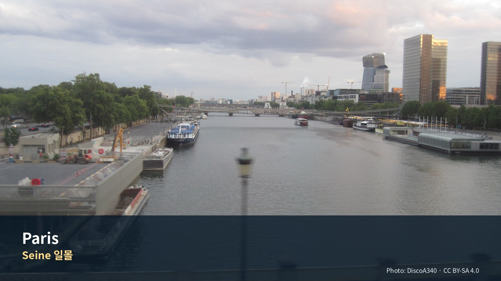

*Seine 일몰 — Photo: DiscoA340, CC BY-SA 4.0; [원문](https://commons.wikimedia.org/wiki/File:River_Seine_at_Sunset_in_Paris.jpg). 가이드북용으로 크롭·리사이즈.*


# Commercial Guide Module

> **관광일·생활일·공연일을 분리한 ‘한 달 살기 축소판’ 15박**  
> 명소를 모두 보는 장이 아니라 Paris 시민의 주간 리듬을 여행자 방식으로 연습하는 장

## Editor’s Verdict

| 항목 | 평가 |
|---|---|
| 여행 적합도 | ★★★★★ Jason·Julia의 생활형 여행에 최적화 |
| 예산 체감 | 높음 |
| 일정 강도 | 15일 3사이클 |
| 예약 핵심 | 숙소 P0 · 미술관/공연 조건부 P1 |
| 우천 전환 | 대형미술관·Passages·BnF·카페 |

## 놓치면 아쉬운 선택

| 등급 | 장소·경험 | 이 가이드북에서 추천하는 이유 |
|---|---|---|
| 필수 | **숙소 생활권과 시장** | 첫날과 매주 반복되는 장보기 루틴이 15박의 품질을 결정한다. |
| 우선 추천 | **Louvre·Orsay 각각 1회** | 대형 미술관은 하루 한 곳, 3시간 30분 상한으로 본다. |
| 우선 추천 | **Notre-Dame–Latin Quarter** | 도시의 역사와 현재의 생활을 함께 보는 첫 주말 코스다. |
| 우선 추천 | **Montmartre–South Pigalle** | 관광언덕과 실제 생활·문화권을 한 방향으로 내려온다. |
| 선택 | **Versailles·Giverny** | 날씨와 예약상태에 따라 15구 생활일·Orangerie로 교체한다. |
| 필수 | **10/4 회복일·10/9 포장시간** | 장기체류의 완성도는 비워둔 시간에서 결정된다. |

## 하루를 완성하는 네 가지 선택

| 시간·역할 | 추천 | 이용법 |
|---|---|---|
| 아침 | **운동·시장·동네 카페** | 명소보다 반복 가능한 생활루틴을 먼저 고정한다. |
| 점심 | **샌드위치·시장·숙소식** | 저녁 공연일에는 점심을 가장 안정적인 식사로 만든다. |
| 저녁 | **공연·축구 또는 동네식 중 하나** | 한날에 복수 야간행사를 넣지 않는다. |
| 스케치 | **Luxembourg·Seine·Palais Royal** | 관광객 흐름과 앉을 장소가 함께 있는 곳을 고른다. |

## 이 지역의 Top 10

1. 숙소 생활권
2. Notre-Dame
3. Latin Quarter
4. Louvre
5. Montmartre
6. BnF·Passages
7. Grand Palais 전시
8. Orsay
9. 시장·공원 회복일
10. 송별저녁

## 현장 메모

- **대표 촬영 장면:** Seine 일몰보다 동네시장·식탁·공원 스케치 장면
- **기념품 방향:** 서점 도서·미술관 출판물·시장 식재료
- **일정 삭제 원칙:** 선택 쇼핑·두 번째 카페·추가 내부관람부터 삭제하고 핵심 예약과 귀환 연결은 유지한다.
- **표시 기준:** 별점은 객관적 품질평가가 아니라 이 여행계획에서의 편집 추천도다.

---

[Paris 15박 3개 사이클](../../ASSETS/85_Editorial_Visuals/06_Paris_Long_Stay_Three_Cycles_v1.0.png)

---
title: "Jason과 Julia의 유럽 장기여행 가이드 — 파리 15박 생활"
chapter: 11
version: "1.8"
status: "Reader Pass C 생활운영본 — 고정·조건부·자유블록과 예약충돌 규칙 반영"
travel_dates: "2026-09-25 – 2026-10-10"
travelers: "Jason · Julia"
last_web_verification: "2026-07-31"
source_priority: "공식기관·시설·사업자 → 파리시·공식 관광기구 → 공식 예약채널"
---

# 11. 파리 15박 생활 가이드
## ‘한 달 살기’의 축소판 — 운동하는 아침, 문화가 있는 오후, 공연과 동네 저녁

> **이 체류의 역할**: 파리는 이번 43일 일정·42박 여행의 마지막 도시이자 하이라이트다. 관광지를 매일 정복하는 방식이 아니라, 같은 빵집과 시장을 다시 찾고, 오전 운동과 세탁·장보기를 반복하며, 오후에는 미술관·동네·도서관을 하나씩 보고, 저녁에는 비스트로·공연·축구를 선택하는 **15일짜리 파리 생활 실험**으로 운영한다.

> **Jason·Julia 맞춤 원칙**: Jason은 러닝·gym과 미술·도시 스케치를, Julia는 동네산책·시장·카페와 선택 수영을 즐긴다. Julia의 수영은 숙소 선정조건이 아니다. 아침은 숙소, 점심은 샌드위치·시장·가벼운 현지식, 저녁은 레스토랑과 숙소식을 섞는다.

> **전시보다 도시를 우선한다**: 15박이어도 대형 미술관을 연속 방문하지 않는다. 필수 대형관은 Louvre·Orsay 정도로 제한하고, Grand Palais·Bourse de Commerce·Orangerie는 2026 특별전과 당일 컨디션에 따라 선택한다. 미술관 사이에는 시장·공원·동네·도서관·무계획 시간을 둔다.

> **디자인 메모**: 최종 Word/PDF에는 지도와 사진을 실제 삽입한다. 현재 문서에는 삽입 위치·제목·설명만 자리표시자로 둔다.

---


## Phase 10 공식정보 원칙

- 운영시간·요금·예약조건은 `OPERATIONS/116_Phase10_Official_Source_Fact_Verification_Register_v1.0.md`를 우선한다.
- 공식 페이지가 충돌하거나 날짜별 예약창이 필요한 항목은 계획가격이 아니라 **재확인**으로 본다.
- 날씨·화재통제·파업·교통은 전날 또는 당일 확인한다.

# Regional Context & Scheduled Place Dossiers

## 지역을 이해하는 다섯 개의 층

### 역사
로마 Lutetia, 중세 왕도, 절대왕정, 혁명, Haussmann 개조, 산업·식민·현대문화의 중심이 겹친다.

### 경제
정치·금융·패션·문화·관광·대학·첨단서비스가 집중된 세계도시다.

### 사회
행정구보다 시장·메트로·학교·공원 단위의 생활권 차이가 크며, 관광중심과 실제 주거권의 리듬이 다르다.

### 문화
국립박물관·공연기관·서점·카페·패션·축구가 일상과 세계문화산업을 동시에 만든다.

### 이번 여행에서의 의미
15박의 가치는 명소 수가 아니라 반복 가능한 아침과 비워둔 날, 공연일의 리듬에서 나온다.

## 일정에 포함된 장소별 상세 가이드

### 1. Notre-Dame de Paris

**왜 중요한가**  
중세 고딕성당이자 국가·종교·도시기억의 상징으로 2019년 화재 후 복원·재개관했다.

| 항목 | 실행정보 |
|---|---|
| 방문 방법 | Île de la Cité, 메트로 Cité·Saint-Michel. |
| 권장 관람법 | 서쪽 파사드–내부 동선–Seine 강변을 한 세트로 본다. |
| 권장 체류 | 60–75분 |
| 요금·예약 | 입장 100% 무료. 공식 무료예약은 선택이나 권장하며 보통 전날·이틀 전·당일 공개된다. |
| 주의사항 | 보안·예배시간·대기열. |
| 공식정보 | https://www.notredamedeparis.fr/en/ |

### 2. Louvre Museum

**왜 중요한가**  
왕궁에서 국립박물관으로 변한 세계 최대급 미술관으로 건축 자체가 프랑스 권력사의 기록이다.

| 항목 | 실행정보 |
|---|---|
| 방문 방법 | Palais Royal–Musée du Louvre역. |
| 권장 관람법 | 한 시대·한 동선만 정하고 3시간 30분 상한. |
| 권장 체류 | 3–3.5시간 |
| 요금·예약 | 2026 비EEA 성인 약 €32 안내, 예약화면 재확인. |
| 주의사항 | 월요일 개관·화요일 휴관 등 요일 확인, 대형가방. |
| 공식정보 | https://www.louvre.fr/en/visit/hours-admission |

### 3. Musée d’Orsay

**왜 중요한가**  
옛 철도역을 개조한 1848–1914년 미술 중심 박물관이다.

| 항목 | 실행정보 |
|---|---|
| 방문 방법 | RER C Musée d’Orsay 또는 Seine 도보. |
| 권장 관람법 | 인상주의만 보지 말고 역건축·사실주의·장식예술을 연결한다. |
| 권장 체류 | 2.5–3시간 |
| 요금·예약 | 유료, 시간지정 권장. |
| 주의사항 | 개막일·특별전 혼잡. |
| 공식정보 | https://www.musee-orsay.fr/en/visit |

### 4. BnF Richelieu

**왜 중요한가**  
프랑스 국립도서관의 역사적 중심으로 Oval Room과 박물관이 지식국가의 상징을 보여준다.

| 항목 | 실행정보 |
|---|---|
| 방문 방법 | Richelieu–Drouot 또는 Palais Royal. |
| 권장 관람법 | Oval Room–Cour d’honneur–서점·Passages를 연결한다. |
| 권장 체류 | 60–90분 |
| 요금·예약 | Oval Room 무료, 박물관·전시 유료 가능. |
| 주의사항 | 열람구역 출입제한. |
| 공식정보 | https://www.bnf.fr/en/richelieu-site |

### 5. Montmartre·South Pigalle

**왜 중요한가**  
종교언덕·예술가 신화·관광지와 실제 9·18구 생활권이 이어지는 지역이다.

| 항목 | 실행정보 |
|---|---|
| 방문 방법 | 북사면 또는 Lamarck-Caulaincourt에서 접근해 남쪽으로 하산. |
| 권장 관람법 | Sacré-Cœur 광장 체류를 짧게 하고 북사면–Abbesses–SoPi로 내려간다. |
| 권장 체류 | 2.5–4시간 |
| 요금·예약 | 거리 무료. |
| 주의사항 | 계단·혼잡·팔찌사기. |
| 공식정보 | https://parisjetaime.com/eng/ |

### 6. Versailles

**왜 중요한가**  
왕권의 궁정·행정·정원체계가 집약된 절대왕정의 대표 공간이다.

| 항목 | 실행정보 |
|---|---|
| 방문 방법 | Paris에서 RER C 또는 SNCF. |
| 권장 관람법 | 궁전–정원–Trianon 중 2개만 우선. |
| 권장 체류 | 6–8시간 |
| 요금·예약 | 시간지정 유료. 공식 요금 확인. |
| 주의사항 | 토요일 혼잡·장거리보행. |
| 공식정보 | https://en.chateauversailles.fr/plan-your-visit |

### 7. Giverny Fondation Monet

**왜 중요한가**  
Monet의 정원과 작업환경을 통해 후기 작품의 색·구도를 이해하는 장소다.

| 항목 | 실행정보 |
|---|---|
| 방문 방법 | Paris–Vernon 열차 후 셔틀·택시. |
| 권장 관람법 | 정원–집–마을을 3시간 내 보고 Paris 귀환. |
| 권장 체류 | 5–7시간 |
| 요금·예약 | 유료·시간지정 가능. 계절운영 확인. |
| 주의사항 | 비·철도·폐장시기. |
| 공식정보 | https://fondation-monet.com/en/ |

### 8. Bourse de Commerce

**왜 중요한가**  
옛 곡물거래소를 Tadao Ando가 개조한 현대미술관으로 역사건축과 원형전시공간이 핵심이다.

| 항목 | 실행정보 |
|---|---|
| 방문 방법 | Les Halles·Louvre권 도보. |
| 권장 관람법 | 중앙 원형공간과 전시 1개에 집중한다. |
| 권장 체류 | 90–120분 |
| 요금·예약 | 유료, 전시별 예약. |
| 주의사항 | 개막일 혼잡. |
| 공식정보 | https://www.pinaultcollection.com/en/boursedecommerce |


---

## 실행지도 · 현장 사용

- [대화형 HTML 지도](../../ASSETS/75_Execution_Maps/Paris_Execution_Map_v0.2.html)
- [GeoJSON](../../ASSETS/75_Execution_Maps/Paris_Execution_Map_v0.2.geojson)
- [KML](../../ASSETS/75_Execution_Maps/Paris_Execution_Map_v0.2.kml)
- 대상 일정: **Day 28–43**
- 숙소 핀은 현재 **후보 위치**이며 실제 예약주소가 아니다.
- 연결선은 일정상의 기준점 순서를 보여주는 개략선이다. 실제 도보·운전은 Google Maps에서 다시 계산한다.
- HTML 배경지도와 Google Maps 링크는 인터넷 연결이 필요하다.

# Layer 1. Quick Reference · 생활 리듬 · 날짜별 실행 일정

## 1. 한눈에 보는 파리 체류

| 항목 | 확정·권장 내용 |
|---|---|
| 체류 | 2026년 9월 25일 금요일–10월 10일 토요일, 15박 |
| 여행 방식 | **관광 50% + 생활 35% + 공연·축구 15%** |
| 숙소 1순위 | **5구 Maubert–Mutualité / Jardin des Plantes–Gobelins 북부** |
| 숙소 2순위 | **15구 Convention–Commerce / Motte-Picquet–Grenelle** |
| 숙박예산 | 2인 15박 총 **약 500만 원 내외**. 세금·청소비·서비스료·취소조건을 포함한 총액으로 비교 |
| 아침 | 주 3회 러닝·gym, Julia 수영 1–2회 선택; 나머지는 시장·공원 산책 |
| 오후 | 하루 핵심 1곳 또는 동네 1권역. 대형관은 3–4시간 상한 |
| 저녁 | 공연 2회 목표, 축구 1회 조건부, 레스토랑 8–9회, 숙소식·포장식 4–5회 |
| 필수 문화 | Louvre, Orsay, BnF Richelieu, Notre-Dame·Île de la Cité |
| 2026 우선 특별전 | Grand Palais **Cézanne et nous**, Orsay **Mary Cassatt**, Orangerie **Monet, peindre le temps**, Bourse **Remember Me** |
| 공연 기본 | 9/30 Philharmonie de Paris 콘서트 + 오페라·발레·연극 중 1회 |
| 축구 | PSG Champions League 홈경기 발표 시 최우선 검토; 10/10 리그 홈경기는 출국과 충돌 |
| 근교 옵션 | Versailles, Giverny. 두 곳 모두 ‘예약 가능·날씨 양호·피로도 허용’일 때만 |
| 교통 | 9/25–27 개별 승차, 9/28–10/4 및 10/5–11 Navigo Weekly 2주 연속 권장 |
| 피로 관리 | 문화 집중일 다음 날은 생활일·공원·시장. 공연 다음 날 오전은 늦게 시작 |

### 파리 15박의 배분

```text
도착·생활권 정착              2일
대표 미술관·특별전            5일
동네·시장·도서관·공원         5일
근교 선택                     0–2일
공연·축구                     저녁 2–3회
완충·무계획 시간              매일 1–3시간
```

### 이 설계가 ‘한 달 살기 축소판’인 이유

1. 같은 동네의 빵집·시장·슈퍼를 최소 두 번 이용한다.
2. 관광일과 생활일을 분리하지 않고, 운동·장보기·세탁 뒤에 관광을 붙인다.
3. 모든 오후를 예약하지 않고 **5개의 자유 교체 블록**을 남긴다.
4. 공연과 축구는 일정을 추가하는 것이 아니라, 해당 날 저녁을 대체한다.
5. 근교를 다녀오지 않아도 파리 체류가 완전하도록 기본안을 설계한다.

---

## Pass C 파리 운영판

| 구분 | 날짜 | 핵심 |
|---|---|---|
| 정착 | 9/25–9/29 | 생활권·Latin Quarter·Louvre·Montmartre. 첫 5일에 파리의 방향을 잡는다. |
| 균형 | 9/30–10/5 | BnF·공연·Cézanne·Versailles 선택·10/4 완전휴식. |
| 회수 | 10/6–10/10 | Orsay·Bourse·Giverny 선택·미완료 회수·포장과 출국. |

**현장 규칙:** 시간지정 미술관 1개와 저녁행사 1개가 하루 상한이다. 공연·축구는 기본 일정에 더하지 않고 교체한다. 10/4 휴식일과 10/9 포장시간은 보호한다. Versailles·Giverny 다음 날에는 고강도 운동을 하지 않는다.

## 2. 시각요소 자리표시자

### {{VISUAL:VIS-MAP-007|type=map|status=linked|strategy=execution-map}} 파리 15박 전체 생활권 지도
- 설명: 5구·15구 추천 숙소권, 주요 시장, 운동시설, 미술관, 공연장, Gare de Lyon, CDG 이동축을 표시한다.

### {{VISUAL:VIS-MAP-008|type=map|status=linked|strategy=execution-map}} 문화시설 군집 지도
- 설명: Louvre–Palais Royal–BnF Richelieu, Orsay–Orangerie–Grand Palais, Marais–Bourse, La Villette–Philharmonie의 네 권역을 구분한다.

### {{VISUAL:VIS-MAP-009|type=map|status=linked|strategy=execution-map}} 오전 운동·수영 지도
- 설명: Luxembourg, Seine 좌안, Parc Montsouris, Champ-de-Mars, Île aux Cygnes, Pontoise·Blomet·Keller 수영장 후보를 표시한다.

### {{VISUAL:VIS-MAP-010|type=map|status=linked|strategy=execution-map}} 시장과 장보기 생활지도
- 설명: Maubert, Monge, Enfants Rouges, Aligre, Convention, Grenelle 및 주요 슈퍼·빵집 후보를 숙소권별로 배치한다.

### {{VISUAL:VIS-MAP-011|type=map|status=linked|strategy=execution-map}} Versailles·Giverny 선택 당일치기 지도
- 설명: RER C를 이용하는 Versailles와 Saint-Lazare–Vernon–셔틀을 이용하는 Giverny의 문전 동선을 비교한다.

### {{VISUAL:VIS-MAP-012|type=map|status=linked|strategy=execution-map}} 공연·축구 귀가 지도
- 설명: Palais Garnier, Opéra Bastille, Philharmonie, Comédie-Française 계열 극장, Parc des Princes와 숙소 귀가 노선을 표시한다.

---

## 3. 15일 운영 원칙

### 3.1 표준 하루

| 시간 | 기본 리듬 |
|---|---|
| 07:30–08:30 | 숙소 아침 |
| 08:30–10:00 | 러닝·gym·선택 수영 또는 시장산책 |
| 10:00–12:00 | 샤워·세탁·장보기·카페·아무것도 하지 않는 시간 |
| 12:00–13:00 | 숙소 샌드위치 또는 시장식 |
| 13:00–14:00 | 이동 |
| 14:00–18:00 | 미술관 1곳 또는 동네 1권역 |
| 18:00–19:15 | 숙소 귀환·휴식 또는 공연장 근처 이른 식사 |
| 19:30–22:30 | 레스토랑·공연·축구 중 하나 |

### 3.2 강도 규칙

- **피로도 4 이상**: 다음 날 오전 정식운동 생략, 산책만 한다.
- **대형 미술관**: 최대 3시간 30분. ‘본전 찾기’식 전관 관람 금지.
- **공연일**: 오후 관광은 17시 이전 종료.
- **생활일**: 예약 0–1개, 저녁은 숙소식도 정상 일정으로 인정한다.
- **근교일**: 저녁 예약 금지.

---

## 4. 일정 요약

| 날짜 | 오전 | 오후 | 저녁 | 피로도 |
|---|---|---|---|---:|
| 9/25 금 | Lyon→Paris 이동 | 체크인·장보기 | 숙소권 산책·가벼운 저녁 | 3 |
| 9/26 토 | 생활권 파악·가벼운 러닝 | Latin Quarter·Notre-Dame·Île Saint-Louis | 5구 비스트로 | 3 |
| 9/27 일 | Luxembourg 러닝·Monge 시장 | Marais·Carnavalet 또는 Hamlet 마티네 | 숙소식/동네 저녁 | 2–4 |
| 9/28 월 | gym·세탁 | Louvre 선택관람·Palais Royal | 일찍 귀가 | 4 |
| 9/29 화 | 느린 아침 | Montmartre·South Pigalle·9구 | 비스트로 / UCL 조건부 | 3–5 |
| 9/30 수 | 걷기·BnF 준비 | BnF Richelieu·Passages | **Philharmonie 20:00** | 4 |
| 10/1 목 | 운동·장보기 | **Grand Palais Cézanne**·강변 | 오페라/발레 선택 | 4 |
| 10/2 금 | 수영·세탁 선택 | Marais·Enfants Rouges·사진/패션 선택 | 재즈·연극 또는 자유 | 3 |
| 10/3 토 | **Versailles 옵션** | Versailles 또는 15구 생활일 | 숙소식 | 4 / 2 |
| 10/4 일 | 늦은 아침·공원 | Canal Saint-Martin·스케치·무계획 | 숙소식 | 1–2 |
| 10/5 월 | gym·빨래 | 11·12구 생활권 또는 13·15구 모듈 | 동네 비스트로 | 2 |
| 10/6 화 | Seine 러닝 | **Orsay·Mary Cassatt 개막** | UCL 조건부 / 휴식 | 4–5 |
| 10/7 수 | 늦은 아침 | **Bourse de Commerce 개막**·Montorgueil | Manon/연극/축구 조건부 | 4–5 |
| 10/8 목 | **Giverny 옵션** | Giverny 또는 Orangerie·Tuileries | 가벼운 저녁 | 4 / 3 |
| 10/9 금 | 마지막 운동·짐정리 | FLV 신규전 또는 자유선택 | 송별저녁·최종포장 | 3 |
| 10/10 토 | 시장·체크아웃 | CDG 이동 | 19:10 출국 예정 | 3 |

---

## 5. Day 1 — 9월 25일 금요일
### Gare de Lyon 도착, ‘관광객’이 아니라 ‘15일 거주자’가 되는 날

### {{VISUAL:VIS-PHOTO-012|type=photo|status=travel-capture|strategy=direct-shot}} 파리 아파트 식탁 위 첫 장보기
- 설명: 바게트, 버터, 과일, 치즈, 요거트와 시장가방을 놓아 장기체류의 시작을 보여준다.

| 시간 | 일정 | 실행 포인트 |
|---|---|---|
| 오전–오후 | Lyon Part-Dieu → Paris Gare de Lyon | 정확한 TGV 확정 후 문전시간 고정 |
| 도착 후 45–75분 | 숙소 이동·체크인 | 15박 수하물이므로 5구·15구 모두 택시가 합리적 |
| +60분 | 객실 점검 | 주방, 세탁기/세탁실, 냉장고, 환기, 엘리베이터, 쓰레기 배출 확인 |
| 17:00 전후 | 슈퍼·빵집 첫 장보기 | 2일치만 구매. 시장 방문 전 대량구매 금지 |
| 18:30–19:30 | 숙소 반경 800m 산책 | 약국·세탁·시장·메트로·택시 승강장 파악 |
| 19:30 이후 | 숙소식 또는 가까운 식당 | 긴 이동일에는 유명식당 예약 금지 |

**오늘의 필수:** 체크인·장보기·귀가길 학습.
**오늘의 피로도:** 3/5.

### 꼭 해볼 것
- 한 번 이용할 슈퍼보다 매일 갈 빵집 한 곳을 먼저 정한다.
- 메트로역의 어느 출구가 숙소와 가까운지 실제로 확인한다.
- 파리 첫날 야경을 보러 멀리 가지 않고, 동네 카페에 30분 앉는다.

---

## 6. Day 2 — 9월 26일 토요일
### Latin Quarter와 다시 열린 Notre-Dame — 집 주변에서 시작하는 파리

### {{VISUAL:VIS-PHOTO-013|type=photo|status=travel-capture|strategy=direct-shot}} Maubert 또는 Monge 시장과 장바구니
- 설명: 관광지가 아닌 토요일 오전의 장보기 장면을 보여준다.

### {{VISUAL:VIS-PHOTO-014|type=photo|status=pre-publication|strategy=licensed-or-direct}} Notre-Dame 내부의 복원 후 공간
- 설명: 재개관한 대성당의 빛과 동선을 담는다.

| 시간 | 일정 | 실행 포인트 |
|---|---|---|
| 08:00–08:45 | 숙소 아침 | 시장에서 점심재료를 살 예정이므로 가볍게 |
| 09:00–09:45 | Jason 4–5km 가벼운 러닝 / Julia 산책 | Luxembourg 또는 Seine 좌안 |
| 10:15–11:15 | Maubert 또는 숙소권 시장·빵집 | 토요일 시장과 생활점포 파악 |
| 11:30–12:30 | 숙소 점심·휴식 | 샌드위치·과일 |
| 13:30–14:30 | Panthéon 외관·Rue Mouffetard 또는 Sorbonne 주변 | 실내명소를 욕심내지 않음 |
| 15:00–16:15 | **Notre-Dame** | 무료입장. 공식 무료 시간예약 권장 |
| 16:15–17:30 | Île de la Cité→Île Saint-Louis | 강변·서점·아이스크림 또는 카페 |
| 18:00–19:00 | 숙소 휴식 | 저녁 전 1시간 비움 |
| 19:30 | 5구 동네 비스트로 | Les Papilles·Bouillon Racine·숙소권 후보 중 1곳 |

**피로도:** 3/5.
**삭제 1순위:** Panthéon 내부.
**우천 대체:** Notre-Dame + Shakespeare and Company 주변 서점 + 카페로 압축.

### 꼭 해볼 것
- Notre-Dame은 외관사진보다 내부의 복원된 동선을 천천히 본다.
- Île Saint-Louis에서 20분은 목적 없이 걷는다.
- 다음 주에 다시 살 빵·치즈·과일을 정한다.

---

## 7. Day 3 — 9월 27일 일요일
### 일요일 생활과 Marais — 공연을 넣어도, 넣지 않아도 완전한 하루

| 시간 | 기본안 | 공연 대체안 |
|---|---|---|
| 08:30–09:30 | Luxembourg 러닝·산책 | 동일 |
| 10:00–11:15 | **Marché Monge** 장보기 | 10:30까지 압축 |
| 12:00 | 숙소 점심 | Bastille 근처 이른 점심 |
| 14:00–16:30 | Marais 골목·Place des Vosges·Carnavalet 선택 | **Hamlet 14:30, Opéra Bastille** 선택 |
| 16:30–18:00 | Enfants Rouges 또는 카페 | 공연 후 Bastille·Arsenal 산책 |
| 저녁 | 숙소식 또는 Café des Musées | 공연 후 가벼운 식사 |

**피로도:** 기본 2–3 / 공연 4.
**판단:** Hamlet 표가 있으면 Marais를 10/2로 이동한다. 공연이 없으면 박물관은 Carnavalet 한 곳만 선택한다.

### 꼭 해볼 것
- 일요일 오전 파리 시장의 가족·주민 리듬을 관찰한다.
- Place des Vosges 회랑에서 커피 한 잔 또는 30분 휴식.
- 숙소 저녁을 ‘실패한 일정’이 아니라 생활체험으로 받아들인다.

---

## 8. Day 4 — 9월 28일 월요일
### Louvre를 ‘완주’하지 않고 잘 보는 날

### {{VISUAL:VIS-PHOTO-015|type=photo|status=pre-publication|strategy=licensed-or-direct}} Cour Carrée에서 바라본 Louvre의 시간층
- 설명: 중세 요새에서 왕궁, 국립박물관으로 이어진 건축사를 보여준다.

| 시간 | 일정 | 실행 포인트 |
|---|---|---|
| 08:00–09:00 | 짧은 gym 또는 맨몸운동 | 이날 보행량이 많으므로 하체 고강도 금지 |
| 09:15–11:00 | 세탁·생활업무·숙소 점심준비 | 월요일은 생활업무 블록 확보 |
| 12:00–13:00 | 숙소 점심 | 물·작은 간식 준비 |
| 13:30–17:00 | **Louvre 시간지정 입장** | 2–3개 섹션만 선택, 총 3시간 30분 상한 |
| 17:00–18:15 | Cour Carrée→Palais Royal 정원 | 관람 후 야외 완충 |
| 18:30–20:00 | 이른 저녁 | Palais Royal·1구에서 비싸게 먹기보다 2·9구 이동 |
| 20:00 이후 | 숙소 귀환 | Fashion Week 첫날 혼잡 고려 |

**피로도:** 4/5.

### Jason·Julia 추천 관람 루트

**A. 고대·르네상스 핵심 3시간**
중세 Louvre 흔적 → 그리스 조각 → 이탈리아 르네상스 일부 → 프랑스 대형회화.

**B. 장식예술·공간 중심 3시간**
Napoléon III 아파트 → 프랑스 장식예술 → Cour Marly·Puget.

**C. 특별전 중심 2.5시간**
2026 체류기간 특별전 가운데 1개 + 상설 1개 권역.

### 금지 규칙
- Mona Lisa 대기와 다른 대형관 3개를 동시에 하지 않는다.
- Louvre 뒤에 야간 크루즈·공연을 붙이지 않는다.

---

## 9. Day 5 — 9월 29일 화요일
### Montmartre와 South Pigalle — 관광언덕에서 생활동네로 내려오기

### {{VISUAL:VIS-PHOTO-016|type=photo|status=travel-capture|strategy=direct-shot}} Montmartre 북사면의 계단과 주거골목
- 설명: Sacré-Cœur 광장보다 실제 주거지와 언덕구조를 보여준다.

| 시간 | 일정 | 실행 포인트 |
|---|---|---|
| 08:30–09:30 | 느린 아침·동네 산책 | 전날 Louvre 피로 회복 |
| 10:00–11:30 | 카페·장보기·자유시간 | 예약 없음 |
| 12:00 | 숙소 점심 | 오후 언덕 대비 |
| 13:30–15:30 | Lamarck-Caulaincourt→Montmartre 북사면 | 오르막을 줄이는 방향 |
| 15:30–16:15 | Sacré-Cœur·전망 | 광장은 짧게 |
| 16:15–18:00 | Abbesses→South Pigalle | 관광지에서 생활·음식권으로 내려옴 |
| 19:30 | **Le Bon Georges** 또는 9구 비스트로 | 예약 권장 |
| 저녁 조건부 | PSG UCL 홈경기 발표 시 경기로 대체 | 경기 시 오후를 17시 종료 |

**피로도:** 3/5, 축구 시 5/5.

### 꼭 해볼 것
- Funiculaire보다 북쪽에서 완만하게 접근한다.
- Place du Tertre보다 Rue des Abbesses·South Pigalle의 생활상권을 본다.
- 축구가 있으면 레스토랑 예약은 취소 가능 조건으로 잡는다.

---

## 10. Day 6 — 9월 30일 수요일
### BnF Richelieu, 회랑과 서점, Philharmonie의 밤

### {{VISUAL:VIS-PHOTO-017|type=photo|status=pre-publication|strategy=licensed-or-direct}} BnF Richelieu Oval Room
- 설명: 책과 건축을 동시에 경험하는 파리의 대표 도서관 내부.

| 시간 | 일정 | 실행 포인트 |
|---|---|---|
| 08:30–09:15 | Seine 또는 동네 걷기 | 공연일까지 체력 보존 |
| 10:00–11:30 | 숙소업무·느린 카페 | 예약 없는 오전 |
| 12:00 | 가벼운 점심 | 공연 전 과식 금지 |
| 13:30–15:30 | **BnF Richelieu** | Oval Room 무료, Museum은 관심 시 추가 |
| 15:30–17:00 | Galerie Vivienne·Passage des Panoramas | 비 오는 날에도 좋은 연결 |
| 17:00–18:00 | 이른 저녁 또는 공연장 이동 | La Villette까지 문전 45–60분 허용 |
| 20:00 | **Philharmonie de Paris** | Orchestre de Paris / Riccardo Chailly 우선 |
| 공연 후 | 택시 또는 메트로 귀가 | 막차 전 여유 |

**피로도:** 4/5.

### 공연 선택
- 9/30·10/1 Orchestre de Paris 프로그램 중 한 날 선택.
- 9/30을 기본으로 두고, 10/1 오페라표를 잡을 수 있으면 일정 충돌을 피한다.

---

## 11. Day 7 — 10월 1일 목요일
### Aix에서 본 Cézanne를 파리에서 다시 읽기

### {{VISUAL:VIS-PHOTO-018|type=photo|status=pre-publication|strategy=licensed-or-direct}} Grand Palais ‘Cézanne et nous’ 전시 입구
- 설명: 프로방스 체류와 파리 미술사를 연결하는 이번 여행의 서사적 하이라이트.

| 시간 | 일정 | 실행 포인트 |
|---|---|---|
| 08:30–09:30 | Jason 러닝 / Julia 선택 수영 | 숙소권에 따라 Luxembourg·Seine·Pontoise/Blomet |
| 10:00–11:30 | 장보기·샤워·휴식 | 오후 대형전 대비 |
| 12:00 | 숙소 점심 | 가볍게 |
| 13:30–16:30 | **Grand Palais: Cézanne et nous** | 9/23 개막, 시간지정 예약 |
| 16:30–18:00 | Seine·Pont Alexandre III·Gros-Caillou | 전시 후 야외 |
| 18:00 | 공연 전 이른 식사 | 공연장 위치에 따라 이동 |
| 19:30 전후 | **오페라·발레 선택** | Barbiere/Bastille 또는 Manon/Garnier 재판매표 |

**피로도:** 4/5.
**공연표가 없으면:** Rue Cler·7구 산책 후 20시 숙소 귀환.

### 왜 필수에 가까운가

Aix의 세잔 작업실과 프로방스 풍경을 경험한 직후, 파리에서 세잔이 후대작가에게 남긴 영향을 보는 전시는 이번 장기여행 전체를 하나의 이야기로 묶는다. 단순히 유명 전시 하나를 추가하는 것이 아니라 **Aix 챕터의 후속편**이다.

---

## 12. Day 8 — 10월 2일 금요일
### Marais의 생활·역사·패션 — 작은 선택을 조합하는 날

| 시간 | 일정 | 실행 포인트 |
|---|---|---|
| 08:30–09:30 | Julia 선택 수영 / Jason gym 또는 휴식 | 공연 다음 날 강도 낮춤 |
| 10:00–11:30 | 세탁·우편·카페 | 생활블록 |
| 12:30 | **Marché des Enfants Rouges** 점심 | 혼잡 전후로 조정 |
| 14:00–16:00 | Marais 골목·Archives·Place des Vosges | 쇼핑보다 건축·생활 관찰 |
| 16:00–17:30 | 선택 1곳 | Carnavalet / MEP 패션사진 / Palais Galliera 중 1곳 |
| 18:00–19:00 | 숙소 휴식 또는 이른 식사 | 저녁 선택에 따라 |
| 20:00 | Shai Maestro 재즈 또는 Comédie-Française 계열 연극 선택 | 둘 다 넣지 않음 |

**피로도:** 3–4/5.

### 꼭 해볼 것
- 시장에서 점심을 먹되 관광객 대기줄이 긴 한 곳에 집착하지 않는다.
- Hôtel particulier의 안뜰과 거리의 관계를 관찰한다.
- Fashion Week 기간의 거리 분위기는 보되 초청제 쇼를 ‘관람 일정’으로 기대하지 않는다.

---

## 13. Day 9 — 10월 3일 토요일
### 근교 옵션 1: Versailles 또는 파리 15구 생활일

### A. Versailles — 대표 궁전 하루

| 시간 | 일정 |
|---|---|
| 07:30 | 숙소 아침 |
| 08:15–09:30 | 문전 이동·RER C 또는 대체열차 |
| 10:00–12:30 | Palace 시간지정 입장 |
| 12:30–13:30 | 피크닉·가벼운 점심 |
| 13:30–16:30 | 정원·Grand/Petit Trianon 중 선택 |
| 17:00–18:30 | 파리 귀환 |
| 저녁 | 숙소식 |

**핵심 원칙:** 궁전·정원·Trianon 모두 ‘완주’하지 않는다. 3개 중 2개를 우선한다.
**피로도:** 4/5.

### B. 파리 기본 대체 — 15구 생활일

- Marché Convention 또는 Grenelle 일정 확인
- Rue du Commerce·Convention 생활상권
- Île aux Cygnes·Seine 산책
- Le CasseNoix 저녁 또는 숙소식

**피로도:** 2/5.

### 선택 기준

Versailles는 ‘파리 근교 대표성’이 가장 높지만, 이번 여행에서 궁전·역사건축에 대한 관심이 낮거나 비·철도혼잡이 있으면 15구 생활일을 택한다. 취소해도 파리 체류의 완성도는 떨어지지 않는다.

---

## 14. Day 10 — 10월 4일 일요일
### 의도적으로 비워 둔 파리의 일요일

### {{VISUAL:VIS-PHOTO-019|type=photo|status=travel-capture|strategy=direct-shot}} Canal Saint-Martin의 일요일 오후
- 설명: 관광지보다 주민들의 산책·피크닉·대화를 보여주는 생활풍경.

| 시간 | 일정 |
|---|---|
| 09:00–10:30 | 늦은 아침·가벼운 산책 |
| 10:30–12:00 | 숙소권 시장 또는 베이커리·커피 |
| 12:00–14:00 | 숙소 점심·독서·낮잠 |
| 15:00–17:00 | Jason 스케치 / Julia 카페·산책 |
| 17:00–18:30 | Canal Saint-Martin 또는 Parc Montsouris |
| 저녁 | 로티세리 치킨·샐러드·와인 등 숙소식 |

**피로도:** 1–2/5.
**예약:** 없음.

### 이 날을 지켜야 하는 이유

15박 체류가 5박 관광여행과 달라지는 지점은 ‘빈 날’이다. 전날 Versailles를 다녀왔다면 완전 휴식, 가지 않았다면 공원과 스케치만 한다. 비가 오면 숙소·카페·동네서점으로 충분하다.

---

## 15. Day 11 — 10월 5일 월요일
### 월요일 생활모듈 — 관광객이 적은 파리 한 구역을 골라 보기

오전에는 정식 운동과 세탁을 하고, 오후에는 숙소 위치에 따라 **한 모듈만** 선택한다.

### 오전 공통

- Jason gym 45–60분
- Julia 수영 또는 카페 선택
- 세탁·냉장고 정리·두 번째 주 장보기
- 숙소 점심

### 오후 선택 모듈

| 모듈 | 동선 | 적합한 경우 |
|---|---|---|
| A | Aligre–Coulée Verte–Bastille | 시장·생활·산책을 원할 때. 월요일 시장휴무 여부 확인 |
| B | Butte-aux-Cailles–Gobelins–Jardin des Plantes | 5구 숙소에서 생활권을 넓힐 때 |
| C | Convention–Parc André Citroën–Grenelle | 15구를 실제 거주지처럼 체험할 때 |
| D | Batignolles–Parc Monceau | 9구 숙소 또는 북서부 생활권이 궁금할 때 |

**저녁:** 해당 동네의 비스트로 또는 아시아 음식.
**피로도:** 2/5.
**예약:** 최대 1개.

---

## 16. Day 12 — 10월 6일 화요일
### Orsay와 Mary Cassatt — 개막일은 짧고 집중해서

### {{VISUAL:VIS-PHOTO-020|type=photo|status=pre-publication|strategy=licensed-or-direct}} Musée d’Orsay 대시계와 센강
- 설명: 기차역 건축과 인상주의 컬렉션을 함께 상징하는 이미지.

| 시간 | 일정 | 실행 포인트 |
|---|---|---|
| 08:00–09:00 | Seine 5–7km 러닝 / Julia 산책 | 저녁 축구 가능성 고려 |
| 10:00–11:30 | 느린 아침·휴식 | 개막일 혼잡 대비 |
| 12:00 | 숙소 점심 | 시간지정표 준비 |
| 14:00–17:45 | **Musée d’Orsay** | Mary Cassatt 개막전 + 상설 1개 층 |
| 17:45–18:30 | Seine 강변 휴식 | 전시 직후 일정 비움 |
| 저녁 | PSG UCL 홈경기 발표 시 경기 | 없으면 숙소식·동네 저녁 |

**피로도:** 기본 4 / 축구 시 5.

### 관람 규칙

1. Mary Cassatt 특별전 90분.
2. 상설관은 인상주의 또는 19세기 조각 중 하나.
3. 사진촬영보다 창과 대시계가 만드는 공간을 즐긴다.
4. 개막일이 지나치게 혼잡하면 10/8 또는 10/9로 이동한다.

---

## 17. Day 13 — 10월 7일 수요일
### Bourse de Commerce 개막과 Montorgueil — 현대 파리의 선택일

### {{VISUAL:VIS-PHOTO-021|type=photo|status=travel-capture|strategy=direct-shot}} Bourse de Commerce 원형 전시장
- 설명: 역사적 상품거래소와 현대미술 공간의 결합을 보여준다.

| 시간 | 일정 | 실행 포인트 |
|---|---|---|
| 09:00–10:30 | 공연·축구 전날이면 늦은 기상 | 정식운동 생략 가능 |
| 11:00–12:00 | 동네업무·점심 준비 | 예약 적게 |
| 13:30–16:00 | **Bourse de Commerce: Remember Me** | 10/7 개막. 시간지정 필수 |
| 16:00–17:30 | Rue Montorgueil·Les Halles 주변 | 시장거리·카페 |
| 17:30–18:30 | 숙소 또는 공연장 이동 | 저녁 대체 규칙 적용 |
| 저녁 선택 | Manon/Garnier, Comédie-Française 계열, PSG UCL 중 하나 | 동시예약 금지 |

**피로도:** 4–5/5.

### 대체 규칙

- 개막일 표가 없거나 혼잡하면 Bourse를 10/9로 이동.
- 축구 홈경기가 잡히면 미술관은 15:00까지 종료.
- Manon 표는 공식 재판매·대기만 사용한다.

---

## 18. Day 14 — 10월 8일 목요일
### 근교 옵션 2: Giverny 또는 Monet의 파리

### A. Giverny — 정원과 마을

### {{VISUAL:VIS-PHOTO-022|type=photo|status=pre-publication|strategy=licensed-or-direct}} Giverny 수련정원과 일본식 다리
- 설명: Monet의 회화와 실제 정원을 연결하는 대표 이미지.

| 시간 | 일정 |
|---|---|
| 07:30 | 숙소 아침 |
| 08:30 전후 | Saint-Lazare 출발 열차 |
| 09:30–10:30 | Vernon 도착·셔틀/택시·입장 |
| 10:30–12:30 | Monet House·Gardens |
| 12:30–14:00 | Giverny 점심·마을산책 |
| 14:00–16:00 | 선택: Musée des Impressionnismes 또는 카페·정원 |
| 16:30–18:00 | Paris 귀환 |
| 저녁 | 숙소식 |

**피로도:** 4/5.
**주의:** Monet 재단 내부에서는 그림·스케치 제한을 확인한다.

### B. 파리 기본 대체 — Orangerie와 Tuileries

- 늦은 아침 운동
- 14:00 **Orangerie: Monet, peindre le temps**
- Tuileries·Place de la Concorde·Seine 산책
- Saint-Germain 카페 또는 숙소식

**피로도:** 3/5.

### 선택 기준

- 맑고 건조하며 열차·셔틀이 정상: Giverny.
- 비·강풍·장기여행 피로: Orangerie.
- 이미 Versailles를 갔다면 Giverny는 그날 아침 몸상태를 보고 결정한다.

---

## 19. Day 15 — 10월 9일 금요일
### 마지막 선택, 송별저녁, 떠날 준비

| 시간 | 일정 | 실행 포인트 |
|---|---|---|
| 08:30–09:30 | 마지막 러닝 또는 산책 | Luxembourg·Seine·숙소권 |
| 10:00–12:00 | 짐 70% 포장·냉장고 정리 | 액체·깨지기 쉬운 물품 분리 |
| 12:00 | 가벼운 숙소 점심 | 남은 재료 사용 |
| 14:00–17:00 | 최종 선택 1곳 | FLV 신규전 / Bourse / 미완료 동네 / 자유쇼핑 |
| 17:30–18:30 | 숙소 휴식·최종 포장 | 다음 날 공항동선 확인 |
| 19:30 | **송별저녁** | Le CasseNoix·Le Bon Georges·선택 특별식 |
| 21:30 | 마지막 야간산책 | 숙소 반경 또는 Seine 30분 |

**피로도:** 3/5.

### 최종 선택 우선순위

1. 10/9 개막 **Fondation Louis Vuitton: Gustave Fayet** 티켓이 있으면 관람.
2. 10/7 Bourse를 못 봤으면 대체.
3. 두 곳 모두 관심이 낮으면 좋아했던 동네를 다시 방문.
4. 쇼핑을 위해 새로운 지역을 추가하지 않는다.

---

## 20. Day 16 — 10월 10일 토요일
### 파리의 마지막 아침과 귀국

| 시간 | 일정 | 실행 포인트 |
|---|---|---|
| 08:00–09:00 | 숙소 아침·남은 음식 정리 | 유리병·냉장식품 처리 |
| 09:00–10:15 | 마지막 시장·빵집 또는 동네산책 | 멀리 이동하지 않음 |
| 10:15–12:00 | 체크아웃·짐 보관 | 숙소조건 확인 |
| 12:00–13:00 | 가벼운 점심 | 공항 전 과식 금지 |
| 14:00–15:00 전후 | CDG 이동 시작 | 항공편 19:10 기준, 교통·보안 여유 확보 |
| 19:10 예정 | 인천행 출국 | 실제 항공권 기준 재확인 |

**PSG 리그 홈경기:** 현재 10/10 홈경기가 일정표에 있으나 경기시간이 미정이고 출국편과 충돌하므로 방문 불가로 본다.

---

## 21. 일정 교체 매트릭스

| 상황 | 바꿀 일정 |
|---|---|
| PSG UCL 홈경기 9/29·9/30 | Montmartre 또는 BnF를 17시 종료, 저녁공연 취소 |
| PSG UCL 홈경기 10/6·10/7 | Orsay/Bourse를 16:30 종료, 공연 취소 |
| Manon 재판매표 확보 | 10/1 또는 10/7 저녁으로 배치 |
| Versailles 비 | 15구 생활일로 교체 |
| Giverny 비·열차장애 | Orangerie로 교체 |
| Orsay 개막일 과밀 | 10/8 오후 또는 10/9로 이동 |
| Bourse 개막일 표 없음 | 10/9로 이동 |
| 누적 피로 | 10/5 모듈·근교 1곳을 삭제 |

---

---

> Reader Edition: 현장 실행에 필요한 Layer 1 중심 요약본. 장소 배경·숙소 후보·상세 출처는 원 챕터 참조.
