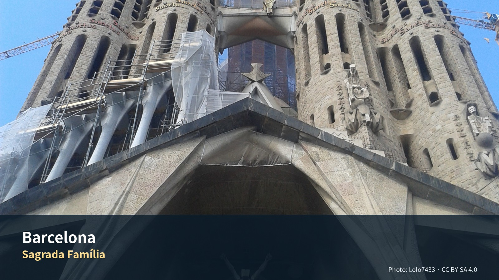

*Sagrada Família — Photo: Lolo7433, CC BY-SA 4.0; [원문](https://commons.wikimedia.org/wiki/File:Sagrada_Familia_Ext%C3%A9rieur.jpg). 가이드북용으로 회전·크롭·리사이즈.*


# Commercial Guide Module

> **건축의 도시를 생활권과 책, 시장의 시선으로 읽는 첫 3박**  
> 재방문 도시를 명소 수집이 아니라 건축·도시구조·동네생활로 다시 보는 장

## Editor’s Verdict

| 항목 | 평가 |
|---|---|
| 여행 적합도 | ★★★★★ Jason·Julia의 생활형 여행에 최적화 |
| 예산 체감 | 중상 |
| 일정 강도 | 보통 |
| 예약 핵심 | Sagrada Família P1 · 렌터카 P0 |
| 우천 전환 | Biblioteca·MACBA·Sant Pau 실내 비중 확대 |

## 놓치면 아쉬운 선택

| 등급 | 장소·경험 | 이 가이드북에서 추천하는 이유 |
|---|---|---|
| 필수 | **Sagrada Família** | 한 번의 시간지정 방문에 집중해 빛·구조·도시 맥락을 함께 본다. |
| 우선 추천 | **Sant Pau–Eixample 산책** | 가우디 한 사람을 넘어 Barcelona 모더니즘의 도시적 규모를 이해한다. |
| 우선 추천 | **Gòtic–Biblioteca–MACBA** | 중세 골목, 카탈루냐의 기억, 현대도시를 한 흐름으로 연결한다. |
| 선택 | **Sitges** | Girona 이동일에 바다와 모더니즘을 짧게 연결하되 차량 인수 지연 시 축소한다. |

## 하루를 완성하는 네 가지 선택

| 시간·역할 | 추천 | 이용법 |
|---|---|---|
| 아침 | **숙소 생활권 카페와 빵집** | 첫날부터 관광지보다 동네의 리듬을 익힌다. |
| 점심 | **시장 또는 샌드위치** | 이동일과 미술관 일정의 체력을 보존한다. |
| 저녁 | **숙소 생활권(Hostafrancs) 또는 그날 동선의 끝** | 늦은 귀가와 과도한 이동을 피한다. |
| 스케치 | **Sant Pau 또는 Eixample 가로** | 건물 하나보다 거리 전체의 비례와 빛을 기록한다. |

## 이 지역의 Top 10

1. Sagrada Família
2. Sant Pau
3. Eixample 가로
4. Gòtic 골목
5. Biblioteca de Catalunya
6. MACBA
7. 독립서점
8. 생활시장
9. Gràcia 저녁
10. Sitges 해변·모더니즘

## 현장 메모

- **대표 촬영 장면:** Sant Pau의 축과 Eixample 가로가 만나는 장면
- **기념품 방향:** 카탈루냐 디자인 문구·독립서점 도서
- **일정 삭제 원칙:** 선택 쇼핑·두 번째 카페·추가 내부관람부터 삭제하고 핵심 예약과 귀환 연결은 유지한다.
- **표시 기준:** 별점은 객관적 품질평가가 아니라 이 여행계획에서의 편집 추천도다.

---

# 04. 바르셀로나·시체스 3박 4일

> **여행의 역할**: 장기 유럽여행의 첫 거점에서 시차를 조절하면서, 바르셀로나의 도시 구조와 카탈루냐 문화에 천천히 진입하는 구간이다. 유료 가우디 명소는 **사그라다 파밀리아만** 방문하고, 나머지는 산책·시장·도서관·현대미술·책방·현지 음식으로 구성한다. 9월 1일에는 바르셀로나에서 렌터카를 인수해 시체스를 방문한 뒤 지로나로 이동한다.

> **여행자 기준**: Julia의 수영은 선택 일정이며 숙소 선정 조건으로 사용하지 않는다. 아침은 숙소, 점심은 샌드위치·시장·가벼운 현지식, 저녁은 레스토랑을 기본으로 한다.

---


## Phase 10 공식정보 원칙

- 운영시간·요금·예약조건은 `OPERATIONS/116_Phase10_Official_Source_Fact_Verification_Register_v1.0.md`를 우선한다.
- 공식 페이지가 충돌하거나 날짜별 예약창이 필요한 항목은 계획가격이 아니라 **재확인**으로 본다.
- 날씨·화재통제·파업·교통은 전날 또는 당일 확인한다.

# Regional Context & Scheduled Place Dossiers

## 지역을 이해하는 다섯 개의 층

### 역사
로마 식민도시 Barcino, 중세 카탈루냐 상업도시, 19세기 산업화와 Eixample 확장, 20세기 내전·독재·민주화가 겹쳐 있다.

### 경제
항만·관광·디자인·디지털산업·교육이 결합된 지중해 대도시다. Eixample은 산업화 이후 인구증가를 수용한 계획도시의 핵심이다.

### 사회
카탈루냐어와 스페인어가 공존하며, 지역정체성과 자치의식이 공공표지·시장·문화기관에 일상적으로 나타난다.

### 문화
모더니즘은 Gaudí 개인의 스타일이 아니라 건축가·공예가·부르주아 후원층이 만든 도시문화다. 책·디자인·현대미술도 도시정체성의 중요한 축이다.

### 이번 여행에서의 의미
Jason·Julia에게는 명소의 수보다 ‘고딕도시–계획도시–현대도시’ 세 층을 연결해 보는 것이 중요하다.

## 이 3박이 여행 전체에서 하는 일

**43일 중 유일한 대도시 구간이다.** 이후 40일은 지방 도시와 마을이다. Lyon과 Paris가 남아 있지만 Lyon은 4박, Paris는 생활형 장기체류다. **대도시를 관광객으로 소비하는 날은 여기 3일뿐이다.**

동시에 이 구간은 **시차 적응일**이다. 도착 당일부터 밀어붙이면 이후 40일이 무너진다. 기존 원고가 Day 1을 도착·정착으로 비워둔 것은 옳은 판단이다.

## 일정에 포함된 장소별 상세 가이드

일정에 들어간 방문지를 순서대로 싣는다. 각 항목은 무엇인지, 무엇이
핵심인지, 현장에서 어떻게 볼 것인지로 나뉜다. 운영시간과 요금은
표로 분리했고 변동 항목에는 재확인 표시를 달았다.

### Day 2 — 사그라다 파밀리아 · 산 파우

#### Sagrada Família {{grade:essential|필수}}

##### 무엇인가

1882년에 시작해 **아직 짓고 있다.** 가우디는 1926년에 죽었고, 그가 남긴 것은 완성된 설계도가 아니라 석고 모형과 원리였다. 스페인 내전 때 그 모형마저 상당수 파괴됐다. 지금의 공사는 **남은 조각을 복원해 원리를 재구성하는 작업**이다.

##### 핵심 — 기둥이 나무인 이유

내부에 들어가면 기둥이 위로 갈수록 갈라진다. 장식이 아니다. **구조 계산의 결과**다.

고딕 성당은 벽이 밖으로 밀려나는 힘을 버티려고 건물 바깥에 부벽(flying buttress)을 세운다. 가우디는 그걸 흉물이라 여겼다. 대신 **기둥 자체를 기울이고 갈라지게 해서** 하중을 안에서 분산시켰다. 부벽이 필요 없어진다.

나무처럼 보이는 건 자연을 흉내 낸 게 아니라, **나무가 이미 그 구조 문제를 풀었기 때문**이다.

> **들어가면 먼저 할 일**
> 빛을 보라. 동쪽(탄생 파사드) 스테인드글라스는 푸른색·초록색, 서쪽(수난 파사드)은 붉은색·주황색이다. **오전에는 푸른빛이, 오후에는 붉은빛이 내부를 채운다.** 시간에 따라 색이 이동하도록 설계됐다.

> **파사드 두 개를 비교하라**
> **탄생 파사드**는 가우디 생전에 완성됐다. 조각이 빽빽하고 유기적이다.
> **수난 파사드**는 후대(주제프 마리아 수비라치)의 작업이다. 각지고 앙상하다.
> 호불호가 갈리지만 **의도된 대비**다. 탄생과 죽음을 같은 양식으로 조각할 이유가 없다.

##### 실용

|항목|값                                    |
|--|-------------------------------------|
|요금|타워 포함 일반권 현재 €36 {{badge:pending|재확인}}|
|예약|**공식 온라인 구매만.** 시간지정                 |
|체류|90–100분                              |
|도착|**입장 30분 전** — 보안검색 대기               |
|주의|일요일 오전 혼잡 · 큰 가방 제한 · **타워는 계단으로 하산**|
|접근|지하철 L2·L5 Sagrada Família            |

⚠ **8월 30일이 일요일이다.** 미사와 관광객이 겹치는 최악의 조합이다. 기존 원고의 예약 시각을 반드시 지킬 것.

---
#### Sant Pau Recinte Modernista {{grade:essential|필수}}

##### 무엇인가 — 병원을 도시로 지었다

1401년 라발 지구 병원의 후신으로, 19세기 말 건축가 류이스 도메네크 이 몬타네르가 만들었다. 카탈루냐 건축 사상 최대의 모더니즘 복합체로 꼽히며 1997년 유네스코 세계유산이 됐다.

시작은 유산이었다. 파리에 살던 카탈루냐 은행가 파우 힐이 1896년에 죽으며 재산 일부를 바르셀로나에 남겼다. 성 바오로의 이름으로 병원을 지으라는 조건이었다. 마침 1401년에 세워진 유럽에서 가장 오래된 축에 드는 산타 크레우 병원이 개축이 필요한 상태였고, 두 사정이 맞물려 새 병원 건설이 시작됐다.

공사는 두 단계로 진행됐다. 1902–1913년에 도메네크 이 몬타네르가 13개 동을 지었고, 1920년부터 아들 페레 도메네크 이 로우라가 절제된 양식으로 6개 동을 더 지었다. 애초에는 48개 동을 지하 통로로 연결해 환자가 날씨에 노출되지 않게 하는 계획이었으나 최종적으로는 그중 일부만 지어졌다.

##### 핵심 — 45도의 이유

건축가는 이 부지를 에이샴플레 격자에 대해 45도로 틀어 놓았다. 바르셀로나를 내려다보는 건축적 섬을 만들기 위해서였다.

도메네크는 병원을 '전원도시’로 구상했다. 그래서 부지 안에 남북으로 흐르는 자체 도시 조직이 있고, 주 파사드에 최대한 빛이 들도록 배치했다.

즉 이 건물의 배치는 **미관이 아니라 채광과 환기의 결과**다. 항생제 이전 시대에 감염을 줄이는 최선의 방법이 햇빛과 바람이었다.

> **사그라다 파밀리아에서 걸어와라**
> 아빙구다 가우디를 따라 도보 10분 거리이고, 화려한 행정동에서 사그라다 파밀리아의 첨탑이 잘 보인다.
> 두 건물을 이어 걸으면 **가우디와 도메네크의 차이가 몸으로 이해된다.** 지하철로 이동하면 이 감각이 사라진다.

> **한 동은 100년 전 그대로다**
> 산 라파엘 동은 100년 전 모습으로 남아 침대까지 그대로 정돈돼 있다. 다른 동의 화려함과 대비해서 보면, 이 화려함이 누구를 위한 것이었는지가 분명해진다.

> **타일을 올려다보라**
> 12개 동이 세라믹으로 덮여 있고, 창작자의 종교적 감성을 드러내는 다양한 도상이 들어가 있다. 눈높이가 아니라 처마와 천장에 밀도가 몰려 있다.

##### 실용

|항목   |값                                  |
|-----|-----------------------------------|
|요금·운영|{{badge:pending|재확인}}|
|체류   |60–90분                             |
|접근   |사그라다 파밀리아에서 도보 10분 (Avinguda Gaudí)|
|성격   |**야외 비중 높음.** 한여름 정오 회피            |

---
### Day 3 — 고딕 지구 · 시장 · 도서관

#### Barri Gòtic {{grade:essential|필수}}

##### 무엇인가

로마 시대 바르시노(Barcino)의 성벽 안쪽이 그대로 중세 도시가 됐다. **길이 좁은 이유는 계획이 아니라 누적이기 때문**이다.

> **에이샴플레와 비교하며 걸어라**
> Day 2에 사그라다 파밀리아 일대(격자·팔각 교차로)를 걸었다면, Gòtic의 감각 차이가 선명하다. **길 하나 폭이 다르고, 시야가 열리는 방식이 다르고, 소리가 다르다.**

> **로마 성벽을 찾아라**
> 대성당 주변에 로마 시대 성벽 조각이 건물 사이에 박혀 있다. 표지판이 크지 않아 지나치기 쉽다.

> **광장은 갑자기 나타난다**
> Gòtic의 광장은 도착 지점이 아니라 사고(事故)처럼 나타난다. 지도를 보며 걷기보다 **몇 번 잘못 들어가는 편이 이 구역의 성격에 맞는다.**

---
#### Biblioteca de Catalunya {{grade:priority|우선추천}}

##### 무엇인가 — 산 파우의 전편

1926년, 카레르 데 로스피탈에 있던 옛 산타 크레우 병원의 기능이 새 병원으로 옮겨갔다. 그 비워진 고딕 건물이 지금 카탈루냐 국립도서관이다.

즉 **Day 2에 본 산 파우가 이 건물의 후계자다.** 순서를 알고 가면 이 방문의 의미가 완전히 달라진다.

1401년, 도시에 흩어져 있던 작은 병원들을 하나로 합치기로 하면서 라발에 웅장한 고딕 건물이 세워졌다. 500년을 병원으로 쓰다가, 도메네크의 새 병원이 완성되자 도서관이 됐다.

> **왜 여기 오는가**
> 관광지가 아니다. 조용하고, 사람이 적고, **에어컨이 있다.** 8월 31일 오후의 열기를 피하는 실용적 선택이기도 하다.
> 고딕 열람실의 아치는 원래 병동이었다. 지금 책이 꽂힌 자리에 침대가 있었다.

##### 실용

|항목   |값                         |
|-----|--------------------------|
|요금·운영|{{badge:pending|재확인}}|
|체류   |30–45분                    |
|위치   |라발, Carrer de l’Hospital  |
|성격   |**실내.** 우천·폭염 대체안으로 가치가 높다|

---
#### MACBA {{grade:optional|선택}}

라발의 현대미술관이다. 리처드 마이어 설계의 흰 건물이 중세 지구 한복판에 서 있다.

> **건물 앞 광장을 보라**
> 미술관보다 **광장이 유명하다.** 스케이트보더가 상시 모여 있고, 이 광장은 세계 스케이트 문화에서 알려진 장소다. 미술관에 들어가지 않아도 이 대비 — 중세 지구 / 백색 모더니즘 / 스케이트보드 — 는 볼 값어치가 있다.

요금·운영 {{badge:pending|재확인}} · 체류 60–90분 · **이번 일정에서는 선택.** 시간이 밀리면 첫 번째 삭제 대상.

---
### Day 4 — 시체스 경유

#### 왜 시체스를 경유하는가

바르셀로나에서 지로나로 가는 길에 시체스는 **남쪽으로 우회**다. 직선 경로가 아니다. 그런데도 넣은 이유가 있다.

**시체스는 카탈루냐 모더니즘이 태어난 곳이다.** Day 2에 본 가우디와 도메네크의 건축이 어디서 나왔는지, 그 사상적 출발점이 여기다.

#### Cau Ferrat {{grade:essential|필수}}

##### 무엇인가 — 모더니즘의 신전

화가·작가·수집가 산티아고 루시뇰(1861–1931)이 자신의 철제 공예품과 미술 소장품을 두기 위해 만들었다. 1893–1894년에 사들인 두 채의 어부 집을 건축가 프란세스크 로젠트의 도움으로 집이자 작업실로 개조한 것이다. 1층은 카탈루냐 토속 건축의 소박함을 유지하고, 2층은 모더니즘 네오고딕 대연회장으로 트여 있다.

방직업으로 부유했던 집안에서 태어난 루시뇰은 가업을 이으라는 조부의 뜻을 거스르고 예술계로 갔다. 화가이자 소설가, 수집가, 극작가, 아마추어 고고학자, 저널리스트였고, 예술을 사제직으로 여겼다.

##### 핵심 — 다섯 번의 축제가 만든 것

루시뇰이 시게스에 도착한 것은 1891년 10월이다. 1892년부터 1899년까지 열린 '모더니즘 축제’, 1893–1894년의 카우 페라트 건축, 1898년 엘 그레코 기념비 제막이 시체스를 모더니즘의 메카로, 루시뇰을 이 새로운 운동의 대사제로 만들었다.

19세기 말에서 20세기 초 사이 시체스에서는 다섯 번의 모더니즘 축제가 열렸고, 미켈 우트리요와 라몬 카사스 같은 친구들과 함께 루시뇰이 조직했다.

축제의 내용은 도발적인 연극, 시 낭송, 음악회, 전시였다. **문화로 사회를 바꾸겠다는 운동**이었고, 그 본부가 이 집이었다.

##### 소장품에서 볼 것

1894년 1월 파리에서 엘 그레코의 「성 베드로의 눈물」과 「참회하는 막달레나」를 사들이며 수집이 시작됐다. 루시뇰 본인과 라몬 카사스, 사발로 등 친구들의 그림이 대부분이고, 이시드로 노넬·피카소·마놀로 우게 같은 신진 작가의 작품도 사들였다.

즉 **피카소가 무명이던 시절에 그를 사 준 사람의 집**이다.

> **1층과 2층의 낙차를 보라**
> 아래는 어부의 집, 위는 네오고딕 대연회장이다. 같은 건물 안에서 계급과 야심이 층으로 갈린다. **개조가 아니라 선언이다.**

> **철물을 보라**
> 'Cau Ferrat’은 '철의 소굴’이라는 뜻이다. 루시뇰이 모은 카탈루냐 단철 공예 컬렉션이 이 집의 시작이었다.

##### 실용

|항목   |값                                  |
|-----|-----------------------------------|
|위치   |산 세바스티아 해변가. 마리셀 궁 바로 옆            |
|통합권  |마리셀과 결합권이 있는 경우가 많다 {{badge:pending|재확인}}|
|체류   |**60–90분 권장.** 작지만 밀도가 높다          |
|요금·운영|{{badge:pending|재확인}}|

---
#### Palau de Maricel {{grade:priority|우선추천}}

1909년, 미국인 사업가이자 미술 수집가 찰스 디어링이 마리셀 궁 건설을 후원했다. 카우 페라트 바로 옆이다.

**루시뇰이 예술가의 시체스를 만들었다면, 디어링은 부자의 시체스를 만들었다.** 두 건물이 붙어 있는 것이 이 마을의 20세기 초를 요약한다.

> 시간이 부족하면 **카우 페라트 우선.** 마리셀은 외부와 바다 쪽 회랑만 봐도 성격이 잡힌다.

---
#### 시체스 2시간 30분 핵심 동선

기존 원고의 동선을 따르되 우선순위만 명시한다.

|순위|항목                   |시간    |
|-:|---------------------|------|
|1 |카우 페라트               |60–90분|
|2 |마리셀 외부·바다 쪽 회랑       |15분   |
|3 |산 바르토메우 교회 앞 계단·바다 조망|10분   |
|4 |해변 산책                |20분   |
|— |점심                   |60분   |

⚠ **Day 4는 렌터카 인수일이다.** {{badge:p0|P0 연결}} 시체스 체류를 늘리면 지로나 체크인이 밀린다. 기존 원고의 역산 기준을 지킬 것.

## 8월 31일 중요 정정

- MACBA Library는 공식 안내상 **8월 휴관**이다. 도서관 방문은 제외한다.
- MACBA 월요일 개관은 공식 사이트에서 2026-08-14 확인했다. 전시실 단위 폐쇄는 방문 48시간 전에 다시 본다.

## 실행지도 · 현장 사용

- [대화형 HTML 지도](../../ASSETS/75_Execution_Maps/Barcelona_Execution_Map_v0.2.html)
- [GeoJSON](../../ASSETS/75_Execution_Maps/Barcelona_Execution_Map_v0.2.geojson)
- [KML](../../ASSETS/75_Execution_Maps/Barcelona_Execution_Map_v0.2.kml)
- 대상 일정: **Day 1–4**
- 숙소 핀은 **확정 숙소** Occidental Barcelona 1929 (Carrer de la Creu Coberta, 20-22) 위치다.
- 연결선은 일정상의 기준점 순서를 보여주는 개략선이다. 실제 도보·운전은 Google Maps에서 다시 계산한다.
- HTML 배경지도와 Google Maps 링크는 인터넷 연결이 필요하다.

# Layer 1. Quick Reference · 확정 일정 · 실행표

## 1. 한눈에 보는 실행 요약

| 항목 | 확정·권장 내용 |
|---|---|
| 체류 | 2026년 8월 29일 토요일 체크인 → 9월 1일 화요일 체크아웃, 3박 |
| 핵심 주제 | 시차 적응 · 사그라다 파밀리아 · 카탈루냐 모더니즘 · 도서관과 현대미술 · 시체스 예술마을 |
| 확정 숙소 | **Occidental Barcelona 1929** — Carrer de la Creu Coberta, 20-22, 08014 Barcelona (Hostafrancs·Sants-Montjuïc, Plaça d’Espanya 인근). 전화 +34 936 26 88 44. 체크인 8/29 14:00–00:00 · 체크아웃 9/1 09:30–12:00. Sants 역이 도보권이라 9/1 렌터카 인수 이동이 짧다. Trip.com 예약 완료, 확인번호 365585SG255002. {{badge:pending|무료취소기한 재확인}} |
| 숙박비 | **확정(2026-08-05 · Trip.com 예약)** 결제총액 **KRW 701,054** (VAT 포함, 선결제) + 현장 결제 **€46.2** (도시세 포함, 약 KRW 76,428). 예산 80만 원 안에 들어왔다. |
| 필수 예약 | ① 사그라다 파밀리아 8/30 10:30, ② 바르셀로나 숙소 **(완료 — Occidental Barcelona 1929)**, ③ 9/1 렌터카 **(완료 — Hertz L671E2E0288, Sants 07:00부터 인수 가능 · 9/4 공항 T1/T2 14:00 반납)**, ④ 9/1 시체스 점심 13:00 |
| 권장 교통권 | {{badge:pending|요금 공식 확인}} 공항→숙소는 **Aerobús 우선** — 첫 시내 정차 Plaça Espanya가 숙소 도보권이다. 짐이 많으면 택시. 시내는 각자 **T-casual 1존 €13** 또는 단건 결제. T-casual은 공항 메트로 T1/T2에 사용할 수 없다. |
| 음식 패턴 | 아침 숙소 / 8월 30일 사그라다 인근 해산물 점심 / 8월 31일 라발·에이샴플라 현지식 / 9월 1일 시체스 쌀요리 |
| 운동 | Jason: 8/31 아침 35–45분 러닝 또는 CEM Joan Miró 1회권. Julia: 같은 시설 수영 또는 CN Atlètic-Barceloneta 선택 이용. |
| 피로 관리 | 도착일 활동 2개 이하, 사그라다 방문일 오후 휴식 포함, 9/1 운전일에는 시체스 핵심 2곳만 방문 |
| 주요 위험 | 8월 말 더위, 소매치기, 사그라다 입장시간 지각, 렌터카 인수 지연, 시체스 주차·바르셀로나 우회 교통 |

### 일정의 핵심 논리

```text
8/29 도착·생활권 적응
        ↓
8/30 사그라다 파밀리아 + 산파우 모더니즘 축
        ↓
8/31 구도심의 역사·도서관 + 현대미술·책방
        ↓
9/1 렌터카 → 시체스 모더니즘·해변 → 지로나
```

---

## 2. 날짜별 확정 일정

### Day 1 — 8월 29일 토요일
### 도착, 숙소 정착, 생활권 적응

**항공 확정 (2026-08-10 반영): OZ511 ICN T2 11:50 → BCN T1 19:10 (예약 FRRL7R).** 저녁 도착이므로 이 날은 순수 도착·취침일이다 — 장보기·산책은 하지 않는다.

| 시간 | 일정 | 실행 포인트 |
|---|---|---|
| 19:10 | 바르셀로나 엘프라트 T1 도착 | OZ511 (아시아나, 14시간 20분). 기내에서 저녁을 해결해 둔다. |
| 19:10–20:40 | 입국·수하물 수령 | 유럽 장기여행 첫 입국일이므로 75–90분의 여유를 둔다. |
| 20:40–21:30 | 공항→숙소 | 야간·짐 2개 — **택시 기본**. Aerobús(24시간, Plaça Espanya 하차)는 대안. |
| 21:30–22:30 | 체크인·샤워 | 체크인 창은 00:00까지. 에어컨·엘리베이터·짐 보관·냉장고 확인 |
| 22:30 이후 | 취침 준비 | 사그라다 티켓 QR·여권 사본만 확인하고 바로 잔다. 필요하면 물만 인근 편의점/자판기 |

**오늘의 피로도: 3/5.** 야간 도착일이다. 장보기·생활권 파악은 Day 2 아침으로 넘긴다. 항공이 지연되어도 체크인 창(00:00) 안이면 문제없다.

---

### Day 2 — 8월 30일 일요일
### 사그라다 파밀리아와 산파우 — 돌, 빛, 도시개혁

| 시간 | 일정 | 실행 포인트 |
|---|---|---|
| 07:30–09:00 | 인근 카페·빵집 아침 | 전날 야간 도착으로 숙소에 식재료가 없다 — Creu Coberta 빵집/카페에서 해결하고 물·과일만 소량 구입. 정식 운동은 하지 않는다. |
| 09:00–09:45 | 사그라다 주변으로 이동·외관 관찰 | Plaça de Gaudí 연못 쪽에서 동쪽 파사드와 전체 높이를 먼저 본다. 소지품은 몸 앞쪽에 둔다. |
| **10:30–12:10** | **사그라다 파밀리아 입장** | 일요일 공식 개장 10:30 (2026-08 확인). **Basilica €26**를 기본안으로 예약한다. 타워는 장기여행 첫날의 피로와 계단 하산을 고려해 선택 사항이다. |
| 12:10–12:50 | Avinguda de Gaudí 산책 | 사그라다에서 산파우로 이어지는 직선축. 도시가 기념건축을 일상생활과 연결하는 방식을 관찰한다. |
| 13:00–14:15 | **La Paradeta Sagrada Família** 점심 | {{badge:pending|영업시간 확인}} 생선·조개를 무게로 골라 조리법을 정하는 셀프서비스. 일요일 13:00–16:00, 예약 없이 줄 서는 방식. 2인 €45–70 예상. |
| 14:30–16:10 | **Recinte Modernista de Sant Pau** | 도메네크 이 몬타네르의 병원 단지. 사그라다와 공동 특별전도 확인한다. |
| 16:10–17:20 | 카페·숙소 휴식 | Three Marks Coffee 또는 숙소 복귀. 45분 이상 앉아 쉬는 시간을 확보한다. |
| 18:00–19:10 | Gràcia 저녁 산책 | Plaça de la Virreina → Plaça del Sol → Vila de Gràcia 골목. 쇼핑보다 동네 생활감에 집중한다. |
| 19:30–21:00 | **Bodega Joan** 저녁 | 카탈루냐·스페인 전통식. 예약 권장. 과식하지 않도록 타파스 3–4개와 메인 1개를 공유한다. |

**오늘의 피로도: 3/5.** 유료 핵심 관광지는 2곳뿐이지만 사그라다의 밀도와 더위 때문에 오후 휴식이 필요하다.

**권장 선택:** 사그라다에서는 타워보다 내부 공간과 빛, 파사드의 이야기, 박물관을 충분히 보는 편이 Jason·Julia의 여행 성격에 더 적합하다.

---

### Day 3 — 8월 31일 월요일
### 책과 도시의 기억 — 고딕지구·카탈루냐 도서관·MACBA

월요일은 피카소미술관과 여러 박물관이 쉬는 날이다. 이를 단점으로 보지 않고 **도서관·거리·현대미술·책방을 연결하는 날**로 사용한다.

| 시간 | 일정 | 실행 포인트 |
|---|---|---|
| 07:20–08:10 | Jason 러닝 / Julia 선택 수영 | 러닝: 숙소 인근 **Parc de Joan Miró(도보 약 300m)–Parc de l’Espanya Industrial(Sants 옆)** 연결 왕복. 수영: CEM Joan Miró(Parc de Joan Miró 쪽) 또는 CN Atlètic-Barceloneta 선택 |
| 08:10–09:30 | 숙소 아침·샤워 | 운동을 하지 않으면 이 시간을 늦잠과 세탁에 사용한다. |
| 10:00–10:40 | Mercat de la Concepció | 과일, 빵, 햄, 치즈를 소량 구입. 다음 날 차 안에서 먹을 물과 비상 간식도 준비한다. |
| 11:00–12:00 | 고딕지구 핵심 산책 | Plaça del Rei → Barcelona Cathedral 외관 → Carrer del Bisbe. 좁은 골목에서 휴대폰을 들고 오래 서 있지 않는다. |
| 12:10–13:05 | **Biblioteca de Catalunya** | 옛 Hospital de la Santa Creu 건축과 열람공간의 분위기. 2026 특별전 ‘Angelina Gatell, una vida compromesa’ 확인 |
| 13:20–14:35 | **Bar Cañete** 점심 | 전통 타파스와 제철 해산물. 예약 필수에 가깝다. 2인 €60–90 — 계획가(2026-08 조사) |
| 14:35–15:10 | 라발 산책·커피 | Rambla del Raval을 길게 걷기보다 MACBA 쪽으로 짧게 이동한다. |
| 15:15–17:15 | **MACBA** | 월요일 개관 (2026-08 확인). 관심 전시 1–2개만. 온라인 €13.50 |
| 17:35–18:30 | **Llibreria Finestres** | 일반서점과 아트·코믹 매장이 길 건너 두 건물로 운영된다. 여행·미술·건축 코너 중심으로 본다. |
| 18:30–19:30 | 숙소 휴식·짐 정리 | 다음 날 렌터카 인수 때문에 80% 이상 짐을 정리한다. 액체·간식·전자기기를 별도 가방에 둔다. |
| 20:00–21:15 | 저녁 선택 | 가벼운 식사는 숙소. 외식은 **Bodega Joan** 또는 **Bar Cañete** 중 전날 가지 않은 곳을 사용한다. |

**오늘의 피로도: 3/5.** 이동은 많아 보이지만 각 구간이 짧다. MACBA에서 2시간을 넘기지 않고, 책방 뒤에는 반드시 숙소로 돌아온다.

---

### Day 4 — 9월 1일 화요일
### 렌터카 인수, 시체스 모더니즘과 바다, 지로나 이동

| 시간 | 일정 | 실행 포인트 |
|---|---|---|
| 06:50–07:40 | 기상·숙소 아침·최종 짐 정리 | 냉장고 비우기, 물 2L, 운전 간식, 선글라스, 주차 앱 준비 |
| 07:40–08:10 | 체크아웃 | 숙소 체크아웃 09:30–12:00 (2026-08-05 확인) 이지만 인수 시각에 맞춰 일찍 나온다 |
| 08:10–08:45 | Barcelona Sants 이동 | 숙소에서 약 650m — 짐이 감당되면 도보 10분 안팎, 아니면 택시로 몇 분이다. |
| **09:00–09:35** | **렌터카 인수** | Hertz Sants 영업소(C/ Viriat 45) · **확정(2026-08-05)** 예약 L671E2E0288 · 07:00부터 인수 가능. 사진·동영상으로 차체, 휠, 유리, 연료, 주행거리 기록. **프랑스 주행을 이 자리에서 신고한다 — 아래 참조** |
| 09:35–10:20 | 바르셀로나→시체스 | C-32 유료구간 사용 권장. 렌터카의 ZBE 적합 여부는 업체가 보장하도록 계약서에 확인한다. |
| 10:20–10:40 | **Can Robert 주차** | 중심 진입을 피하는 유료 환승형 주차장. 대안은 24시간 운영 Plaça del Pou Vedre 지하주차장. |
| 10:40–11:05 | 시체스 구시가지 도보 | Carrer de Sant Francesc → Plaça Cap de la Vila → 교회 언덕 방향 |
| **11:05–12:20** | **Museu del Cau Ferrat + Museu de Maricel** | 화–일 10:00–19:00, 월요일 휴관. 통합 일반권 €12/인 (2026-08 확인). Rusiñol의 집·작업실과 모더니즘 컬렉션에 집중 |
| 12:20–12:50 | Sant Bartomeu 교회 외관·해변 전망 | 계단과 Baluard에서 스케치 사진 10분. 박물관 관람이 길어지면 해변 산책을 줄인다. |
| **13:00–14:25** | **La Zorra** 점심 | 쌀요리 전문. 2인 이상 공유. 13:00 예약. 평일 점심 세트 또는 arroz a banda 권장. |
| 14:25–14:55 | Passeig de la Ribera 짧은 산책 | 바다에 들어가기보다 25–30분 산책. 9월 1일부터 해변 구조서비스는 10:00–18:00. |
| 14:55–15:15 | 주차장 복귀·출발 준비 | 화장실, 물, 목적지 주소, 연료 확인 |
| **15:15–17:30** | 시체스→지로나 방면 | C-32 → 바르셀로나 외곽순환 → AP-7. 정상 1시간 45분–2시간, 교통 지연 포함 2시간 15분 계획 |
| 17:30 이후 | 지로나 축소안 또는 Bàscara 직행 | 시간·컨디션이 허락할 때만 지로나 성당 축소안을 실행한다. 세부는 지로나 챕터의 9/1 계획을 따른다. |
| 저녁 | **Bàscara 체크인·가벼운 저녁** | 숙소 체크인은 12:00부터 가능하다. 운전일이므로 거점 인근에서 간단히 먹는다. |

**오늘의 피로도: 4/5.** 운전 3시간 안팎과 체크인 2회가 겹친다. 시체스에서 활동을 추가하지 않는다.

### ⚠ 인수 창구에서 반드시 할 말 — 프랑스 주행 신고 {{badge:p0|보험}}

**Day 5(9/2)에 콜리우르로 국경을 넘는다.** Hertz 스페인 약관은 차량을 스페인 밖으로 가져갈 때
**크로스보더 요금**이 붙고, **신고하지 않으면 별도 위약금**이 부과되며, 무엇보다
**신고 없이 국경을 넘으면 제3자·CDW·도난·SuperCover 가 전부 무효**가 된다고 명시한다.
프랑스는 허용 국가 목록에 있으므로 **문제는 허용 여부가 아니라 신고 여부**다.

인수 창구에서 이 한 문장을 말한다 — *"We will drive to France (Collioure) on September 2."*
계약서에 크로스보더 항목이 들어갔는지 **서명 전에 눈으로 확인**한다.
금액과 조건은 계약서 기준이다 {{badge:pending|요금·조건 계약서 확인}}.
출처: Hertz Rental Terms (Spain, DRIVINGRESTRICTIONS) — 2026-08-14 확인.

### ⚠ 미결정 권고 — 시체스를 이 날 넣을 것인가 {{badge:pending|사용자 결정 대기}}

**결정하지 않았다. 다음 라운드로 넘긴 항목이고, 잊지 않으려고 여기 적어 둔다 (2026-08-14).**

지리적으로 이 날은 **남쪽으로 40km 내려갔다가 북쪽으로 130km 올라간다.** 시체스를 넣지
않으면 Sants → AP-7 북행 한 방향이다. 왕복분 약 80–90km, 고속도로 주행 1시간–1시간 30분,
C-32 통행료가 순수하게 추가된다. 그 위에 렌터카 인수(09:00)·박물관·점심 예약·주차가 얹힌
날이라 **피로도 4/5 가 붙은 이유**이기도 하다.

| 안 | 내용 | 얻는 것 | 잃는 것 |
|---|---|---|---|
| **A. 현행 유지** | Day 4 에 시체스를 넣고 Bàscara 로 북상 | 시체스를 차로 편하게 본다. Day 2–3 이 가벼워진다 | 왕복 80–90km·통행료·이동일 피로 |
| **B. 시체스를 Day 2 또는 3 으로** | Sants 에서 Rodalies **R2 Sud** 근교열차로 당일 왕복, Day 4 는 AP-7 북행만 | 이동일이 단순해지고 주차·통행료가 사라진다 | Day 2–3 밀도 상승, La Zorra 13:00 예약과 렌터카 09:00 인수 재조정 |
| **C. 시체스 삭제** | 해안 모더니즘을 콜리우르·카다케스로 대체 | 가장 가볍다 | Rusiñol 의 집(Cau Ferrat)을 못 본다 |

**B 를 고르면 함께 바뀌는 것:** Day 2 또는 3 의 일정표, La Zorra 예약일, Hertz 인수 시각
(09:00 이 더는 필요 없을 수 있다), Day 4 카드·경로 캐시, 감사표 Day 4 행.
**열차 소요·운임은 확정 전에 공식 확인이 필요하다** {{badge:pending|Rodalies R2 Sud 시각·운임 확인}}.

### 9월 1일의 의사결정 기준

- 렌터카 인수가 **10:00 이전 완료**되면 위 일정대로 진행한다.
- 인수가 10:00–11:00에 끝나면 시체스 박물관을 60분으로 줄이고 15:15 출발을 유지한다.
- 인수가 11:00 이후면 시체스는 **점심+해변 전망 90분**만 하고 지로나로 이동한다.
- 폭우·파업·대규모 교통통제가 있으면 시체스를 생략하고 지로나 직행이 원칙이다.

---

## 3. 피로도와 하루 활동량

| 날짜 | 걷기 예상 | 주요 실내시간 | 피로도 | 조정 레버 |
|---|---:|---:|---:|---|
| 8/29 | 3–5km | 항공·숙소 중심 | 2/5 | 외식 취소 가능 |
| 8/30 | 7–9km | 3–3.5시간 | 3/5 | 타워 제외, Gràcia 산책 축소 |
| 8/31 | 8–10km | 3시간 | 3/5 | 운동 또는 Finestres 중 하나 생략 |
| 9/1 | 5–7km + 운전 3시간 | 박물관 1시간 | 4/5 | 시체스 박물관·산책 축소, 15:15 출발 고정 |

> **운영 원칙:** 다음 도시가 기다리는 장기여행이므로 “오늘 다 보는 것”보다 “내일 무리 없이 이동하는 것”이 우선이다.

---

## 4. 예약 우선순위 실행표

| 우선순위 | 항목 | 목표 일시 | 예약 시점 | 취소·변경 체크 |
|---:|---|---|---|---|
| P0 | 바르셀로나 숙소 — **예약완료** (Occidental Barcelona 1929) | 8/29–9/1 | 완료 | 예약번호, 총액·관광세, 무료취소 기한 기록 |
| P0 | 사그라다 파밀리아 | 8/30 10:30 | 공식 판매창 오픈 즉시; 보통 약 2개월 전 | 이름, 날짜, 입장시간, 타워 선택, 이어폰 |
| P0 | 렌터카 | 9/1 09:00 Barcelona Sants | 즉시 | 자동변속기, 국경 이동, 편도반납, 보험, 보증금, ZBE |
| P1 | La Zorra Sitges | 9/1 13:00 | 2–4주 전 | 쌀요리 2인, 알레르기, 주차 지연 시 연락 |
| P1 | Bar Cañete | 8/31 13:20 | 2–4주 전 | 카운터/테이블, 지각 정책 |
| P2 | Sant Pau | 8/30 14:30 전후 | 1–2주 전 또는 현장 | 특별전 포함 범위, 최종 입장시간 |
| P2 | MACBA | 8/31 15:15 | 전날까지 | 월요일 개관(2026-08 확인)·전시실 폐쇄 여부 |
| P3 | Cau Ferrat·Maricel | 9/1 11:00 | 현장 가능, 사전구매 권장 | 화요일 개관·€12/인 (2026-08 확인) |

---

# Layer 2. 지역 이해 · 동네 · 추천등급 · 볼거리

## 5. 바르셀로나와 카탈루냐를 이해하는 다섯 가지 열쇠

### 5.1 바르셀로나는 ‘고딕도시’이면서 ‘계획도시’다

바르셀로나의 여행 경험은 중세 골목과 19세기 격자도시의 대비에서 시작한다. 고딕지구와 Born은 로마 도시 Barcino와 중세 상업도시의 흔적을 간직한다. 그 북쪽의 Eixample은 산업화로 성벽을 철거한 뒤 Ildefons Cerdà가 설계한 확장도시다. 모서리를 잘라낸 팔각형 블록, 넓은 도로, 안뜰은 빛·환기·교통을 도시계획으로 해결하려 한 실험이었다.

Jason과 Julia에게 중요한 것은 유명 건축물을 점으로 소비하기보다, **사그라다–산파우의 기념축**, **Eixample 격자**, **구도심 골목**을 서로 다른 도시 레이어로 읽는 것이다.

### 5.2 카탈루냐어는 장식이 아니라 일상의 언어다

표지판과 메뉴에는 카탈루냐어와 스페인어가 함께 보인다. `Sortida`는 출구, `Carrer`는 거리, `Plaça`는 광장, `Mercat`은 시장, `Horari`는 운영시간이다. 간단한 인사 `Bon dia`, 감사 `Gràcies`를 사용하면 충분하다. 정치적 논쟁을 여행자가 먼저 꺼낼 필요는 없지만, 카탈루냐의 언어·문화적 자율성이 지역 정체성의 핵심이라는 점은 이해해야 한다.

### 5.3 모더니즘은 가우디 한 사람의 스타일이 아니다

카탈루냐 모더니즘은 건축·장식예술·문학·음악을 결합한 근대 문화운동이다. 사그라다의 가우디, 산파우의 Lluís Domènech i Montaner, 시체스의 Santiago Rusiñol을 연결하면 모더니즘이 성당 하나의 기괴한 형식이 아니라 **산업도시가 새로운 문화적 언어를 만드는 과정**으로 보인다.

### 5.4 시장은 관광명소이기 전에 생활 인프라다

바르셀로나의 공설시장은 동네별 식생활을 지탱한다. Boqueria는 상징성이 크지만 혼잡하고 관광화되었다. 이번 일정에서는 숙소 앞 생활시장인 **Mercat d’Hostafrancs**(Creu Coberta 거리)와 Day 3 동선의 **Mercat de la Concepció**를 실제 장보기에 사용하고, Boqueria는 별도 필수 코스로 넣지 않는다.

### 5.5 2026년은 도시 전체가 건축을 말하는 해다

바르셀로나는 2026 World Capital of Architecture 프로그램을 2월 12일부터 12월 13일까지 운영한다. 별도 대형 행사 하나를 쫓기보다, 거리의 전시·건축 안내·Disseny Hub 프로그램을 일정에 자연스럽게 연결하는 편이 좋다.

---

## 6. 추천등급 기준

| 등급 | 의미 | 이번 체류에서의 적용 |
|---|---|---|
| **Essential** | 이 여행의 목적과 직접 연결되며 예약·시간을 우선 배정 | 사그라다 파밀리아, 산파우, 시체스 Cau Ferrat |
| **Priority** | 일정과 체력이 허용하면 적극 방문 | Biblioteca de Catalunya, MACBA, Gràcia, 시체스 구시가지 |
| **Optional** | 관심·날씨·휴관에 따라 교체 가능 | Picasso, MNAC, Miró, Disseny Hub, Barceloneta 수영 |
| **Alternative** | 우천·피로·예약실패 때 사용 | Federal Café, Museu Picasso, Santa Caterina, 호텔 휴식 |
| **Not recommended** | 이번 3박 일정과 개인 취향에 비해 시간 대비 효율이 낮음 | Park Güell, Casa Batlló·La Pedrera 유료입장, Montjuïc 과밀 일정, 당일 몬세라트 |

---

## 7. 숙소 생활권과 동네별 성격

> **결정 완료 (2026-08-05):** 숙소는 아래 후보권이 아닌 **Hostafrancs(Sants-Montjuïc)** 의 Occidental Barcelona 1929 로 확정됐다. 이 절의 동네 분석은 선정 당시 기록이며, 방문지로서의 동네 성격 참고용으로만 읽는다. 확정 생활권의 실제 기준점: Plaça d’Espanya·Creu Coberta 거리·Mercat d’Hostafrancs·Parc de Joan Miró·Sants 역.

### 7.1 Dreta de l’Eixample 동부 — 가장 균형 잡힌 1순위

**추천도: Essential / 숙소 1순위**

Passeig de Sant Joan, Girona, Monumental, Verdaguer 사이를 중심으로 본다. 사그라다, 산파우, Gràcia, Born으로 이동하기 쉽고, Mercat de la Concepció와 슈퍼마켓·빵집이 가깝다. 관광 중심부보다 밤이 상대적으로 차분하면서도 식당 선택이 충분하다.

**Jason·Julia 적합 이유(우리 판단):** 아침 러닝은 Passeig de Sant Joan–Ciutadella로 연결되고, 문화일정과 저녁식사를 대중교통 20분 안팎으로 해결할 수 있다. 9월 1일 Sants 렌터카 영업소로 택시 이동도 단순하다.

**주의:** Gran Via·Aragó·València 대로변 객실은 소음이 있을 수 있으므로 안뜰 방향 객실을 요청한다.

### 7.2 Sagrada Família 서쪽·Fort Pienc — 가격과 실행성의 2순위

**추천도: Priority**

사그라다 도보권이면서 중심 관광지 한가운데보다 숙박비가 낮을 가능성이 있다. Arc de Triomf, Ciutadella, Glòries로 이어져 러닝과 현대건축 관찰에 좋다.

**적합 이유:** 도착 다음 날 사그라다 10:30 입장이 편하고, Hotel Glòries·Leonardo Boutique·Aparthotel Napols 등 실제 후보가 있다.

**주의:** 사그라다 바로 주변은 낮 관광객이 많고 일부 구간은 저녁 분위기가 평범하다. ‘성당 전망’에 예산을 더 쓰기보다 10–15분 바깥을 선택한다.

### 7.3 Vila de Gràcia — 생활감은 좋지만 이동 효율은 3순위

**추천도: Priority**

작은 광장, 독립상점, 동네 식당이 이어지는 주거지역이다. 저녁 산책과 카페에는 가장 매력적이지만, 공항·Sants·구도심 이동은 Eixample보다 한 단계 불편하다.

**적합 이유:** 관광지보다 동네의 생활감을 선호하는 Jason·Julia에게 잘 맞는다.

**주의:** 오래된 건물의 작은 엘리베이터, 계단, 방음, 냉방을 반드시 확인한다. Gràcia Festa Major는 체류 전에 끝나므로 축제 소음은 주된 문제가 아니다.

### 7.4 Sant Antoni — 음식·시장·현대도시를 좋아하면 좋은 대안

**추천도: Optional**

Mercat de Sant Antoni, 카페, 비교적 넓은 거리, Montjuïc 접근성이 장점이다. 구도심 서쪽 일정을 중심으로 잡으면 좋지만 사그라다·산파우와 거리가 있다.

**적합 이유:** 현지 식생활과 카페를 중시하고, CEM Joan Miró 운동시설을 사용할 경우 편리하다.

**주의:** 9월 1일 시체스로 출발할 때는 Sants와 가깝지만 8월 30일 핵심 일정 이동시간이 늘어난다.

### 7.5 Born·Gòtic — 방문은 필수, 숙박은 비추천

**추천도: 방문 Priority / 숙박 Not recommended**

역사적 분위기와 미술관·상점이 밀집하지만 밤 소음, 관광객, 소매치기, 택시 접근·짐 이동 문제가 있다. 3박 첫 거점에서는 ‘관광지 가까움’보다 수면과 생활 편의가 중요하다.

### 7.6 Poblenou — 장기체류에는 좋지만 이번 3박에는 비효율

**추천도: Alternative**

산업유산, 바다, 디자인·창업 분위기, Nomad Coffee가 매력적이다. 그러나 바르셀로나 첫 2일의 핵심축과 Sants 렌터카를 모두 연결하기에는 동선이 길다.

---

## 8. 주요 관광지 상세 설명과 추천등급

### 8.1 Basílica de la Sagrada Família

**추천등급: Essential**

사그라다 파밀리아는 바르셀로나에서 유일하게 유료 입장하는 가우디 건축으로 선정한다. 외관의 조각적 과잉보다 내부의 구조와 빛이 핵심이다. 나무처럼 갈라지는 기둥, 하중을 전달하는 기하학, 동·서 스테인드글라스의 색 변화는 고딕 성당의 수직성을 현대 구조로 번역한 결과다.

#### 실용정보

> 요금·개장시간 출처: sagradafamilia.org 공식 요금 페이지 — **2026-08-14 확인.**
> {{badge:pending|출발 전 재확인}}

| 항목 | 2026 확인 내용 |
|---|---|
| 방문일 | 2026년 8월 30일 일요일 |
| 공식 개장 | 일요일 10:30–20:00. 4–9월 평일 09:00–20:00, 토요일 09:00–18:00 |
| 권장 입장 | **10:30 첫 타임** |
| 기본권 | Basilica €26 |
| 공식 가이드 | €30 |
| Basilica + Towers | €36 |
| Guided + Towers | €40 |
| 기본 소요시간 | 70–90분. 타워 포함 시 100–120분 |
| 구매 방식 | 공식 온라인 티켓 중심. 현장 매표에 기대지 않는다. |
| 오디오 | 공식 앱·오디오가 포함되는 상품이 있다. 스마트폰, 완충 배터리, 개인 이어폰 준비 |
| 타워 | 엘리베이터로 올라가고 계단으로 내려오는 구조. 폐쇄·날씨·이동제약 가능 |
| 복장·보안 | 종교시설에 맞는 복장. 큰 가방·위험물 제한 확인. 입장 15분 전 도착 |

#### Jason·Julia 관람 순서

1. **Plaça de Gaudí 동쪽 외관**: 전체 실루엣과 탄생 파사드의 밀도를 먼저 본다.
2. **탄생 파사드**: 자연·생명·성육신을 조각과 표면으로 읽는다.
3. **내부 중앙신랑**: 기둥의 분기와 천장 모듈을 아래에서 위로 본다.
4. **동·서 채광 비교**: 오전에는 동쪽 빛이 상대적으로 선명하다.
5. **수난 파사드**: Subirachs의 각진 조각과 탄생 파사드의 유기적 언어를 비교한다.
6. **박물관**: 모형·현수선 실험을 통해 형식이 장식이 아니라 구조적 연구였음을 확인한다.

#### 타워 선택 판단

- **선택하지 않는 기본안:** 장거리 비행 다음 날, 계단 하산, 전망보다 내부공간의 중요성이 더 크다.
- **선택 가능한 조건:** 무릎·어지럼 문제가 없고, 10:30 타워 시간이 확보되며, 날씨가 맑고 강풍 예보가 없을 때.
- **예약 실패 대안:** Basilica 일반권을 먼저 확보하고 타워는 포기한다. 타워 때문에 전체 입장을 늦추지 않는다.

#### 2026 특별 포인트

사그라다 파밀리아와 Hospital de Sant Pau가 공동으로 여는 **“The Sagrada Família and Hospital de Sant Pau: A Living Memory”** 전시가 2026년 7월 7일부터 11월 15일까지 예정되어 있다. 같은 날 두 장소를 방문하는 일정은 이 특별전의 맥락과 정확히 맞는다.

---

### 8.2 Recinte Modernista de Sant Pau

**추천등급: Essential**

산파우는 병원을 여러 파빌리온과 정원으로 분산한 ‘치유도시’다. 도메네크 이 몬타네르는 위생·빛·바람·녹지와 조각·타일·벽돌을 하나의 시스템으로 묶었다. 사그라다가 초월적 종교공간이라면, 산파우는 근대 시민사회가 의료와 아름다움을 결합한 공간이다.

**권장 관람:** 75–90분. 지하 연결통로, Sant Salvador Pavilion, Administration Pavilion, 정원축에 집중한다. Jason의 스케치 후보는 행정동 정면보다 정원 안에서 보이는 파빌리온의 반복과 색채다.

**피로 대체:** 외부 정원과 행정동 중심 50분 관람으로 줄일 수 있다.

**운영·요금:** 4–10월 **매일 09:30–18:30** (11–3월 09:30–17:00). **월요일도 연다** —
바르셀로나 미술관 다수가 월요일에 닫는 것과 다르다. 자율관람 일반권 **14시 전 €18 ·
14시 이후 €17**. 우리는 8/30(일) 14:30 입장이므로 **€17 요율이고 마감까지 4시간이 남는다.**
출처: santpaubarcelona.org 공식 방문안내 — **2026-08-14 확인.** {{badge:pending|출발 전 재확인}}

---

### 8.3 Gothic Quarter와 Plaça del Rei

**추천등급: Priority**

고딕지구는 ‘중세 그대로 보존된 도시’라기보다 로마·중세·근대 복원이 겹친 장소다. Plaça del Rei에서는 왕궁·예배당·도시박물관의 벽이 한 공간을 둘러싼다. Carrer del Bisbe의 다리는 아름답지만 20세기 네오고딕 요소라는 점을 알고 보면, 도시가 역사를 어떻게 연출하는지도 보인다.

**권장 방식:** 60분 이내의 구조적 산책. 쇼핑 거리와 Rambla를 무작정 왕복하지 않는다.

---

### 8.4 Biblioteca de Catalunya

**추천등급: Priority**

옛 Hospital de la Santa Creu의 고딕 건축을 사용하는 카탈루냐의 국가적 도서관이다. 관광객을 위한 화려한 도서관이 아니라 실제 연구기관이므로, 조용히 공간과 전시를 보고 필요한 경우 방문자 규정을 따른다.

**운영:** 월–금 09:00–20:00, 토요일 09:00–14:00. 체류 중에는 2026년 7월 23일–9월 13일 **“Angelina Gatell, una vida compromesa”** 전시가 예정되어 있다.

**Jason·Julia 적합 이유:** 여행의 지역 이해를 건축·문학·언어로 확장한다. 8월 31일 월요일 박물관 휴관 문제를 해결하는 핵심 장소다.

---

### 8.5 MACBA — Museu d’Art Contemporani de Barcelona

**추천등급: Priority**

Richard Meier의 백색 건축과 라발의 복합적인 도시 현실이 강하게 대비된다. 2026년 여름에는 ‘Like a Dance of Starlings’ 등 여러 전시가 9월 말까지 이어진다. 모든 전시를 이해하려 하기보다 한 전시를 깊게 보고, 건물의 램프·자연광·광장과의 관계를 관찰한다.

**운영·가격:** 6월 25일–9월 24일 여름 운영 기준 월·수·목·금 10:00–20:00, 토요일 10:00–20:00,
일요일 10:00–15:00, **화요일 휴관**. 온라인 €13.50, 현장 €15. 마지막 입장은 마감 30분 전.
**8월 31일은 월요일이라 정상 개관일이다.**
출처: macba.cat 공식 방문안내 — **2026-08-14 확인.** {{badge:pending|출발 전 재확인}}

---

### 8.6 Museu Picasso de Barcelona

**추천등급: Optional / 일정상 대체안**

초기 피카소와 바르셀로나의 관계를 이해하기 좋은 미술관이다. 2026년 체류기에는 ‘Picasso Cyprus’(6/6–9/27)와 Valérie Belin 특별전(4/17–9/6)이 예정되어 있다. 그러나 8월 31일 월요일에는 정규 운영일이 아니므로 확정 일정에 넣지 않는다.

**사용법:** 8월 29일 항공이 이르게 도착하거나, 8월 30일 사그라다 예약이 실패해 일정을 교체할 때만 검토한다.
운영시간과 요금은 **이번 확인 대상에서 제외했다** — 기본 일정에 없는 대체안이다.
쓰게 되면 그때 공식 사이트에서 확인한다 {{badge:pending|공식 확인 필요}}.

---

### 8.7 MNAC — Museu Nacional d’Art de Catalunya

**추천등급: Optional**

로마네스크 벽화, 카탈루냐 미술의 장기 흐름, Palau Nacional의 전망이 강점이다. Jason의 미술 관심에는 매우 적합하지만 이번 3박에서는 Montjuïc 왕복이 일정의 초점을 흐린다. 파리 장기체류 전 미술관 피로를 줄이기 위해 제외한다.

**운영 참고:** 기본 일정에서 제외한 시설이라 운영시간·요금을 확인하지 않았다.
방문으로 전환할 때 공식 사이트에서 확인한다 {{badge:pending|공식 확인 필요}}.

---

### 8.8 Fundació Joan Miró

**추천등급: Optional**

Josep Lluís Sert의 건축과 Miró의 작품을 함께 보는 장소다. 2026년 4월 30일–9월 13일 Kapwani Kiwanga 전시가 예정되어 있다. Miró 또는 현대건축이 이번 여행의 우선 관심사라면 MNAC 대신 선택할 수 있지만, 사그라다·산파우와 같은 날 결합하지 않는다.

---

### 8.9 Disseny Hub Barcelona

**추천등급: Alternative**

2026 World Capital of Architecture와 연결되는 전시를 보기 좋은 장소다. ‘Seny i rauxa. News of Catalan Architecture’가 5월 22일부터 9월 6일까지 예정되어 있다. 월요일 운영 여부와 전시 시간을 출발 직전에 다시 확인한 뒤, 비가 오거나 MACBA보다 건축에 집중하고 싶을 때 교체한다.

---

## 9. 미술관·박물관·도서관·서점 선택표

| 장소 | 분야 | 추천도 | 확정 일정 | 예상 체류 | 핵심 이유 |
|---|---|---:|---|---:|---|
| Sagrada Família | 건축·종교미술 | Essential | 8/30 10:30 | 90분 | 이번 바르셀로나의 유일한 유료 가우디 |
| Sant Pau | 건축·도시사 | Essential | 8/30 14:30 | 80분 | 모더니즘을 시민복지로 확장 |
| Biblioteca de Catalunya | 도서관·문학 | Priority | 8/31 12:10 | 55분 | 카탈루냐 언어·문학과 역사적 건축 |
| MACBA | 현대미술 | Priority | 8/31 15:15 | 120분 | 월요일 개관 (2026-08-14 확인) |
| Finestres | 서점 | Priority | 8/31 17:35 | 55분 | 일반서점+아트·코믹 전문공간 |
| Museu Picasso | 미술 | Optional | 일정 미포함 | 90분 | 월요일 휴관 {{badge:pending|공식 확인}} |
| MNAC | 카탈루냐미술 | Optional | 일정 미포함 | 150분 | 매우 좋지만 Montjuïc 이동부담 |
| Fundació Joan Miró | 현대미술·건축 | Optional | 일정 미포함 | 120분 | Miró·Sert 관심이 강할 때 |
| Disseny Hub | 디자인·건축 | Alternative | 우천 교체 | 90분 | 2026 건축수도 프로그램 |
| La Central / Altaïr | 서점 | Optional | 자유시간 | 30–60분 | 인문학·여행서 추가 선택지 |

### 서점 세부 추천

- **Llibreria Finestres**: Carrer de la Diputació 249의 일반서점과 250의 아트·코믹 공간. 월–토 10:00–21:00. 이번 일정의 확정 서점이다.
- **Altaïr**: 여행·지도·세계문화 전문서점. 유럽 장기여행 중 다음 지역 자료를 보완하는 데 유용하다.
- **La Central del Raval**: 인문사회과학·문학 비중이 높다. Biblioteca de Catalunya와 가깝지만 일정 과밀을 피하기 위해 선택 방문으로 둔다.

---

## 10. 시체스 지역 이해와 핵심 동선

### 10.1 왜 시체스를 경유하는가

시체스는 단순한 해변 휴양지가 아니다. 19세기 말 화가·작가 Santiago Rusiñol이 집과 작업실 Cau Ferrat를 만들면서 카탈루냐 모더니즘의 문화거점이 되었다. 바르셀로나의 거대한 기념건축을 본 뒤, 시체스에서는 예술가의 집·작은 박물관·해변·구시가지가 가까운 거리에서 결합하는 방식을 본다.

### 10.2 2시간 30분 핵심동선

```text
Can Robert 또는 Pou Vedre 주차
  → Cap de la Vila
  → Sant Bartomeu 교회 언덕
  → Cau Ferrat + Maricel
  → Passeig de la Ribera
  → La Zorra 점심
  → 주차장 복귀
```

### 10.3 Cau Ferrat와 Maricel

**추천등급: Essential**

Cau Ferrat는 Rusiñol의 전 거주지·작업실로 회화, 철공예, 도자기, 유리 컬렉션이 집의 분위기와 함께 남아 있다. Maricel은 로마네스크부터 근대까지의 작품과 해안 건축을 연결한다.

**운영:** 4–10월 화–일 10:00–19:00, 월요일 휴관. Cau Ferrat+Maricel 통합권은 **일반 €12**
(감면 €8 · 초감면 €6). 9월 1일은 화요일이므로 정상 개관일이다.
출처: museusdesitges.cat 공식 요금표 — **2026-08-14 확인.**

> ⚠ **이전 원고의 €6 은 초감면 요율이었다.** 우리는 일반 요율 대상이므로 **2인 €24** 로 잡는다.
> 예상 현지비용표도 같이 고쳤다.

### 10.4 해변 선택

- **Sant Sebastià**: 구시가지와 박물관 가까이에서 지역 주민 분위기를 느끼기 좋다.
- **Ribera**: 중심성과 접근성이 가장 좋고 점심 동선과 맞는다.
- 이번에는 수영 일정이 아니라 **30분 전망 산책**만 배치한다. 9월 1일부터 공식 구조서비스는 10:00–18:00로 안내된다.

---

# Layer 3. 숙소 · 음식 · 생활 · 운동 · 이벤트 · 예약 · 대체안

## 11. 숙소 선택 원칙과 예산

> **계획가(2026-08 조사)** — 실제 결제액이 아니라 예산 설계용 범위다.

### 11.1 예산 산식

> **계획가(2026-08 조사)** — 실제 결제액이 아니라 예산 설계용 범위다.

- 총 목표: **2인 3박 약 800,000원**
- 2026-07-27 ECB 참고환율 1유로≈1,674원 적용 시 약 **€478**
- 카드 환율·해외결제 수수료·관광세를 고려한 안전 목표:
  - 객실료·VAT 포함 **€400–420 이하**
  - 관광세·추가비용 예비 **€50–70**
- 아파트는 청소비가 별도이면 호텔보다 총액이 높아질 수 있다. 반드시 마지막 결제화면의 **3박 총액**으로 비교한다.

### 11.2 공통 필수 확인

| 항목 | 합격 기준 |
|---|---|
| 위치 | 메트로 7분 이내, 밤 귀가 동선이 큰길과 연결 |
| 냉방 | 객실 전용 에어컨 명시 |
| 엘리베이터 | 짐이 있으므로 필수에 가깝다. 오래된 건물은 실제 운행 여부 후기 확인 |
| 소음 | 대로변이면 안뜰·고층 객실 요청 |
| 침대 | 더블베드 폭과 트윈 가능 여부 확인 |
| 아침 | 조식보다 냉장고·주전자·근처 슈퍼 접근성이 중요 |
| 세탁 | 3박이므로 필수는 아니나 셀프세탁소 10분 이내면 가점 |
| 취소조건 | 최소 출발 7–14일 전 무료취소 선호 |
| 총액 | VAT·관광세·청소비·서비스 수수료 포함 여부 확인 |

---

## 12. 실제 숙소 후보 7곳

> 가격은 **계획가(2026-08 조사)** — 실시간 요금이 아니다. 확정 총액은 트래커가 정본이다.

> **결정 완료 (2026-08-05):** 숙소는 후보 7곳이 아닌 **Occidental Barcelona 1929** (Carrer de la Creu Coberta, 20-22, 08014 Barcelona, Hostafrancs·Sants-Montjuïc)로 확정했다. 아래 비교표는 선정 당시의 판단 기록으로만 남긴다. 확정 숙소는 Eixample 이 아니라 Plaça d’Espanya·Sants 생활권이므로, 아침 생활권·렌터카 인수(9/1 Sants) 동선은 이 위치 기준으로 읽는다.

> **가격 주의:** 아래 금액은 2026년 7월 말 공식·예약사이트에 노출된 공개요금, 월별 가격 추세 또는 3박 검색 결과를 조합한 **예약 판단용 범위**다. 객실 재고와 환율에 따라 즉시 바뀐다. ‘예산 적합’은 최종 결제화면에서 다시 판정해야 한다.

| 순위 | 숙소 | 생활권 | 예상 3박 객실료 | 예산판정 | Jason·Julia 관점 |
|---:|---|---|---:|---|---|
| 1 | **Hotel SERHS Carlit** | Fort Pienc / Eixample | 약 €414–475 | 목표–경계 | 사그라다·Passeig de Sant Joan·Born 사이 균형. 호텔형이라 체크인 단순 |
| 2 | **Hotel Glòries** | Monumental / Glòries | 약 €360–440 + 세금 | 목표 | 가격 경쟁력이 가장 좋을 가능성. 사그라다·Disseny Hub 접근 양호 |
| 3 | **Leonardo Boutique Hotel Barcelona Sagrada Familia** | Clot / Sagrada 동쪽 | 약 €370–480 | 목표–경계 | 비교적 조용한 생활권, 메트로 연결. 중심 저녁식사는 이동 필요 |
| 4 | **Praktik Garden** | Dreta de l’Eixample | 약 €420–520 | 경계 | 가장 좋은 생활권과 디자인. €450 이하 총액이 잡히면 우선 고려 |
| 5 | **Motel One Barcelona-Ciutadella** | Arc de Triomf / Born 북쪽 | 약 €440–510 | 경계–초과 | 러닝·구도심 접근 최상, 객실은 작을 수 있음. 주방 없음 |
| 6 | **Aparthotel Napols** | Fort Pienc | 약 €475–600 | 초과 가능 | 주방·거실형이라 생활성 최상. 3박에서는 예산 초과 시 제외 |
| 7 | **Petit Palace Eixample** | Eixample 중심 | 약 £426(공개 일자별 검색 합계) + 세금 | 대체로 초과 | 정확한 날짜별 가격이 확인된 후보. 할인·무료취소 조건이 좋을 때만 |

### 12.1 1순위: Hotel SERHS Carlit

**장점(우리 판단):** Eixample 동부에 있어 사그라다, 산파우, Arc de Triomf, Mercat de la Concepció가 고르게 가깝다. 렌터카 인수일 Sants 택시 이동도 수월하다. 최근 공개요금은 — 계획가(2026-08 조사) — 1박 €138–158 수준이 관찰되어 3박 객실료가 예산권에 들어올 수 있다.

**확인:** 객실 크기, 냉장고, 안뜰 방향, 무료취소, 최종 관광세.

### 12.2 2순위: Hotel Glòries

**장점:** 3박 공개검색에서 비교적 낮은 가격이 관찰되었다. Monumental·Glòries 사이여서 사그라다 도보권, Disseny Hub·Clot 접근이 좋다.

**약점:** 고급스러운 동네 분위기보다 실용형이다. 저녁 식당으로 이동할 때 메트로나 택시가 필요할 수 있다.

### 12.3 3순위: Leonardo Boutique Hotel Barcelona Sagrada Familia

**장점:** 중심 Eixample보다 숙박비가 낮고 Clot 생활권의 슈퍼·시장·메트로를 사용할 수 있다. 사그라다까지 접근이 쉽다.

**약점:** 8월 31일 구도심과 Finestres 이동이 길어지며, ‘바르셀로나 첫 숙소’의 분위기는 Praktik Garden보다 약하다.

### 12.4 4순위: Praktik Garden

**장점:** 이번 일정에 가장 잘 맞는 Dreta de l’Eixample 중심. Mercat de la Concepció, Passeig de Sant Joan, Finestres, 사그라다 사이에 위치한다. 정원·디자인 콘셉트도 Jason의 시각적 관심에 적합하다.

**예약 기준:** 세금 포함 3박 총액이 80만 원을 크게 넘지 않을 때 1순위로 승격한다. 월별 가격추세가 1박 약 $166–171 수준이므로 조기예약이 중요하다.

### 12.5 5순위: Motel One Barcelona-Ciutadella

**장점:** Arc de Triomf와 Ciutadella 공원 바로 옆이라 Jason 러닝, Born·Picasso·해변 접근이 좋다. 체인호텔의 예측 가능한 품질이 장거리 여행 첫 숙소에 장점이다.

**약점:** 냉장고·주방 등 생활 기능이 제한될 수 있고 객실이 작다. 3박 총액이 예산을 넘으면 위치 프리미엄을 지불할 이유가 약하다.

### 12.6 6순위: Aparthotel Napols

**장점:** 약 40㎡급 아파트형 객실·주방이 공개검색에 나타나 생활형 여행에는 가장 편하다. 아침과 샌드위치 점심 준비에 이상적이다.

**약점:** 3박 공개요금이 예산을 넘을 가능성이 높다. 청소비·도시세까지 합치면 가격 우위가 줄어든다.

### 12.7 숙소 최종 선택 알고리즘

```text
세금 포함 총액 ≤ 80만원?
 ├─ 예 → 에어컨·엘리베이터·무료취소 확인
 │        ├─ 모두 충족 → Praktik Garden / SERHS Carlit 우선
 │        └─ 하나 미충족 → Hotel Glòries / Leonardo 비교
 └─ 아니오 → 85만원 이내이며 위치가 크게 우수한가?
          ├─ 예 → Praktik Garden 또는 Motel One 허용
          └─ 아니오 → Hotel Glòries·Leonardo로 이동
```

---

# 먹거리 — 카탈루냐 요리의 문법

> 가격은 **계획가(2026-08 조사)** — 메뉴·세트 구성과 요금은 현장에서 달라질 수 있다. 확정가는 방문 당일 확인한다.

## 카탈루냐 요리의 기본 문법

|이름                        |정체                   |참고                 |
|--------------------------|---------------------|-------------------|
|**Pa amb tomàquet**       |빵에 토마토를 문지르고 올리브유·소금 |거의 자동으로 나온다. 이게 기본값|
|**Escalivada**            |가지·피망·양파를 불에 구워 껍질 벗겨|채소 중 가장 안전         |
|**Esqueixada**            |소금대구 생채 샐러드          |익히지 않는다            |
|**Fideuà**                |쌀 대신 짧은 국수로 만든 파에야   |해안 요리              |
|**Arròs negre**           |오징어 먹물 밥             |검은색에 놀라지 말 것       |
|**Botifarra amb mongetes**|카탈루냐 소시지와 흰콩         |가장 흔한 서민 한 끼       |
|**Calçots**               |구운 대파, 로메스코 소스       |**겨울 음식.** 9월엔 없다  |
|**Crema catalana**        |표면을 태운 커스터드          |                   |

## 시체스의 xató

’샤토(xató)’라는 단어의 가장 오래된 문헌 기록은 1896년 시체스의 한 카니발 모임에서 나왔고, 그 자리에 루시뇰이 있었다.

에스카롤(치커리 계열)에 소금대구·참치·안초비를 올리고 로메스코 계열 소스를 끼얹는 샐러드다. **다만 겨울 음식이다.** 9월에 메뉴에 있으면 관광용일 가능성이 있다.

## 이 구간의 식사 전략

|날    |성격       |판단                           |
|-----|---------|-----------------------------|
|Day 1|도착일      |**가까운 곳.** 새로운 시도를 하지 않는다    |
|Day 2|사그라다·산 파우|산 파우 전후 가벼운 점심. 저녁은 Gràcia 방향|
|Day 3|시장·Gòtic |**시장에서 점심을 해결하는 날**          |
|Day 4|시체스 경유   |시체스 해변 식당. 시간 통제가 핵심         |

**보케리아는 관광시장이다.** 사진은 좋지만 가격과 붐빔이 그에 상응한다. 생활 시장을 원하면 **Santa Caterina**나 **Sant Antoni** 쪽이 낫다 {{badge:pending|확인 권장}}.

## 시간대

스페인은 식사 시간이 늦다.

|  |현지 시각            |
|--|-----------------|
|점심|13:30 – 15:30    |
|저녁|**20:30 – 22:30**|

19시에 저녁을 먹으려 하면 문을 연 곳이 관광객 상대뿐이다. **한국 시계로 움직이면 관광지 식당만 만나게 된다.** 다만 도착 직후 시차 상태에서 22시 저녁은 무리이므로, Day 1–2는 이른 시간을 택하고 Day 3부터 현지 리듬으로 옮기는 것이 현실적이다.

---

## 13. 레스토랑과 카페 — 실명·메뉴·가격·예약

> 가격은 **계획가(2026-08 조사)** — 메뉴·세트 구성과 요금은 현장에서 달라질 수 있다. 확정가는 방문 당일 확인한다.

### 13.1 확정 또는 우선 예약 레스토랑

> 가격은 **계획가(2026-08 조사)** — 메뉴·세트 구성과 요금은 현장에서 달라질 수 있다. 확정가는 방문 당일 확인한다.

| 장소 | 지역·사용일 | 추천 메뉴 | 2인 예상 | 예약 |
|---|---|---|---:|---|
| **Bodega Joan** | Eixample, 8/29 또는 8/30 저녁 | bomba picante €4.90, escalivada+anchovy €11.30, cannelloni 약 €10.50, seafood paella €15.50/인, crema catalana €5.75 | €45–70 | **권장**. 매일 영업, 온라인 예약 가능 |
| **La Paradeta Sagrada Família** | 8/30 점심 | 홍합·새우·오징어·생선 중 당일 가격을 보고 3종 선택, 튀김+그릴 혼합 | €45–70 | **예약 없음**, 줄 서기. 일요일 13:00–16:00 |
| **Bar Cañete** | Raval, 8/31 점심 | pan con tomate, 제철 채소, 크로켓, 생선·해산물, 오늘의 쌀요리 또는 고기 | €60–90 | **필수에 가까움** |
| **La Zorra** | Sitges, 9/1 점심 | arroz a banda €25/인 또는 paella valenciana €24/인, mejillones thai €16, cheesecake €7.5 | €60–85 | **필수**, 13:00 예약 |

### 13.2 Bodega Joan — 예산과 전통의 균형

> **계획가(2026-08 조사)** — 실제 결제액이 아니라 예산 설계용 범위다.

1942년부터 이어진 Eixample 식당으로, 지나치게 정교한 현대요리보다 전통적이고 이해하기 쉬운 메뉴가 강점이다. 공식 메뉴 가격이 공개되어 예산 통제가 쉽다.

**2인 주문 예시 A — 도착일 가벼운 식사**

- pan de coca con tomate €2.95
- tortilla de patatas €3.85
- croquetas 6개 €6.70
- escalivada con anchoas €11.30
- 음료 2잔
- 총 약 €35–45

**2인 주문 예시 B — 정식 저녁**

- ensaladilla rusa €7.80
- calamares a la romana €8.60
- seafood paella 2인 약 €31
- crema catalana €5.75 공유
- 음료 포함 약 €60–70

**예약:** 매일 운영시간이 길고 온라인 예약이 가능하지만 일요일 저녁은 사전예약한다.

### 13.3 La Paradeta — 사그라다 뒤의 실용적 해산물

수산시장처럼 진열된 해산물을 무게로 고르고 조리법을 선택한다. 메뉴 가격은 고정 접시가 아니라 당일 중량·품목에 따라 달라진다.

**주문법:** 2인 기준 홍합 1, 새우 또는 langostino 1, 오징어 또는 작은 생선 1, 샐러드·빵을 더한다. 처음부터 랍스터·대형 생선을 고르면 예산이 급증한다. 일요일은 점심만 13:00–16:00이며 예약을 받지 않으므로 **12:50 도착**한다.

### 13.4 Bar Cañete — 한 번의 집중 타파스

Catalan 시장에서 들여온 생선·해산물과 제철 채소를 강조하는 인기 타파스바다. 공식 사이트에서 예약을 받는다. 메뉴는 변동성이 있으므로 가격은 2인 €60–90의 범위로 관리한다.

**주문 원칙:** 빵+토마토, 채소 1, 해산물 2, 고기 또는 쌀요리 1의 네 축으로 주문하고, 직원에게 양이 과한지 확인한다. 카운터는 활기와 조리 장면이 장점이지만 장거리 여행 첫 주에는 테이블이 더 편하다.

### 13.5 La Zorra Sitges — 이동일 점심의 기준점

> 가격은 **계획가(2026-08 조사)** — 메뉴·세트 구성과 요금은 현장에서 달라질 수 있다. 확정가는 방문 당일 확인한다.

월–일 13:00–16:30, 20:30–23:00로 안내된 쌀요리 전문점이다. 9월 1일 화요일에도 운영한다 {{badge:pending|영업시간 공식 확인}}.

**추천 주문:**
- 평일 제공 여부는 당일 확인 — 점심 구성 €32.50/인, 계획가(2026-08 조사). 또는
- arroz a banda de calamarcitos €25/인(최소 2인) + 가벼운 전채 1개
- 디저트는 cheesecake €7.50 공유

점심을 75–85분 안에 끝내야 지로나 도착이 늦어지지 않는다. 주문 직후 “15시 전에 출발해야 한다”고 알린다.

### 13.6 추가 식당 후보

> 가격은 **계획가(2026-08 조사)** — 메뉴·세트 구성과 요금은 현장에서 달라질 수 있다. 확정가는 방문 당일 확인한다.

| 장소 | 용도 | 메뉴·가격대 | 예약 판단 |
|---|---|---|---|
| **El Castell de Sitges** | La Zorra 예약 실패 | 평일 점심 €19.50, 해산물 메뉴 €29.50, 랍스터 쌀요리 €38.50/인 | 점심 예약 권장 |
| **La Masia Sitges** | 전통 카탈루냐식 | 평일 런치 €22, botifarra·cannelloni·crema catalana | 전화 예약 권장. 월요일 점심 영업, 화요일 휴무이므로 9/1에는 사용 불가 |
| **Bar El Cable** | 저녁 타파스 | patatas bravas, ‘Buscant en Nemo’ 타파 | 9/1 점심에는 평일 낮 영업이 맞지 않아 제외 |
| **Federal Café Gòtic** | 우천·피로 브런치 | 커피, 샌드위치, 달걀요리. 중간 가격대 | 예약 불필요, 매일 09:00–16:30 |

---

## 14. 카페 5곳

> 가격은 **계획가(2026-08 조사)** — 메뉴·세트 구성과 요금은 현장에서 달라질 수 있다. 확정가는 방문 당일 확인한다.

| 카페 | 지역 | 추천 상황 | 가격 가이드 | 운영 참고 |
|---|---|---|---|---|
| **Three Marks Coffee — Ausiàs Marc** | Fort Pienc | 사그라다·산파우 후 쉬기 | espresso·milk coffee 대체로 €2.5–5 예상 | 공식 안내상 매일 운영, 시간표가 페이지별로 달라 출발 전 재확인 |
| **Nomad Coffee — Passatge Sert** | Born | 고딕·Born 산책 중 짧은 커피 | espresso 약 €3, filter 약 €5 수준 | 월–금 08:00–19:00, 토요일 휴무 안내 |
| **Nomad Frutas Selectas** | Poblenou | 별도 디자인·카페 반일 | 커피 €3–5, 샌드위치·점심 별도 | 월–금 08:00–18:00, 토 09:00–17:00 |
| **Federal Café Gòtic** | Gòtic | 우천·브런치 대체 | 커피+가벼운 식사 €12–22/인 | 매일 09:00–16:30 |
| **Granja M. Viader** | Raval | 전통 초콜릿·granja 체험 | 초콜릿·멜린드로스·유제품 €5–12/인 예상 | 영업일·여름휴가 재확인 |

> 카페 가격은 좌석·원두·음료에 따라 변동하므로 예산표에서는 **2인 €10–18**을 기본으로 잡는다.

---

## 15. 시장·슈퍼·빵·햄·치즈·제철 과일

### 15.1 Mercat de la Concepció — 실제 장보기 1순위

> 가격은 **계획가(2026-08 조사)** — 메뉴·세트 구성과 요금은 현장에서 달라질 수 있다. 확정가는 방문 당일 확인한다.

Carrer d’Aragó 311, Dreta de l’Eixample. 토요일 통상 08:00–15:00로 안내되며, 평일은 점포별 운영 차이가 있다. 8월 말은 일부 상인의 여름휴가가 있을 수 있으므로 모든 점포가 열려 있다고 가정하지 않는다.

**구입 목록:**
- 과일: 무화과 `figa de coll de dama`, 복숭아 `préssec`, 포도 `raïm`, Gala 사과
- 햄: `jamón ibérico`는 소량, 샌드위치용은 가격이 낮은 `jamón serrano` 또는 `pernil dolç`
- 치즈: Catalan goat cheese, `Garrotxa`, 반경성 `manchego curado`
- 빵: `pa de pagès`, `barra`, 토마토빵용 단단한 컨트리브레드
- 기타: 올리브, `escalivada`, 견과류, 요거트, 물

### 15.2 Boqueria — 상징성은 높지만 이번에는 선택

월–토 08:00–20:30. 관광객이 몰리는 Rambla 입구보다 안쪽 상점을 보고, 즉석 과일컵보다 숙소에서 먹을 온전한 과일을 산다. 일정상 일부러 왕복할 필요는 없다.

### 15.3 Santa Caterina — Born 일정과 결합할 대안

물결치는 컬러 지붕으로 유명하다. 8월 31일 고딕·Born 산책이 길어지고 Biblioteca de Catalunya를 포기한다면 점심용 시장으로 바꿀 수 있다. 다만 영업시간은 상점별로 다르고 월요일 오후에는 선택이 줄 수 있다.

### 15.4 슈퍼마켓 사용 원칙

- **Mercadona**: 가격과 자체브랜드가 강함. 물·요거트·샐러드·견과류·세제 구입.
- **Bonpreu / Esclat**: Catalan 제품 선택이 좋음.
- **Condis / Caprabo**: 도심 지점이 많아 도착일 긴급 장보기에 편리.
- **Carrefour Express**: 늦게까지 열지만 단가가 높을 수 있어 소량만.

### 15.5 8월 말 제철 구입 추천

- **무화과:** Catalonia의 대표 여름 과일로 8–9월이 중심. 2–4개만 사서 당일 먹는다.
- **복숭아:** Lleida 산지가 유명하며 아침 과일과 샌드위치 후식에 적합하다.
- **Gala 사과:** Girona 지역 Gala는 8월 수확 품종이어서 지로나 구간으로 이어지는 좋은 식재료다.
- **포도:** 8월 말부터 가을로 넘어가는 시기에 구하기 쉽다.

### 15.6 2인 3일 아침·점심 장보기 예시

> 가격은 **계획가(2026-08 조사)** — 메뉴·세트 구성과 요금은 현장에서 달라질 수 있다. 확정가는 방문 당일 확인한다.

| 품목 | 수량 | 예상 |
|---|---:|---:|
| 생수 | 1.5L×4 | €4–7 |
| 샐러드·토마토 | 3회분 | €8–12 |
| 과일 | 5–6회분 | €10–15 |
| 빵 | 2개 또는 바게트 3개 | €5–8 |
| 햄·치즈 | 각 200–250g | €15–25 |
| 요거트·우유 | 3회분 | €6–10 |
| 커피·주스·견과 | 소량 | €8–12 |
| **합계** |  | **€56–89** |

---

## 16. Jason 운동 — 헬스장과 러닝

> **확정 숙소 기준 1순위는 Parc de Joan Miró–Parc de l’Espanya Industrial 연결 코스다.** 두 공원 모두 숙소 도보권(약 300m / Sants 옆)이다. 아래 16.1–16.2 는 Eixample 숙소를 전제로 쓴 코스라, 이제는 관광 동선과 결합할 때의 대안으로 읽는다.

### 16.1 러닝: Passeig de Sant Joan–Ciutadella (Eixample 대안)

**거리:** 5–7km 왕복. **시간:** 35–45분.

```text
Verdaguer 또는 Monumental
 → Passeig de Sant Joan 중앙 보행축
 → Arc de Triomf
 → Parc de la Ciutadella 외곽 1바퀴
 → 같은 길 복귀
```

장점은 신호가 비교적 단순하고, 도시 격자와 개선문·공원을 한 번에 경험하는 것이다. 8월 말에는 오전에도 덥기 때문에 08:00 이전에 시작하고 강도는 RPE 5–6의 편안한 조깅으로 제한한다.

### 16.2 러닝 2순위: Barceloneta 해변

아침 바다를 선호할 때 선택한다. Port Olímpic–Barceloneta–W Hotel 방향의 평탄한 산책로를 사용하되, 숙소에서 이동시간이 추가된다. 확정 일정에는 넣지 않는다.

### 16.3 CEM Joan Miró

**추천도: Priority — Jason 헬스와 Julia 수영을 한 시설에서 해결할 때**

- 성인 1회 이용권 €13.85 — 계획가(2026-08 조사)
- 7일권 €41 — 계획가(2026-08 조사). 3박에서는 비효율
- 월–목 06:20–22:30, 금 07:00–22:30, 토·일 단축 운영
- 수영장·체력시설을 갖추고 있으나 피트니스 구역은 사전 기술 인터뷰가 필요하다고 안내되어 있다.

**실행:** 1회권 구매 전 이메일 또는 현장에서 관광객이 당일 fitness area를 바로 쓸 수 있는지 확인한다. 절차가 번거로우면 러닝으로 대체한다.

### 16.4 DiR Claris

Eixample 중심의 피트니스클럽으로 운동공간, 기능성 운동구역, 수중·스팀 시설을 갖춘다. 단기·체험권 가격과 여권 요구 여부가 명확히 공개되지 않았으므로 예약 전 문의한다. 확정 숙소(Occidental Barcelona 1929, Plaça d’Espanya 인근)에서의 거리·동선은 방문 전 지도로 확인한다.

---

## 17. Julia 선택 수영시설

> 수영은 **선택 일정**이며 숙소 선정 점수에 반영하지 않는다. 바르셀로나에서 무리하게 수영하지 않아도 이후 니스·파리에서 충분히 배치할 수 있다.

### 17.1 Club Natació Atlètic-Barceloneta

**추천도: Priority — 시설 자체를 경험하고 싶을 때**

- 성인 일일권 €16.49 + 의무 사고보험 €0.35 — 계획가(2026-08 조사)
- 수영장, 피트니스, 스파 계열 시설
- 현장 수용인원에 따라 판매하며 사전예약을 받지 않는다고 안내
- 해변·Barceloneta 일정과 결합해야 이동 효율이 좋다.

**장점:** 바르셀로나의 해양 스포츠 문화를 경험할 수 있다. **단점:** 숙소에서 왕복시간과 준비시간을 포함하면 반나절이 소요될 수 있다.

### 17.2 CEM Joan Miró

Jason이 같은 날 헬스를 할 수 있어 가장 실용적이다. 수영모, 수영복 규정, 락커 자물쇠·코인, 레인 이용시간을 출발 전 확인한다.

### 17.3 선택 기준

- **8/31 아침 몸 상태가 좋음:** Julia CEM Joan Miró 수영, Jason 러닝 또는 같은 시설.
- **시차·피로가 남음:** 수영 취소, 숙소 아침과 세탁으로 전환.
- **바다 분위기가 최우선:** CN Atlètic-Barceloneta를 별도 자유일정으로 사용하되 MACBA 또는 책방 하나를 생략.

---

## 18. 2026년 행사·특별전 — 체류기간에 실제로 겹치는 것

| 행사·전시 | 기간 | 장소 | 추천도 | 일정 연결 |
|---|---|---|---:|---|
| **The Sagrada Família and Hospital de Sant Pau: A Living Memory** | 7/7–11/15/2026 | 사그라다·산파우 | Essential | 8/30 두 장소 연속 방문 |
| **Barcelona 2026 World Capital of Architecture** | 2/12–12/13/2026 | 도시 전역 | Priority | 도시해설의 배경, Disseny Hub 대체안 |
| **Seny i rauxa. News of Catalan Architecture** | 5/22–9/6/2026 | Disseny Hub | Optional | 우천 시 MACBA와 교체 |
| **Valérie Belin** | 4/17–9/6/2026 | Museu Picasso | Optional | 월요일 휴관으로 일정 미포함 |
| **Picasso Cyprus** | 6/6–9/27/2026 | Museu Picasso | Optional | 8/29 조기 도착 시 대체 |
| **Kapwani Kiwanga** | 4/30–9/13/2026 | Fundació Joan Miró | Optional | 미술 집중형 변형 일정 |
| **Like a Dance of Starlings** 외 | –9/27–28/2026 | MACBA | Priority | 8/31 확정 |
| **Angelina Gatell, una vida compromesa** | 7/23–9/13/2026 | Biblioteca de Catalunya | Priority | 8/31 확정 |
| **Pantalla Pavelló Film Series** | 7/7–9/7/2026 | Mies van der Rohe Pavilion | Optional | 상영일·시간이 맞을 때만 |
| **Mas i Mas Festival** | 4/1–8/29/2026 | 여러 공연장 | Alternative | 도착 당일 마지막 프로그램이 맞을 경우만. 비행 지연 위험 때문에 사전구매 비추천 |

### 행사 운영 원칙

공연은 항공 도착일에 고정예약하지 않는다. 특별전은 주 전시기관의 운영시간과 티켓에 포함되는지 7일 전 재확인한다. 2026 건축수도 프로그램은 도시 전역에서 갱신되므로 출발 직전 공식 달력에서 숙소 주변 무료행사 1개만 추가한다.

---

# 교통 — 이 구간의 이동 구조

## 이 구간의 성격 — 아직 차가 없다

**Day 1–3은 도보와 대중교통, Day 4에 렌터카를 인수한다.** 이후 40일과 완전히 다른 모드다.

## 지하철·버스

- **T-casual** 등 회수권이 1회권보다 크게 싸다 {{badge:pending|요금 재확인}}
- 사그라다 파밀리아는 **L2·L5**, 라발·MACBA는 **L3 Universitat / Liceu**
- 소매치기 경고는 과장이 아니다. **지하철과 람블라스에서 가방을 앞으로**

## Barcelona Sants — Day 4의 기점

렌터카 인수 지점이다. {{badge:p0|P0 연결}}

|확인 사항|내용                                     |
|-----|---------------------------------------|
|인수 시각|기존 원고 기준 준수                            |
|소요   |**60–90분 완충** — 서류·차량 점검·주차장 출차        |
|연료 종류|인수 즉시 확인, 주유구 라벨 촬영                    |
|국경 통과|**프랑스로 넘어간다고 말로 알릴 것.** Day 5에 콜리우르로 간다|
|차량 상태|인수 전 외관 전체를 영상으로 촬영                    |

## 시체스까지

바르셀로나 → 시체스는 C-32 유료도로 또는 해안도로다.

- **C-32는 유료(AP 계열)**, 해안도로 C-31은 무료지만 굽이가 많고 느리다
- 시체스 구시가지는 **주차가 어렵다.** 외곽 주차 후 도보
- Day 4는 시간 압박이 있으므로 **유료도로 권장**

## 저배출구역 (ZBE)

바르셀로나 광역권에 저배출구역이 있다. 렌터카가 등록돼 있는지 인수 시 확인한다 {{badge:pending|확인 필요}}.

---

## 19. 공항·시내교통 실용정보

### 19.1 공항에서 숙소

| 수단 | 비용·시간 | 적합 조건 | 판단 |
|---|---|---|---|
| 택시 | 교통에 따라 약 30–45분, 비용 변동 | 장기여행 짐 2개 이상, 도착피로 | 짐이 많거나 지쳤을 때의 대안 |
| Aerobús | 편도 €7.75, 24시간 {{badge:pending|요금 공식 확인}} | **첫 시내 정차 Plaça Espanya가 숙소 도보권** | **기본 권장** — 짐이 아주 많을 때만 택시 |
| 공항 메트로 | 공항권 €5.90 {{badge:pending|요금 공식 확인}} | 숙소가 L9S 환승에 유리, 짐 적음 | 첫날에는 비추천 |
| 통근열차 | T2 접근, 도심 연결 | 터미널·숙소 위치가 정확히 맞음 | 실제 도착터미널 확인 후 |

### 19.2 2026 시내교통권

> **계획가(2026-08 조사)** — 실제 결제액이 아니라 예산 설계용 범위다.

- 단일권 1존: €2.90
- T-casual 1존 10회: €13.00
- T-dia 1존: €12.00
- 공항 메트로권: €5.90
- T-casual은 공항 T1/T2 메트로역에서 사용할 수 없다.

**이번 체류 권장:** 공항 이동을 별도로 해결하고, 각자 T-casual 1장을 산다. 2일 동안 5회 이상 타면 단일권보다 유리하다. 9월 1일 렌터카 영업소는 짐 때문에 택시를 쓴다.

---

## 20. 9월 1일 렌터카 인수 실행 가이드

### 20.1 인수지 권장: Barcelona Sants

{{badge:pending|영업시간 공식 확인}} SIXT 기준 영업소는 Sants역 지하 SABA 주차장 -1층, Plaça dels Països Catalans 쪽에 있고 매일 07:00–23:00로 안내된다. Europcar 등 다른 회사도 Sants 지점을 운영한다. 실제 선택은 **자동변속기 가격, 프랑스 편도반납, 국경 이동 허용, 보험조건**으로 결정한다.

### 20.2 예약 시 반드시 넣을 조건

- 2026-09-01 09:00 Barcelona Sants 인수
- 이후 프랑스 구간과 최종 반납지 허용
- 자동변속기 확정
- 운전자 Jason, 필요 시 Julia 추가운전자
- 스페인·프랑스 국경 통과 서면 허용
- 무제한 또는 충분한 주행거리
- 완전면책 또는 자기부담금 수준 명확화
- 유리·타이어·휠·하부 손상 포함 여부
- 도난보험
- 보증금과 신용카드 명의
- ZBE 적합 차량과 스페인 환경라벨 문제는 업체 책임 확인
- C-32 등 유료도로 결제방식

### 20.3 현장 10분 점검

1. 여권, 한국 운전면허, 국제운전면허, 신용카드 명의 일치.
2. 차량 네 면, 지붕, 휠, 유리, 계기판을 영상으로 촬영.
3. 기존 흠집이 계약서에 표시되었는지 확인.
4. 연료정책과 반납정책 확인.
5. 타이어 공기압 경고, AdBlue, 비상삼각대·반사조끼 확인.
6. 내비게이션에서 Sitges `Aparcament Can Robert` 또는 `Plaça del Pou Vedre` 저장.
7. 휴대폰 거치대·충전 케이블 연결 후 출발.

### 20.4 바르셀로나 ZBE

바르셀로나 저배출구역은 평일 07:00–20:00에 환경라벨이 없는 고공해 차량의 운행을 제한한다. 정상적인 최신 스페인 렌터카는 대체로 적합해야 하지만, 차량 교체 시에도 적합성이 유지되는지 업체에 확인한다. 외국 등록차는 별도 등록 문제가 있으므로 프랑스 번호판 등 예외 차량을 받는 경우 즉시 확인한다.

---

## 21. 시체스 주차와 이동

### 21.1 1순위: Can Robert

Sitges 시가 공식적으로 안내하는 유료 환승형 주차장으로 Avinguda del Camí dels Capellans 쪽이다. 중심부 좁은 길에 들어가지 않고 도보로 접근할 수 있다. 블루존은 동전·카드 또는 Blinkay 앱으로 결제 가능하다고 안내된다.

### 21.2 2순위: Plaça del Pou Vedre 지하주차장

- 주소: Plaça del Pou Vedre 4 인근
- 24시간 입출차
- 높이 제한 2m
- 구시가지·해변과 더 가까움

Can Robert가 만차이거나 짐을 차 안에 오래 두는 것이 걱정되면 지하주차장을 사용한다. 어느 경우든 노트북·여권·카메라를 보이는 곳에 두지 않는다.

### 21.3 주차비 판단

시 블루존 표준요금 예시는 90분 €1.95, 3시간 €3.70 — 계획가(2026-08 조사)이며 구역·요일에 따라 특별요금이 적용될 수 있다. 현장 표지판과 기계를 최종 기준으로 삼는다.

---

## 22. 우천·지연·피로 대체안

### 22.1 8월 29일 항공 지연

| 지연 | 조치 |
|---|---|
| 60분 미만 | 원안 유지, 저녁만 20:00로 이동 |
| 60–150분 | 장보기 최소화, 숙소 인근 슈퍼+샌드위치 |
| 150분 이상 | 모든 외출 취소, 배달 또는 공항에서 간단식 |
| 수하물 분실 | 항공사 신고번호 확보, 필수품만 구매, 다음 날 사그라다 일정은 유지 |

### 22.2 8월 30일 비

- 사그라다와 산파우는 유지한다.
- Avinguda de Gaudí 산책을 택시 또는 메트로 1정거장 수준으로 줄인다.
- Gràcia 저녁산책 대신 숙소 휴식 또는 Disseny Hub·카페로 교체한다.
- 강풍으로 타워가 폐쇄될 수 있으므로 타워권보다 기본권을 권한다.

### 22.3 8월 30일 사그라다 예약 실패

**대체안:** 09:30 Sant Pau → 12:00 Gràcia 점심 → 14:30 Museu Picasso 또는 Fundació Joan Miró → 18:00 사그라다 외관과 Avinguda de Gaudí. 공식 취소표를 반복 확인하되 비공식 판매자 고가 티켓은 피한다.

### 22.4 8월 31일 피로

- 운동 취소: 가장 먼저 줄인다.
- 고딕지구를 Plaça del Rei–Biblioteca 두 구간만으로 축소.
- MACBA는 90분만.
- Finestres는 숙소에서 가까울 때만 방문.
- 저녁 외식을 취소하고 숙소식.

### 22.5 9월 1일 렌터카 지연

| 인수 완료 | 시체스 운영 |
|---|---|
| 09:30 이전 | 원안 전체 |
| 09:30–10:30 | 박물관 60분, 산책 20분 |
| 10:30–11:30 | 박물관 또는 점심 중 하나만. La Zorra 예약시간 변경 연락 |
| 11:30 이후 | 시체스 생략, 지로나 직행. 휴게소에서 점심 |

### 22.6 9월 1일 폭우·교통경보

시체스 박물관보다 지로나 도착 안정성이 우선이다. 바르셀로나 외곽의 침수·강풍·대규모 사고가 있으면 C-32·AP-7 상황을 확인하고 직행한다. 여행 중 “예약했으므로 반드시 간다”는 판단을 하지 않는다.

---

## 23. 예약카드

### 예약카드 A — 사그라다 파밀리아

| 필드 | 입력 내용 |
|---|---|
| 날짜·시간 | 2026-08-30 일요일 10:30 |
| 상품 | Basilica 기본권 우선 (€26/인 · 2026-08-14 확인) |
| 인원 | 성인 2명 |
| 공식 구매 | Sagrada Família 공식 사이트·앱 |
| 준비 | QR 2개, 이어폰 2개, 보조배터리, 신분증 |
| 도착 | 10:10–10:15 |
| 취소·변경 | 구매 전 공식 조건 확인 |
| 대체안 | 기본권 우선 확보, 타워 포기 |

### 예약카드 B — 바르셀로나 숙소 · 예약완료

| 필드 | 입력 내용 |
|---|---|
| 숙소 | **Occidental Barcelona 1929** (예약완료, 2026-08-05 확인) |
| 주소 | Carrer de la Creu Coberta, 20-22, 08014 Barcelona (Hostafrancs·Sants-Montjuïc) |
| 전화 | +34 936 26 88 44 |
| 날짜 | 2026-08-29 체크인 14:00–00:00 / 2026-09-01 체크아웃 09:30–12:00 |
| 예약 채널 | Trip.com · 확인번호 365585SG255002 · 예약번호 1400827967207904 |
| 결제 | **확정(2026-08-05)** 선결제 KRW 701,054 (VAT 포함) · 현장 결제 €46.2 (도시세 포함, 약 KRW 76,428) |
| 남은 기록 | 무료취소 마감 {{badge:pending|재확인}} |
| 체크인 시 확인 | 에어컨, 엘리베이터, 짐 보관, 냉장고 여부 |

### 예약카드 C — Bar Cañete

| 필드 | 입력 내용 |
|---|---|
| 날짜·시간 | 2026-08-31 13:20 |
| 인원 | 2명 |
| 좌석 | 테이블 선호, 카운터는 대안 |
| 예산 | 2인 €60–90 — 계획가(2026-08 조사) |
| 요청 | 제철 해산물 중심, 양 과다하지 않게 추천 |
| 지각 | 예약정책 확인, 10분 이상 늦으면 전화 |

### 예약카드 D — 렌터카

| 필드 | 입력 내용 |
|---|---|
| 인수 | 2026-09-01 09:00 Barcelona Sants |
| 반납 | 전체 자동차 여정의 최종 반납도시·일시를 프로젝트 공통 일정과 일치시킬 것 |
| 차종 | 자동변속기, 중형 이상, 트렁크에 큰 짐이 외부에서 보이지 않는 모델 |
| 운전자 | Jason, Julia 추가 여부 결정 |
| 필수 옵션 | 국경통과, 편도반납, 충분한 주행거리, 보험, ZBE 적합 |
| 서류 | 여권, 한국면허, 국제면허, 명의 일치 신용카드 |
| 현장 | 차체 영상, 연료, 손상표, 비상장비, 톨 결제 확인 |

### 예약카드 E — La Zorra Sitges

| 필드 | 입력 내용 |
|---|---|
| 날짜·시간 | 2026-09-01 13:00 |
| 인원 | 2명 |
| 주문 | arroz a banda 또는 평일 메뉴, 2인 공유 |
| 예산 | €60–85 — 계획가(2026-08 조사) |
| 요청 | 15:00 전 출발 필요, 서비스시간 확인 |
| 지연 연락 | 렌터카 인수가 30분 이상 늦으면 즉시 |
| 대체안 | El Castell de Sitges 평일 점심 |

---

## 24. 출발 전 확인목록

### D-60–D-45

- [ ] 사그라다 공식 판매창에서 8/30 10:30 티켓 구매
- [x] 바르셀로나 숙소 예약 — Occidental Barcelona 1929, Trip.com 365585SG255002 (2026-08-05). 무료취소 기한 기록만 남음
- [ ] 9/1 Barcelona Sants 렌터카 예약
- [ ] 프랑스 국경통과·편도반납·국제운전면허 요구조건 서면 확인

### D-30–D-14

- [ ] Bar Cañete 8/31 점심 예약
- [ ] La Zorra 9/1 13:00 예약
- [ ] 숙소에 늦은 체크인, 조용한 객실, 엘리베이터 문의
- [ ] 운동시설 1회권·수영모·락커 규정 확인
- [ ] 2026 특별전 종료·휴관 변경 확인

### D-7

- [ ] 항공 도착 터미널·도착시각 확인
- [ ] 공항→숙소 교통 결정
- [ ] 사그라다 앱 다운로드·오디오가이드 설치
- [ ] 모든 QR 오프라인 저장·종이 1부 출력
- [ ] 시체스 Cau Ferrat 화요일 개관 확인
- [ ] Can Robert·Pou Vedre 주차 위치 오프라인 지도 저장
- [ ] Bàscara 확정 숙소의 차량 진입·주차지침 재확인·저장

### D-2–D-1

- [ ] 바르셀로나·시체스·지로나 시간대별 날씨와 강풍 확인
- [ ] C-32·AP-7 공사·사고·행사 통제 확인
- [ ] 렌터카 보증금 한도와 신용카드 사용가능액 확인
- [ ] 국제운전면허, 한국면허, 여권을 한 파우치에 보관
- [ ] 휴대폰 거치대, USB-C/Lightning 충전, 보조배터리 준비
- [ ] Julia 수영은 몸 상태를 보고 최종 선택

### 매일 밤 5분 점검

- [ ] 다음 날 첫 예약시각과 이동시간
- [ ] 물·간식·이어폰·우산
- [ ] 여권 원본 필요 여부
- [ ] 숙소 주소와 귀가 교통
- [ ] 일정에서 먼저 버릴 항목 1개

---

## 25. 현지 안전과 지속가능한 여행

- 지하철 문 근처, Rambla, 사그라다 주변에서는 휴대폰과 지갑을 바깥 주머니에 두지 않는다.
- 카페 의자 뒤에 가방을 걸지 말고, 테이블 아래 다리 사이에 둔다.
- 렌터카에는 여권·노트북·카메라·짐을 보이는 상태로 두지 않는다. 시체스에서도 동일하다.
- 바르셀로나 구도심은 보행 우선이므로 차량으로 관광지 앞까지 접근하지 않는다.
- 시장에서는 필요한 양만 사고, 숙소에서 남은 음식은 9월 1일 운전 간식으로 전환한다.
- 8월 말 한낮에는 그늘·실내·카페를 연결하고, 물을 한 번에 많이 마시기보다 자주 마신다.
- 응급전화는 유럽 공통 **112**다.

---

# 경비 — 예산 설계

> **계획가(2026-08 조사)** — 실제 결제액이 아니라 예산 설계용 범위다.

> 예산 설계용 기준값이다. 확정값은 트래커에서 관리한다.

## 3박 4일 구조 (2인)

|항목   |특징                                      |
|-----|----------------------------------------|
|숙소 3박|**이 여행에서 가장 비싼 구간일 가능성이 높다.** 대도시 + 8월 말|
|교통   |Day 1–3은 대중교통. 회수권                      |
|입장료  |**이 구간은 입장료 비중이 크다.** 다른 구간과 반대         |
|렌터카  |Day 4 인수. 보증금이 신용카드 한도를 잡는다             |
|식사   |점심 3 · 저녁 3                             |

## 입장료 — 이 구간의 특징

|대상                         |요금    |상태             |
|---------------------------|------|---------------|
|Sagrada Família (타워 포함)    |€36   |{{badge:pending|재확인}}|
|Sant Pau Recinte Modernista|—     |{{badge:pending|재확인}}|
|Cau Ferrat + Maricel       |결합권 여부|{{badge:pending|재확인}}|
|MACBA                      |—     |{{badge:pending|재확인}}|
|Biblioteca de Catalunya    |—     |{{badge:pending|재확인}}|
|**Barri Gòtic · 시장 · 해변**  |**무료**|—              |

Girona 구간이 차량 운용비 중심이었다면 **여기는 입장료 중심**이다. 예산을 잡을 때 성격이 다르다는 것을 의식할 것.

## 절감 여지

> **계획가(2026-08 조사)** — 실제 결제액이 아니라 예산 설계용 범위다.

|항목     |방법           |주의                      |
|-------|-------------|------------------------|
|MACBA  |삭제           |선택 등급. 손실 작음            |
|사그라다 타워|타워 제외 일반권    |**권하지 않음.** 타워가 이 방문의 절반|
|점심     |Day 3 시장에서 해결|오히려 경험이 는다              |
|교통     |회수권          |필수                      |

## 결제

- 카드 결제가 일반적이나 **소액 현금** 필요 — 시장, 소형 상점
- 렌터카 보증금은 **신용카드**. 체크카드 불가인 경우가 많다
- **팁 문화는 약하다.** 잔돈 정도로 충분

---

## 26. 예상 현지비용 — 2인, 숙박 제외

> **계획가(2026-08 조사)**다. 입장료는 공식 요금표 기준이고 식비는 메뉴 기준 추정이다.
> 현장 결제액은 달라질 수 있다.

| 항목 | 예상 |
|---|---:|
| 공항→숙소 | Aerobús 2인 €15.50 + 연결교통 또는 택시 실비 |
| 시내교통 | T-casual 2장 €26 |
| 사그라다 | €52, 타워 선택 시 €72 |
| Sant Pau | 티켓 종류에 따라 약 €30–40/2인 예상, 예약 시 확인 |
| MACBA | 온라인 €27/2인 |
| Cau Ferrat+Maricel | **€24/2인** (일반 €12/인) |
| 시장·아침·샌드위치 | €56–89 |
| 레스토랑·카페 | 약 €230–340 |
| 시체스 주차·톨 | 약 €15–30 범위의 예비비 |
| 운동·수영 선택 | 0–€35/2인 |
| **총계** | **약 €460–651 + 택시·렌터카 별도** |

> 식비는 저녁 외식을 모두 실행했을 때의 범위다. 도착일·8월 31일 중 한 끼를 숙소식으로 바꾸면 €40–70 절감할 수 있다.

---

---

## 편집자 큐레이션 — 바르셀로나·시체스를 더 깊게 경험하는 법

> 이 보강 섹션은 기존 운영시간·가격·예약정보를 반복하지 않고, 현장에서 장소를 **어떻게 보고 무엇을 느낄지**를 설명한다. 변동 가능한 실무정보는 앞의 실행표와 공식자료를 우선한다.

### {{VISUAL:VIS-MAP-047|type=map|status=linked|strategy=execution-map}} 바르셀로나 도시구조와 3박 핵심동선
- 설명: 중세의 Gòtic·Born, 19세기 Eixample, Modernisme 축, 9월 1일 Sitges 이동축을 한 장에 표시한다.

### {{VISUAL:VIS-PHOTO-088|type=photo|status=pre-publication|strategy=licensed-or-direct}} Sagrada Família 내부의 빛과 기둥
- 설명: 건축 외관보다 내부의 색유리, 숲처럼 갈라지는 기둥, 높이감이 한눈에 보이는 장면.

### 편집자가 고른 핵심 방문지 5곳

#### Sagrada Família — “가우디 건축”보다 도시가 140년 넘게 이어온 집단 프로젝트

외관의 조각을 하나씩 해독하려 들기보다, **수난·탄생 파사드의 분위기 차이와 내부의 빛**을 비교하는 편이 좋다. Jason·Julia에게는 이번 여행에서 여러 가우디 명소를 순회하지 않고도 바르셀로나 Modernisme의 야심과 종교건축의 실험성을 압축해 이해할 수 있는 장소다.

- **놓치지 말 것:** 탄생 파사드의 생명감, 수난 파사드의 절제, 내부 기둥의 분기, 색유리 빛이 바닥에 만드는 색면
- **좋은 관람법:** 입장 전 맞은편에서 전체 비례를 보고, 입장 후에는 중앙 신랑에서 2–3분 멈춰 위를 본다.
- **적정 체류:** 본문 예약시간 기준 90–120분
- **피로 시 축소:** 탑·박물관 세부 관람을 줄이고 본당과 두 파사드에 집중

#### Recinte Modernista de Sant Pau — 화려한 병원이 아니라 ‘빛과 정원으로 치료하려 한 도시개혁’

Sant Pau는 장식적 타일과 돔이 아름답지만, 핵심은 환자를 좁은 병동에 몰아넣지 않고 정원과 독립 병동으로 분산하려 했던 계획이다. Sagrada Família와 같은 날 보면 **종교적 상징의 Modernisme와 공공복지의 Modernisme**가 대비된다.

- **놓치지 말 것:** 중앙축의 정원, 병동 파사드의 도자장식, 지하 연결통로, 도시계획적 배치
- **Jason 포인트:** 반복되는 창·돔·벽돌의 리듬은 어반스케치 소재로 좋다.
- **적정 체류:** 75–90분

#### Gothic Quarter·Plaça del Rei — 중세유적보다 ‘층이 겹친 도시’를 보는 곳

Gòtic은 관광객이 많지만 Plaça del Rei 주변에서는 로마도시, 중세 왕궁, 현대 바르셀로나가 좁은 공간에 포개진다. 메인 쇼핑골목을 빠르게 통과하고, 작은 광장과 골목이 갑자기 열리는 순간을 관찰하는 것이 좋다.

- **놓치지 말 것:** 대성당 외관과 회랑 선택, Plaça del Rei, Carrer del Bisbe보다 조용한 뒷골목, Sant Felip Neri 광장
- **좋은 시간:** 이른 오전 또는 저녁
- **주의:** 혼잡한 골목에서는 휴대전화와 가방을 몸 앞쪽에 둔다.

#### Biblioteca de Catalunya — 관광명소가 아닌 ‘조용한 카탈루냐 문화기관’ 체험

옛 병원 건물의 회랑과 중정, 독서실 분위기를 통해 Barcelona가 건축과 책을 일상 속에 보존하는 방식을 느낄 수 있다. 전시를 많이 보지 않아도 **Raval의 소음에서 오래된 돌 회랑의 정적**으로 전환되는 경험 자체가 가치다.

- **놓치지 말 것:** 중정, 고딕 회랑, 공개 가능한 전시·열람공간
- **적정 체류:** 45–60분
- **잘 어울리는 일정:** Bar Cañete 점심 전후, MACBA 권역과 결합

#### Sitges {{grade:optional|선택}}

**이동일에 만나는 ‘바다의 Modernisme’ 다.**

Sitges는 단순한 휴양지가 아니다. Rusiñol과 예술가들이 바닷가 마을을 문화적 피난처로 만들었고, 흰 골목·교회·해변·작은 미술관이 가까이 붙어 있다. 이번 일정에서는 긴 해변체류보다 **구시가지–교회–바다–점심**을 하나의 짧은 장면으로 보는 편이 효율적이다.

- **놓치지 말 것:** Sant Bartomeu i Santa Tecla 교회 앞 전망, Racó de la Calma, Cau Ferrat 외관 또는 선택 관람, Passeig de la Ribera
- **적정 체류:** 2–3시간
- **이동일 원칙:** 점심 종료시각을 먼저 정하고 나머지를 줄인다.

19세기 말 산티아고 루시뇰이 어촌의 어부 창고 두 채를 사서 작업실 겸 살롱으로 개조한 것이
Cau Ferrat 다. 카탈루냐 모더니즘 예술가들이 여기 모여 '축제(festes modernistes)'를 열었고,
**바르셀로나의 도시형 모더니즘이 바다에서 어떻게 다르게 작동했는지**가 이 마을의 핵심이다.
엘 그레코 두 점이 이 집에 걸려 있는 것도 그 시절 루시뇰의 선택이다.

| 항목 | 내용 |
|---|---|
| 접근 | 렌터카 이동 중 경유 (Barcelona 남 40km) · Rodalies R2 Sud 도 가능 |
| 체류 | 2–3시간 |
| 요금 | Cau Ferrat + Maricel 통합권 **일반 €12/인** (2026-08-14 확인) |
| 운영 | 4–10월 화–일 10:00–19:00, 월요일 휴관 (2026-08-14 확인) — **9/1 은 화요일이라 정상 개관** |
| 주의 | 중심 진입 주차가 어렵다. Can Robert 환승주차장을 쓴다 |
| 공식정보 | [museusdesitges.cat](https://museusdesitges.cat/ca/tarifes) |

### 바르셀로나에서 꼭 체험할 것

1. **시장 재료로 다음 날 아침 만들기:** 무화과·포도, Garrotxa 치즈, 빵, 토마토와 햄을 소량 구입한다.
2. **vermut 시간 갖기:** 저녁식사 전에 작은 vermut 한 잔과 올리브·멸치를 주문해 현지의 느린 식사 시작을 경험한다.
3. **Eixample 블록 하나를 의도적으로 돌기:** chamfered corner, 안뜰, 1층 상점이 도시생활을 어떻게 만든 지 본다.
4. **전통 granja에서 간식:** Granja M. Viader 같은 곳에서 초콜릿·유제품·멜린드로스 중 하나를 맛본다.
5. **Sitges에서 바다를 바라보는 20분:** 이동일의 관광량을 늘리는 대신 해안벤치에서 쉬는 시간을 확보한다.

### 식당을 장소처럼 이해하기

> 가격은 **계획가(2026-08 조사)** — 메뉴·세트 구성과 요금은 현장에서 달라질 수 있다. 확정가는 방문 당일 확인한다.

#### Bodega Joan — 관광객도 편하게 이용할 수 있는 오래된 동네식당
> 가격은 **계획가(2026-08 조사)** — 확정가는 방문 당일 확인한다.


> 가격은 **계획가(2026-08 조사)** — 메뉴·세트 구성과 요금은 현장에서 달라질 수 있다. 확정가는 방문 당일 확인한다.

정교한 미식보다 **카탈루냐 가정식의 문법**을 알기 좋은 곳이다. tortilla·escalivada·croqueta 같은 작은 접시 뒤에 쌀요리나 cannelloni를 넣으면 한 끼의 흐름이 자연스럽다. 첫날 또는 Sagrada Família 일정 뒤에 쓰기 좋다.

#### La Paradeta — 주문 자체가 경험인 해산물 식당
> 가격은 **계획가(2026-08 조사)** — 확정가는 방문 당일 확인한다.


> 가격은 **계획가(2026-08 조사)** — 메뉴·세트 구성과 요금은 현장에서 달라질 수 있다. 확정가는 방문 당일 확인한다.

진열된 해산물을 보고 무게와 조리법을 선택하는 과정이 시장과 식당의 중간처럼 느껴진다. 두 사람이 품목을 너무 많이 고르지 말고 **홍합 1 + 갑각류 1 + 오징어·생선 1** 정도로 시작한다. 활기찬 분위기를 즐기되 조용한 식사를 기대하지 않는다.

#### Bar Cañete — 한 번만 선택할 ‘집중 타파스’

요리의 회전과 서비스가 빠르고, 시장재료를 사용한 해산물·채소가 강하다. 인기메뉴를 무작정 늘리기보다 빵, 채소, 해산물, 고기 또는 쌀요리의 네 축으로 주문한다. 이곳을 선택한 날은 다른 유명 타파스바를 추가하지 않는다.

#### La Zorra Sitges — 이동일에도 지역 쌀요리를 포기하지 않는 방법

바다 앞에서 paella를 오래 기다리는 방식이 아니라, 예약시간과 출발시간을 명확히 해 **쌀요리 한 가지와 가벼운 전채**로 구성한다. 지로나 도착이 늦어지지 않도록 식사 시작과 동시에 출발 목표시각을 알리는 것이 핵심이다.

#### Granja M. Viader — ‘카페’보다 바르셀로나 식문화의 작은 박물관

> 가격은 **계획가(2026-08 조사)** — 메뉴·세트 구성과 요금은 현장에서 달라질 수 있다. 확정가는 방문 당일 확인한다.

우유·초콜릿·전통 간식이 중심이라 specialty coffee를 기대하기보다는 오래된 granja 문화 자체를 체험한다. 한 사람은 진한 초콜릿, 다른 사람은 커피를 주문하고 작은 과자를 공유하면 충분하다.

### 현장에서의 최종 선택 규칙

- **한 곳만 더 볼 수 있다면:** Sant Pau
- **한 끼만 특별히 먹는다면:** Bar Cañete 또는 Sitges의 쌀요리 중 하나
- **비가 오면:** Biblioteca de Catalunya + MACBA/서점 + granja
- **피로하면:** 고딕지구의 박물관을 빼고 골목·카페·저녁만 유지
- **사진 한 장을 남긴다면:** Sant Pau 정원축 또는 Sitges 교회 앞 해안

# 대안 루트 — 이번 일정에서 배제한 경로

> 비가 오거나 예약이 깨졌을 때 쓰는 자료다. 계획이 살아 있으면 기존 일정이 우선이다.

## 우선순위

|순위|대안                             |빼야 할 것  |추가  |난이도|
|-:|-------------------------------|--------|----|---|
|1 |**Palau de la Música Catalana**|MACBA   |1.5h|낮음 |
|2 |**Casa Batlló 또는 La Pedrera**  |Gòtic 축소|2h  |낮음 |
|3 |**Park Güell**                 |반나절     |3h  |중간 |
|4 |Museu Picasso                  |MACBA   |2h  |낮음 |
|5 |Montjuïc                       |Day 3 전체|반나절 |중간 |
|6 |Montserrat                     |하루      |하루  |높음 |

## Palau de la Música Catalana {{badge:rest|1순위}}

도메네크 이 몬타네르가 설계한 가장 독특한 아르누보 건물 중 하나다. 산 파우와 같은 건축가의 작품이다.

**왜 1순위인가** — Day 2에 산 파우를 보고 나면 **같은 건축가의 완전히 다른 용도 건물**을 보게 된다. 병원과 콘서트홀. 이 대비가 가우디와의 비교보다 더 흥미로울 수 있다.

가이드 투어 또는 공연 관람으로만 내부 진입이 가능하다 {{badge:pending|재확인}}. Gòtic 인근이라 Day 3 동선에 붙는다.

## Casa Batlló · La Pedrera (Casa Milà)

에이샴플레의 가우디 주택 두 채다. **왜 뺐나** — 사그라다 파밀리아로 가우디를 충분히 본다는 판단, 그리고 두 곳 모두 **입장료가 높고 대기가 길다.**

**넣으려면** 하나만 고른다. 둘 다 보면 피로 대비 소득이 낮다.

## Park Güell

**왜 뺐나** — 시내에서 떨어져 있고 언덕이다. 3박 일정에서 반나절을 쓰기에 이동 부담이 크다. 유료 구역 예약도 필요하다 {{badge:pending|재확인}}.

**넣으려면** Day 3 오전 전체. Gòtic을 오후로 밀거나 포기한다.

## Museu Picasso

**왜 뺐나** — 피카소의 **초기작 중심**이라 대표작을 기대하면 어긋난다. 다만 시체스의 카우 페라트에서 무명 시절 피카소를 산 루시뇰 이야기를 듣고 나면, 이 미술관이 다르게 보인다.

**넣으려면** MACBA 대신. 둘 다 Gòtic·보른 인근이다.

## Montjuïc

미로 미술관, 카탈루냐 국립미술관(MNAC), 올림픽 시설, 성채가 있는 언덕이다.

**왜 뺐나** — 하나만 봐도 반나절이다. **3박에서 감당이 안 된다.**

**넣으려면** Day 3을 통째로 교체. MNAC의 로마네스크 벽화 컬렉션은 세계적이지만, 이 여행은 이후 40일 내내 로마네스크를 본다.

## Montserrat

산악 수도원이다. 왕복 이동만 반나절이 넘는다.

**왜 뺐나** — 하루가 통째로 필요하고, 이 여행의 축(해안·마을)과 성격이 다르다.
**다음 여행 후보로 기록해 둔다.**

---

## 27. 공식자료와 검증 기록

> 아래 링크는 2026년 7월 30일 확인을 기준으로 했다. 운영시간·가격·전시·식당 메뉴는 출발 7일 전과 전날 다시 확인한다.

### 관광·교통·건축

1. Sagrada Família — Tickets and prices: <https://sagradafamilia.org/en/tickets-individuals>
2. Sagrada Família — Opening hours: <https://sagradafamilia.org/en/opening-hours-and-getting-here>
3. Sagrada Família — News and 2026 exhibition: <https://sagradafamilia.org/en/news>
4. Recinte Modernista de Sant Pau: <https://santpaubarcelona.org/en/>
5. TMB 2026 fares: <https://www.tmb.cat/en/barcelona-fares-metro-bus/transport-ticket-fares>
6. Aerobús Barcelona: <https://aerobusbarcelona.es/en/>
7. Barcelona ZBE: <https://zbe.barcelona/en/>
8. Barcelona 2026 World Capital of Architecture: <https://www.barcelona.cat/capitalmundialarquitectura/en>

### 미술관·도서관·서점

9. Museu Picasso — Visit and exhibitions: <https://museupicassobcn.cat/en>
10. MACBA — Hours, prices, exhibitions: <https://www.macba.cat/en/visit/>
11. MNAC — Plan your visit: <https://www.museunacional.cat/en/plan-your-visit>
12. Fundació Joan Miró: <https://www.fmirobcn.org/en/>
13. Biblioteca de Catalunya — Hours and exhibitions: <https://www.bnc.cat/eng/Visit-us>
14. Llibreria Finestres: <https://www.llibreriafinestres.com/en/>
15. Barcelona 2026 event calendar: <https://www.barcelonaturisme.com/wv3/en/agenda/>

### 시장·운동

16. Mercats de Barcelona: <https://ajuntament.barcelona.cat/mercats/en>
17. Mercat de la Boqueria — official hours: <https://www.boqueria.barcelona/market-boqueria>
18. CEM Joan Miró: <https://www.ae-eixample.cat/cem-joan-miro/>
19. Club Natació Atlètic-Barceloneta — day pass: <https://www.cnab.cat/en/>
20. DiR Claris: <https://www.dir.cat/en/clubs/dir-claris>

### 음식

21. Bodega Joan — official menu and reservations: <https://www.bodegajoan.com/en/carta>
22. Bar Cañete — menu and booking: <https://barcanete.com/en/>
23. La Paradeta — locations and hours: <https://www.laparadeta.com/en/seafood-restaurants/>
24. La Zorra Sitges — menu and reservations: <https://restaurantelazorra.com/>
25. El Castell de Sitges — menus: <https://elcastelldesitges.com/menu/>
26. Nomad Coffee locations: <https://nomadcoffee.es/pages/locales-nomad-coffee-en-barcelona>
27. Three Marks Coffee locations: <https://www.threemarkscoffee.com/en/pages/contact>
28. Federal Café Gòtic: <https://www.federalcafe.es/bcn-gotic>

### 시체스·도로·주차

29. Sitges Tourism — arrival by car and beaches: <https://www.sitgesanytime.com/en/plan-your-trip/how-to-get-there/car>
30. Sitges City Council — parking: <https://www.sitges.cat/serveis/mobilitat/on-aparcar>
31. Museus de Sitges — hours: <https://museusdesitges.cat/en/schedule>
32. Museus de Sitges — fees: <https://www.museusdesitges.cat/en/fees>
33. Autopistas — C-32 2026 tariffs: <https://www.autopistas.com/tarifas-y-descuentos/tarifas/>
34. SIXT Barcelona Sants — location and hours: <https://www.sixt.com/car-rental/spain/barcelona/barcelona-sants/>

### 숙소 가격 참고

35. 각 숙소 공식 홈페이지와 Booking.com·Expedia·Trivago의 2026년 8월 29일 전후 공개요금. 숙박비는 동적 가격이므로 본문 범위는 보증가격이 아니다.
36. ECB EUR/KRW reference rate: <https://www.ecb.europa.eu/stats/policy_and_exchange_rates/euro_reference_exchange_rates/html/eurofxref-graph-krw.pl.html>

---

## 28. 최종 결론

바르셀로나 3박은 도시의 모든 유명장소를 훑기에는 짧지만, 이번 장기여행의 목적에는 충분하다. 핵심은 **사그라다 파밀리아 하나를 깊게 보고**, 산파우에서 카탈루냐 모더니즘을 확장하며, 도서관·현대미술·시장·책방을 통해 실제 도시의 층위를 경험하는 것이다. 9월 1일 시체스는 동선상 남쪽으로 우회하지만, Rusiñol의 Cau Ferrat를 통해 바르셀로나의 모더니즘을 해변 예술마을까지 연결한다는 분명한 의미가 있다.

실행의 우선순위는 다음과 같다.

1. **숙소와 사그라다 10:30 티켓을 먼저 확정한다.**
2. 숙소는 Dreta de l’Eixample 동부를 우선하되, 총액이 80만 원을 넘으면 Hotel Glòries·Leonardo로 이동한다.
3. 8월 31일은 월요일 휴관을 피한 Biblioteca de Catalunya–MACBA–Finestres 구성으로 고정한다.
4. 9월 1일에는 15:15 시체스 출발을 지키며, 렌터카 지연 시 시체스 활동을 줄인다.
5. Julia의 수영과 Jason의 헬스는 몸 상태가 좋을 때만 추가하고, 숙소 위치와 일정의 핵심을 훼손하지 않는다.

---

# 검증 상태 — 보강본 근거

|항목                                                                                                                                                   |상태                               |
|-----------------------------------------------------------------------------------------------------------------------------------------------------|---------------------------------|
|Sant Pau (1401년 전신·도메네크 이 몬타네르·1997 유네스코·1902–1913 13개동·1920 아들 6개동·전원도시 구상·45도 배치·산 라파엘 동·사그라다에서 도보 10분)                                            |복수 출처 확인                         |
|Biblioteca de Catalunya (옛 산타 크레우 병원·1401년 통합·1926년 이전)                                                                                              |확인                               |
|Cau Ferrat (루시뇰 1861–1931·1891년 10월 도착·1893–94 개조·어부 집 두 채·프란세스크 로젠트·1층 토속/2층 네오고딕·모더니즘 축제 1892–1899·1898 엘 그레코 기념비·엘 그레코 2점 1894년 파리 구입·피카소 등 신진 구입)|복수 출처 확인                         |
|Maricel (1909년 찰스 디어링 후원)                                                                                                                            |확인                               |
|xató 1896년 카니발 최초 문헌 기록                                                                                                                              |확인                               |
|**Sagrada Família 구조 원리·파사드 대비**                                                                                                                     |일반 지식 기반. **[교차 확인 권장]**         |
|**Barri Gòtic·Eixample 도시계획 대비**                                                                                                                     |일반 지식 기반                         |
|**운영시간·요금 전반**                                                                                                                                       |**[재확인 필수]** — 계절 변동. 출발 전 공식 사이트|
|MACBA·Museu Picasso·Park Güell 상세                                                                                                                    |**[보완 필요]** — 조사 부족              |
|시장별 성격 (보케리아 vs 산타 카테리나)                                                                                                                             |**[확인 권장]**                      |
|바르셀로나 ZBE 렌터카 등록|**복수 출처 확인** — **외국 번호판 차량은 사전 등록이 의무**다(zberegistre.ambmobilitat.cat · 수수료 €7 · 검증에 영업일 최대 15일). 미등록 진입은 카메라로 적발되며 과태료가 최대 €1,800 까지 간다. **스페인에서 빌린 렌터카는 스페인 번호판이라 대개 이미 요건을 충족한다** (휘발유 Euro 3 · 경유 Euro 4 이상). 렌터카를 쓴다면 **인수 시 ZBE 적합 여부를 영업소에 확인**하면 된다 {{badge:pending|2026-08 확인 · 출발 전 재확인}}|
