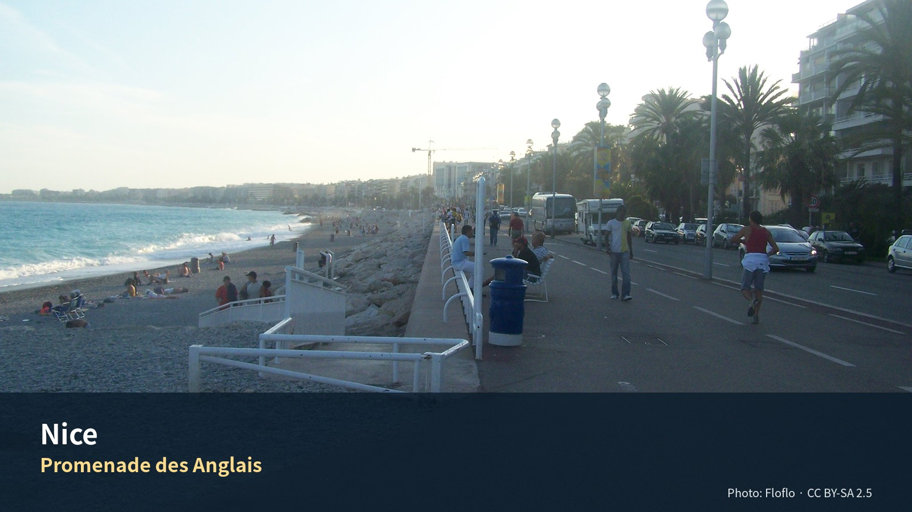

*Promenade des Anglais — Photo: Floflo, CC BY-SA 2.5; [원문](https://commons.wikimedia.org/wiki/File:Nice_promenade-anglais.jpg). 가이드북용으로 크롭·리사이즈.*

# Commercial Guide Module

> **시장과 해변의 생활도시를 중심으로 Cannes와 Monaco를 분리해 보는 5박**  
> Riviera의 화려함보다 Nice의 생활감과 회복일을 중심에 둔 장

## Editor’s Verdict

| 항목 | 평가 |
|---|---|
| 여행 적합도 | ★★★★★ Jason·Julia의 생활형 여행에 최적화 |
| 예산 체감 | 중상 |
| 일정 강도 | 당일치기 2회 + 회복일 |
| 예약 핵심 | TER 유연 · NCE 렌터카 P0 |
| 우천 전환 | Nice 미술관 1곳과 시장·카페 중심 |

## 놓치면 아쉬운 선택

| 등급 | 장소·경험 | 이 가이드북에서 추천하는 이유 |
|---|---|---|
| 필수 | **Cours Saleya–Vieux Nice–Castle Hill** | 시장·구시가지·전망을 한 날의 완성된 흐름으로 묶는다. |
| 우선 추천 | **Promenade 생활산책** | 관광명소라기보다 매일 반복할 수 있는 운동·일몰 공간으로 쓴다. |
| 우선 추천 | **Cannes 당일치기** | 시장·구시가지·Croisette를 짧고 명확하게 본다. |
| 우선 추천 | **Monaco 당일치기** | 왕실 구시가지와 항구를 우선하고 Monte Carlo 추가는 체력에 따라 결정한다. |
| 필수 | **9/8 회복일** | 세탁·장보기·문화시설 한 곳만 배치해 Provence 차량구간을 준비한다. |

## 하루를 완성하는 네 가지 선택

| 시간·역할 | 추천 | 이용법 |
|---|---|---|
| 아침 | **Libération 또는 Cours Saleya** | 시장에 먼저 가고 해변은 이후에 본다. |
| 점심 | **시장·구시가지 가벼운 식사** | 해변 도시에서 긴 점심보다 오후 체력을 남긴다. |
| 저녁 | **숙소 생활권 또는 Port** | 당일치기 귀환 후 이동을 최소화한다. |
| 운동 | **Promenade 러닝·걷기** | 평탄하고 반복 가능한 Nice의 대표 생활경험이다. |

## 이 지역의 Top 10

1. Cours Saleya
2. Vieux Nice
3. Castle Hill
4. Promenade
5. Libération 시장
6. Port
7. Cannes Forville
8. Le Suquet
9. Monaco-Ville
10. 회복일 장보기

## 현장 메모

- **대표 촬영 장면:** Promenade의 곡선과 지중해의 파란 수평선
- **기념품 방향:** 올리브·향신료·지역 비누·시장 식재료
- **일정 삭제 원칙:** 선택 쇼핑·두 번째 카페·추가 내부관람부터 삭제하고 핵심 예약과 귀환 연결은 유지한다.
- **표시 기준:** 별점은 객관적 품질평가가 아니라 이 여행계획에서의 편집 추천도다.

---

# 06. 니스와 코트다쥐르 5박 6일
## 지중해 생활도시, 칸과 모나코, 시장과 해안풍경

> **이번 개정의 핵심**: Nice 체류를 4박에서 **5박**으로 늘리고 Aix를 4박으로 줄였다. 기본안은 **Nice 자체 탐방 + Cannes + Monaco + Nice 생활·회복일**이다. 추가된 9월 8일은 Libération 시장, 화요일에 여는 Musée de la Photographie Charles Nègre 선택, 세탁·휴식·해변산책을 조합하는 완충일로 사용한다. Matisse·Chagall은 모두 화요일 휴관이므로 이날 배치하지 않는다. Saint-Paul-de-Vence·Grasse·Aix 이동은 9월 9일로 하루 늦춘다.

> **식사 원칙**: 아침은 숙소, 점심은 샌드위치·시장·가벼운 현지식, 저녁은 레스토랑을 기본으로 한다.

> **운동 원칙**: Jason은 러닝 또는 짧은 gym, Julia의 수영은 선택 일정이며 숙소 선택조건이 아니다.

> **디자인 메모**: 최종 가이드북에는 지도·사진·그림 이미지를 삽입한다. 현재 작업본에는 **삽입 위치와 제목, 설명만 자리표시자 형태로 배치**한다.

---

## Phase 10 공식정보 원칙

- 운영시간·요금·예약조건은 `OPERATIONS/116_Phase10_Official_Source_Fact_Verification_Register_v1.0.md`를 우선한다.
- 공식 페이지가 충돌하거나 날짜별 예약창이 필요한 항목은 계획가격이 아니라 **재확인**으로 본다.
- 날씨·화재통제·파업·교통은 전날 또는 당일 확인한다.

# Regional Context & Scheduled Place Dossiers

## 이 5박이 여행 전체에서 하는 일

**43일 중 가장 긴 무이동 구간이다.** Day 7에 도착해 Day 12까지 같은 숙소에 머문다. Paris를 빼면 최장이다.

바르셀로나 3박은 대도시 소화, Bàscara 3박은 권역 이동이 많았다. **니스 5박은 회복 구간이다.** 기존 원고가 Day 11을 '생활·회복일’로 비워둔 것이 이 구간의 성격을 정확히 보여준다.

동시에 이 구간은 **당일치기 두 번(칸·모나코)** 을 품는다. 거점을 두고 방사형으로 나갔다 돌아오는 방식이라 짐을 옮기지 않는다. 43일 여행에서 이런 구조가 가능한 곳이 몇 없다.

## 이 도시를 이해하는 축

### 니스는 프랑스에 늦게 합류했다

기원전 350년경 그리스 마사리아인이 승리의 여신 니케의 이름을 따 니카이아로 세웠고, 1세기에 로마가 정복했다. 중세 이후 프랑스와 이탈리아 지배를 오가다 1388년 사보이 백작의 보호 아래 들어갔다. 사보이 가문은 이후 500년간 니스를 지배했고, 1860년에야 프랑스에 병합됐다.

1860년 병합은 나폴레옹 3세의 토리노 조약과 그에 따른 주민투표로 이뤄졌다. 논란은 있었지만 받아들여졌다. '두 세계의 영웅’ 주세페 가리발디는 1807년 니스에서 태어났고 평생 자기 도시의 프랑스 병합에 반대해 싸웠다.

**즉 니스가 프랑스인 기간은 166년이고, 사보이였던 기간은 500년이다.** 구시가지의 파스텔 파사드와 덧창, 바로크 교회, 가정식 전통이 이탈리아식인 것은 흉내가 아니라 원래 그랬기 때문이다.

### 왜 병합에 찬성했는가 — 항구 문제

1853년 사보이-사르데냐가 니스의 자유항 지위를 폐지했다. 제노바가 피에몬테의 주역이 되면서 니스의 작은 림피아 항은 무의미해졌다. 지역 경제에 치명타였고 폭력 시위로 이어졌다. 이 항구 문제가 1860년 니스가 프랑스행을 택한 핵심 요인이었다.

역사가 애국심이 아니라 **경제로 결정된 사례**다. 항구를 걸을 때 이 배경을 알고 보면 다르게 보인다.

### 성이 없어진 도시

1705년 말 니스가 항복했고, 1706년 프랑스군이 성을 허물어 성벽·탑·능보를 잔해로 만들었다. 니스는 군사적 기능을 잃었다.

그런데 이것이 도시를 바꿨다. 더 이상 공격할 가치가 있는 군사 거점이 아니게 되자 니스는 확장과 미화에 집중할 수 있게 됐다. 쿠르 살레야와 가리발디 광장 같은 큰 공공 공간이 그때 생겼다.

**파괴가 도시계획의 출발점이 된 경우다.** 성이 남아 있었다면 쿠르 살레야는 없었다.

### 경제 — 관광이 전부는 아니다

관광이 크지만 니스는 프랑스 5위권 인구를 가진 실제 도시다. **구시가지 밖으로 한 블록만 나가면 생활권이 시작된다.** 리베라시옹 시장이 그 증거다.

## 일정에 포함된 장소별 상세 가이드

일정에 들어간 방문지를 순서대로 싣는다. 각 항목은 무엇인지, 무엇이
핵심인지, 현장에서 어떻게 볼 것인지로 나뉜다. 운영시간과 요금은
표로 분리했고 변동 항목에는 재확인 표시를 달았다.

### Day 7–8 — 니스 도착과 핵심

#### Promenade des Anglais {{grade:essential|필수}}

##### 무엇인가

19세기 영국인 겨울 체류객들이 만든 해안 산책로다. 이름 그대로 '영국인의 산책로’다.

1860년 병합 이후 구시가지 북쪽 시미에 언덕이 투자 대상이 됐고, 농지가 고급 저택으로 바뀌었다. 유럽 귀족에게 리비에라는 온화한 겨울 햇빛과 바다·산 풍경의 동의어였다. 빅토리아 여왕도 만년에 매년 겨울 몇 주를 코트다쥐르에서 보냈다.

즉 이 산책로는 **관광이 산업이 되기 전, 요양이 산업이던 시대의 유산**이다.

> **도착일 저녁에 걸어라**
> 기존 원고가 Day 7을 '도착·체크인·Promenade 적응’으로 잡은 것이 맞다. 시차와 이동 피로 상태에서 **평지를 직선으로 걷는 것**만큼 좋은 적응 활동이 없다.

> **자갈 해변이다**
> 모래가 아니라 굵은 자갈이다. 맨발로 걷기 불편하고, 누울 때 매트가 필요하다. 사진과 실제의 낙차가 큰 지점이다.

---
#### Cours Saleya {{grade:essential|필수}}

##### 무엇인가

구시가지 중심의 큰 광장에서 열리는 시장이다. 월요일을 제외하고 매일 선다. 특히 1897년에 시작된 꽃시장(Marché aux Fleurs)으로 유명하고, 프랑스의 '특별시장’으로 지정돼 있다. 꽃 외에 신선 농산물·치즈·수공예품을 판다. 월요일에는 골동품·벼룩시장으로 바뀐다.

##### 관광지인가 아닌가

쿠르 살레야는 전 세계 관광객에게 인기지만 관광객 함정으로 치부할 수 없다. 주민들도 여기서 장을 본다.

다만 구분이 필요하다.

> **광장의 큰 테라스 식당은 피하라**
> 쿠르 살레야에 면한 대형 테라스 식당들은 대체로 비싸고 관광객 위주다. 구시가지 뒷골목에서 훨씬 낫고 진짜에 가까운 음식을 찾을 수 있다.
> **시장에서 사고, 밥은 골목에서 먹는다.** 이 원칙 하나면 된다.

> **Ponchettes를 보라**
> 쿠르 살레야 남쪽의 낮은 색색 건물들을 퐁셰트라고 한다. 그 평평한 옥상이 벨 에포크 초기의 산책로였고, 프로므나드 데 장글레가 생기기 수십 년 전까지 가장 인기 있는 해안 산책로였다.
> 즉 **프로므나드의 전신**이다. 두 개를 이어 보면 니스가 어떻게 해안 도시가 됐는지가 보인다.

##### 실용

|항목 |값                       |
|---|------------------------|
|운영 |**월요일 휴장** (골동품 시장으로 전환)|
|요금 |무료                      |
|시간대|오전이 본편. 정오 지나면 정리 시작    |
|체류 |45–60분                  |

⚠ **Day 10(9월 7일, 모나코 당일치기)이 월요일이다.** 그날 아침 쿠르 살레야에 들르면 골동품 시장을 만난다 — 그것대로 재미있지만 **기대와 다르다는 것을 알고 갈 것.** 회복일 Day 11(9월 8일 화요일)에는 정상 운영한다.

---
#### Colline du Château (성채 언덕) {{grade:essential|필수}}

##### 무엇인가 — 이름과 실물이 다르다

이름과 달리 지금 92미터 언덕 위에 성은 없다. 거의 천 년간 니스의 스카이라인을 지배하던 요새가 1706년 루이 14세의 명령으로 파괴됐다. 지금은 항구와 구시가지 사이의 19헥타르 공원이다.

성은 11세기에 카스트룸으로 지어져 성벽·탑·대성당을 갖춘 요새로 발전했고, 1388년 이후 사보이 가문 아래 도시를 지켰다. 1543년·1691년·1705년의 포위를 견뎌냈지만 1706년 적에게 이용되는 것을 막기 위해 조직적으로 철거됐다. 지금은 성벽 잔해, 5–15세기 생트마리 대성당 유적, 19세기 벨랑다 탑이 남아 있다.

##### 관람 요령

> **먼저 이 언덕이 니스의 출발점이라는 것**
> 여기가 니스가 세워진 자리이고, 니스 사람들이 수백 년간 살던 곳이다. 지금 구시가지로 알려진 아래쪽은 그보다 나중이다. 위에서 아래를 보는 것이 시간 순서상 맞는다.

> **엘리베이터가 있다**
> 무료 공공 엘리베이터 또는 계단으로 오른다. 5박 중 어느 날이든 갈 수 있지만, **계단으로 오르면 30분, 엘리베이터면 5분**이다. 피로도에 따라 선택.

> **시간대를 정하라**
> 항구는 일출에, 프로므나드 데 장글레는 일몰에 가장 좋다. 두 방향의 최적 시각이 다르다. 한 번만 간다면 **늦은 오후**가 절충점이다.

> **인공폭포와 대성당 유적**
> 지금 언덕에는 녹지와 인공폭포, 원래 대성당의 고고학 유적이 있다. 폭포는 19세기에 만든 것이다. 유적 쪽은 표지가 작아 지나치기 쉽다.

##### 실용

|항목|값                      |
|--|-----------------------|
|요금|**무료**                 |
|높이|92m · 공원 19헥타르         |
|접근|무료 엘리베이터(벨랑다 탑 옆) 또는 계단|
|체류|45–75분                 |
|주의|그늘이 부분적. 물 지참          |

---
#### Vieux Nice — 구시가지 {{grade:essential|필수}}

##### 무엇인가

사보이 가문 아래에서 니스는 리구리아·피에몬테와 언어·건축·요리·관습을 공유했다. 이 이탈리아 유산이 지금도 구시가지의 파스텔 파사드, 덧창, 바로크 교회, 가족 운영 식문화에 남아 있다.

##### 볼 것

쿠르 살레야에서 구시가지 골목으로 들어간다. Rue Droite, Rue de la Préfecture, 그리고 도시 수호성인에게 헌정된 1650–1699년 바로크 건축 생트레파라트 대성당이 있는 로세티 광장. Rue Saint-François-de-Paule에는 1820년부터 이어온 초콜릿 가게 메종 아우어와 니스 오페라가 있다. 좁은 길 양옆으로 리구리아-프로방스식 파스텔 건물이 높이 서 있다.

놓치지 말 것 — 지중해에서 가장 장식적인 축에 드는 로코코 내부의 미제리코르드 성당, 17세기 제노바-니스 귀족 저택이자 고악기 박물관인 팔레 라스카리스, 1642년 예수회 성당인 제쥐 성당.

> **위를 보라**
> 골목이 좁고 건물이 높아 시선이 아래로 향한다. **파사드 상부의 트롱프뢰유(눈속임 그림)** 가 이 도시의 특징이다. 실제 조각이 아니라 그려 넣은 창틀과 기둥이 많다. 제노바에서 온 관습이다.

---
### Day 9 — 칸 당일치기

#### Marché Forville {{grade:essential|필수}}

##### 무엇인가

칸의 마르셰 포르빌은 지금 무엇이 제철인지를 알려주는 지표 시장이다.

병아리콩 갈레트 소카, 검은 올리브, 안초비 페이스트를 곁들인 보라색 아티초크, 말린 토마토, 루핀콩. 이탈리아식 샤퀴트리, 푸가스, 피살라디에르, 칸 분지의 근대 파이(짭짤한 버전과 잣을 넣은 단 버전).

> **니스 시장과 비교하라**
> 쿠르 살레야는 꽃과 관광이 섞여 있고, 포르빌은 **식자재 중심**이다. 같은 코트다쥐르인데 시장의 성격이 다르다.

#### Le Suquet — 칸 구시가지 {{grade:essential|필수}}

칸의 언덕 구시가지다. 영화제의 크루아제트와 정반대 성격이다.

> **크루아제트를 먼저 보고 르 쉬케로 올라가라**
> 순서가 중요하다. 해안의 호텔·명품가를 먼저 보고 언덕으로 올라가면 **칸이 원래 어촌이었다는 사실**이 몸으로 이해된다. 반대로 하면 그냥 언덕이다.

실용 — 언덕이라 계단이 많다. {{badge:pending|운영·요금 재확인}}

---
### Day 10 — 모나코 당일치기

#### Le Rocher — 모나코 구시가지 {{grade:essential|필수}}

바위 위의 구시가지다. 대공궁, 대성당, 해양박물관이 있다.

> **위병 교대**
> 대공궁 앞에서 매일 정오 직전에 위병 교대가 있다 {{badge:pending|시각 재확인}}. **시각이 정확해야 의미가 있으므로 출발 전 반드시 확인할 것.**

> **모나코는 나라다**
> 셍겐 지역이라 국경 검문은 없지만 **별도 국가**다. 통화는 유로로 같다. 주차와 벌금 체계가 프랑스와 다르므로 렌터카로 갈 경우 주의 {{badge:pending|확인 필요}}.

⚠ **이 방문지는 조사가 부족하다.** 몬테카를로·항구·해양박물관 상세는 **[보완 필요]** 상태다.

---
### Day 11 — 생활·회복일

#### Marché de la Libération {{grade:priority|우선추천}}

##### 무엇인가 — 진짜 장을 보는 곳

더 '진지한’ 식료품 쇼핑을 원한다면 제네랄 드골 광장의 리베라시옹 시장으로 가라. 좌판이 과일·채소·가정 요리에 더 집중돼 있다.

**쿠르 살레야가 도시의 얼굴이라면 리베라시옹은 도시의 부엌이다.** 5박 중 하루를 회복일로 쓰는 이 일정에서, 관광 시장이 아닌 생활 시장에 가는 것이 이 날의 성격에 맞는다.

> **회복일의 구성**
> 시장 → 문화시설 한 곳 → 세탁 → 해변. 기존 원고의 이 구성이 옳다. **새로운 것을 넣지 마라.** 43일 중 11일차다.

## 실행지도 · 현장 사용

- [대화형 HTML 지도](../../ASSETS/75_Execution_Maps/Nice_Execution_Map_v0.2.html)
- [GeoJSON](../../ASSETS/75_Execution_Maps/Nice_Execution_Map_v0.2.geojson)
- [KML](../../ASSETS/75_Execution_Maps/Nice_Execution_Map_v0.2.kml)
- 대상 일정: **Day 7–12**
- 숙소 핀은 현재 **후보 위치**이며 실제 예약주소가 아니다.
- 연결선은 일정상의 기준점 순서를 보여주는 개략선이다. 실제 도보·운전은 Google Maps에서 다시 계산한다.
- HTML 배경지도와 Google Maps 링크는 인터넷 연결이 필요하다.

# Layer 1. Quick Reference · 확정 일정 · 실행표

## 1. 한눈에 보는 실행 요약

| 항목 | 권장 내용 |
|---|---|
| 체류 | 2026년 9월 4일 금요일 체크인 → 9월 9일 수요일 체크아웃, **5박** |
| 숙소 | **확정 — Palais ALZIRA · 12 Rue Verdi, 06000 Nice** (체크인 15:00 · 체크아웃 11:00) |
| 여행 성격 | 지중해 생활도시 + 당일치기 2회 + 생활·회복 1일 + 이동일 언덕마을·향수도시 |
| 이번 챕터의 우선순위 | **Nice 시내 1일, Cannes 1일, Monaco 1일, Nice 생활·회복 1일, 9/9 Saint-Paul-de-Vence·Grasse 경유 후 Aix 이동** |
| 미술관 전략 | 9/8에는 화요일 운영하는 Musée de la Photographie Charles Nègre만 선택. Matisse·Chagall은 모두 휴관 |
| 숙소 1순위권 | Place Masséna 북동, Jean Médecin 동쪽, Garibaldi–Port 서쪽 |
| 숙박예산 | 2인 5박 총액 **€700–1,000 내외**를 계획범위로 사용. 주방·세탁·조용한 방향이 명확하면 상단 허용 |
| 필수 경험 | Cours Saleya, Vieux Nice, Castle Hill, Cannes Forville·Le Suquet, Monaco-Ville·Palace Square, 9/8 생활형 시장·완충시간 |
| 선택 경험 | Matisse 또는 Chagall, Cimiez 정원, Nice Port, Saint-Paul 골목 스케치, Grasse 향수 체험 |
| 운동 | Jason Promenade 5–8km 러닝 1–2회, Julia는 9/8 수영 선택 |
| 다음 이동 | **9/9** NCE Terminal 2 렌터카 인수 → Saint-Paul-de-Vence → Grasse → Aix-en-Provence |
| 피로도 | Nice 도시일 3 / Cannes·Monaco 4 / 9/8 회복일 2 / 이동일 5 |

### 이 일정이 Jason·Julia에게 맞는 이유

1. Nice·Cannes·Monaco의 도시성 차이를 보면서도, 추가된 하루가 누적피로를 회수한다.
2. 미술관을 강제하지 않고 **시장·운동·세탁·한 곳의 문화시설**을 선택하는 생활형 구조다.
3. 렌터카 인수 전날 서류·짐·간식을 정리해 9/9 장거리 이동의 실패 가능성을 낮춘다.

---

## 2. 시각요소 자리표시자

### {{VISUAL:VIS-MAP-041|type=map|status=linked|strategy=execution-map}} 니스와 코트다쥐르 전체 개요 지도
- 설명: Nice 숙소권, Nice-Ville역, Cannes, Monaco, 9/8 Nice 생활모듈, NCE Terminal 2, Saint-Paul-de-Vence, Grasse, Aix 이동축을 한 장에 정리한다.

### {{VISUAL:VIS-MAP-042|type=map|status=linked|strategy=execution-map}} 9/5 니스 도보 동선 지도
- 설명: 숙소권에서 Cours Saleya, Vieux Nice, Colline du Château, Promenade, Port까지 이어지는 도보 동선.

### {{VISUAL:VIS-MAP-043|type=map|status=linked|strategy=execution-map}} 9/6 Cannes 당일치기 동선 지도
- 설명: Nice-Ville, Cannes역, Marché Forville, Le Suquet, Vieux-Port, Croisette, 귀환 동선.

### {{VISUAL:VIS-MAP-044|type=map|status=linked|strategy=execution-map}} 9/7 Monaco 당일치기 동선 지도
- 설명: Monaco-Monte-Carlo역, Monaco-Ville, Palace Square, Cathedral, Port Hercule, Casino Square 선택동선.

### {{VISUAL:VIS-MAP-045|type=map|status=linked|strategy=execution-map}} 9/8 Nice 생활·회복 지도
- 설명: Marché de la Libération, Musée de la Photographie Charles Nègre 선택, 숙소 휴식, Promenade 저녁산책을 연결한다.

### {{VISUAL:VIS-MAP-046|type=map|status=linked|strategy=execution-map}} 9/9 Nice→Saint-Paul-de-Vence→Grasse→Aix 이동 지도
- 설명: 공항 렌터카 인수 이후 언덕마을과 향수도시를 거쳐 Aix로 넘어가는 자동차 이동축.

---

## 3. 날짜별 확정 일정

| 날짜 | 테마 | 핵심 방문지 | 기본 성격 |
|---|---|---|---|
| 9/4 금 | 도착과 적응 | Place Masséna·Promenade des Anglais | 가벼운 산책 |
| 9/5 토 | Nice 핵심 도시일 | Cours Saleya·Vieux Nice·Castle Hill·Port 또는 해변 | 도시 이해 |
| 9/6 일 | Cannes 당일치기 | Marché Forville·Le Suquet·Vieux-Port·Croisette | 새로운 도시 경험 |
| 9/7 월 | Monaco 당일치기 | Monaco-Ville·Palace Square·Cathédrale·Monte Carlo | 도시국가 경험 |
| **9/8 화** | **Nice 생활·회복일** | Libération 시장·사진미술관 선택·세탁·Promenade | 피로 회수 |
| **9/9 수** | Provence 이동일 | NCE 렌터카·Saint-Paul-de-Vence·Grasse·Aix | 이동 + 마을체험 |

---

## 4. Day 1 — 9월 4일 금요일
### 니스 도착, 체크인, Promenade 적응

| 상대시간 | 일정 | 실행 포인트 |
|---|---|---|
| 도착–+60분 | 공항 → 숙소 이동·체크인 | **12 Rue Verdi (Palais ALZIRA)** — 도착터미널에 따라 Tram 2 또는 택시. 체크인 15:00부터 |
| +60–+120분 | 짐 정리·근처 슈퍼 장보기 | 물, 요거트, 빵, 과일, 햄·치즈, 샐러드 |
| 일몰 전 45–60분 | Masséna·Jardin Albert 1er·Promenade | 방향만 익히고 장거리 도보는 피함 |
| 19:30 전후 | 가벼운 저녁 | 숙소권 캐주얼 식당 또는 숙소식 |

**피로도 2/5.** 지연 시 외식과 산책을 순서대로 삭제한다.

---

## 5. Day 2 — 9월 5일 토요일
### Nice 핵심: 시장, 구시가지, 성채언덕, 해변

| 시간 | 일정 | 실행 포인트 |
|---|---|---|
| 07:20–08:05 | Jason 선택 러닝 | Promenade 5km 내외 |
| 09:20–10:20 | **Cours Saleya** | 과일·올리브·치즈·꽃시장 |
| 10:20–11:30 | **Vieux Nice** | Sainte-Réparate, 골목, 작은 광장 |
| 11:35–12:35 | **Colline du Château** | 해변·구시가지·항구 조망 |
| 12:45–13:30 | 가벼운 점심 | socca·salade niçoise·pan bagnat 중 1개 |
| 13:30–16:00 | Promenade 또는 Port·카페 | 폭염이면 숙소휴식 |
| 16:30–18:00 | 선택 | Port 또는 Garibaldi 중 1개 |
| 19:30–21:00 | 전통 Nice 저녁 | Acchiardo 또는 La Table Alziari |

**피로도 3/5.** 필수는 Cours Saleya·Vieux Nice·Castle Hill이다.

---

## 6. Day 3 — 9월 6일 일요일
### Cannes 당일치기: 시장, 구시가지, 항구, Croisette

| 시간 | 일정 | 실행 포인트 |
|---|---|---|
| 08:40 전후 | Nice-Ville → Cannes TER | 당일 운행 재확인 |
| 09:30–10:20 | **Marché Forville** | 생활시장·간식 |
| 10:20–11:20 | **Le Suquet** | 골목·전망 |
| 11:20–12:00 | **Vieux-Port** | 항구 보행 |
| 12:00–13:00 | 가벼운 점심 | 시장식 또는 간단한 해산물 |
| 13:00–15:40 | Palais·Croisette·해변 선택 | 쇼핑연장은 삭제 가능 |
| 16:00 전후 | Nice 귀환 | 저녁 전 숙소휴식 |

**피로도 4/5.** Forville·Le Suquet·Croisette를 핵심으로 두고 해변 체류를 조절한다.

---

## 7. Day 4 — 9월 7일 월요일
### Monaco 당일치기: 왕실 구시가지, 항구, Monte Carlo

| 시간 | 일정 | 실행 포인트 |
|---|---|---|
| 09:00 전후 | Nice-Ville → Monaco TER | 역내 엘리베이터·출구 확인 |
| 10:15–12:30 | Monaco-Ville·Palace Square·Cathedral | 버스·엘리베이터 활용 |
| 12:40–13:30 | 가벼운 점심 | Old Town 또는 항구 |
| 13:40–14:40 | Port Hercule·Condamine | 도시단면 관찰 |
| 14:50–16:10 | Casino Square·Monte Carlo | 외관·정원 중심 |
| 16:10–17:00 | Japanese Garden 또는 Larvotto | 둘 중 하나만 |
| 17:20 전후 | Nice 귀환 | 저녁은 가볍게 |

**피로도 4/5.** Palace Square와 Monte Carlo가 핵심이다.

---

## 8. Day 5 — 9월 8일 화요일
### Nice 생활·회복일: 시장, 사진미술관 선택, 세탁과 해변

추가된 1박의 목적은 장소를 더 쌓는 것이 아니라 **당일치기 이틀 뒤 피로를 회수하고 Nice에서 실제 생활하는 것**이다.

| 시간 | 일정 | 실행 포인트 |
|---|---|---|
| 07:30–08:15 | Jason 선택 러닝 또는 늦잠 | 다리 피로가 있으면 완전휴식 |
| 09:20–10:30 | **Marché de la Libération** | 실제 장보기·9/9 차량간식 준비 |
| 10:45–12:30 | **Musée de la Photographie Charles Nègre 선택** | 화요일 10:00–18:00 운영. 피로하면 생략 |
| 12:45–13:30 | 가벼운 점심 | 시장재료 또는 숙소권 점심 |
| 13:30–15:30 | 숙소 휴식·세탁 | 체크아웃·렌터카 서류·짐 재분류 |
| 15:30–17:30 | 선택 모듈 | Promenade 카페, 해변산책, Julia 수영 중 1개 |
| 17:30–18:30 | 9/9 준비 | 물·간식·면허·예약번호·주유/보험 확인 |
| 19:30–21:00 | Nice 마지막 저녁 | 과식하지 않고 이동일 전 음주 최소화 |

**피로도 2/5.** 사진미술관은 선택이며 생활블록을 우선한다. Matisse·Chagall은 화요일 휴관이고, Èze·Villefranche 추가도 금지한다.

---

## 9. Day 6 — 9월 9일 수요일
### 렌터카 인수, Saint-Paul-de-Vence·Grasse, Aix 이동

| 시간 | 일정 | 실행 포인트 |
|---|---|---|
| 08:00–08:45 | 체크아웃·간단한 아침 | 체크아웃은 11:00까지 가능하지만 인수 시각에 맞춰 나온다. 차량용 물·간식 준비 |
| 08:45–09:00 | Nice역(Avenue Thiers)까지 도보 | 숙소에서 약 1.2km — 짐이 많으면 택시 |
| 09:00 | **Nice역 렌터카 인수** (확정 Hertz L672E080313) | 자동변속·보험·편도반납·차체촬영. 수속 30–60분 |
| 09:30–11:00 | **Saint-Paul-de-Vence** | 골목·성벽·짧은 스케치 |
| 11:00–12:00 | 가벼운 점심·이동 | 긴 코스식 금지 |
| 12:30–14:00 | **Grasse vieille ville** | 향수 시향 또는 짧은 공방 |
| 14:30–17:00 | Grasse → Aix | A8 정체에 따라 변동 |
| 17:00 이후 | Aix 체크인 | 다음 챕터의 Day 1로 연결 |

**피로도 5/5.** 인수가 늦으면 Grasse를 먼저 삭제하고, 정체가 심하면 Saint-Paul만 본다.

---

## 10. 피로도와 삭제 우선순위

| 날짜 | 피로도 | 삭제 1순위 | 삭제 2순위 |
|---|---:|---|---|
| 9/4 | 2 | 외식 | Masséna 추가산책 |
| 9/5 | 3 | Port | 카페 2차 |
| 9/6 | 4 | Croisette 쇼핑 | 해변 연장 |
| 9/7 | 4 | Larvotto/Japanese Garden | Condamine 추가산책 |
| **9/8** | **2** | 두 번째 문화시설 | 추가 동네탐방 |
| **9/9** | **5** | Grasse | Saint-Paul 긴 점심 |

---

# Layer 2. 지역 이해 · 동네 · 추천등급 · 방문지 설명

## 11. 니스와 코트다쥐르를 어떻게 볼 것인가

이번 5박은 니스를 “휴양지”로만 소비하지 않고, **서로 다른 해안도시를 비교하는 짧은 입문 코스**로 보는 편이 좋다.

- **Nice**: 시장, 구시가지, 산책과 장보기의 생활도시
- **Cannes**: 영화제와 해변 리조트, 상업적 해안도시
- **Monaco**: 왕정 구시가지와 초고가 현대도시가 맞붙는 도시국가
- **Saint-Paul-de-Vence**: 언덕 위 석조마을
- **Grasse**: 향수 산업과 구시가지가 결합한 내륙 언덕도시

이 구조는 Jason·Julia가 이후에 가게 될 **Aix, Luberon, Avignon**과도 잘 이어진다. 즉, 니스 챕터는 단순한 해변 휴양이 아니라, **프랑스 남동부의 도시·마을 성격을 빠르게 읽는 첫 단계**다.

---

## 12. 동네와 숙소 생활권

| 생활권 | 성격 | 장점 | 약점 | 추천 |
|---|---|---|---|---|
| **Place Masséna 북동** | 중심·도보형 | 바다·구시가지·트램·쇼핑의 균형 최고 | 가격이 약간 높음 | **1순위** |
| **Jean Médecin 동쪽** | 교통·상점 중심 | Nice-Ville, 트램, 슈퍼 접근 우수 | 대로변 소음 가능 | **1순위** |
| **Garibaldi–Port 서쪽** | 식당·항구·트램 | Vieux Nice와 Port 사이, 저녁산책 좋음 | 역 접근은 한 단계 떨어짐 | **1.5순위** |
| Libération | 생활시장형 | 시장·트램·현지감 | 바다·구시가지까지 이동 필요 | 2순위 |
| Promenade 서쪽 | 해변형 | 바다 접근과 러닝 최적 | 철도·시장 동선이 길어짐 | 2순위 |
| Vieux Nice 내부 | 관광 중심 | 분위기는 좋음 | 야간소음, 계단, 짐 이동 불리 | 비추천 |

### Jason·Julia에게 가장 적합한 이유

이번 일정은 Nice 자체보다 Cannes·Monaco 철도 이동이 핵심이므로, **Nice-Ville 접근성과 저녁 산책의 균형**이 중요하다. 따라서 Place Masséna 북동 또는 Jean Médecin 동쪽이 가장 무난하다.

---

## 13. 추천등급 요약

| 장소 | 등급 | 이유 |
|---|---|---|
| Cours Saleya | 필수 | 니스의 시장과 생활감이 가장 농축된 장소 |
| Vieux Nice | 필수 | 니스의 도시 성격을 직접 체감하는 구역 |
| Colline du Château | 필수 | 해변·항구·구시가지 전체를 한 번에 이해하는 전망대 |
| Cannes — Forville + Le Suquet + Croisette | 필수에 가까운 우선 추천 | Nice와 성격이 다른 해안도시 경험 |
| Monaco — Monaco-Ville + Monte Carlo | 필수에 가까운 우선 추천 | 도시국가의 밀도와 상징성이 강함 |
| Saint-Paul-de-Vence | 우선 추천 | 이동일에 넣기 좋은 대표 언덕마을 |
| Grasse vieille ville | 우선 추천 | 향수도시라는 뚜렷한 개성이 있음 |
| Port Lympia | 우선 추천 | Nice의 생활형 항구 분위기 |
| Marché de la Libération | 선택 | 생활감 있는 장보기에 좋음 |
| Matisse Museum | 선택 | 관심이 있거나 비 오는 날 대체안으로 좋음 |
| Chagall Museum | 선택 | 예술 관심이 강할 때만 추가 |
| Cannes 쇼핑 중심 장기체류 | 비추천 | 이번 일정에서는 도시 성격 체험만으로 충분 |
| Monaco 대형 실내명소 연속 방문 | 비추천 | 도시 자체를 보기보다 실내에 갇히게 됨 |

---

## 14. 주요 방문지 상세 소개

### 14.1 Cours Saleya — 니스를 시작하는 가장 좋은 장소

### {{VISUAL:VIS-PHOTO-079|type=photo|status=travel-capture|strategy=direct-shot}} 꽃과 식품 노점이 이어진 Cours Saleya
- 설명: 니스의 시장 문화와 구시가지 입구의 활기를 상징하는 이미지.

니스에서 “어디부터 시작할 것인가”를 묻는다면 답은 거의 항상 Cours Saleya다. 관광객도 많지만, 이곳은 여전히 니스가 **먹고, 사고, 걷는 도시**라는 사실을 보여준다.

**왜 가야 하나**
- 니스 특유의 식문화가 눈앞에 펼쳐진다.
- Vieux Nice와 해변을 연결하는 출발점이다.
- 점심 재료와 간단한 간식을 동시에 해결할 수 있다.

**꼭 해볼 것**
- 꽃시장과 식품시장을 모두 한 바퀴 돌아보기
- 제철 과일 1–2종 사보기
- socca 또는 pissaladière를 간식으로 맛보기
- 주변 골목으로 자연스럽게 이어서 Vieux Nice로 들어가기

**체류 적정시간**: 45–60분

---

### 14.2 Vieux Nice — 관광지가 아니라 “도시의 기억”으로 보기

### {{VISUAL:VIS-PHOTO-080|type=photo|status=pre-publication|strategy=licensed-or-direct}} Vieux Nice의 주황빛 건물과 좁은 골목
- 설명: 관광객이 많아도 여전히 니스의 역사적 중심이라는 느낌을 주는 장면.

Vieux Nice는 단지 “예쁜 골목”이 아니라, 현재의 니스가 생겨난 오래된 도심이다. 골목을 서둘러 통과하기보다, 광장과 성당, 아이스크림 가게, 작은 식당이 어떻게 엮여 있는지 보는 것이 중요하다.

**꼭 해볼 것**
- Sainte-Réparate 성당 주변 광장 머물기
- 골목 하나는 의도적으로 천천히 걸어보기
- 관광객이 몰리는 메인축을 벗어난 조용한 골목 1–2개 찾아보기

**체류 적정시간**: 60–75분

---

### 14.3 Colline du Château — 니스를 한 번에 이해하는 전망대

### {{VISUAL:VIS-PHOTO-081|type=photo|status=pre-publication|strategy=licensed-or-direct}} Castle Hill에서 내려다본 Baie des Anges
- 설명: 니스의 해변곡선과 구시가지, 항구를 동시에 담는 대표 전망 이미지.

이곳은 Nice 시내에서 가장 높은 상징적 전망 지점이다. 박물관 대신 도시 전체 구조를 한 번에 읽고 싶다면, 바로 이곳이 더 중요하다.

**꼭 해볼 것**
- 해변 방향 전망과 항구 방향 전망을 모두 보기
- 폭포 주변 그늘에서 잠깐 쉬기
- 내려올 때는 Port 쪽 또는 구시가지 쪽 중 한 방향을 선택해 동선을 마무리하기

**체류 적정시간**: 45–60분

---

### 14.4 Cannes — “영화제 도시”와 “리조트 도시”를 동시에 체험

### {{VISUAL:VIS-PHOTO-082|type=photo|status=pre-publication|strategy=licensed-or-direct}} Croisette의 야자수와 호텔 파사드
- 설명: 칸이 왜 지중해 리조트의 상징으로 소비되는지를 한눈에 보여주는 장면.

Cannes는 화려한 이미지 때문에 피상적으로 느껴질 수 있지만, Forville 시장과 Le Suquet를 같이 보면 훨씬 입체적으로 읽힌다. 즉, 칸은 **시장과 언덕의 오래된 마을 + 영화제와 리조트의 현대 이미지**가 공존하는 도시다.

**꼭 해볼 것**
- Forville 시장에서 치즈·과일·해산물 풍경 보기
- Le Suquet에서 칸 시가지와 항구 조망
- Croisette를 적어도 30분은 걸어보기
- Palais des Festivals 주변에서 영화제 도시의 분위기 체감하기

**체류 적정시간**: 5–6시간

**추천 음식 포인트**
- 시장 안 또는 근처에서 가벼운 점심
- 저녁은 Nice로 돌아와 먹는 편이 전체 리듬상 좋음

---

### 14.5 Monaco — 작지만 강한 도시국가

### {{VISUAL:VIS-PHOTO-083|type=photo|status=pre-publication|strategy=licensed-or-direct}} Monaco-Ville 성벽과 바다 전망
- 설명: 작은 면적 안에 군주국의 상징과 바다풍경이 겹치는 Monaco의 특징을 보여주는 장면.

Monaco는 작지만 하루를 꽉 채울 수 있다. Old Town, Palace, Cathedral, Port, Casino Square가 전부 성격이 다르기 때문이다.

**꼭 해볼 것**
- Monaco-Ville에서 골목·기념품가게·광장 사이를 천천히 걷기
- Palace Square에서 항구 쪽 조망 보기
- Casino Square까지 이동해 극적인 분위기 차이를 체감하기
- 시간이 남으면 Japanese Garden 또는 Larvotto로 내려가 생활형 해안축 보기

**체류 적정시간**: 6–7시간

---

### 14.6 Saint-Paul-de-Vence — 이동일에 가장 효율적인 언덕마을

### {{VISUAL:VIS-PHOTO-084|type=photo|status=pre-publication|strategy=licensed-or-direct}} Saint-Paul-de-Vence 성문과 석조 골목
- 설명: 남프랑스 언덕마을 이미지의 전형.

이곳은 너무 유명해서 오히려 과소평가되지만, 이동일에 짧고 강하게 보기엔 매우 좋다. 성벽마을의 구조가 명료하고, Jason의 짧은 스케치 포인트로도 훌륭하다.

**꼭 해볼 것**
- 성문을 지나 한 바퀴 도는 식으로 골목 순환하기
- 성벽 끝 전망 포인트 하나는 꼭 보기
- 상점 구경보다 골목과 건물 재료, 풍경에 집중하기

**체류 적정시간**: 60–90분

---

### 14.7 Grasse — 향수도시를 “박물관”보다 “체험”으로 보기

### {{VISUAL:VIS-PHOTO-085|type=photo|status=pre-publication|strategy=licensed-or-direct}} 향수 체험 테이블 또는 향수 بوتीक 디스플레이
- 설명: Grasse를 단순한 구시가지가 아니라 향수산업의 도시로 인식하게 만드는 장면.

Grasse는 박물관을 깊게 보지 않아도 좋다. 구시가지와 향수 관련 boutique 또는 짧은 체험만으로도 도시 정체성이 분명하게 느껴진다.

**꼭 해볼 것**
- vieille ville 골목 30–40분 걷기
- 향수 boutique 또는 공방에서 시향 체험하기
- 너무 길게 머무르지 말고 Aix 이동의 리듬을 지키기

**체류 적정시간**: 60–90분

---

### 14.8 미술관·박물관은 어떻게 다룰까

Jason·Julia의 선호를 반영해 이번 챕터에서 미술관은 기본안에서 후순위로 내린다. 다만 다음과 같은 상황이면 넣을 가치가 있다.

- 비가 와서 야외 산책 가치가 떨어질 때
- Monaco 또는 Cannes 대신 좀 더 조용한 하루가 필요할 때
- Matisse 또는 Chagall에 대한 관심이 일정 전체에서 특별히 클 때

**우선순위**
1. Matisse Museum
2. Chagall Museum
3. Monaco Oceanographic Museum

---

# Layer 3. 숙소 · 음식 · 시장 · 운동 · 이벤트 · 예약 · 대체안

## 15. 숙소 전략

### 15.1 숙소 선택 기준

- Nice-Ville 또는 Masséna 방면 접근성이 좋을 것
- 도보 5–10분 안에 슈퍼와 빵집이 있을 것
- 5박이므로 주방 또는 kitchenette·세탁 접근이 있으면 가점
- 엘리베이터와 조용한 객실 여부 확인
- 9/9 체크아웃(11:00)과 Nice역(Avenue Thiers) 09:00 렌터카 인수 이동이 어렵지 않을 것

### 15.2 실제 숙소 후보

> **확정됐다 (2026-08-13).** **Palais ALZIRA · 12 Rue Verdi, 06000 Nice** — 체크인 9/4 15:00, 체크아웃 9/9 11:00.
> 아래 표는 선정 과정의 기록이며 더는 선택지가 아니다. 총액·예약번호·플랫폼은 트래커에 입력해야 한다 {{badge:pending|트래커 입력}}.

| 후보 | 생활권·형태 | 장점 | 확인사항 | 적합도 |
|---|---|---|---|---:|
| **AMMI Nice Massena** | Place Masséna, 아파트호텔 | 중심성, 주방, 해변·구시가지 접근 우수 | 객실까지 계단 유무 확인 | **91/100** |
| **Adagio Access Nice Garibaldi** | Garibaldi 동쪽, 아파트호텔 | 주방, 트램, 구시가지 접근, 생활형 체류 적합 | 역 접근은 한 단계 멂 | **88/100** |
| **AMMI Nice Lafayette** | Masséna 북동, 아파트호텔 | 위치 탁월, 간단한 조리 가능 | 1층까지 30계단 안내 확인 | **86/100** |
| **Best Western Lakmi Nice** | Jean Médecin, 호텔 | 역·트램·쇼핑 접근 안정적 | 주방 없음, 대로변 소음 가능 | **84/100** |
| **Residhome Nice Promenade** | Promenade 서쪽, 아파트호텔 | 주방, 해변·러닝 우수 | 시장·역 이동이 길어짐 | **82/100** |
| **Best Western Alba** | Jean Médecin 북부, 호텔 | 교통 편리, 무난한 호텔형 | 주방 없음 | **81/100** |
| **Adagio Nice Centre** | Port 북동, 아파트호텔 | 주방, 비교적 넓은 객실 | 중심축에서 약간 벗어남 | **80/100** |
| **Hôtel du Midi** | Nice-Ville 남서, 호텔 | 예산형 가능성, 역 접근 우수 | 구시가지와 해변까지 추가 이동 | **79/100** |

### 15.3 최종 선택 순서

1. **AMMI Nice Massena** — 총액이 허용 범위면 1순위
2. **Adagio Access Nice Garibaldi** — 생활형·주방형 대안
3. **Lakmi / Alba** — 주방보다 교통과 가격을 우선할 때
4. **Residhome Nice Promenade** — 해변과 러닝을 우선할 때

---

# 먹거리 — 니스 요리의 문법

## 니스 요리를 이해하는 한 문장

**"이탈리아 재료를 프랑스 문법으로 쓴다."**

니스 요리는 제철 지역 농산물을 쓰는 단순한 조리법으로 알려져 있다. 프로방스와 이탈리아가 겹치는 지점이고, 그 겹침이 500년의 사보이 지배에서 왔다.

## 반드시 먹을 것

|이름                   |정체                           |어디서         |
|---------------------|-----------------------------|------------|
|**Socca**            |병아리콩 가루 갈레트. 장작 화덕에 구워 뜨거울 때 |쿠르 살레야 · 항구 |
|**Pissaladière**     |캐러멜라이즈 양파·안초비·올리브 타르트        |빵집          |
|**Pan bagnat**       |'적신 빵’. 니수아즈 샐러드를 통째로 넣은 샌드위치|점심·해변       |
|**Petits farcis**    |제철 채소 속을 채워 구운 것             |식당          |
|**Salade niçoise**   |아래 규칙 참조                     |식당          |
|**Tourte de blettes**|근대(chard) 파이. 단 버전도 있다       |빵집          |
|**Daube**            |소고기 스튜. 라비올리나 뇨키와            |**가을·겨울 요리**|

## 진짜와 가짜를 가르는 세 가지 규칙

### 소카 — 미리 담아둔 것을 사지 마라

소카는 장작 화덕에서 나온 직후에 후추를 잔뜩 뿌리고 로제 한 잔과 먹는 것이 최선이다. 미리 접시에 담겨 있는 것은 사지 마라. 소카는 화덕에서 팬째 바로 나와야 한다.

표면은 물집처럼 부풀고 속은 부드러워야 하며, 손으로 찢어 소금을 뿌려 즉시 먹는다.

쿠르 살레야의 셰 테레자가 1925년부터 장작 화덕으로 만들어 온 가장 유명한 집이다. 항구 쪽 셰 피포도 이 요리의 대명사에 가깝다.

### 피살라디에르 — 바닥을 보라

양파 타르트처럼 보이는 것을 사기 전에 바닥을 보라. 크루아상처럼 얇게 부서지고 황금빛이면 그냥 지나쳐라.

현지인은 퍼프 페이스트리로 만든 것을 기름지고 부스러지는 흉물로 여긴다. 진짜는 강렬하게 단 양파를 받쳐줄 만한 빵 같은 씹는 맛이 있어야 한다.

진짜를 원하면 전통을 관리하는 공식 'Cuisine Nissarde’ 라벨을 가진 곳으로 가라.

### 살라드 니수아즈 — 감자와 그린빈이 들어가면 관광용

진짜 살라드 니수아즈는 토마토와 피망 같은 생채소, 참치나 안초비, 삶은 달걀, 니수아즈 올리브만 들어간다. 익힌 감자나 그린빈이 절대 들어가지 않는다. 그건 관광객 버전이다.

**메뉴판에서 확인할 수 없으면 물어보라.** 이 한 가지 질문이 그 식당의 성격을 드러낸다.

## Cuisine Nissarde 라벨

니스 코트다쥐르 관광청이 만든 인증으로, 전통 레시피를 따르고 지역 산물을 존중하는 식당에 부여한다. 이 라벨이 있는 곳에서는 진짜 니수아즈 샐러드, 프티 파르시, 피살라디에르를 맛볼 수 있다.

**간판에서 이 라벨을 찾는 것이 가장 빠른 판별법이다.**

## 날짜별 전략

|날     |성격   |판단                  |
|------|-----|--------------------|
|Day 7 |도착   |가까운 곳. 소카 한 조각으로 시작 |
|Day 8 |니스 핵심|시장에서 팡 바냐, 저녁은 골목   |
|Day 9 |칸    |포르빌 시장에서 점심 조달      |
|Day 10|모나코  |물가가 다르다. 예산 주의      |
|Day 11|회복일  |**리베라시옹 시장 + 숙소 조리**|
|Day 12|이동   |그라스 점심. 계획하지 않음     |

**Day 11에 숙소에서 해 먹는 것을 권한다.** 5박 중 한 번은 식당을 쉬어야 43일이 버틴다.

---

## 16. 레스토랑·카페·먹어야 할 것

### {{VISUAL:VIS-PHOTO-086|type=photo|status=travel-capture|strategy=direct-shot}} petits farcis 또는 socca 한 접시
- 설명: 니스에서 꼭 먹어볼 전형적인 지역음식을 보여주는 이미지.

### 16.1 저녁식당 추천

| 식당 | 성격 | 꼭 먹을 것 | 1인 예산 | 예약 |
|---|---|---|---:|---|
| **Acchiardo** | Vieux Nice 전통요리 | petits farcis, ravioli à la daube, daube niçoise | €30–50 | 권장 |
| **La Table Alziari** | 지역식·올리브오일 가문 | farcis, 제철 생선, pissaladière | €35–55 | 권장 |
| **La Mérenda** | 작은 전통식당 | daube, pâtes au pistou, 지역식 일품요리 | €40–60 | 예약 강권 |
| **Café de Turin** | Garibaldi 해산물 | 굴, 새우, fish soup, seafood platter | €30–70 | 저녁 권장 |
| **Chez Pipo** | Port 인근 socca 전문 | socca, pissaladière, tourte de blettes | €10–25 | 보통 불필요 |
| **D’Aqui** | 테이크아웃·가벼운 점심 | pan bagnat, barbajuan, panisse | €10–20 | 불필요 |

### 16.2 Cannes 점심 후보

| 식당/형태 | 추천 이유 | 추천 |
|---|---|---|
| Marché Forville 안팎 간단 식사 | 시장 동선과 가장 자연스럽게 연결 | 1순위 |
| 항구 주변 해산물 비스트로 | 도시 분위기 체험 가능 | 2순위 |
| Croisette 카페 | 바다 풍경은 좋으나 가격이 높음 | 선택 |

### 16.3 Monaco 점심 후보

| 식당/형태 | 추천 이유 | 추천 |
|---|---|---|
| Monaco-Ville 샌드위치·샐러드 | 동선 효율이 좋음 | 1순위 |
| Port Hercule 주변 캐주얼 레스토랑 | 전망과 휴식 | 2순위 |
| Monte Carlo 호텔 레스토랑 | 분위기는 좋으나 과도한 지출 가능 | 특별한 날만 |

### 꼭 먹어볼 것 리스트

- **socca**: 병아리콩 전. 니스 대표 간식
- **salade niçoise**: 가벼운 점심용
- **pan bagnat**: 이동일과 당일치기 점심에 최적
- **pissaladière**: 양파와 멸치가 들어간 지역식 타르트
- **petits farcis**: 니스 저녁식사의 대표 메뉴
- **daube niçoise**: 느긋한 저녁에 좋은 전통 스튜
- **tourte de blettes**: 근대 잎을 쓴 디저트 또는 간식

---

## 17. 시장·슈퍼·제철 과일·햄·치즈·빵

### {{VISUAL:VIS-PHOTO-087|type=photo|status=travel-capture|strategy=direct-shot}} Libération 시장의 생활형 장보기 풍경
- 설명: 관광지 시장과 다른, 니스 주민의 일상 장보기 장면을 보여주는 이미지.

### 17.1 시장

| 시장 | 역할 | 추천 방문시점 |
|---|---|---|
| **Cours Saleya** | 관광 + 식문화 + 사진 | 9/5 오전 |
| **Marché de la Libération** | 실제 장보기, 생활형 시장 | **9/8 오전** |
| **Marché Forville** | Cannes의 대표 시장 | 9/6 오전 |

### 17.2 숙소에서 사둘 것

- 물, 요거트, 샐러드채소
- 햄·치즈, 작은 바게트 또는 fougasse
- 무화과, 포도, 복숭아, 자두
- 올리브 또는 tapenade
- 이동일용 견과류와 과일

### 17.3 제철 과일과 지역 식재료

| 품목 | 비고 |
|---|---|
| 무화과 | 9월 초 대표 과일 |
| 포도 | 아침·간식 모두 좋음 |
| 복숭아·자두 | 과숙 주의, 소량 구매 |
| chèvre | 샌드위치와 아침에 활용 |
| jambon cru | 점심용 샌드위치 |
| 올리브·tapenade | 숙소 간단한 aperitif 느낌 |

---

## 18. Jason 운동 · Julia 선택 수영

### 18.1 Jason 러닝

**기본 코스**: Place Masséna/Jean Médecin 숙소권 → Jardin Albert 1er → Promenade des Anglais 서쪽 → 회차 → 숙소

- 거리: 5–8km 조절 가능
- 가장 좋은 날: 9/5 아침 또는 **9/8 회복일 아침**
- 주의: 자전거도로와 보행자 흐름 구분

### 18.2 Jason gym 선택

- Jean Bouin 복합시설을 1회성 선택지로 둔다.
- 다만 이번 챕터는 도시당일치기 2회가 있으므로 **러닝 우선**이 더 현실적이다.

### 18.3 Julia 수영 선택

- **Jean Bouin 수영장**이 가장 현실적인 선택지
- 장거리 당일치기를 하는 이번 일정에서는 수영을 “필수 루틴”으로 넣지 않는다.
- 넣는다면 **9/8 오후**에 배치

---

## 19. 2026 행사·특별전과 이번 일정에서의 다루는 방식

이번 개정에서는 행사와 전시는 **보조정보**로 둔다.

- Matisse 관련 특별전이 체류기간과 겹치더라도, 이번 기본 일정은 도시·마을 체험 우선
- Chagall 특별대여전도 흥미롭지만, 우선순위는 Nice·Cannes·Monaco보다 낮게 둔다
- 9/8에는 화요일 운영하는 Musée de la Photographie Charles Nègre만 선택하며, Matisse·Chagall은 배치하지 않는다

---

## 20. 우천·지연·피로 대체안

### 20.1 9/5 Nice 도시일 대체안

- 비: Cours Saleya 짧게 → Matisse 또는 Chagall → 실내 점심 → Masséna 산책 축소
- 폭염: Castle Hill 시간을 줄이고 Port 대신 숙소 휴식
- 피로: Libération 또는 Port 삭제

### 20.2 9/6 Cannes 대체안

- 강풍·비: Cannes 전체 취소 후 Nice 미술관일로 교체
- 열차 지연: Forville 또는 Croisette 중 하나만 선택
- 더 걷기 싫음: Le Suquet만 보고 조기 귀환

### 20.3 9/7 Monaco 대체안

- 비: Old Town 축소 + Oceanographic Museum 또는 Nice 미술관 전환
- 피로: Monte Carlo까지만 보고 Larvotto 생략
- 철도문제: Nice Port·Garibaldi·Libération으로 대체

### 20.4 9/8 생활·회복일 대체안

- 비: Libération 짧게 → 사진미술관 선택 → 숙소 휴식
- 피로: 시장·미술관 중 하나만 유지
- 맑고 컨디션 좋음: Promenade 또는 Cimiez 산책 60분 추가

### 20.5 9/9 이동일 대체안

- 렌터카 지연: Saint-Paul만 보고 Aix 직행
- 폭우: Grasse 실내 시향 중심, Saint-Paul 축소
- A8 정체: Grasse 생략

---

# 교통 — 이 구간의 이동 구조

## 이 구간의 성격 — 차가 없다가 마지막에 생긴다

**Day 7–11은 차가 없다.** Day 12에 니스 공항에서 렌터카를 인수해 엑상프로방스로 간다. {{badge:p0|P0 연결}}

이 구조가 이 구간의 교통 전략을 결정한다.

## 니스 시내

|수단    |용도                        |
|------|--------------------------|
|**트램**|공항↔시내, 구시가지 접근. 2호선이 공항 연결|
|**버스**|언덕·근교                     |
|**도보**|구시가지·프로므나드·성채언덕은 전부 도보권   |

회수권·1일권 체계가 있다 {{badge:pending|요금·명칭 재확인}}.

## 칸·모나코 — 기차가 정답이다

두 곳 모두 **니스-빌(Nice-Ville) 역에서 기차**로 간다.

|목적지|방식    |비고                         |
|---|------|---------------------------|
|칸  |TER 서행|해안선을 따라간다                  |
|모나코|TER   |**모나코 역이 지하다.** 출구를 잘 봐야 한다|

> **왜 렌터카가 아닌가**
> 모나코와 칸 모두 **주차가 비싸고 어렵다.** 그리고 이 구간은 아직 차가 없다. 기차가 저렴하고 빠르고 스트레스가 없다.

> **기차 티켓 각인**
> 프랑스 TER은 승차 전 티켓 각인(compostage)이 필요한 경우가 있다 {{badge:pending|현행 규정 확인}}. 모바일 티켓은 해당 없다.

## Day 12 — 니스 공항 렌터카 인수 {{badge:p0|P0 연결}}

이 여행에서 가장 위험한 이동 중 하나다.

|항목|내용                                |
|--|----------------------------------|
|장소|니스 코트다쥐르 공항 T2                    |
|접근|트램 2호선                            |
|완충|**인수 60–90분**                     |
|확인|연료 종류, 주유구 라벨 촬영, 차량 외관 영상        |
|경로|Saint-Paul-de-Vence → Grasse → Aix|
|위험|인수 지연 · Aix 체크인 · 주차              |

**이 날 오전에 새로운 것을 하지 마라.** 기존 원고의 08:30 출발 기준을 지킨다.

## 운전 (Day 12부터)

|항목    |프랑스                            |
|------|-------------------------------|
|유료도로  |**A-** (Autoroute) 대부분 유료      |
|무료    |**N-**, **D-**                 |
|무연 95 |SP95 / Sans Plomb 95           |
|경유    |**Gazole** / Diesel            |
|원형교차로 |안에 있는 차가 우선                    |
|제한속도  |시내 50 · 국도 80 · 고속 130 (우천 110)|
|국제운전면허|**필수**                         |

**전자 태그(télépéage) 전용 차선에 들어가지 마라.** 렌터카에 태그가 없으면 후진해야 한다.

---

## 21. 렌터카·철도·주차 핵심 실무

### 21.1 Nice ↔ Cannes / Monaco

- 기본은 **TER 열차**
- Nice-Ville 기준 Cannes 약 35–40분, Monaco 약 25분 전후
- 장기여행 큰 짐은 숙소에 두고 소형 가방만 휴대

### 21.2 9/9 렌터카 인수

- 시내보다 **NCE Terminal 2 인수** 우선
- 이유: 시내 진입 스트레스 감소, A8 진입 용이, 다음 거점 연결이 자연스러움

### 21.3 Saint-Paul-de-Vence 주차

- 관리형 유료주차장 사용을 기본으로 한다.
- 장기여행 짐은 외부에서 보이지 않게 둔다.

### 21.4 Grasse 주차

- vieille ville 외곽 공영주차장을 사용하고, 짧게 도보 진입하는 방식이 안전하다.

---

# 경비 — 예산 설계

> 예산 설계용 기준값이다. 확정값은 트래커에서 관리한다.

## 5박 6일 구조 (2인)

|항목   |특징                                 |
|-----|-----------------------------------|
|숙소 5박|**최장 체류.** 주간 할인 여지가 있는 유일한 구간 중 하나|
|교통   |시내 트램·버스 + 칸·모나코 기차 왕복 2회          |
|입장료  |**매우 낮다.** 핵심 방문지 다수가 무료           |
|식사   |5박 6일 · **회복일 자가 조리로 1회 절감 가능**    |
|렌터카  |Day 12 인수. 보증금은 신용카드               |

## 입장료 — 이 구간의 특징

|대상                              |요금    |상태             |
|--------------------------------|------|---------------|
|**Colline du Château**          |**무료**|—              |
|**Cours Saleya · 리베라시옹 시장**     |**무료**|—              |
|**Promenade des Anglais · 구시가지**|**무료**|—              |
|Palais Lascaris                 |—     |{{badge:pending|재확인}}|
|모나코 대공궁·해양박물관                   |—     |{{badge:pending|재확인}}|
|마티스·샤갈 미술관 (선택)                 |—     |{{badge:pending|재확인}}|

**니스 핵심 방문지의 대부분이 무료다.** 바르셀로나와 정반대다. 예산의 무게중심이 **숙소와 식사**에 있다.

## 모나코 주의

코트다쥐르는 지역 안에서도 물가 편차가 크다. 모나코는 별도 국가이고 물가가 다르다. **Day 10 예산을 다른 날과 같게 잡으면 어긋난다.**

## 절감 여지

|항목              |방법         |효과                   |
|----------------|-----------|---------------------|
|**Day 11 자가 조리**|리베라시옹 시장 조달|1회 식사비 + 회복          |
|점심              |소카·팡 바냐    |앉아 먹는 것보다 크게 싸고 더 현지식|
|쿠르 살레야 테라스 회피   |골목 식당      |같은 음식이 더 싸고 낫다       |
|칸·모나코           |기차         |주차비·스트레스 회피          |

---

## 22. 예약카드

### 22.1 출발 전 예약 우선순위

| 항목 | 우선순위 | 비고 |
|---|---:|---|
| Nice 숙소 | 매우 높음 | 위치·계단·에어컨·주방 확인 |
| **9/9 렌터카** | 매우 높음 | 차종, 자동변속기, 편도반납, 보험 확인 |
| Nice 첫 저녁 또는 마지막 저녁 | 중간 | La Mérenda는 조기 예약 권장 |
| Cannes·Monaco 열차 | 낮음 | 보통 현장 또는 앱 구매 가능 |
| Saint-Paul/Grasse 식당 | 낮음 | 이동일이라 현장 탄력 운영 |

### 22.2 현장 직전 재확인

- TER 운행상태와 파업 여부
- Cours Saleya와 Forville 운영일
- 날씨, 폭염, 우천 예보
- 렌터카 인수시간과 필요 서류
- 숙소 체크아웃 시간과 짐 보관 가능 여부

---

## 23. 출발 전 확인목록

- [ ] Nice 숙소 최종 총액 확인
- [ ] 객실까지 엘리베이터 유무 확인
- [ ] Cannes·Monaco용 가벼운 당일가방 준비
- [ ] **9/9 렌터카** 예약번호·운전면허·국제면허 준비
- [ ] 시장 장바구니와 간단한 밀폐용기 준비
- [ ] 해변 산책용 모자·선글라스·얇은 겉옷 준비
- [ ] Jason 러닝화 준비
- [ ] Julia 수영을 넣을 경우 수영모·수영복 규정 확인
- [ ] 식당 예약이 필요한 저녁 1–2곳 확정

---

---

## 편집자 큐레이션 — 코트다쥐르의 도시들을 서로 비교하는 법

> Nice·Cannes·Monaco는 모두 지중해 해안에 있지만 같은 도시가 아니다. 이번 챕터는 명소를 늘리는 대신 **생활도시–리조트도시–도시국가**의 차이를 체험하도록 설계한다.

### 코트다쥐르에서 꼭 기억할 세 장면

1. **Cours Saleya가 막 활기를 띠는 오전:** 관광객용 시장이 되기 전 채소·꽃·치즈의 생활감
2. **Le Suquet에서 내려다본 Cannes:** 오래된 언덕마을과 Croisette의 리조트 축이 한눈에 겹치는 풍경
3. **Monaco-Ville에서 Monte Carlo로 이동하는 순간:** 왕실 구시가지와 금융·럭셔리 신도시의 극적인 전환

### 방문지 관람 포인트 보강

#### Promenade des Anglais — 바다를 ‘보는’ 길이 아니라 도시가 바다를 사용하는 방식

아침에는 러너와 통근자, 낮에는 해변 이용객, 저녁에는 산책객이 섞인다. Jason은 한 번은 운동공간으로, Julia와 함께는 일몰 산책공간으로 두 번 다르게 이용해보는 것이 좋다.

#### Cannes — 화려함을 비판하기 전에 오래된 도시를 먼저 본다

Forville 시장과 Le Suquet를 먼저 본 뒤 Croisette로 내려가야 Cannes가 단순한 명품거리로 끝나지 않는다. 오래된 어촌 언덕에서 시작해 영화제·호텔 파사드로 이동하면 도시의 변신이 분명해진다.

#### Monaco — ‘카지노 구경’보다 수직도시의 이동 자체가 체험

엘리베이터·터널·경사로·에스컬레이터가 여러 층의 도시를 연결한다. 이동수단을 단순한 편의시설이 아니라 제한된 영토 안에서 도시가 자란 방식으로 관찰한다.

#### Saint-Paul-de-Vence — 유명 갤러리보다 돌과 전망에 집중

상점이 많아도 모든 갤러리를 들르지 않는다. 성문, 골목의 경사, 돌벽의 질감, 성벽 끝 전망을 중심으로 60–90분 순환한다. Jason은 15분짜리 선 스케치 한 장만 남겨도 충분하다.

#### Grasse — 향수를 ‘사는 곳’보다 후각으로 도시를 기억하는 곳

짧은 방문이라도 세 가지 향 계열을 비교해본다. citrus, floral, woody 계열 중 각자 선호를 말해보고 작은 샘플이나 비누 정도만 구매한다. 향수공장 투어가 길어지면 Aix 도착시간을 우선한다.

### 식당 소개 보강

#### Acchiardo — 가족식당의 활기 속에서 니스 전통요리 입문

petits farcis와 ravioli à la daube를 공유하면 니스 음식이 채소와 오래 익힌 고기를 어떻게 결합하는지 알 수 있다. 구시가지 중심에서 식사하되, 저녁 후 귀가동선을 미리 확인한다.

#### La Table Alziari — 올리브오일과 지역 채소를 중심으로 보는 한 끼

지역요리는 무거운 고기만이 아니다. pissaladière·채소·제철 생선을 섞어 주문하면 장기여행 중 부담이 적다. 조용한 저녁을 원할 때 Acchiardo보다 적합하다.

#### La Mérenda — 작은 공간과 고정적인 지역요리의 집중경험

좌석과 예약방식이 독특할 수 있으므로, 유명세만 보고 선택하지 않는다. 당일 컨디션이 좋고 지역요리를 진하게 경험하고 싶을 때 한 번만 선택한다.

#### Café de Turin — ‘해산물 플래터’의 크기를 통제하는 것이 핵심

굴·새우·조개를 조금씩 고르고 fish soup 또는 샐러드를 더한다. 사진을 위한 대형 platter보다 먹을 수 있는 양을 먼저 말하는 것이 좋다.

#### Chez Pipo — socca를 한 끼가 아니라 도시의 간식으로

socca·pissaladière·tourte de blettes를 나눠 맛보는 가벼운 첫날 식사에 적합하다. 병아리콩전의 바삭한 가장자리와 부드러운 중앙을 뜨거울 때 먹는다.

### 코트다쥐르 체험 체크리스트

- [ ] Nice 시장에서 무화과·포도·올리브 중 2가지를 구입
- [ ] Castle Hill에서 해변 방향과 항구 방향을 모두 봄
- [ ] Cannes에서 시장–언덕–해변의 세 도시층을 순서대로 걸음
- [ ] Monaco의 공공 엘리베이터·수직동선을 한 번 이용
- [ ] Grasse에서 선호 향 계열을 서로 비교
- [ ] 미술관을 넣는 경우 하루 1곳만 선택

### 현장 선택 규칙

- **날씨가 가장 좋은 날:** Monaco
- **구름이 많거나 바람이 있는 날:** Cannes
- **비가 오는 날:** Nice 미술관 또는 Grasse 실내체험
- **피로가 누적되면:** Monaco의 Larvotto 또는 Cannes 쇼핑구간 삭제
- **한 번의 특별식:** La Mérenda 또는 Café de Turin 중 하나

# 대안 루트 — 이번 일정에서 배제한 경로

> 비가 오거나 계획이 깨졌을 때 쓰는 자료다. 5박 중 회복일이 있으므로 **여유가 가장 큰 구간**이기도 하다.

## 우선순위

|순위|대안                      |빼야 할 것   |추가  |난이도|
|-:|------------------------|---------|----|---|
|1 |**Èze 마을**              |반나절      |3h  |낮음 |
|2 |**Villefranche-sur-Mer**|회복일 일부   |2h  |낮음 |
|3 |**마티스 미술관 · 시미에**       |회복일 문화시설 |2h  |낮음 |
|4 |**샤갈 미술관**              |위와 택일    |1.5h|낮음 |
|5 |Antibes                 |칸 대신     |반나절 |중간 |
|6 |Menton                  |모나코 대신·연장|반나절 |중간 |

## Èze {{badge:rest|1순위}}

니스와 모나코 사이 절벽 위의 중세 마을이다. 니스에서 버스로 접근한다.

**왜 1순위인가** — 이번 일정의 마을 방문이 Day 12의 생폴드방스 하나뿐이다. 에즈는 니스에서 가장 가깝고 이동이 짧다.

**넣으려면** 회복일(Day 11) 오전 또는 모나코 당일치기(Day 10)와 묶는다. 두 곳이 같은 방향이다.

{{badge:pending|버스 편·소요시간·입장료 확인 필요}}

## Villefranche-sur-Mer

니스 바로 옆의 만이다. 깊은 천연 항구와 파스텔 구시가지가 있다.

**왜 뺐나** — 니스 구시가지와 성격이 겹친다고 판단됐을 가능성이 높다.
**넣으려면** 회복일 오후. 기차로 몇 분이다. **회복일의 성격을 해치지 않는 가장 가벼운 추가**다.

## 마티스 미술관 · 시미에

1860년 병합 이후 시미에 언덕이 투자 대상이 됐고, 폼페이 규모였던 로마 도시 유적이 근처에 있으나 크게 주목받지 못했다. 빅토리아 여왕을 위해 설계된 오텔 레지나가 이 언덕에 있다.

마티스는 니스에서 오래 살았고 시미에에 묻혔다. **Day 5(콜리우르)에서 야수파의 탄생을 봤다면, 여기가 그 이후다.** 서사적으로 연결된다.

**넣으려면** 회복일의 '문화시설 한 곳’을 이것으로 정한다. 기존 원고가 이미 그 자리를 비워뒀다.

{{badge:pending|운영·요금·휴관일 확인 필요}}

## 샤갈 미술관

성서 메시지 연작이 있는 국립미술관이다. 마티스 미술관과 같은 방향이다.

**둘 중 하나만.** 회복일에 미술관 두 곳은 회복이 아니다.

## Antibes

피카소 미술관(그리말디 성)과 프로방살 시장이 있다.

**왜 뺐나** — 칸과 같은 방향이고 하루에 둘 다는 무리다.
**넣으려면** Day 9의 칸을 앙티브로 교체. 시장 성격은 비슷하나 **피카소 미술관이 차별점**이다.

## Menton

이탈리아 국경의 레몬 마을이다.

**왜 뺐나** — 니스에서 가장 먼 축이다. 모나코보다 더 간다.
**넣으려면** Day 10 모나코와 묶어 하루를 길게 쓴다. 다음 날이 회복일이라 길어져도 흡수된다.

---

## 24. 공식자료와 참고 출처 범주

이번 챕터의 실행정보는 다음 계열 자료를 우선 사용해 정리했다.

- Nice 관광청·시청·문화시설 공식자료
- Cannes 시청·관광 관련 공식자료
- Monaco 관광·문화시설 공식자료
- TER/SNCF 및 공항 렌터카 공식 채널
- 각 숙소·식당 공식 사이트 또는 공식 예약채널

> **실무 메모**: 운영시간, 휴관일, 열차상황, 렌터카 정책은 출발 전 다시 한 번 재확인해야 한다. 이 문서는 실행형 기본틀과 선택기준을 제공하는 데 목적이 있다.

---

# 검증 상태 — 보강본 근거

|항목                                                                               |상태                    |
|---------------------------------------------------------------------------------|----------------------|
|니스 역사 (기원전 350년경 니카이아·1388 사보이·1860 병합·토리노 조약·가리발디 1807년생)                       |복수 출처 확인              |
|1853년 자유항 폐지가 병합의 핵심 요인                                                          |확인                    |
|성 파괴 (1705 항복·1706 루이 14세 철거·11세기 카스트룸·1543/1691/1705 포위·92m·19헥타르·벨랑다 탑·생트마리 유적)|복수 출처 확인              |
|쿠르 살레야 (1897 꽃시장·월요일 골동품·특별시장 지정·퐁셰트 옥상 산책로)                                     |확인                    |
|구시가지 (생트레파라트 1650–1699·메종 아우어 1820·미제리코르드·팔레 라스카리스·제쥐 1642)                      |확인                    |
|음식 규칙 (소카 즉석·피살라디에르 바닥·살라드 니수아즈 감자/그린빈 배제·Cuisine Nissarde 라벨·셰 테레자 1925)        |복수 출처 확인              |
|리베라시옹 시장이 생활 시장                                                                  |확인                    |
|칸 마르셰 포르빌                                                                        |확인                    |
|**모나코 전반 (위병교대 시각·대공궁·해양박물관·주차)**                                                |**[보완 필요]** — 조사 부족   |
|**칸 르 쉬케·크루아제트 상세**                                                              |**[보완 필요]**           |
|에즈·빌프랑슈·마티스·샤갈 상세|**복수 출처 확인** — **마티스 미술관**(164 av. des Arènes de Cimiez) 4–9월 **화요일 휴관, 10:00–18:00**, €12(18세 미만·학생·구직자 무료). **샤갈 국립미술관**도 **화요일 휴관**이고, 「Chagall at Work」 2부가 **2026/5/23–9/21** 이라 **니스 체류(9/4–9/9)가 회기 안**이다. 참고로 **Villa Ephrussi de Rothschild**(생장캅페라)는 연중무휴 10:00–18:00, €18/€12. **두 미술관이 같은 화요일에 쉬므로 화요일에 미술관 날을 잡으면 안 된다.** {{badge:pending|2026-08 확인 · 출발 전 재확인}}|
|**운영시간·요금 전반**                                                                   |**[재확인 필수]** — 계절 변동  |
|트램·기차 요금 체계·티켓 각인 규정|**복수 출처 확인** — Lignes d'Azur 단발권 **€1.80**(1시간 내 버스·트램 환승 무제한), 10회권 €12.60, **1일권 €5**, 7일권 €15, 월정기 €40(26세 미만 €20). **각인(validation)은 의무이고 환승·차량 교체 때마다 매번 찍어야 한다.** 차내 또는 승강장 단말기에서 한다. **도시 이동이 잦은 날은 1일권 €5 가 유리하다.** 출처: lignesdazur.com · 니스시 {{badge:pending|2026-08 확인 · 출발 전 재확인}}|
