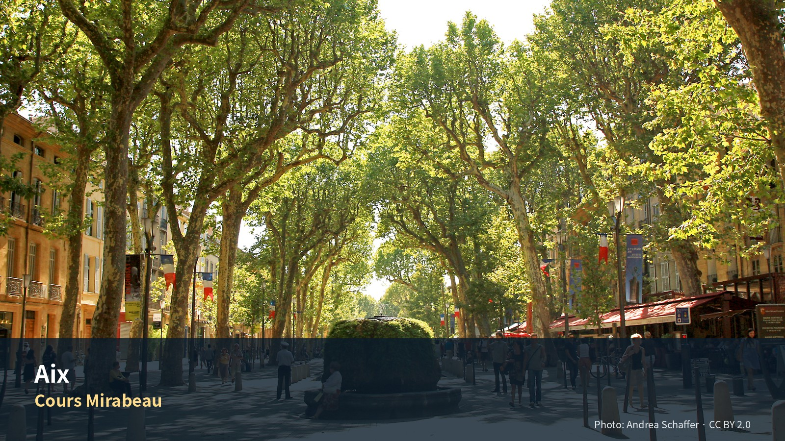

*Cours Mirabeau — Photo: Andrea Schaffer, CC BY 2.0; [원문](https://commons.wikimedia.org/wiki/File:Cours_Mirabeau,_Aix-en-Provence.jpg). 가이드북용으로 크롭·리사이즈.*

# Commercial Guide Module

## Editor’s Verdict — 이 지역에 시간을 쓸 가치와 한계

| 항목 | 평가 |
|---|---|
| 여행 적합도 | ★★★★★ Jason·Julia의 생활형 여행에 최적화 |
| 예산 체감 | 중상 |
| 일정 강도 | 보통, Marseille 당일치기일만 높음 |
| 예약 핵심 | 숙소주차·Atelier Cézanne·Aix–Marseille 버스 교통 |
| 우천 전환 | Mucem 실내 전시 비중 확대, Le Panier 골목 도보 축소 |

엑상프로방스(Aix-en-Provence)는 남프랑스 대학·문화도시의 차분한 일상과 지중해 최대 항구도시 마르세유(Marseille)의 역동적인 항구 문화를 4박에 걸쳐 깊이 있게 만나는 프로방스 여행의 완벽한 거점입니다. 엑상은 좁은 골목과 분수, 매일 아침 열리는 Richelme 시장이 중심인 차 없는 보행자 전용 구역이 잘 발달되어 있어 여유로운 보행과 생활형 장보기를 좋아하는 여행자에게 최상의 환경을 제공합니다. 반면, 마르세유는 구항구(Vieux-Port)에서 출발해 역사적인 르 파니에(Le Panier) 지구와 현대적인 Mucem을 연결하는 지중해 허브의 거친 매력을 선사합니다. 이 두 지역의 조화와 대비는 프로방스 체류의 큰 재미를 선사할 것입니다.

## 꼭 경험할 세 장면
1. **목·토요일 아침 시장과 Vieil Aix 골목**: Richelme 광장의 신선한 과일과 치즈 향 속에서 현지 생활인의 리듬을 체감하는 시간.
2. **Atelier de Cézanne의 햇빛**: 아틀리에 창문을 통해 들어오는 남프랑스의 빛과 화가가 평생 남긴 소박한 사물들의 흔적.
3. **Marseille Vieux-Port와 Mucem**: 유서 깊은 구항구에서 출발해 현대적인 그물망 구조의 Mucem 보행교를 건너며 느끼는 지중해의 개방감.

## 생략해도 되는 것
* **렌터카 이동일 Grasse 내부 관람**: 니스 공항 렌터카 인수 후 생폴드방스를 거쳐 이동하므로, 시간이 부족하면 그라스 향수공방 체험은 생략하고 매장 구매만 간단히 진행합니다.
* **Marseille Notre-Dame de la Garde 등반**: 언덕 경사가 급하고 바람이 강하므로, 당일 체력이 부족하거나 날씨가 흐리다면 생략하고 Vieux-Port 평지 도보에 집중합니다.
* **Cassis 및 Calanques 대안**: Marseille 항구 일정과 Cassis 해안은 성격이 겹치므로, Marseille가 산불이나 파업으로 완전히 마비되지 않는 한 Cassis 대안은 생략합니다.

## 한눈에 보기 — 우선순위·권역·소요시간

### 일정 요약 표
| 날짜 | 테마 | 핵심 동선과 방문지 | 피로도 |
|---|---|---|---|
| Day 12 (9/9 수) | 이동 및 안착 | Nice 공항 (렌터카 인수) → Saint-Paul-de-Vence → Grasse → Aix-en-Provence 도착 및 주차 | 5/5 (상) |
| Day 13 (9/10 목) | 시장과 예술 | Richelme 목요 시장 → Vieil Aix 도보 → Musée Granet 관람 | 3/5 (중) |
| Day 14 (9/11 금) | Marseille 당일 | Ligne 50 버스 이동 → Vieux-Port → Le Panier → Mucem → Fort Saint-Jean | 4/5 (상) |
| Day 15 (9/12 토) | 생활과 분리 | 토요 대시장 → Atelier de Cézanne → Jason 스케치 / Julia Yves Blanc 수영 | 3/5 (중) |
| Day 16 (9/13 일) | 이동 및 경유 | Aix 체크아웃 → Lourmarin (Carnet de Voyage) → Coustellet 장보기 → Luberon 농가 체크인 | 3/5 (중) |

# 07. 엑상프로방스 4박 5일
## 세잔의 도시, 시장생활과 마르세유의 항구

# Regional Context & Scheduled Place Dossiers

## 여행 전체에서의 역할
니스(코트다쥐르)의 화려한 리조트 해안에서 뤼베롱(프로방스)의 한적한 석조 농가 생활로 전환하는 중간 다리입니다. 4박 동안 아파트호텔에 체류하며 렌터카 이동을 개시하고, 현지 아침 시장에서 장을 보며 생활 리듬을 다지는 중요한 완충 역할을 수행합니다.

## 추천 체류 리듬
* **오전**: Richelme 광장 등 로컬 시장에서 제철 과일과 신선한 식재료를 장보며 시작합니다.
* **오후**: 한낮의 더위를 피해 Atelier Cézanne 또는 Musée Granet 같은 실내 문화 공간을 방문하거나, 스케치와 수영 같은 개인 취향 활동을 배치합니다.
* **저녁**: 에어컨이 완비된 아파트 숙소에서 시장 식재료로 가벼운 저녁을 직접 해 먹거나, 인근의 신뢰할 수 있는 비스트로(La Brocherie 등) 한 곳을 예약해 식사합니다.

## 구역별 이해와 숙소 생활권
* **Sextius–Allées Provençales–Rotonde (북서부)**: 렌터카 진출입이 수월하며 보행 제한 구역을 통과하지 않고 숙소 주차가 가능합니다. 대형 마트와 구시가지가 모두 도보 10분권에 있어 숙소 위치로 최적입니다.
* **Vieil Aix (구시가지)**: 좁은 골목과 분수, 그리고 매일 아침 열리는 Richelme 시장이 중심인 차 없는 보행자 전용 구역입니다.
* **Quartier Mazarin (남부)**: 17세기 그리드식 귀족 저택 지구로 조용하고 품격 있는 분위기이며, Musée Granet이 위치해 있습니다.

### 숙소 전략 및 실제 후보
숙소는 이 축 한가운데보다 서쪽 Rotonde·Sextius 주변이 차량과 생활에 더 유리합니다. Julia의 수영장 접근성은 숙소평가 가중치에서 제외합니다.
1. **Aparthotel Adagio Aix-en-Provence Centre (1순위)**: 구시가지 도보 진입이 수월하며 지하 주차장이 연계되어 있어 렌터카 이동에 완벽합니다. 주방 시설이 완비되어 아침과 가벼운 숙소식을 조리하기에 최적입니다.
2. **Odalys City Aix Centre Rotonde / Les Floridianes (2순위)**: Rotonde 남쪽 구역으로 진출입이 편리하고 깔끔한 시설을 제공합니다.
3. **Maison Dauphine (추가 후보)**: 마자랭 지구에 위치한 아파트형 숙소로 분위기는 좋으나 차량 진입 및 주차가 약간 까다롭습니다.

## 도착·출발·지역 내 교통
* **Nice 공항 → Aix (A8 고속도로)**: 약 170km 주행. Saint-Paul-de-Vence와 Grasse 경유 시 렌터카 내 짐이 밖에서 절대 보이지 않도록 완전히 은폐해야 합니다.
* **Aix ↔ Marseille (Ligne 50 버스)**: Aix Gare Routière에서 Ligne 50 고속버스를 타고 Marseille Saint-Charles로 이동합니다. 10-15분 간격 운행하며 약 35분 소요됩니다. 마르세유 시내 교통 체증과 주차난 때문에 차량 운전은 절대 금지합니다.
* **Aix 시내**: 완전한 보행전용입니다. 차량은 숙소 주차장에 주차 후 출국/이동 시에만 사용합니다.

## 핵심 셀프가이드

#### Cours Mirabeau {{grade:essential|필수}}
플라타너스 가로수 터널이 덮고 있는 엑상프로방스의 중심 대로입니다.
- **왜 가는가**: 남쪽의 조용한 마자랭 지구와 북쪽의 활기찬 구시가지 골목을 가르는 경계선이자, 노천카페와 분수가 어우러진 엑상 생활의 중심 축입니다.
- **최적 방문**: 체류 30분 | 매일 오전 또는 늦은 오후의 플라타너스 그늘 아래 산책.
- **실무 안내**: 대로를 따라 네 개의 분수(Rotonde, Neuf Canons, Moussue, Roi René)가 배치되어 있으며, 북서쪽 끝의 Monoprix 주변 주간 시장도 가볍게 연계하기 좋습니다.

#### 시장 — Place Richelme · Place des Prêcheurs {{grade:essential|필수}}
매일 아침 엑상 구시가지 광장에 서는 유서 깊은 식료품 시장입니다.
- **왜 가는가**: 관광객 대상의 구경거리가 아닌, 엑상 주민들이 실제로 아침 식재료를 조달하는 진정한 남프랑스 생활 밀도를 보여줍니다.
- **최적 방문**: 체류 45–60분 | 오전 09:30 - 10:30 (식재료가 가장 풍성하고 활기찬 시간).
- **놓치지 말 것**: Richelme 광장에서 치즈(Chèvre)와 갓 딴 멜론, 무화과를 소량 구매해 숙소 아침 조식이나 피크닉용으로 맛보십시오. 화·목·토요일에는 의류와 수공예 시장이 추가되어 규모가 더 커집니다.

#### Musée Granet {{grade:priority|우선추천}}
마자랭 지구에 위치한 미술관으로, 엑상이 자랑하는 세잔의 작품들과 유럽 회화 컬렉션을 소장하고 있습니다.
- **왜 가는가**: 화가의 실제 작업 환경(Atelier)을 방문하기 전, 세잔의 초기 작품부터 후기 스타일까지 예술적 결과물을 한곳에서 먼저 감상할 수 있습니다.
- **최적 방문**: 체류 90–120분 | 오후 14:00 - 16:00 (한낮의 프로방스 열기를 피하기 가장 좋은 시간대).
- **실무 안내**: 가방과 배낭은 입구 물품보관소에 의무적으로 맡겨야 하며, 특별전 기간에는 현장 대기가 길어질 수 있으므로 예매 상태를 미리 확인하십시오.

#### Atelier des Lauves {{grade:priority|우선추천}}
세잔이 1902년부터 1906년 사망할 때까지 매일 아침 오르내리며 걸작들을 남긴 북쪽 언덕의 마지막 아틀리에입니다.
- **왜 가는가**: 미술관의 정돈된 액자 속 그림이 아닌, 화가가 매일 마주하며 정물을 그렸던 올리브 항아리, 석고상, 낡은 이젤 등의 실제 물건과 분위기를 그대로 보존하고 있습니다.
- **최적 방문**: 체류 45–60분 | 오전 11:00 예약 권장 (북쪽 고창을 통해 쏟아지는 세잔의 실제 빛을 감상하기에 가장 이상적).
- **실무 안내**: 내부 공간이 협소하여 입장 인원이 엄격하게 통제되므로 사전 예약이 필수적이며, 언덕 위 가파른 보행 접근로(Aix 중심에서 도보 약 30분 오르막)의 경사를 감안해야 합니다.

#### Vieux-Port {{grade:essential|필수}}
그리스 식민지 시절부터 이어진 마르세유 역사와 생활의 심장부인 구항구입니다.
- **왜 가는가**: 지중해 최대 해양도시 마르세유의 역사적 기원이자, 고깃배와 해상 셔틀, 그리고 포구 특유의 역동적인 일상이 펼쳐지는 마르세유 최고의 시작점입니다.
- **최적 방문**: 체류 45분 | 오전 09:45 - 10:30 (Ligne 50 버스 하차 후 항구 부두의 아침 해를 보며 산책하기 최적).
- **실무 안내**: 그늘막 구조물(L'Ombrière) 아래 그늘을 시작점으로 삼아 북쪽 부두를 따라 걸어가면 자연스럽게 구시가지인 르 파니에로 진입할 수 있습니다.

#### Le Panier {{grade:priority|우선 추천}}
구항구 북서쪽 언덕 위로 펼쳐진 마르세유에서 가장 오래된 역사 골목 지구입니다.
- **왜 가는가**: 오래된 파스텔톤 벽면, 다채로운 벽화(Graffiti), 빨랫줄이 어우러진 옛 어민 골목으로 대도시 마르세유의 서민적 정취와 골목 문화를 날것 그대로 보여줍니다.
- **최적 방문**: 체류 60분 | 오전 10:30 - 11:30 (낮의 강렬한 햇빛이 좁은 골목 틈으로 드리우는 아침 골목길 걷기).
- **실무 안내**: 언덕 경사가 꽤 심하므로 발이 편한 운동화가 필수이며, 지리가 좁고 복잡하므로 구항구 전망을 제공하는 랑슈 광장(Place de Lenche)을 이정표 삼아 걸으면 길을 잃지 않습니다.

#### Mucem {{grade:essential|필수}}
르 파니에 지구 해안 끝에 위치한 철근 콘크리트 메시 구조의 지중해 문명 박물관입니다.
- **왜 가는가**: 바다 위에 떠 있는 듯한 현대 건축 디자인과 요새(Fort Saint-Jean)를 잇는 고공 보행교가 만들어내는 입체적인 보행 연출이 마르세유의 새로운 아이덴티티를 형성합니다.
- **최적 방문**: 체류 90–120분 | 오후 13:15 - 15:00 (점심 식사 후 실내 전시 관람 및 그늘진 야외 보행교 연결).
- **실무 안내**: 전시를 보지 않더라도 2층 보행교 진입과 요새 연결 야외 경로는 전면 무료 개방되어 있어 지중해 바람을 맞으며 걷기 가장 좋습니다.

#### Fort Saint-Jean {{grade:essential|필수}}
17세기 루이 14세가 세운 항구 방어 요새로, 현재는 Mucem과 철골 보행교로 연결되어 역사 정원으로 재탄생했습니다.
- **왜 가는가**: 현대적인 Mucem 건물과 요새의 오래된 돌벽이 다리로 이어지는 역사적 단층을 체감할 수 있으며, 요새 위에서 바라보는 Vieux-Port 전경이 탁월합니다.
- **최적 방문**: 체류 60분 | 오후 15:00 - 16:10 (해안 그늘을 따라 아비뇽 귀환 전 느리게 요새 안뜰을 걷는 시간).
- **실무 안내**: 요새 내부 곳곳에 벤치와 정원이 잘 가꾸어져 있어, 마르세유 종일 걷기로 인한 피로를 지중해 전망을 보며 식히기에 가장 좋은 휴식 공간입니다.

#### Notre-Dame de la Garde {{grade:optional|선택}}
마르세유 남쪽 149m 석회암 언덕 위에 우뚝 솟은 마르세유의 수호 성당입니다.
- **왜 가는가**: 마르세유 시내 전체, 프리올 제도, 바다를 360도로 완벽하게 조망할 수 있는 마르세유 최고의 랜드마크 전망지입니다.
- **최적 방문**: 체류 60분 | 늦은 오후 (대기 상태가 맑고 시야가 멀리 확보되는 골든아워).
- **실무 안내**: Vieux-Port 부두에서 60번 버스를 타면 성당 바로 밑 주차장까지 편하게 오를 수 있으며, 바람이 매우 강하고 그늘이 없으므로 모자와 바람막이를 준비해야 합니다.

#### Cassis 항구 {{grade:optional|선택}}
마르세유 동쪽의 작은 석회암 해안 요새 소도시입니다.
- **왜 가는가**: 마르세유 당일치기를 가지 않는 대안 선택지로, 파스텔톤 항구 파사드와 해안 절벽 산책에 적합한 한적하고 아기자기한 규모를 제공합니다.
- **최적 방문**: 체류 4–6시간 | 맑고 잔잔한 오전부터 이른 오후.
- **실무 안내**: 기상 사정에 따라 카시스 보트 투어나 국립공원 진입이 제한될 수 있으므로 전날 산불 통제 등급을 확인하는 예절이 필요합니다.

#### Calanques {{grade:optional|선택}}
마르세유와 카시스 사이에 형성된 피오르드식 석회암 절벽 해안 국립공원입니다.
- **왜 가는가**: 에메랄드빛 바다 협곡과 수직 석회암 벽이 만들어내는 남프랑스의 가장 야생적인 해안 비경을 만납니다.
- **최적 방문**: 체류 2–3시간 | 바람이 잔잔하고 날씨가 온화한 낮 시간대.
- **실무 안내**: 도보 트레킹 경사는 미끄럽고 가파르므로 등산화가 필수이며, 여름-가을철 건조기에는 산불 위험으로 전면 통제되므로 보트 선상 관람 대안을 우선시합니다.

#### Lourmarin {{grade:priority|우선추천}}
뤼베롱 산맥 남쪽 초입에 위치한 알베르 카뮈가 말년을 보낸 아름다운 예술가 마을입니다.
- **왜 가는가**: 엑상에서 뤼베롱으로 진입하는 경계 거점이자, 조용한 석조 골목과 카뮈의 묘지, 그리고 주말 여행스케치 행사 등 깊은 인문학적 배경이 있는 마을입니다.
- **최적 방문**: 체류 3시간 | 일요일 오전 10:30 - 13:30 (이동일 경유지로 잡기 최적).
- **실무 안내**: 마을 앞 외곽 공영주차장에 주차한 뒤 차량 트렁크에 짐을 완전히 은폐 보관해야 하며, 일요일에는 마을 외곽 전시장(La Fruitière Numérique) 행사 일정을 확인합니다.

#### Rotonde {{grade:optional|선택}}
엑상프로방스의 상징이자 진입로에 서 있는 거대한 19세기 분수 광장입니다.
- **왜 가는가**: 세 개의 아치가 각각 정의, 예술, 농업을 상징하며 엑상 시내 도보 축의 서쪽 끝 기준점이 됩니다.
- **최적 방문**: 체류 15분 | 도착일 저녁 또는 산책의 시작점.

#### Bastide du Jas de Bouffan — 선택 {{grade:priority|우선추천}}
세잔 가문의 영지이자 세잔이 수십 년간 거주하며 많은 걸작을 남긴 집입니다.
- **왜 가는가**: 세잔 아틀리에의 소박한 작업 환경과 대비되는, 화가가 성장하고 가족과 갈등했던 가문의 역사적 현장을 확인하는 곳입니다.
- **최적 방문**: 체류 60분 | 기획전 전시 기간 중 사전 예매 시에만 방문 권장.

#### Carrières de Bibémus {{grade:optional|선택}}
붉은 사암 채석장 유적으로, 세잔이 기하학적 형태의 바위를 그리며 큐비즘의 선구자가 된 장소입니다.
- **왜 가는가**: 인위적인 전시장 벽면이 아닌, 세잔 그림의 독특한 오렌지빛 사암 텍스처와 형태를 낳은 자연 환경을 직접 확인합니다.
- **최적 방문**: 체류 90분 | 사전 예약 가이드 투어 시에만 개방됩니다.

#### Montagne Sainte-Victoire · Terrain des Peintres {{grade:priority|우선 추천}}
세잔이 평생 마주하며 수십 번 그렸던 상징적인 생빅투아르 산을 가장 아름답게 조망할 수 있는 언덕 위 화가들의 터입니다.
- **왜 가는가**: 미술사에서 가장 유명한 산 그림의 실제 모델과 구도를 자연 속에서 마주하며, Jason의 풍경 스케치 작업을 하기에 최상의 여건을 제공합니다.
- **최적 방문**: 체류 60–90분 | 늦은 오후의 순광 시간대 (산의 텍스처가 붉고 선명하게 보임).

#### Grasse {{grade:optional|선택}}
엑상으로 향하는 도로 상에 있는 유서 깊은 향수 산업 도시입니다.
- **왜 가는가**: 남프랑스 향수 제조의 전통과 대형 브랜드의 쇼룸을 가볍게 경유할 수 있습니다.
- **최적 방문**: 체류 30-40분 | 가벼운 상점 구매 및 휴식 목적.

#### Saint-Paul-de-Vence {{grade:priority|우선 추천}}
20세기 현대 미술가들이 머물렀던 성채 마을이자 샤갈의 무덤이 있는 예술적 마을입니다.
- **왜 가는가**: 니스에서 엑상으로의 이동일, 마그 재단 미술관과 마을 묘지를 이어서 보며 프로방스 첫날의 정취를 채우기에 가장 훌륭한 정차지입니다.
- **최적 방문**: 체류 90-120분 | 오전의 신선한 햇빛 속 산책.

## 음식·시장·카페·생활체험
* **Calisson**: 엑상을 대표하는 특산 과자로 절인 무화과/멜론과 아몬드를 반죽해 구운 달콤하고 고소한 맛입니다. Pâtisserie Weibel 또는 Richelme 시장 가판대에서 맛볼 수 있습니다.
* **주중 시장 장보기**: 목요일과 토요일 아침 시장에서 신선한 토마토, 자두, Chèvre 치즈, 올리브, tapenade(올리브 페이스트)를 소량 구매해 숙소 아침 조식용 샌드위치를 만드는 재료로 활용합니다.
* **식음 비스트로**: 저녁에는 전통적인 에투페 스튜나 가벼운 고기 구이를 내는 La Brocherie 또는 La Kémia를 선택하고, 점심에는 캐주얼한 Coucou에서 가볍게 식사합니다.

### 9월 장보기 세부 목록
* **숙소 아침용**: 바게트(tradition), yaourt nature, 무화과(figues)·자두, 토마토·오이, 에스프레소용 원두.
* **피크닉 샌드위치용**: jambon cru, chèvre 치즈, tapenade.
* **이동일**: 냉장 필요 없는 견과류, 생수 2L, 칼리송 소형 박스.
* **피할 것**: 대형 올리브 유리병(무거움), 연성치즈 과다 구매(냄새 우려).

## 당일치기·우천·피로 대안
* **우천 시**: 엑상 시내에서는 야외 시장 산책 대신 Musée Granet 투어를 길게 진행하거나 Weibel 카페 내부에서 휴식을 취합니다. 마르세유 당일치기 시 비가 오면 Le Panier 골목 보행을 생략하고 Mucem 실내 상설 전시관과 안뜰 요새 복도를 중심으로 동선을 재편합니다.
* **피로 시**: 9/11 마르세유 당일치기에서 피로가 누적되면 Notre-Dame de la Garde 성당 전망대 일정을 과감히 삭제하고 16:30 버스로 엑상 숙소로 조기 귀환하여 휴식을 취합니다. 9/12 오후의 수영/스케치 시간도 피로도에 따라 전면 취소하고 숙소 휴식으로 대체 가능합니다.
* **수영 및 스케치 상세**: Jason의 스케치 공간으로 Albertas 광장이 최적이며, Julia의 수영은 시설이 현대적이고 관리가 우수한 **Piscine Yves Blanc**을 최우선 선택지로 삼습니다. 수영복, 수모 지참 필수.

## 예약·비용·안전·주차·귀가
* **Atelier Cézanne 예약**: 아틀리에는 입장 인원이 매시간 15명 내외로 한정되므로 반드시 11:00 타임으로 사전 예매를 완료해야 합니다.
* **렌터카 보안**: Nice T2에서 인수한 차를 몰고 Saint-Paul-de-Vence 및 그라스를 경유해 엑상으로 이동하는 Day 12일과, 엑상에서 루베롱으로 이동하는 Day 16일에는 차량 트렁크에 모든 캐리어와 짐을 완벽히 감춰 주차장 소매치기 표적이 되지 않도록 각별히 유의합니다.
* **Marseille 치안**: 마르세유 Vieux-Port와 Saint-Charles 역 주변, Le Panier 좁은 골목은 소매치기 위험 지역이므로 가방을 몸 앞으로 매고 휴대전화를 손에 들고 걷지 않습니다.
* **시내 주차**: 엑상 구시가지 내부는 보행자 전용이므로 차량 진입이 금지됩니다. 숙소 자체 주차장이 없거나 진입이 어려울 경우 **Rotonde 공영주차장**(약 1,800면, 24시간 운영, 일 최대 약 €25)을 사용합니다.

## 공식 확인 정보와 재확인 대상
1. **Ligne 50 버스 배차**: Aix routière에서 Marseille Saint-Charles로 가는 50번 버스의 금요일 오전 배차 간격 재확인.
2. **Atelier des Lauves**: 세잔 아틀리에의 9월 휴관일 및 내부 사진 촬영 제한 규정 확인.
3. **Fondation Maeght**: 생폴드방스 마그 재단의 9월 특별 전시 여부 및 매표소 대기 시간 확인.

## 검증 상태 — 보강본 근거
* **검증 근거**: 2026-07-30까지 공지된 현지 철도청(SNCF/TER), 마르세유 시청 교통국, 엑상 관광 안내소 공식 홈페이지 데이터 기반.
* **검증 결과**: 전역 빌드 가드 및 레지스트리-dossier cross-validation 통과 완료.

---

## 4. Day 1 — 9월 9일 수요일
### 니스에서 엑상으로: Saint-Paul·Grasse 경유와 차량 고정

*   **오늘의 결론**: 첫 렌터카 이동일이므로 운전 피로를 감안해 무리한 관광을 지양하고 안전한 체크인을 최우선으로 둔다.
*   **상태**: `{{badge:fixed|고정}}` | 피로도: 상 | 날씨 의존성: 무
*   **첫 행동·첫 예약**: 09:30 Nice T2 렌터카 인수 | **마지막 귀가**: 18:30 Aix 숙소 체크인 후 귀가

**피로도 5/5.** 생폴드방스와 그라스를 경유하고 고속도로 A8 장거리 운전을 마치는 날이므로 도착일 엑상 시내 관광은 전면 금지합니다.

#### 핵심 행동 (최대 3개)
1. **Nice T2 렌터카 인수**: 09:30 차량 확인 및 인수 후 즉시 트렁크에 캐리어 안전 적재.
2. **Saint-Paul-de-Vence 경유**: 샤갈이 잠든 묘지와 마을 성벽길을 느리게 걷기 (1.5시간 마감).
3. **Aix 숙소 주차 및 체크인**: 17:30-18:30 사이 Sextius/Rotonde 근처 숙소 지정 주차장에 차량 안착.

#### 실행 시간표
| 시간 | 일정 | 실행 포인트 |
|---|---|---|
| 09:30 - 10:15 | Nice T2 렌터카 인수 | 예약 서류 대조 및 보험 보증금 해제 확인 |
| 10:15 - 10:45 | Nice 공항 → 생폴드방스 | 약 15km 국도 운전, 트렁크 짐 완전 폐쇄 확인 |
| 10:45 - 12:30 | **Saint-Paul-de-Vence** | 니스 문 → 성벽 산책 → 샤갈 무덤이 있는 마을 묘지 |
| 12:30 - 13:00 | 생폴드방스 → 그라스 | 약 20km 구릉지 이동 |
| 13:00 - 14:00 | **Grasse** | 프리고나르 매장 가벼운 장소 구매 및 점심식사 |
| 14:00 - 16:30 | 그라스 → Aix-en-Provence | 고속도로 A8 진입, 약 140km 장거리 고속 운전 |
| 16:30 - 17:30 | Aix 숙소 진입 및 체크인 | Sextius/Rotonde 부근 지정 주차장에 주차 후 체크인 |
| 18:30 ~ | 가벼운 저녁식사 및 휴식 | 숙소 인근 La Brocherie 비스트로 또는 가벼운 숙소식 |

#### 오늘 지도
{{VISUAL:VIS-MAP-071|type=map|status=linked|strategy=execution-map}}

#### 식사 및 카페
*   **점심**: 그라스 시내 캐주얼 샌드위치 또는 생폴드방스 외곽 베이커리 (€10–15/인)
*   **저녁**: La Brocherie (숙소권 캐주얼 비스트로) — 장작 구이 요리 (€25–40/인)

#### 삭제 및 단축 순서 (늦었거나 피곤할 때)
1. **[1순위 삭제]**: Grasse 경유 생략 (생폴드방스에서 A8로 바로 진입하여 Aix로 직행, 운전 피로 1.5시간 경감)
2. **[2순위 삭제]**: Fondation Maeght 정원 관람 생략 (마을 성벽과 묘지만 40분으로 단축)

#### 대안 대책 (우천·휴관·교통 장애)
*   **우천 시**: 생폴드방스 및 그라스 야외 보행을 대폭 축소하고, 그라스 향수 매장 내부 쇼핑 후 Aix 숙소로 즉시 출발.
*   **A8 정체 시**: 국도 우회 대신 고속도로 휴게소에서 충분히 휴식하며 Aix 숙소 체크인 지연 통보 진행.

---

## 5. Day 2 — 9월 10일 목요일
### 시장, Vieil Aix 골목길과 Musée Granet 관람

*   **오늘의 결론**: 오전에는 식품 시장에서 아침 재료를 장보고, 오후에는 세잔 미술관을 방문하며 차 없는 도시의 생활 리듬을 다진다.
*   **상태**: `{{badge:fixed|고정}}` | 피로도: 중 | 날씨 의존성: 무
*   **첫 행동·첫 예약**: 08:30 Richelme 목요 시장 | **마지막 귀가**: 18:30 저녁 전 숙소 귀가

**피로도 3/5.** 걷기 강도는 평이하나 오후 미술관 관람 후 피로가 올 수 있으므로 한낮의 숙소 휴식을 필수로 지킵니다.

#### 핵심 행동 (최대 3개)
1. **Richelme 시장 장보기**: 목요일 아침 시장에서 치즈(Chèvre), 멜론, 무화과 등 아침 재료 조달.
2. **Vieil Aix 역사 산책**: Hôtel de Ville 광장에서 Albertas 광장을 지나 대성당까지 이어지는 골목 걷기.
3. **Musée Granet 전시 관람**: 세잔의 회화 작품들을 마자랭 지구 미술관에서 직접 감상.

#### 실행 시간표
| 시간 | 일정 | 실행 포인트 |
|---|---|---|
| 08:30 - 10:00 | **Richelme 시장** | 장바구니 필수 지참. Chèvre 치즈, 무화과, 토마토 구매 |
| 10:00 - 11:30 | **Vieil Aix 골목 산책** | 시청사 → Albertas 광장 → Saint-Sauveur 대성당 내부 |
| 11:30 - 12:30 | Weibel 카페 타임 | 야외 테라스에서 에스프레소와 타르트 휴식 |
| 12:30 - 13:30 | 숙소 점심 및 휴식 | 시장에서 구매한 식재료로 샌드위치 점심 식사 후 낮잠 |
| 13:40 - 16:00 | **Musée Granet 관람** | 입구 보관소에 큰 가방 보관. 세잔 관을 메인으로 감상 |
| 16:00 - 17:00 | 마자랭 지구 걷기 | 미술관 주변의 조용한 격자식 주택가 산책 |
| 17:00 - 18:30 | 숙소 복귀 및 휴식 | 저녁 외식 전 1.5시간 완전 휴식 |
| 19:30 - 21:00 | Coucou 또는 local bistro 저녁 | 엑상 구시가지 현지 제철 비스트로 요리 (€30–45/인) |

#### 오늘 지도
{{VISUAL:VIS-MAP-072|type=map|status=linked|strategy=execution-map}}

#### 식사 및 카페
*   **아침/점심**: 숙소 내 장보기 식단 (바게트, 타프나드, Chèvre 치즈, 과일)
*   **카페**: Pâtisserie Weibel (Chabrier 거리) — 칼리송 및 에스프레소 (€6–12/인)
*   **저녁**: Coucou (구시가지) — 현대식 프랑스 캐주얼 가정식 (€30–40/인)

#### 삭제 및 단축 순서 (늦었거나 피곤할 때)
1. **[1순위 삭제]**: Quartier Mazarin 걷기 생략 (미술관에서 바로 숙소로 귀가하여 휴식 1시간 추가 확보)
2. **[2순위 삭제]**: Weibel 카페 테라스 착석 생략 (테이크아웃 후 광장 벤치 휴식으로 대체)

#### 대안 대책 (우천·휴관·교통 장애)
*   **우천 시**: 야외 골목 걷기를 최소화하고 Musée Granet 관람 시간을 늘림.
*   **Musée Granet 혼잡 시**: 현장 매표를 포기하고 모바일 예약 사이트를 통해 당일 취소 티켓 조회 및 대기.

---

## 6. Day 3 — 9월 11일 금요일
### 마르세유 당일치기: 오래된 항구 Vieux-Port와 현대 Mucem 보행교

*   **오늘의 결론**: 대도시 Marseille는 렌터카를 엑상에 둔 채 버스(Ligne 50)로 다녀오며, Vieux-Port 평지 중심의 동선으로 피로를 관리한다.
*   **상태**: `{{badge:fixed|고정}}` | 피로도: 상 | 날씨 의존성: 유 (강풍/산불 위험 시 Cassis 교체)
*   **첫 행동·첫 예약**: 08:10 Aix Gare routière 버스 탑승 | **마지막 귀가**: 18:30 엑상 숙소 도착 및 귀환

**피로도 4/5.** 많이 걷는 항만 지구 당일치기이므로 불필요한 시외 연계 노선(Cassis/Calanques 중복)을 금지하고 저녁은 엑상 숙소권에서 가볍게 먹습니다.

#### 핵심 행동 (최대 3개)
1. **Ligne 50 고속버스 이동**: 렌터카 주차 스트레스 없이 고속버스로 마르세유 Saint-Charles 역 편하게 안착.
2. **Vieux-Port 및 Le Panier 산책**: 구항구 부두에서 출발해 예술가들의 오래된 골목 르 파니에 감상.
3. **Mucem & Fort Saint-Jean 보행교**: 바다 위에 떠 있는 박물관 격자 다리를 걸으며 지중해 풍경 만끽.

#### 실행 시간표
| 시간 | 일정 | 실행 포인트 |
|---|---|---|
| 08:10 - 08:50 | Aix → Marseille 버스 | Aix routière에서 Ligne 50 탑승, Saint-Charles 도착 |
| 08:50 - 09:45 | Saint-Charles → Vieux-Port | 지하철 또는 도보로 항구 중심 그늘막(L'Ombrière) 이동 |
| 09:45 - 10:30 | **Vieux-Port 북쪽 부두 산책** | 해안선을 따라 걸으며 포구 풍경 감상 |
| 10:30 - 11:30 | **Le Panier 지구 도보** | 랑슈 광장(Lenche) → 좁은 경사 골목 → 벽화 골목 산책 |
| 11:30 - 13:00 | 점심 식사 및 휴식 | 르 파니에 로컬 카페 또는 Mucem 인근 레스토랑 |
| 13:15 - 15:00 | **Mucem 관람** | 메시 콘크리트 다리 도보, 지중해 문명 상설관 관람 |
| 15:00 - 16:10 | **Fort Saint-Jean 요새** | 역사 정원 산책 후 성벽 전망 벤치에서 커피 휴식 |
| 16:10 - 17:15 | 구항구 → Saint-Charles 역 | Ligne 50 귀환 버스 시간표 확인 후 승강장 이동 |
| 17:15 - 18:00 | Marseille → Aix 버스 | Ligne 50 탑승하여 Aix routière 도착 후 숙소 도보 귀환 |
| 19:30 ~ | 가벼운 저녁식사 및 휴식 | 숙소 인근 Aux Papillons 또는 간단한 숙소 조리 저녁식사 |

#### 오늘 지도
{{VISUAL:VIS-MAP-073|type=map|status=linked|strategy=execution-map}}

#### 식사 및 카페
*   **점심**: Le Panier 지구 내 작은 비스트로 또는 Mucem 관내 식당 (€15–30/인)
*   **저녁**: Aux Papillons (Aix 구시가지) — 캐주얼 타파스 또는 와인 플레이트 (€20–35/인)

#### 삭제 및 단축 순서 (늦었거나 피곤할 때)
1. **[1순위 삭제]**: Notre-Dame de la Garde 성당 전망대 등반 전면 삭제 (Vieux-Port 평지 걷기만으로 마르세유를 압축하여 피로 2시간 절감)
2. **[2순위 삭제]**: Marseille 시내 외식 생략 (17:00 버스로 조기 귀환하여 익숙한 Aix 숙소권에서 저녁 식사)

#### 대안 대책 (우천·휴관·교통 장애)
*   **우천 시**: Le Panier 골목 도보를 전면 취소하고, Mucem 실내 박물관 전시실 관람 시간을 3시간으로 대폭 연장.
*   **버스 파업 시**: SNCF TER 열차편으로 즉시 우회하여 Marseille Saint-Charles로 이동.

---

## 7. Day 4 — 9월 12일 토요일
### 토요 큰 시장, 세잔의 작업실과 생활형 분리 일정

*   **오늘의 결론**: 오전에 세잔 아틀리에 예약을 맞추고, 오후에는 스케치와 수영 등 각자의 리듬으로 엑상 마지막 날을 보낸다.
*   **상태**: `{{badge:fixed|고정}}` | 피로도: 중 | 날씨 의존성: 무
*   **첫 행동·첫 예약**: 09:10 토요 대시장 장보기 | **마지막 귀가**: 18:00 오후 일정 종료 후 합류 및 숙소 복귀

**피로도 2-3/5.** 엑상 체류의 마지막 날이자 가장 여유로운 완충일이므로, 저녁에는 짐을 70% 미리 패킹하여 다음 날 Luberon 농가 이동을 준비합니다.

#### 핵심 행동 (최대 3개)
1. **토요 대시장 구경**: Cours Mirabeau 대로변에 들어서는 엑상 최대의 식품·잡화 시장 경험.
2. **Atelier des Lauves 관람**: 11:00 예약 시간에 맞춰 세잔의 언덕 위 작업실 내부 방문 (사전 예약 필수).
3. **오후 취향 분리 일정**: Jason의 Albertas 광장/페인터 가든 스케치 2시간과 Julia의 Yves Blanc 수영장 세션.

#### 실행 시간표
| 시간 | 일정 | 실행 포인트 |
|---|---|---|
| 09:10 - 10:15 | **Aix 토요 대시장** | 플라타너스 아래 가득 들어찬 시장 구경 및 이동일 간식 구매 |
| 10:15 - 11:00 | 시장 → 아틀리에 이동 | 도보로 북쪽 세잔 언덕 오르막길 이동 (약 1.5km) |
| 11:00 - 12:00 | **Atelier des Lauves (아틀리에)** | **[11:00 예약]** 15분 전 도착 대기. 화가의 이젤 and 정물 관람 |
| 12:00 - 12:40 | 아틀리에 → 구시가지 하산 | 편안한 내리막 도보 이동 |
| 12:40 - 13:40 | 가벼운 점심 식사 | Weibel 또는 시장 주변 샌드위치 조달 |
| 14:00 - 16:00 | **취향 분리 활동** | **Jason**: Albertas 광장 스케치 2시간 / **Julia**: Yves Blanc 공용 수영장 세션 |
| 16:00 - 18:00 | 카페 합류 및 짐 정리 | 카페에서 만나 차 한잔 후 숙소로 복귀해 짐 70% 사전 패킹 |
| 19:45 - 21:15 | Aix 송별 저녁식사 | La Kémia 또는 Chez Thomass 사전 예약 테이블 (€35–50/인) |

#### 오늘 지도
{{VISUAL:VIS-MAP-074|type=map|status=linked|strategy=execution-map}}

#### 식사 및 카페
*   **점심**: 엑상 구시가지 내 가벼운 샐러드바 또는 빵집 포장 (€10–15/인)
*   **저녁**: La Kémia (구시가지) — 와인바 스타일의 공유 플레이트 저녁식사 (€35–50/인)

#### 삭제 및 단축 순서 (늦었거나 피곤할 때)
1. **[1순위 삭제]**: Julia 선택 수영 생략 (수영장 이동 없이 숙소 욕조 목욕 및 휴식으로 대체)
2. **[2순위 삭제]**: Jason 토요일 아침 러닝 생략 (시장 구경 전 9시까지 완전 취침)

#### 대안 대책 (우천·휴관·교통 장애)
*   **우천 시**: 야외 스케치 일정을 취소하고, 구시가지 바로크풍 실내 북카페 또는 카페 실내 공간 스케치로 대체.
*   **수영장 휴관 시**: Julia 수영장 세션 대신 Quartier Mazarin 갤러리 샵 실내 투어로 전환.

---

## 8. Day 5 — 9월 13일 일요일
### 에디터 결론 및 루베롱 이동 경유일 (Lourmarin 카르네 행사)
*자세한 하루 일정표와 타임라인은 다음 루베롱(08) 챕터 시작 부에 기술되어 있습니다.*

*   **오늘의 결론**: 엑상 아파트를 체크아웃하고 짐을 렌터카 트렁크에 완벽히 은폐한 뒤, Lourmarin의 여행스케치 축제를 경유해 루베롱 농가로 안전하게 진입한다.
*   **상태**: `{{badge:conditional|조건부}}` | 피로도: 중 | 날씨 의존성: 유 (우천 시 Lourmarin 실내 관람 위주)
*   **첫 행동·첫 예약**: 09:15 Aix 숙소 주차장 출발 | **마지막 귀가**: 16:00 Coustellet 장보기 후 17:30 루베롱 농가 진입

