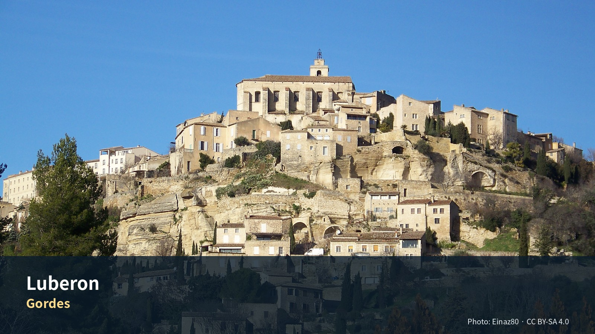

*Gordes — Photo: Einaz80, CC BY-SA 4.0; [원문](https://commons.wikimedia.org/wiki/File:Village_of_Gordes.jpg). 가이드북용으로 크롭·리사이즈.*

# Commercial Guide Module

> **마을을 많이 보는 대신 농가의 아침·저녁과 석조·오커 풍경을 압축해 경험하는 3박**
> 이번 여행에서 ‘숙박 그 자체가 목적’이 되는 유일한 장

## Editor’s Verdict — 이 지역에 시간을 쓸 가치와 한계

| 항목 | 평가 |
|---|--- |
| 여행 적합도 | ★★★★★ Jason·Julia의 생활형 여행에 최적화 |
| 예산 체감 | 숙박비 높음 |
| 일정 강도 | 느림 |
| 예약 핵심 | 농가 주소·진입·체크인 P0 |
| 우천 전환 | 농가 독서·실내 스케치·가까운 마을 카페 |
> **여행의 역할**: 엑상프로방스의 도시생활과 카시스·마르세유 당일치기를 마친 뒤, 뤼베롱에서는 속도를 낮춘다. 이 구간의 목적은 유명마을을 가능한 많이 수집하는 것이 아니라 **농가 숙박 자체, 마을의 재료와 지형, 시장에서 산 식재료, 스케치·산책·테라스 식사**를 하나의 생활 경험으로 만드는 것이다.

> **최신 확정사항**: 프로방스는 **엑상 4박 + 뤼베롱 농가 3박 + 아비뇽 4박**으로 운영하며, 뤼베롱 농가 숙박은 옵션이 아니라 확정 일정이다. **수영장 유무·가열·길이는 숙소 평가에서 완전히 제외**하고, 중앙입지·농가환경·전용주방·세탁·주차·포장도로·생활편의·3박 총액을 우선한다. 기존 4박 예약표기는 변경 완료가 아니라 **예약 변경 필요** 상태다.

> **사용자 선호 반영**: 실내 전시보다 **Lourmarin, Roussillon, Goult 또는 Bonnieux, Gordes, Ménerbes 또는 Oppède**의 서로 다른 성격을 비교한다. L’Isle-sur-la-Sorgue 목요시장은 새 날짜와 맞지 않아 기본 일정에서 제외했다.

## 꼭 경험할 세 장면

1. **시장에서 산 재료로 한 끼 완성**
가장 중요한 체험이다. 고급 레스토랑보다 시장에서 산 치즈·토마토·빵·과일을 농가 테라스에서 먹는 경험이 이 구간의 정체성에 더 가깝다.

2. **pétanque 한 게임**
숙소에 코트가 있으면 규칙을 완벽히 알지 못해도 30분 즐긴다. 현지 생활의 리듬을 체험하는 간단한 방식이다.

3. **포도밭·올리브밭 가장자리 산책**
- 사유지 경계를 지킨다
- 수확 작업차량을 방해하지 않는다
- 일몰 전 30–45분이 좋다

## 생략해도 되는 것

| 항목 | 이유 |
|---|--- |
| **마르세유·아비뇽 당일치기** | 마르세유는 Aix에서, 아비뇽은 9/16부터 4박 한다 |
| **베르동 협곡** | 왕복만 하루. 이 구간 리듬과 안 맞는다 |
| **라벤더 밭 투어** | **9월에는 없다** |
| **마을 5개 이상 하루** | 운전과 주차만 하다 끝난다 |
---

## 한눈에 보기 — 우선순위·권역·소요시간

| 장소·경험 | 등급 | 이유 |
|---|---|--- |
| 농가생활·테라스 식사 | **필수** | 이 구간 자체의 목적 |
| Coustellet 생산자시장 | **필수** | 체크인 당일 식재료와 생활리듬 확보 |
| Roussillon·오커길 | **필수** | 다른 마을과 완전히 다른 지질·색채 경험 |
| Gordes 시장·마을 | **필수** | 뤼베롱 상징성과 화요일 일정 결합 |
| Lourmarin | **우선 추천** | 이동일에 맞고 스케치 행사와 결합 |
| Goult | **우선 추천** | 관광객이 덜한 생활마을·스케치 |
| Ménerbes | **우선 추천** | 포도밭·능선·와인·저녁 선택 |
| L’Isle 목요시장 | **대체** | 새 체크아웃 9/16과 맞지 않아 기본 일정 제외 |
| Village des Bories | 선택 | 열린 농업유산, 30–45분이면 충분 |
| Sénanque 내부 | 선택 | 건축·정적은 좋으나 농가·마을보다 후순위 |
| Oppède-le-Vieux | 선택 | 독특하지만 오르막과 돌길 |
| Bonnieux | 선택 | 전망·식당 우수, Goult와 교환 |
| Lacoste | 선택 | 성·예술마을, 일정이 과밀해지기 쉬움 |
| Fontaine-de-Vaucluse | 대체 | 이동일 자연경관, 수량·혼잡 변수 |
| 모든 유명마을 순회 | 비추천 | 주차·중복·피로가 농가체험을 약화 |
| Apt 대형시장 | 이번 체류 불가 | 토요일 시장으로 날짜 불일치 |
---

## 놓치면 아쉬운 선택

| 등급 | 장소·경험 | 이 가이드북에서 추천하는 이유 |
|---|---|--- |
| 필수 | **농가의 아침과 저녁** | 관광지 사이의 빈 시간이 아니라 Luberon 체류의 본체다. |
| 우선 추천 | **Roussillon–Goult** | 강한 오커색과 조용한 생활마을을 대비한다. |
| 우선 추천 | **Gordes–Bories** | 전망도시와 돌의 생활문화를 한 흐름으로 본다. |
| 선택 | **Sénanque** | 내부관람보다 일정·혼잡·계절 상태에 따라 외관 또는 생략을 결정한다. |
| 선택 | **Ménerbes 또는 Oppède** | Gordes·Bories 뒤 체력이 남을 때 한 마을만 고른다. |
## 하루를 완성하는 네 가지 선택

| 시간·역할 | 추천 | 이용법 |
|---|---|--- |
| 아침 | **농가 테라스** | 햇빛·소리·식재료를 기록하는 가장 중요한 시간이다. |
| 점심 | **시장 장보기 후 숙소식** | 숙소의 주방과 지역 식재료를 여행경험으로 바꾼다. |
| 저녁 | **농가 또는 가까운 마을** | 야간 좁은길 운전을 최소화한다. |
| 스케치 | **농가 주변·Gordes 전망·Roussillon 색면** | 완성작보다 색과 구조를 기록한다. |
## 석조마을, 오커 지형, 시장, 포도밭과 느린 농가생활

## 현장 메모

- **대표 촬영 장면:** Gordes 전경보다 농가의 식탁과 아침 빛
- **기념품 방향:** 시장 식재료·올리브오일·와인·도자기
- **일정 삭제 원칙:** 선택 쇼핑·두 번째 카페·추가 내부관람부터 삭제하고 핵심 예약과 귀환 연결은 유지한다.
- **표시 기준:** 별점은 객관적 품질평가가 아니라 이 여행계획에서의 편집 추천도다.

# Regional Context & Scheduled Place Dossiers

## 여행 전체에서의 역할

## 이 3박이 여행 전체에서 하는 일

**43일 중 유일한 시골 숙박이다.** 앞의 15일은 도시와 항구, 뒤에는 아비뇽·리옹·파리가 이어진다. **농가에서 자는 밤은 여기 3박뿐이다.**

그래서 이 구간의 성공 기준이 다르다. 전일 휴식은 없어졌지만, 매일 농가에서 맞는 아침과 돌아온 뒤의 느린 저녁을 보호한다. 방문 마을 수보다 **숙소 경험과 귀환 리듬**이 핵심이다.

시장 의존은 줄인다. 일요일 Coustellet 장보기는 유지하고, 화요일 Gordes는 혼잡을 감안해 마을과 Bories를 중심으로 본다. 목요일 L’Isle 시장은 체류가 끝난 뒤라 기본안이 아니다.

## 추천 체류 리듬

```text
9/13 Aix → Lourmarin의 여행스케치 행사 → Coustellet 생산자시장 → 농가 체크인
        ↓
9/14 Roussillon 오커길 → 마을 → Goult 또는 Bonnieux → 농가 저녁
        ↓
9/15 Gordes·Village des Bories → Ménerbes 또는 Oppède 선택 → 농가 마지막 저녁
        ↓
9/16 느린 농가 아침 → 체크아웃 → Avignon 체크인·가벼운 성벽 산책
```

---

| 날짜 | 요일 | 테마 | 기본 동선 | 피로도 |
|---|---|---|---|---: |
| 9/13 | 일 | 엑상에서 농가로, 스케치와 시장 | Aix → Lourmarin → Coustellet → 농가 | 3/5 |
| 9/14 | 월 | 오커색과 생활마을 | 농가 → Roussillon → Goult/Bonnieux → 농가 | 3/5 |
| 9/15 | 화 | Gordes와 돌의 문화 | 농가 → Gordes → Bories → Ménerbes/Oppède 선택 → 농가 | 3/5 |
| 9/16 | 수 | 농가 체크아웃과 아비뇽 이동 | 농가 → Avignon 숙소·주차 → 가벼운 산책 | 3/5 |
---

| Day | 날짜 | 점심 | 저녁 |
|---|---|---|--- |
| 16 | 9/13 일 | 뤼르마랭 또는 이동 중 | **농가 — 쿠스텔레 장본 것으로** |
| 17 | 9/14 월 | 루시용 또는 고울트 | 농가 |
| 18 | 9/15 화 | **고르드 시장 조달** | 농가 또는 식당 한 번 |
| 19 | 9/16 수 | **농가 테라스** | 농가 |
| 선택 | 9/17 목 | 리슬 시장 조달 | 기본 일정 아님 |
**식당은 3박 중 한 번이면 충분하다.** 이 구간의 목적이 농가 생활이다.

---

## 구역별 이해와 숙소 생활권

### 마을이 아니라 생활권이다

뤼베롱은 하나의 마을 이름이 아니다. **뤼베롱 산맥과 그 남북 평야가 만든 생활권**이다.

산맥이 동서로 뻗어 남뤼베롱(뤼르마랭 쪽)과 북뤼베롱(고르드·루시용 쪽)을 가른다. 같은 뤼베롱인데 산 하나를 넘어야 한다. **Day 16에 남쪽 뤼르마랭을 지나 북쪽 농가로 들어가는 것**이 이 구조를 통과하는 동선이다.

### 돌의 색이 마을의 성격을 바꾼다

이 구간을 관통하는 가장 선명한 축이다.

| 마을 | 돌 | 인상 |
|---|---|--- |
| **Roussillon** | 오커 (붉은·주황·노랑) | 강렬. 화성 같다 |
| **Gordes** | 회백색 석회암 | 위엄. 계단식 |
| **Ménerbes** | 밝은 석회암 | 능선. 포도밭 |
| **Oppède-le-Vieux** | 거친 석회암 + 폐허 | 긴장 |
| **Village des Bories** | 마른돌 (회반죽 없음) | 노동 |
**같은 지역인데 마을마다 다른 돌을 썼다.** 지질이 다르기 때문이고, 그것이 마을의 인상을 결정한다. 마을 목록을 채우는 여행이 아니라 **돌의 변화를 따라가는 여행**으로 보면 3박이 하나로 묶인다.

### 9월은 라벤더의 계절이 아니다

**중요한 기대 조정이다.**

라벤더는 6월 말–7월 중순이 절정이고 7월 말이면 수확한다. **9월 중순에는 없다.** 세낭크 수도원의 그 유명한 보라색 밭 사진은 이 시기에 재현되지 않는다.

대신 9월에 있는 것 —

| 있는 것 | 비고 |
|---|--- |
| **포도** | 수확기. 포도밭이 가장 활발하다 |
| **무화과** | 제철 |
| **멜론** | 카바용이 산지다 |
| **빛** | 여름보다 낮고 부드럽다 |
| **한산함** | 8월 인파가 빠졌다 |
**9월은 라벤더보다 포도·무화과·빛의 계절이다.**

### 시장이 여행의 실제 시간을 결정한다

프로방스 시장은 **오전에 서고 13시에 접는다.** Coustellet 첫 장보기와 화요일 Gordes 혼잡 대응에 이 원칙을 적용한다.

늦잠을 자면 그날의 절반이 없어진다. 반대로 **8–9시에 시장에 가면 하루가 길어진다.** 43일 여행의 중반에 이 리듬을 잡아 두면 남은 23일에도 도움이 된다.

### 차를 쓰되 하루 종일 운전하지 않는다

마을 간 거리가 짧아 욕심을 내기 쉽지만, **하루 세 마을이면 운전과 주차만 하다 끝난다.**

이 보강본의 배치는 하루 **두 권역**이다. 9/14 루시용+고울트/보니외, 9/15 고르드+보리 뒤 선택마을 하나다.

### 숙소 권역 비교

| 권역 | 성격·장점 | 약점 | Jason·Julia 적합성 | 권고 |
|---|---|---|---|--- |
| **Goult–Robion–Oppède** | 중앙성, 슈퍼·빵집, L’Isle·Gordes·Ménerbes 균형 | 마을마다 숙소가 분산 | 생활편의·농가환경·마을 접근의 최적 균형 | **1순위** |
| **Ménerbes–Les Martins** | 포도밭·스케치·Gordes·Bonnieux 접근 | 식료품 선택이 제한될 수 있음 | 농가 분위기와 중앙성 우수 | **1.5순위** |
| **Gordes–Goult** | 상징성, Sénanque·Bories 접근 | 가격 높고 Gordes 혼잡 | 좋은 숙소가 있으면 매우 편리 | 2순위 |
| **Roussillon–Bonnieux** | 오커·전망·레스토랑 | L’Isle·Avignon 이동이 길어짐 | 색채·마을 체험 우수 | 2순위 |
| Lourmarin–Cucuron | 식당·생활감, Aix 접근 | 북뤼베롱 주요마을 이동 증가 | 남뤼베롱 집중형에 적합 | 이번 일정 3순위 |
| Apt 동쪽 | 슈퍼·가격·실용성 | Gordes·L’Isle과 멂 | 비용 우선 시 | 대체 |
### 최종 숙소권 권고

> **Robion–Oppède–Goult–Ménerbes 사각형** 안에서 찾는다. 농가 느낌이 아무리 좋아도 Apt 동쪽 또는 Lourmarin 남쪽으로 멀어지면, 이번 확정 일정에서 매일 왕복운전이 늘어난다.

---

### 농가 숙소 후보와 선정 기준

### 16.1 필수 평가표

> **수영장 유무·가열·수온·길이는 평가에서 제외한다.** 숙소에 수영장이 있더라도 가점하지 않고, 없더라도 감점하지 않는다.

| 평가항목 | 가중치 | 확인 질문 |
|---|---:|--- |
| 위치·마을 접근 | 20 | Gordes·Roussillon·Ménerbes·L’Isle 문전시간 |
| 농가·정원·테라스·풍경 | 18 | 생활체험·스케치·야외식사의 질 |
| 전용 주방 | 15 | 오븐·인덕션·냉장고·조리도구·식탁, 공용 여부 |
| 세탁·건조 | 12 | 전용/공용 세탁기, 건조기·건조대 |
| 도로·야간 진입 | 10 | 포장도로, 대문, 조명, 좁은 길, GPS 안내 |
| 주차·보안 | 8 | 전용주차, 차량 짐 노출, 대문·CCTV |
| 슈퍼·빵집·식당 | 7 | 실제 차량시간과 영업요일 |
| 객실 독립성·방음 | 5 | 호스트·다른 투숙객 공간과의 관계 |
| 총액·취소조건 | 5 | 관광세·청소비·보증금 포함 3박 재견적 |
### 16.2 실제 숙소 후보 비교

> 가격은 **계획가(2026-08 조사)** — 실시간 요금이 아니다. 확정 총액은 트래커가 정본이다.

> 실시간 재고는 확정하지 않았다. 아래 순위는 **중앙성·농가환경·주방·세탁·도로·주차·가격**만으로 평가한다. 수영장 정보는 부가시설로만 보며 점수에 반영하지 않는다.

| 후보 | 권역·형태 | 핵심 장점 | 약점·확인사항 | 계획가격 | 적합도 |
|---|---|---|---|---:|---: |
| **Domaine des Peyre – Syrah/Merlot** | Robion, 와이너리 gîte | 중앙입지, 2인 규모, 주방, 공용세탁, 전용주차, 포도밭·예술공간 | 객실별 주방 상세, 중심마을까지 차량시간 | **3박 재견적 필요** | **94/100** |
| **La Canove** | Goult, 17세기 mas·suite | 중앙성, 정원, 합리적 가격, 세탁기·건조기, 3박 최소 | 객실 전용주방인지 공용 여름주방인지 확인 | **3박 재견적 필요** | **92/100 조건부** |
| **Domaine Les Roullets** | Oppède, vineyard farmhouse | 농가성·조경·포도·올리브·와인경험, 조용한 환경 | 객실형은 주방·세탁 부족, cottage는 크고 고가 | B&B €310/박, cottage €550/박 | **90/100** |
| **Domaine Les Martins – Studio/Gîte** | Gordes 남서, premium domaine | 관리품질, 완비주방, 보안주차, 정원·테라스 | 높은 가격, 체크인 17시 이후, 객실별 세탁 확인 | Studio급 €355/박부터 | **88/100** |
| **Maison Bertuli – La Suite/Les Oliviers** | Oppède, 디자인 gîte | 디자인·정원·포도·올리브 환경, 세탁시설 | 주방 전용성, 3박 총액, 야간진입 확인 | 견적 필요 | **86/100 조건부** |
| **Résidence Les Petitons** | Oppède, gîte résidence | 주방·공용세탁·운영 안정성, 생활권 접근 | 단독 농가 분위기와 객실 독립성이 약함 | 견적 필요 | **82/100** |
| **Le Jas de Gordes** | Gordes, hotel fallback | 관리·주차·Gordes 접근이 안정적 · 04 90 72 00 75 | 주방·세탁 부재, 농가생활 자율성 약함 | 실시간 확인 | **70/100 대체** |
### 16.3 추가 후보 — 현지 결정용 (2026-08-15 조사)

> **현지 결정 방침 (DEC-039).** 이 구간 숙소는 사전 예약하지 않고 현지에서
> 결정한다. 아래는 16.2 후보 풀에 더하는 추가 후보로, 값은 2026-08-15 조언
> 문서 기반의 **미검증 참고치**다 — 도착 1–2일 전 전화·공식 페이지로 확인한다.

먼저 권역 결정 프레임 하나를 더한다 — 16.2 의 후보가 Robion·Goult·Oppède
중앙권 중심이라면, 아래 둘은 **Gordes 외곽(경험 우선) vs Apt(생활 편의 우선)**
축이다. 낮에 여행하고 숙소에서는 편하게 살 것인가(Apt), 문을 열면 프로방스가
보이는 숙박 자체를 경험으로 삼을 것인가(Gordes 외곽)를 먼저 정한다.

| 후보 | 권역·형태 | 연락처 | 참고 가격 | 장점 | 확인사항 |
|---|---|---|---|---|--- |
| **Domaine de l'Enclos** | Gordes 북쪽 Sénanque 방향, B&B | 06 83 67 89 13 | 견적 필요 | Gordes 최근접 전원 환경, 조용함, "프로방스 숙박" 경험 | 객실 타입별 주방·세탁 유무, 저녁 식사·장보기는 차량 필요 |
| **Le Clos de Gordes** | Gordes 중심 인근, guest house | 공식 페이지 확인 | 견적 필요 | Gordes 접근 + 관광 한복판을 피한 조용함 | 주방·세탁 객실별 확인, 차량 필수 |
| **Hôtel Suite Home Apt Luberon** | Apt 시내, 장기체류형 호텔 | 04 90 05 50 50 | 견적 필요 | 슈퍼·주유·식당 생활권, 전 마을로 차량 이동 균형 | 전원 분위기는 없음 — 생활 편의 우선일 때만 |
### 16.4 우선협상 순서

1. **Domaine des Peyre** — 입지·2인 gîte·주방·포도밭 경험의 균형
2. **La Canove** — 전용주방이 확인되면 가격·중앙성·정원이 우수
3. **Domaine Les Roullets** — 농가성·조경·와인 경험을 우선할 때
4. **Domaine Les Martins** — 예산보다 관리품질·보안·정원을 우선할 때
5. **Maison Bertuli** — 디자인·세탁은 좋으나 주방과 총액 확인 필요
6. **Les Petitons** — 농가 독립성보다 편의·운영안정을 우선할 때

### 16.5 제외 또는 주의 후보

- 1주 최소예약만 가능한 대형 villa: 3박 일정과 불일치
- 비포장 산길·야간 조명 부족 숙소: 분위기보다 안전 우선
- 주방이 ‘사용 가능’이라고만 쓰이고 실제로는 호스트와 공용인 숙소
- 세탁기가 없거나 3박 투숙자가 이용할 수 없는 숙소
- 청소비·보증금·취소조건을 포함하면 예산을 크게 초과하는 숙소

### 16.6 숙소에 보낼 필수 문의문

> **문의문 템플릿은 삭제했다.** 이 구간 숙소는 현지에서 결정한다(DEC-A10). 체류는 **3박(9/13–16)** 이고, 사전 문의·예약을 하지 않는다.

---

## 도착·출발·지역 내 교통

## 이 구간의 성격 — 차가 필수이고 길이 좁다

대중교통이 사실상 없다. 루시용은 뤼베롱 지역자연공원 안에 있어 조용하지만 차로 가는 것이 최선이다. 기차로 온다면 가장 가까운 역은 카바용이고 거기서 버스를 탈 수 있으나 운행이 제한적이다.

## 차량 크기 — 이 구간의 실질 제약

차량 크기를 별도로 따지는 이유가 있다.

| 문제 | 내용 |
|---|--- |
| 마을 골목 | 석조마을 골목은 **차가 들어가면 나올 수 없다** |
| 주차장 | 외곽 지정 주차장이 좁다 |
| 시골길 | 폭이 좁고 양쪽이 돌담이거나 도랑이다 |
| 농가 진입로 | 비포장·경사 가능 |
> **골목에 진입하지 않는다.** 이것이 이 구간 최대 원칙이다. 페라타야다(Girona 구간)에서 같은 경고를 했는데, 뤼베롱에서는 그런 마을이 다섯 곳이다.

## 주차 — 마을별

| 마을 | 요령 |
|---|--- |
| **Gordes** | 화요일 시장일에는 일찍 가라. 주차장이 매우 빨리 찬다 · **8시대 목표** |
| **Roussillon** | 유료 · 24시간 €4 정액 — 계획가(2026-08 조사) · 가장 가까운 곳은 "Les Ocres" · 경기장·그리모 주차장은 무료 |
| **L'Isle-sur-la-Sorgue** | 중심 밖 파킹 드 라 가르, 파킹 데 네봉 |
| **Lourmarin** | 마을 주차장 후 도보. 묘지는 외곽 |
| 그 외 석조마을 | 외곽 지정 주차장 · 골목 진입 금지 |
## 야간 운전

시골길에 가로등이 없다. 농가 진입로는 더 어둡다.

| 원칙 | 내용 |
|---|--- |
| **해 지기 전 복귀** | 9월 중순 일몰은 20시 전후 {{badge:unverified|정확한 시각 확인}} |
| 야생동물 | 멧돼지·사슴. 특히 새벽·저녁 |
| 좁은 교행 | 돌담 사이에서 마주치면 후진해야 한다 |
## 주유

시골이라 주유소가 드물고 야간·일요일에 닫는 곳이 있다.

> **절반 이하로 떨어뜨리지 마라.** 특히 **일요일(Day 16)**과 농가 도착 전.
> 무인 주유기는 해외 카드가 거부될 수 있다. 유인 시간대에 넣는 편이 안전하다.

## 프랑스 도로 — 요약

| 항목 | 내용 |
|---|--- |
| 유료 | **A-** · 무료 **N-**, **D-** |
| 무연 95 | SP95 / Sans Plomb 95 |
| 경유 | **Gazole** / Diesel |
| 원형교차로 | 안에 있는 차가 우선 |
| 제한속도 | 시내 50 · 국도 80 · 고속 130 (우천 110) |
뤼베롱 내부 이동은 대부분 **D 도로**다. 무료지만 좁고 굽는다. 표시 거리보다 **실제 시간이 1.5배** 걸린다고 보는 편이 맞다.

## 화재·기상

여름 산불 위험 지역이다. 9월 중순은 위험도가 낮아지지만 **완전히 끝난 것은 아니다**.

- 산책로 폐쇄 여부는 현지 안내를 따른다
- **미스트랄** — 북서풍이 강하게 불 수 있다. 기온이 급락하고 보행이 힘들어진다

---

- Roussillon 오커먼지용 별도 신발 또는 세척도구
- Oppède·Sénanque 도로는 해질 무렵 피함

### 22.5 화재·기상

- 6–9월 산불위험으로 숲길·오커길이 폐쇄될 수 있음
- 강풍·폭우·뇌우 시 오커길과 돌길 축소
- 실시간 접근정보는 전날 18시 이후 재확인

---

### 문전 이동과 현실적 소요시간

| 구간 | 표면 주행 | 현실적 문전시간 | 메모 |
|---|---:|---:|--- |
| Aix 중심 → Lourmarin | 약 40–50분 | 체크아웃·주차 포함 70–90분 | 일요일 오전 교통 확인 |
| Lourmarin → Coustellet | 약 30–35분 | 주차 포함 45–55분 | 시장 13:00 종료 |
| 숙소권 → Roussillon | 10–30분 | 주차·도보 포함 30–50분 | 숙소 위치에 따라 편차 큼 |
| 숙소권 → Gordes | 10–30분 | 시장 주차 포함 40–60분 | 화요일 혼잡 최대 |
| Gordes → Village des Bories | 약 10–15분 | 좁은 도로 포함 20–30분 | 큰 차량 주의 |
| Gordes → Sénanque | 약 15–20분 | 굴곡도로 포함 25–35분 | 대형차·자전거 주의 |
| 숙소권 → Ménerbes/Oppède | 10–25분 | 주차·오르막 포함 30–50분 | Oppède는 보행 더 큼 |
| 숙소권 → L’Isle 선택안 | 15–35분 | 시장주차 포함 45–70분 | 기본 일정 아님 |
| 숙소권 → Avignon | 약 35–55분 | 체크인·주차 포함 60–90분 | 9/16 진입 여유 |
---

## 핵심 셀프가이드

일자별로 방문지를 싣는다. 각 항목은 무엇인지, 무엇이 핵심인지,
현장에서 어떻게 볼 것인지로 나뉜다. 운영시간과 요금은 표로
분리했고 변동 항목에는 재확인 표시를 달았다.

---

### Lourmarin {{grade:essential|필수}}

> **Editor's Verdict**: 알베르 카뮈가 영면한 뤼베롱 남부의 평탄하고 세련된 예술 마을. 프로방스 최초의 르네상스 성과 플라타너스 카페 테라스, 로즈마리에 덮인 소박한 카뮈의 묘소.

- **체류/요금**: 60–90분 · 마을/묘지 **무료**, 르네상스 성 €7.50
- **상세 가이드**: [Lourmarin 전체 심화 가이드 보기](../places/lourmarin.html)

---

### Marché Paysan de Coustellet (생산자 시장) {{grade:essential|필수}}

> **Editor's Verdict**: 뤼베롱 현지 농부들이 직접 재배한 신선 농산물과 염소치즈, 꿀을 파는 공인 정통 생산자 직거래 일요 시장. 뤼베롱 농가 체류 최고의 식재료 보급선.

- **체류/요금**: 45–60분 · **무료** (일요일 08:00–13:00 개장)
- **상세 가이드**: [Coustellet 생산자 시장 전체 가이드 보기](../places/coustellet.html)

---

### Roussillon · Sentier des Ocres {{grade:essential|필수}}

> **Editor's Verdict**: 17가지 타오르는 황토빛(Ochre) 절벽과 소나무 숲이 어우러진 뤼베롱에서 가장 이색적인 붉은 마을. 1억 년 지질학의 기적 '오커 트레일'과 파스텔톤 골목.

- **체류/요금**: 1.5–2시간 · 트레일 €3.50 (흰옷/흰 신발 절대 금지)
- **상세 가이드**: [Roussillon · Sentier des Ocres 전체 심화 가이드 보기](../places/roussillon-sentier-des-ocres.html)

---

### Goult {{grade:priority|우선추천}}

> **Editor's Verdict**: 대형 관광버스가 닿지 않아 뤼베롱에서 가장 고요하고 평화로운 '숨겨진 보석' 마을. 정상의 17세기 예루살렘 풍차와 현지인들의 일상이 살아있는 골목.

- **체류/요금**: 45–60분 · **무료** (마을 입구 무료 주차장)
- **상세 가이드**: [Goult 전체 가이드 보기](../places/goult.html)

---

### Bonnieux {{grade:alternative|대체}}

> **Editor's Verdict**: 뤼베롱 산맥 북사면에 층층이 솟아오른 계단식 언덕 마을. 정상 옛 성당 테라스에서 맞은편 라코스트(Lacoste) 성채와 계곡 전체를 굽어보는 압도적 파노라마.

- **체류/요금**: 60–75분 · **무료** (가파른 계단 오르막 도보)
- **상세 가이드**: [Bonnieux 전체 가이드 보기](../places/bonnieux.html)

---

### Gordes {{grade:essential|필수}}

> **Editor's Verdict**: 보클뤼즈 고원 가장자리 백색 석회암 절벽 위에 층층이 솟아오른 뤼베롱 최고의 요새 마을. 진입로 전망대(Town View Point)의 압도적 파노라마와 11세기 중세 르네상스 성채.

- **체류/요금**: 60–90분 · **무료** (화요일 시장 시 08:30 이전 도착 필수)
- **상세 가이드**: [Gordes 전체 심화 가이드 보기](../places/gordes.html)

---

### Village des Bories {{grade:priority|우선추천}}

> **Editor's Verdict**: 모르타르 없이 납작한 석회암 조각만 맞물려 쌓아 올린 20여 채의 건식 석조(Dry-stone) 원추형 오두막 군락. 프로방스 농민들의 지혜가 담긴 야외 민속 건축 박물관.

- **체류/요금**: 45–60분 · 일반 €6.00 (진입로 1차선 좁은 도로 주의)
- **상세 가이드**: [Village des Bories 전체 가이드 보기](../places/village-des-bories.html)

---

### Abbaye Notre-Dame de Sénanque {{grade:priority|우선추천}}

> **Editor's Verdict**: 1148년 깊은 협곡 속에 세워진 12세기 시토회(Cistercian) 로마네스크 수도원. 일체의 장식을 배제한 절대적 청빈의 중세 석조 건축과 수도사들의 침묵 기도.

- **체류/요금**: 60–75분 · 히스토패드 일반 €9.50 (단정한 복장 및 침묵 필수)
- **상세 가이드**: [Abbaye de Sénanque 전체 심화 가이드 보기](../places/abbaye-de-senanque.html)

---

### Ménerbes {{grade:priority|우선추천}}

> **Editor's Verdict**: 피터 메일의 소설 『프로방스에서의 1년』의 무대이자 피카소의 뮤즈 도라 마르가 살았던 길고 좁은 능선(Ridge) 위의 성채 마을. 뤼베롱 와인과 트러플 하우스.

- **체류/요금**: 45–60분 · **무료**
- **상세 가이드**: [Ménerbes 전체 가이드 보기](../places/menerbes.html)

---

### Oppède-le-Vieux {{grade:alternative|대체}}

> **Editor's Verdict**: 19세기 주민들이 떠난 뒤 시간 속에 멈춰버린 뤼베롱의 신비로운 옛 중세 요새 마을. 숲과 덩굴에 뒤덮인 12세기 성채 폐허와 복원된 고딕 성당.

- **체류/요금**: 60–75분 · **무료** (주차장에서 숲길 15분 도보)
- **상세 가이드**: [Oppède-le-Vieux 전체 가이드 보기](../places/oppede-le-vieux.html)

---

### L’Isle-sur-la-Sorgue {{grade:alternative|대체}}

> **Editor's Verdict**: 에메랄드빛 소르그(Sorgue) 강이 섬처럼 감싸 흐르는 '프로방스의 베네치아'. 이끼 낀 거대한 목조 물레바퀴와 300여 개 앤틱 상점이 밀집한 유럽 3대 골동품 도시.

- **체류/요금**: 1.5–2시간 · **무료** (일요일 오전 대형 시장 및 앤틱 벼룩시장)
- **상세 가이드**: [L’Isle-sur-la-Sorgue 전체 가이드 보기](../places/l-isle-sur-la-sorgue.html)

---

## 음식·시장·카페·생활체험

## 이 구간이 다른 이유 — 사 먹는 곳이 아니라 해 먹는 곳이다

농가에 주방이 있다. 그리고 **일요일·화요일·목요일에 시장이 선다.**

**식당 목록보다 장보기 목록이 중요한 유일한 구간이다.**

## 9월 장보기 — 무엇을 사는가

| 품목 | 비고 |
|---|--- |
| **포도** | 수확기. 시장에서 가장 좋은 것 |
| **무화과** | 제철. 하루 안에 먹는다 |
| **멜론** | 카바용 산지가 인근 |
| 토마토 | 아직 좋다 |
| 염소치즈(chèvre) | 숙성도별로 조금씩 |
| 올리브 | 종류별 100g |
| 타프나드·아파나드 | 아침용 |
| 소시지(saucisson) | 보관이 쉽다 |
| 빵 | **당일 소비량만** |
| 로제 또는 뤼베롱 AOC | 저녁용 |
**피할 구매** — 라벤더 제품(9월엔 전년도 재고), 부피 큰 도자기, 유리병 오일. **이후 23일을 더 이동한다.**

## 세 시장의 성격이 다르다

| 시장 | 요일 | 성격 |
|---|---|--- |
| **Coustellet** | 일 (4–12월) | **생산자 직판.** 농가 첫 장보기 |
| **Gordes** | 화 | 관광 비중 높음. 붐빔 |
| **L'Isle-sur-la-Sorgue** | 목 | 식료품 시장. 골동품은 일요일 |
> **첫 장보기는 쿠스텔레에서 한다.** 생산자가 직접 파는 곳이고, 농가 체크인 당일이라 냉장고가 비어 있다.
> 고르드는 사기보다 보는 시장에 가깝다.

## 먹어야 할 것

| 이름 | 정체 |
|---|--- |
| **Tapenade** | 올리브·케이퍼·안초비 페이스트 |
| **Ratatouille** | 가지·호박·피망·토마토 |
| **Daube provençale** | 와인에 오래 익힌 소고기 |
| **Chèvre** | 프로방스 염소치즈. 신선한 것부터 단단한 것까지 |
| **Melon de Cavaillon** | 인근 카바용 산 멜론 |
| **Herbes de Provence** | 타임·로즈메리·세이버리 등 혼합 |
> **아파나드(anchoïade)와 타프나드의 차이** — 둘 다 검은 페이스트로 보이지만 아파나드는 안초비 중심, 타프나드는 올리브 중심이다 {{badge:unverified|교차 확인 권장}}.

## 와인 — 마시는 사람을 정한다

뤼베롱은 AOC 산지다. 다만 **이 구간은 매일 운전한다.**

**와인 시음은 한 명만, 또는 무알코올 방식으로 한다.**

| 방식 | 내용 |
|---|--- |
| 한 명만 | 운전자는 마시지 않는다. 역할을 미리 정한다 |
| 저녁 농가 | **가장 안전하다.** 운전이 끝난 뒤 |
| 시음장 | 뱉는 통(crachoir)을 쓴다. 삼키지 않아도 결례가 아니다 |
프랑스 음주운전 기준은 한국보다 엄격하지 않지만 **렌터카 보험은 별개**다. 사고 시 알코올이 검출되면 보장이 무효가 될 수 있다.

## 식사 배치

### 시장 실행표와 생활거점

### 17.1 시장 실행표

| 시장 | 운영 | 이번 일정 역할 |
|---|---|--- |
| **Coustellet 생산자시장** | 일요일 08:00–13:00, 4월–12월 말 | 9/13 체크인 전 핵심 장보기 |
| **Gordes 시장** | {{fact:gordes.hours}} | 9/15 관광+장보기 |
| **L’Isle 시장** | 목·일 06:00–14:00, 연중 | 9/17 정보 보존, 기본 일정 아님 |
| Bonnieux·Lourmarin | 금요일 오전 | 체류요일과 불일치 |
| Apt 대형시장 | 토요일 오전 | 체류 전날이라 제외 |
### 17.2 첫날 장보기 목록

| 품목 | 수량·용도 | 메모 |
|---|---|--- |
| 바게트·fougasse | 1–2일분 | 다음 날은 빵집에서 새로 구매 |
| chèvre·tomme | 2종 소량 | 냉장공간 확인 |
| jambon cru·saucisson | 샌드위치·aperitif | 염도 고려 |
| 토마토·샐러드채소 | 아침·점심 | 세척·보관 |
| 무화과·포도·자두 | 2일분 | 9월 대표 과일 |
| 달걀·요거트 | 아침 | 시장 없으면 슈퍼 보완 |
| 올리브·tapenade | 빵·저녁 | 소량 |
| 꿀·허브 | 선물·요리 | 유리병 무게 고려 |
| 파스타·쌀·소스 | 피로한 날 저녁 | 슈퍼에서 구매 |
| 물·탄산수 | 차량·숙소 | 농가 수돗물 안내 확인 |
### 17.3 슈퍼·생활거점

실제 숙소가 확정되면 가장 가까운 다음 생활거점 중 하나를 사용한다.

- Coustellet·Maubec: 중앙 생활권, 중형 슈퍼와 식당
- Robion: 숙소·와이너리권에서 접근이 좋음
- Apt: 선택 폭이 가장 크지만 동쪽 숙소가 아니면 멂
- L’Isle-sur-la-Sorgue: 서쪽 숙소·Avignon 이동과 결합
- Goult·Ménerbes: 빵집·작은 식료품은 좋지만 대량 장보기 제한

---

### 식당

### 18.1 식사 운영 원칙

- 3박 중 **농가 저녁 2회**, 외식 1회 안팎
- 운전이 필요한 저녁은 술을 최소화
- 특별식은 한 번만 선택하고 나머지는 시장·숙소 중심
- 유명마을 중심광장의 즉흥식당보다, 운영일과 예약이 확인되는 식당을 선택

### 18.2 실제 식당 후보

> 가격은 **계획가(2026-08 조사)** — 메뉴·구성과 요금은 현장에서 달라질 수 있다. 확정가는 방문 당일 확인한다.

| 식당 | 위치·성격 | 추천 주문·경험 | 가격대 | 예약 |
|---|---|---|---:|--- |
| **Goût Bistrot** | Bonnieux, 계절 bistro | 3코스 시장메뉴, 지역채소·육류·소스 | {{fact:gout-bistrot.price_range}} | **권장** |
| **JU – Maison de Cuisine** | Bonnieux, Michelin급 | 3 act 점심부터, 지역 생산자 중심 | {{fact:ju-maison-de-cuisine.price_range}} | **필수** |
| **La Table des Ocres** | Roussillon, hotel-restaurant | 오커마을 관람 뒤 3코스 점심 | €36 set | 권장 |
| **La Cuisine des Huguets** | Roussillon, casual Provençal | 오늘의 메뉴, 샐러드·전통식 | 중간 | 보통 |
| **La Gaudina** | Goult 인근, bistronomic | 프로방스·지중해, 그늘 테라스 | 메뉴 변동 | **시간 재확인** |
| **Restaurant Pistou** | Gordes, 현대적 지역식 | 시장일 점심·가벼운 저녁 | 중간 | 권장 |
| **Bistrot des Bories** | Gordes, premium Mediterranean | 계절 생선·채소·고기 | 중상 | 권장 |
| **Maison de la Truffe et du Vin** | Ménerbes, wine bar·garden | 지역 와인, 치즈·charcuterie, 정원 전망 | 중간 | 운영시간 확인 |
| **Le p’tit coin des gourmands** | Bonnieux, tea room·light meal | 샐러드·오늘의 요리·허브티 | dish €13.50부터 | 보통 |
### 18.2b 추가 후보 (2026-08-15 조사)

> AI 자문 자료(2026-08-15)에서 추린 후보다. 가격은 **미검증 참고치** {{badge:field-recheck|재확인}}. 미슐랭 표기는 2026-08-15 guide.michelin.com 에서 직접 확인한 것만 적었다.

| 식당 | 위치·성격 | 참고 | 참고가격 | 연락처 |
|---|---|---|---:|--- |
| **Le Mas – Alexis Osmont** | Gordes(Les Imberts), 옛 농가·시장 식재료 | 미슐랭 가이드 등재 — 별 아님 (확인) | €60–90/인 | 04 90 04 03 57 |
| **La Trinquette** | Gordes, 편안한 비스트로 | 고급 호텔 식당이 많은 고르드에서 현실적 대안 | €30–50 | 04 90 72 11 62 |
| **Restaurant Omma** | Roussillon | 오커 절벽 관람 뒤 점심 | €40–80 | 04 90 05 60 13 |
| **La Grappe de Raisin** | Roussillon, 캐주얼 | 가장 현실적인 점심 형태 | €20–30 | 04 90 71 38 06 |
| **Bouchon** | Lourmarin, 마을 비스트로 | Day 16 뤼르마랭 점심 후보 | €30–40 | 04 90 09 18 16 |
자문 자료의 판단: 뤼베롱은 저녁 특별식보다 **언덕마을 관람 뒤 12:30–14:30 테라스에서 먹는 긴 점심**이 핵심 경험이다. 시장 재료로 한 끼를 만드는 원칙과 병행하면 — 외식 1회 원칙(18.1)은 그대로 두고, 그 1회를 저녁 대신 점심으로 옮기는 선택지가 생긴다.

### 18.3 추천 배치

- 9/13: 농가 첫 테라스 저녁
- 9/14: **Goût Bistrot** 일반 특별식 또는 **JU** 프리미엄 선택
- 9/15: 농가 간단 저녁, 낮은 Gordes 시장 피크닉
- 9/16: Ménerbes wine bar가 열면 가벼운 plate, 아니면 농가 마지막 저녁
- 9/17 L’Isle 시장점심은 선택 대안에서만 검토

### 18.4 꼭 먹어볼 것

| 음식·식재료 | 설명 | 이번 일정 활용 |
|---|---|--- |
| chèvre frais | 신선한 염소치즈 | 아침·샌드위치 |
| tapenade | 올리브 페이스트 | 빵·aperitif |
| melon de Cavaillon | 늦여름 멜론 | 시장에서 상태 좋을 때 |
| figues | 9월 무화과 | 아침·치즈와 함께 |
| raisins | 수확철 포도 | 간식, 포도밭 무단채취 금지 |
| tomates anciennes | 다양한 색의 토마토 | 샐러드 |
| agneau·daube provençale | 지역 고기요리 | 외식 1회 |
| fougasse | 올리브·허브 빵 | 피크닉 |
| miel de lavande | 라벤더꿀 | 선물·요거트 |
| AOP Luberon 와인 | rosé·red·white | 운전 끝난 저녁에만 |
---

### 운동·스케치·휴식

### 20.1 Jason 러닝·산책

농가 주변 도로는 차량·노견·경사·어둠이 변수다.

**권장**
- 9/16 09:30–10:30
- 30–45분 빠른 걷기 또는 4–6km 러닝
- 출발 전 숙소 호스트에게 안전한 순환로 확인

**비추천**
- 해 뜨기 전·일몰 후
- 차선 없는 좁은 지방도로
- 포도수확 농기계가 많은 구간

### 20.2 Jason 스케치

| 장소 | 소재 | 장점 |
|---|---|--- |
| 농가 테라스 | 정원·돌담·포도밭 | 화장실·그늘·음료가 가까움 |
| Goult 풍차 | 석조·풍차·지붕 | 관광객 적음 |
| Ménerbes 능선 | 마을·포도밭 | 원근과 지형이 좋음 |
| Oppède 폐허 | 돌·폐허·교회 | 질감 강함, 체력 필요 |
| Gordes 외부전망 | 마을 전경 | 대표구도, 앉을 곳 확인 |
### 20.3 Julia 선택 휴식·수영

기본은 9/16의 산책·독서·카페다. 숙소에 수영장이 있고 수온·청결·이용시간이 적절하면 9/13·15·16 오후에 짧게 이용할 수 있다.

**확인 항목**
- 실제 가열 시작·종료일
- 수온
- 길이와 깊이
- 수영시간 제한
- 다른 투숙객과 공용 여부
- 수영모·샤워·수건
- 수영장 덮개·안전경보 운영

> 수영장은 **숙소 선택·순위·예산의 판단요소가 아니다.** 수영장이 없거나 이용하기 어려워도 숙소를 감점하지 않으며, 별도 공공수영장을 찾아 이동하는 일정도 만들지 않는다.

---

## 당일치기·우천·피로 대안

### 23.1 비가 하루 종일 올 때

- 농가 요리·세탁·독서·실내 스케치
- Apt 장보기·카페
- L’Isle 상점·골동품 구역
- Sénanque HistoPad 자율관람

### 23.2 폭염일

- 시장·마을을 08:00–11:30에 집중
- 12:00–16:00 농가 휴식·독서·선택 수영
- 마을은 17:00 이후 한 곳만

### 23.3 농가 시설이 설명과 다를 때

1. 주방·세탁·주차·도로·객실 독립성처럼 예약의 핵심조건이 설명과 다른지 확인
2. 핵심조건 불일치는 즉시 호스트에게 기록을 남기고 대안을 요청
3. 수영장 상태는 보상·숙소 변경 판단의 기준으로 사용하지 않음
4. 일정은 스케치·산책·생활체험 중심으로 그대로 유지

### 23.4 체크인 지연

- Lourmarin 행사는 60분으로 축소
- Coustellet 시장을 우선하고 Goult 삭제
- 16:00 이후에는 농가로 직행

### 23.5 화요일 Gordes 혼잡

- 시장 60분으로 축소
- Bories 또는 Sénanque 중 하나 삭제
- 주차 20분 이상 실패 시 Gordes 외부전망만 보고 이동

### 23.6 피로 누적

- 9/16 마을 전체 삭제
- 농가 산책·스케치·테라스 저녁만 수행
- 이것을 ‘일정 실패’로 처리하지 않음

---

### 배제한 대안 루트

> 비가 오거나 계획이 깨졌을 때 쓰는 자료다. **이 구간은 여백이 목적이므로 채우려 들지 마라.**

| 순위 | 대안 | 빼야 할 것 | 추가 | 난이도 |
|---:|---|---|---|--- |
| 1 | **Fontaine-de-Vaucluse** | L’Isle 선택안 축소 | 1.5h | 낮음 |
| 2 | **Bonnieux** | Day 17 고울트 | 1.5h | 낮음 |
| 3 | **Lacoste** | 9/15 선택마을 교체 | 1h | 낮음 |
| 4 | **Apt** | Day 17 오후 | 2h | 중간 |
| 5 | Ochre 워크숍 (루시용) | 기본 일정 제외 | 3h | 중간 (예약) |
| 6 | Mines de Bruoux | Day 17 | 1.5h | 중간 (예약) |
소르그 강의 **발원지**다. 절벽 아래 깊은 샘에서 물이 솟는다.

**왜 보존하는가** — L’Isle 선택안에서 **소르그 강의 하류**를 볼 때 발원지를 함께 이해할 수 있다.

**넣는 법** — L’Isle를 별도 선택일로 되살릴 때만 검토한다. 새 9/16 Avignon 체크인을 침범하지 않는다.

{{badge:unverified|주차·수량·접근 확인 필요 — 갈수기에는 샘이 마른다고 알려져 있으나 미검증}}

Day 2 대체안이다. 금요일 오전에 시장이 선다. 9월 14일은 월요일이라 시장은 없다.

**넣는 법** — 고울트 대신. 둘 다 뤼베롱 북사면 마을이라 성격이 겹친다. **둘 다 가지 마라.**

뤼베롱에서 가장 아름다운 마을 중 하나로, 마르키 드 사드의 성 아래 자리한다.

**왜 뺐나** — 작고 볼거리가 한정적이다. 성은 현재 사유(패션 기업 소유)로 알려져 있다 {{badge:unverified|접근 가능 여부 확인 필요}}.

**넣는 법** — 9/15 선택마을을 메네르브·오페드 대신 라코스트로 바꾼다. 다만 **오르막이 있다.**

이 지역의 실질적 중심 도시다. 토요일 오전에 큰 시장이 서고, 화요일에는 농민 시장이 있다.

**왜 뺐나** — 마을이 아니라 도시다. 이 구간의 성격과 다르다.
**넣는 법** — 생필품 보충이 필요할 때. 슈퍼마켓과 약국이 있다. **실용 목적의 방문지**로 기억해 둘 것.

2026 특별 선택 항목이다. 오커를 실제 그림 재료로 다뤄 보는 체험이다.

**Jason의 스케치와 직결되지만** 새 3박 일정에는 여백이 없어 기본 제외한다.

{{badge:unverified|운영 주체·예약·소요·요금 확인 필요}}

루시용 인근의 옛 오커 갱도다. 루시용 주변 방문지 목록에 포함된다.

**왜 언급하는가** — 오커 탐방로가 **야외 협곡**이라면 이쪽은 **갱도 내부**다. 성격이 다르다. 우천 시 대안으로 가치가 있다.

{{badge:unverified|운영·예약·요금·기온 확인 필요 — 갱도 내부는 서늘하다고 알려져 있으나 미검증}}

### 현장 선택 규칙

- **마을이 반복돼 피곤하면:** Goult·Ménerbes 중 하나를 농가생활로 교체
- **강풍·비:** Apt 또는 L’Isle의 시장·상점 중심
- **특별식 한 번:** Goût Bistrot 또는 JU 중 하나
- **가장 중요한 경험:** 농가에서의 저녁과 느린 아침
- **사진 한 장:** Gordes 전체전망보다 숙소 테라스의 실제 생활장면도 남긴다.

## 예약·비용·안전·주차·귀가

### 예약 우선순위

| 우선순위 | 항목 | 목표 | 예약 시점 | 최종 확인 |
|---:|---|---|---|--- |
| P0 | 농가 숙소 | 9/13–9/16 3박 | **예약 변경 필요** | 기존 4박 취소·변경조건, 3박 허용, 주방·세탁, 도로, 총액 |
| P1 | Lourmarin 여행스케치 행사 | 9/13 오전 | 사전 또는 현장 | 티켓·주차·최종시간 |
| P1 | Goût Bistrot 또는 JU | 9/14 저녁 | 1–2주 전 | 월요일 운영, 취소조건 |
| P1 | Sénanque 내부 | 9/15 13:30 전후 | 온라인 재개 시 또는 현장 | HistoPad, 최종입장, 임시폐쇄 |
| P2 | Roussillon 오커 워크숍 | 9/16 10:00 | 관심 있을 때만 | 독일어 진행, 예약, 복장 |
| P2 | 와인 시음 | 9/16 17:00 전후 | 1–3일 전 전화 | 운전자, 수확작업, 영업시간 {{badge:unverified|공식 확인}} |
| P3 | 식당 2곳째 | 현지 상태에 따라 | 당일 오전 | 숙소와 야간 운전거리 |
---

### 경비 구조와 입장료

> 예산 설계용 기준값이다. 확정값은 트래커에서 관리한다.

| 항목 | 특징 |
|---|--- |
| **농가 3박** | **이 구간 최대 지출.** 주방·주차·세탁 포함 여부와 변경수수료가 결정적 |
| 연료 | 마을 순회. 거리는 짧으나 D 도로라 연비가 나쁘다 |
| 통행료 | **거의 없다.** 내부 이동이 D 도로 |
| 주차 | 마을마다 소액. 루시용 €4/24h — 계획가(2026-08 조사) |
| 입장료 | **낮다.** 오커 €3.50 · 보리 €8 (2026-08-14 확인) · 세낭크 소액 |
| **식료품** | **식당비를 대체한다.** 시장 3회 |
| 식당 | 3박 중 1회 안팎 |
## 입장료 — 확인된 값

| 대상 | 요금 | 상태 |
|---|---|--- |
| **Sentier des Ocres** | **€3.5 내외** | {{badge:field-recheck|재확인}} |
| Abbaye de Sénanque | — | {{badge:field-recheck|재확인}} |
| Village des Bories | — | {{badge:field-recheck|재확인}} |
| Château de Lourmarin | — | {{badge:field-recheck|재확인}} |
| Gordes 성 (현대미술 센터) | — | {{badge:field-recheck|재확인}} |
| **시장 · 마을 산책 · 카뮈 묘** | **무료** | — |
**이 구간은 입장료가 43일 중 가장 낮다.** 대신 **숙소와 식료품**이 무게중심이다.

## 절감과 증가 요인

| 항목 | 방향 | 내용 |
|---|---|--- |
| 시장 자가 조리 | **절감** | 3박 중 2회 저녁이면 상당하다 |
| 농가 주차 포함 | 절감 | 마을 주차비만 별도 |
| 루시용 무료 주차 | 절감 | 도보 15–25분 감수 |
| 골동품 구매 | **증가** | L’Isle 선택 대안에서만 주의 |
| 와인 구매 | 증가 | 이후 23일 운반 부담도 |
> **L’Isle 선택 대안의 골동품은 예산 항목으로 미리 정해 두라.** 기본 일정에는 포함하지 않는다.
> 다만 목요일이라 상설 가게 상당수가 아직 닫혀 있다. **결과적으로 예산 방어에는 유리하다.**

## 예약이 필요한 것

| 순위 | 대상 | 이유 |
|---:|---|--- |
| 1 | **농가 숙소** | 이 구간 전체의 전제 |
| 2 | Sénanque 가이드 투어 | 정원 제한 · 프랑스어 |
| 3 | 와인 시음 | 사전 연락 필요한 곳이 많다 |
| — | 오커 탐방로 | 예약 불필요 |
---

### 예약카드

```text
9/13 Coustellet: 08:00–13:00
9/15 Gordes: 08:00–13:00
9/17 L’Isle: 06:00–14:00
시장가방 / 보냉백 / 현금 / 주차앱 준비
```

### 9/15 Gordes 카드

```text
출발 목표: 08:10
주차 목표:
시장 종료: 13:00
Village des Bories: {{fact:village-des-bories.hours}} / {{fact:village-des-bories.price_adult}}
Sénanque: 내부 선택 / €8 / HistoPad 한국어 {{badge:unverified|공식 확인}}
삭제기준: 주차지연·폭염·피로
```

### 와인 시음 카드

```text
와이너리:
예약시각:
운전자:
시음 여부:
구매 상한:
숙소 냉장·보관:
```

---

## 공식 확인 정보와 재확인 대상

### 2026 행사·특별 경험

| 날짜 | 행사 | 판단 |
|---|---|--- |
| 9/12–13 | **Salon du Carnet de Voyage, Lourmarin** | **최우선 추천**. Jason의 여행스케치 관심과 직접 일치 |
| 9/13 | Livre en fête, Roussillon | 무료 문학행사. Lourmarin 대신 선택 가능 |
| 9/16 | VOM OCKER ZUR FARBE, Roussillon 10:00–12:00 | 오커 페인팅 워크숍, €25, 독일어 진행. 선택 {{badge:unverified|공식 확인}} |
| 체류기간 | 포도수확 계절 | 공개행사가 아니며 작업일정·접근은 농가·와이너리에 문의 |
### 행사 운영 원칙

- 여행스케치 행사는 고정가치가 높아 Day 1에 반영
- 페인팅 워크숍은 Avignon 이동일을 잠식하므로 기본 제외
- 포도수확은 구경거리가 아니라 노동현장이므로 허가 없이 접근하지 않음

---

### 출발 전 최종 확인목록

### 숙소
- [ ] 기존 9/13–17 4박 표기를 9/13–16 3박으로 변경 요청하고 수수료·최소숙박 확인
- [ ] 전용/공용 주방·세탁기 확인
- [ ] 청소비·관광세·보증금 포함 총액 확인
- [ ] 포장도로·야간 조명·대문 진입 확인
- [ ] 체크인 시각과 지연정책 확인

### 일정
- [ ] Lourmarin 여행스케치 행사 최종시간·티켓
- [ ] Coustellet 시장 운영 확인
- [ ] Roussillon 오커길 산불·우천 접근상태
- [ ] Gordes 주차와 시장 통제
- [ ] Sénanque 온라인 예약 재개 여부
- [ ] L’Isle 시장·주차 통제

### 생활
- [ ] 시장가방·보냉백
- [ ] 간단한 양념·지퍼백·밀폐용기
- [ ] 세탁세제 소포장
- [ ] 오커길용 어두운 신발·바지
- [ ] 모자·선크림·벌레기피제
- [ ] Jason 스케치도구·작은 의자 또는 방석
- [ ] Julia 수영용품은 숙소에 이용 가능한 시설이 있을 때만 준비
- [ ] 차량용 물·간식·휴대폰 충전기

---

---

### 공식자료·검증 출처

### 지역·시장·마을
- Pays d’Apt Luberon 관광청 — 시장요일·지역행사·식당
  - https://www.luberon-apt.fr/
- Destination Luberon
  - https://www.destinationluberon.com/
- Gordes 시청 — 시장·주차·Village des Bories
  - https://www.gordes-village.com/
- Roussillon 시청 — Sentier des Ocres
  - https://roussillon-en-provence.fr/
- L’Isle-sur-la-Sorgue 시청 — 목·일시장·보행화
  - https://www.islesurlasorgue.fr/
- Abbaye Notre-Dame de Sénanque
  - https://www.senanque.fr/

### 숙소
- Domaine des Peyre
  - https://www.domainedespeyre.com/
- Domaine Les Martins
  - https://www.domainelesmartins.com/
- Domaine Les Roullets
  - https://www.lesroullets.com/
- La Canove
  - https://www.lacanove-luberon.com/
- Provence-Alpes-Côte d’Azur Tourism·Provence Guide·Destination Luberon 숙소 데이터베이스

### 음식·와인
- Pays d’Apt Luberon 레스토랑 데이터베이스
- Château La Canorgue
  - https://chateaulacanorgue.com/
- Maison de la Truffe et du Vin du Luberon
  - https://www.maisontruffevinluberon.fr/

> **최종 검증 원칙**: 시장·시설 운영일은 비교적 안정적이지만, 농가 재고·주방·세탁·도로·체크인 조건, 식당 휴무와 와이너리 수확기 운영은 변동 가능성이 높다. 출발 2–3주 전과 전날에 다시 확인한다.

## 검증 상태 — 보강본 근거

| 항목 | 상태 |
|---|--- |
| 프로방스 시장 요일표 (쿠스텔레 일 8–13시 4–12월 · 고르드 화 8–13시 · 리슬 목 8–13시/일 7:30–14시 · 뤼르마랭 금 오전·화 저녁 · 보니외 금 · 메네르브 목 · 루시용 목) | 확인 |
| **일정과 시장 요일 일치** | Day 16 일요일 Coustellet 유지 · 9/17 목요일 L’Isle는 기본안 제외 |
| Sentier des Ocres (30·50분 코스 · €3.5 · 예약 불필요 · 350계단 · 흰옷 금지 · 피크닉 금지 · 개 동반 가능 · 주차 €4/24h · 무료 주차 2곳 · 2월 중순–12월) | 복수 출처 확인 |
| Sénanque (1148 창설 · 시토회 성립 배경 · 세 자매 수도원 · 1150 계곡 기증 · 1220 완공 · 위그노 약탈 · 1903–26 추방 · 1988 복귀 · 새벽 4:30 · 자유관람 시간 · 가이드 투어 프랑스어 1시간 · 히스토패드 · 단정 복장 · 9월 라벤더 없음) | 복수 출처 확인 |
| Gordes (성 1031 · 12세기 교회 · 갈로로마 방어 · 화요일 시장 주차 조기 만차 · 성이 현대미술 센터 · D177 조망) | 확인 |
| Village des Bories (계절 농업 노동용 임시 석조 거처) | 확인 |
| Lourmarin·카뮈 (장 그르니에·로랑비베르 재단 1930–31 · 르네 샤르 권유 · M. 테라스 가명 · 올리에·로르모 영업 중 · 1913 알제리 출생 · 1960 빌블르뱅 사고 46세 · 미셸 갈리마르 · 정착 2년 전 · 무덤 위치와 형태 · 앙리 보스코 · 프로방스 최초 르네상스 성 · 성 뒤 올리브밭) | 복수 출처 확인 |
| L'Isle-sur-la-Sorgue (콩타의 베네치아 · 18세기 운하 · 19세기 물레 60개 · 순회로 2km 1시간 · 300+ 골동품상 · 금–월 개점 · 목 오후–일 전 가게 개점 · 르네 샤르 출생지 · 주차 안내 · 피터 메일 인용) | 복수 출처 확인 |
| **Salon du Carnet de Voyage 2026** | **복수 출처 확인** — `Lourmarin des Carnets · 9e Salon` , **2026/9/12–13**, La Fruitière Numérique(Avenue du 8 Mai, Lourmarin). 카르네티스트 45명. 일요일 09:00–18:30. **Day 16(9/13)이 마지막 날 — 원고의 날짜가 맞았다.** 판 번호만 8e → 9e 로 고쳤다. 출처: lourmarindescarnets.fr · lourmarin.com · 뤼브롱 지역자연공원 {{badge:field-recheck|2026-08 확인 · 출발 전 재확인}} |
| **Goult 상세** | **[보완 필요]** |
| **Ménerbes · Oppède-le-Vieux 상세** | **[보완 필요]** |
| **Village des Bories 운영·요금** | 운영 {{fact:village-des-bories.hours}} · 요금 {{fact:village-des-bories.price_adult}} · 연중무휴(1/1·12/25 제외) · 학생 감액 있음 |
| **Château de Lourmarin 운영·요금** | **복수 출처 확인** — **5/1–9/30 10:30–18:45**(매표는 45분 전 마감). 10월은 10:30–17:45. 12/25·1/1 및 1/5–16 휴관. 일반 €8 · 감액 €6.50 · 6–12세 €3.50 · 6세 미만 무료. **Day 16(9/13)은 여름 시간이다.** 출처: chateaudelourmarin.com 공식 · 보클뤼즈 관광청 {{badge:field-recheck|2026-08 확인 · 출발 전 재확인}} |
| Sentier des Ocres 9월 운영시간 | **[재확인]** — 계절 편차 큼 |
| Sénanque 자유관람 시간 | **[재확인]** — 출처가 2024년 |
| 시장 요일·시간 (쿠스텔레·고르드·리슬·뤼르마랭·보니외·아프트) | 확인 |
| Roussillon 접근·주차 요금 | 확인 |
| L'Isle-sur-la-Sorgue 주차·골동품 규모 | 확인 |
| Lacoste (사드 성 아래) | **복수 출처 확인 — 들어갈 수 있다.** 성은 **2026/5/3 부터 9월 말까지 여름 시즌 개방**. 월–토 10:00–13:00, 14:00–19:00 · 일 14:00–18:00. 성인 €10 · 10–17세와 학생 €5 · 9세 미만 무료. **성 앞 광장(esplanade)은 연중 개방**이라 마을과 성을 보는 전망은 언제든 된다. 2001년에 피에르 카르댕이 사들여 보수했고 안뜰과 인접 채석장에서 매년 음악·연극제가 열린다. **뤼브롱 체류(9/13–9/16)는 여름 시즌 안이다.** 출처: chateaudumarquisdesade.com · 보클뤼즈 관광청 {{badge:field-recheck|2026-08 확인 · 출발 전 재확인}} |
| Sentier des Ocres 예약 불필요 | 확인 |
| **9월 라벤더 부재** | 확인 (방문지 파일의 Sénanque 항목 참조) |
| **Fontaine-de-Vaucluse 상세** | **복수 출처 확인** — 평균 유량 약 **18 m³/s**, 연간 6.3–7억 m³. **갈수기에도 약 4 m³/s 를 유지하고 완전히 마르지는 않는다**(QMNA5 5.4 m³/s). 다만 **여름 끝~9월에는 수면이 크게 내려가 '용출' 장면은 못 볼 가능성이 높다** — 갈수기에는 동굴 아래쪽 이차 샘이 소르그강을 먹인다. **물이 차오른 모습을 기대하고 가면 실망한다.** 출처: lasorgue.fr · 퐁텐드보클뤼즈 시청 |
| **오커 워크숍 · Mines de Bruoux** | **복수 출처 확인** — Mines de Bruoux(Gargas)는 **2026/3/7–10/31 매일 10:00–18:00, 마지막 회차 16:30, 예약 필수.** 회차제이고 **소요 50분**, 정비된 갱도 650m. 일반 €10~ · 감액 €8.50~ · 아동 €7.50 · 5세 미만 무료. **루시용 오커 에코뮤지엄(Ôkhra) 과 묶은 조합권 €17** — 오커 워크숍은 Ôkhra 쪽이다. 출처: 보클뤼즈 관광청 · destinationluberon.com · luberon-apt.fr {{badge:field-recheck|2026-08 확인 · 출발 전 재확인}} |
| **Salon du Carnet de Voyage 2026** | **복수 출처 확인** — `Lourmarin des Carnets · 9e Salon` , **2026/9/12–13**, La Fruitière Numérique(Avenue du 8 Mai, Lourmarin). 카르네티스트 45명. 일요일 09:00–18:30. **Day 16(9/13)이 마지막 날 — 원고의 날짜가 맞았다.** 판 번호만 8e → 9e 로 고쳤다. 출처: lourmarindescarnets.fr · lourmarin.com · 뤼브롱 지역자연공원 {{badge:field-recheck|2026-08 확인 · 출발 전 재확인}} |
| **9월 중순 일몰 시각** | **계산으로 확정** — NOAA 태양위치 알고리즘, 현지시(CEST). **아비뇽 9/5 20:11 · 9/15 19:52 · 9/25 19:34.** 엑상은 2–3분 이르고, 니스는 약 10분 이르다. 리옹은 아비뇽과 거의 같고 파리는 10–15분 늦다(9/25 19:43). **9월 하순으로 갈수록 하루 3분씩 당겨진다 — 뤼브롱 마을 일몰 산책은 19:30 을 기준으로 잡는다.** 천문 계산이라 재확인이 필요 없다 |
| 뤼베롱 AOC 와인 | 일반 지식. **[교차 확인 권장]** |
| 타프나드·아파나드 구분 | **[교차 확인 권장]** |
| 프랑스 음주운전·보험 무효 | 일반적 서술. **[확인 권장]** |
| 멧돼지 등 야생동물 | 일반 지식 |
## 실행지도 · 현장 사용

- [대화형 HTML 지도](../../ASSETS/75_Execution_Maps/Luberon_Execution_Map_v0.2.html)
- [GeoJSON](../../ASSETS/75_Execution_Maps/Luberon_Execution_Map_v0.2.geojson)
- [KML](../../ASSETS/75_Execution_Maps/Luberon_Execution_Map_v0.2.kml)
- 대상 일정: **Day 16–20**
- 숙소 핀은 현재 **후보 위치**이며 실제 예약주소가 아니다 — 농가는 아직 미확정이다.
- 연결선은 일정상의 기준점 순서를 보여주는 개략선이다. 실제 도보·운전은 Google Maps에서 다시 계산한다.
- HTML 배경지도와 Google Maps 링크는 인터넷 연결이 필요하다.

## 17. Day 1 — 9월 13일 일요일
### 엑상 → Lourmarin 여행스케치 행사 → Coustellet 생산자시장 → 농가

*   **오늘의 결론**: 이동·행사·시장·체크인이 겹치지만 보행거리는 길지 않다.

**오늘의 피로도: 3/5.**

9월 13일에는 Lourmarin의 **9e Salon du Carnet de Voyage**(Lourmarin des Carnets) 마지막 날이 열린다. 행사 일정은 {{fact:lourmarin.note}} 이고 시간·입장료는 공식 미게시다. 입장료 €6–10 범위는 {{badge:field-recheck|2026-08 확인 · 출발 전 재확인}}. 일반적인 마을 산책보다 Jason에게 특별한 가치가 있으므로, 이번 이동일의 핵심으로 둔다.

#### 실행 시간표

| 시간 | 일정 | 실행 포인트 |
|---|---|--- |
| 07:30–08:30 | 엑상 숙소 아침·체크아웃 | 냉장고 비우기, 농가 첫날 간식과 물 준비 |
| 08:40 | Aix 출발 | 차량에 모든 짐이 있으므로 귀중품은 몸에 휴대 |
| 09:35–11:15 | **Lourmarin 산책 + 여행스케치 행사** | 행사 60분, 마을·카페 30–40분. 성 내부는 기본 제외 |
| 11:20–12:00 | Lourmarin → Coustellet | D973·D2 계열, 실제 교통 확인 |
| 12:00–13:00 | **Coustellet 생산자시장** | 일요일 08:00–13:00. 현지 생산자 식재료로 3–4일분 1차 장보기 |
| 13:00–13:45 | 시장 점심·차량 정리 | 빵·치즈·토마토·과일·샐러드 또는 간단한 현지식 |
| 13:45–15:15 | 체크인 전 완충시간 | 숙소 인근 Goult 짧은 산책 또는 카페. 피곤하면 그늘에서 휴식 |
| 15:30–16:30 | 농가 체크인 | 주방·세탁기·쓰레기·주차·대문·야간 조명·테라스 확인 |
| 16:30–18:00 | 농가 적응 | Julia 휴식·산책, Jason 정원·테라스 답사. 수영장은 이용 가능할 때만 선택 |
| 18:00–19:15 | 첫 세탁·간단한 요리 | 시장 식재료로 샐러드, 치즈, 빵, 달걀 또는 파스타 |
| 19:15–20:30 | **테라스 첫 저녁** | 와인은 운전이 끝난 뒤 소량. 일몰 방향 파악 |
#### 오늘 꼭 해볼 것

- 여행스케치 행사에서 마음에 드는 화가·스케치북 2–3개 기록하기
- Coustellet 시장에서 생산자에게 직접 제철 과일과 치즈를 사기
- 체크인 직후 농가의 **주방·세탁기·대문·야간 진입·테라스 사용조건**을 확인하기
- 첫날 저녁은 외식보다 테라스 식사로 농가체류의 리듬을 시작하기

#### 대안 대책 (우천·휴관·교통 장애)

- 여행스케치 행사 관심이 낮아지면 Lourmarin 마을 60분으로 축소
- 시장에 늦으면 Coustellet 슈퍼에서 최소 장보기 후 농가로 직행
- 행사 혼잡이 심하면 Lourmarin 대신 Roussillon의 `Livre en fête`를 선택할 수 있으나, 동선은 덜 효율적

---

## 18. Day 2 — 9월 14일 월요일
### Roussillon의 오커와 Goult의 조용한 생활감

*   **오늘의 결론**: 오커길은 짧지만 계단·먼지·햇빛을 고려한다.

**오늘의 피로도: 3/5.**

두 코스가 있다면 짧은 코스를 기본으로 한다. 목표는 운동량이 아니라 **색의 층, 침식 지형, 마을 벽색과 자연지형의 관계**를 보는 것이다.

#### 실행 시간표

| 시간 | 일정 | 실행 포인트 |
|---|---|--- |
| 07:45–09:00 | 농가 아침·느린 준비 | 전날 시장 빵·과일·요거트. 정식 운동 생략 |
| 09:15 | 농가 출발 | Roussillon 주차장 실시간 혼잡 확인 |
| 09:30–10:30 | **Sentier des Ocres** | 9월 09:30–18:30 개방(탐방로 퇴장 19:00), 성인 €3.50 (2026-08-14 확인). 비·폭풍·산불위험 시 폐쇄 가능 |
| 10:30–11:40 | **Roussillon 마을** | Place de la Mairie, 전망점, 오커색 골목. 상점은 1–2곳만 |
| 11:45–12:40 | 가벼운 점심 | 시장 준비식 또는 La Table des Ocres·La Cuisine des Huguets 선택 |
| 12:40–14:00 | 농가 귀환·휴식 | 오커먼지 제거, 샤워, 낮잠 |
| 15:30–17:15 | **Goult 생활마을 산책** | 중앙광장, 옛 골목, 풍차, 작은 상점. Jason 짧은 스케치 30–45분 |
| 17:15–18:00 | 카페 또는 장보기 보완 | 빵·육류·샐러드·물 보충 |
| 19:00–20:30 | 저녁 선택 | 농가 요리 또는 Bonnieux의 Goût Bistrot·JU 특별식 |
#### 오늘 꼭 해볼 것

- 오커길에서는 붉은 지층만 보지 말고 노랑·주황·보라빛의 변화 관찰하기
- 밝은 신발·흰 바지는 피하고, 오커먼지가 묻어도 되는 복장 사용
- Roussillon과 Goult를 비교해 “관광마을”과 “생활마을”의 차이를 느끼기
- Goult에서 상점보다 골목·벽·풍차를 천천히 보기

#### 대안 대책 (우천·휴관·교통 장애)

Goult보다 전망과 식사를 우선하면 오후를 Bonnieux로 바꾼다.

- 높은 마을에서 북쪽 Mont Ventoux 방향 전망
- 교회 주변 오르막은 체력에 따라 축소
- **Goût Bistrot**: {{fact:gout-bistrot.price_range}} · 영업 {{fact:gout-bistrot.hours}} · 휴무 {{fact:gout-bistrot.closed}}
- **JU – Maison de Cuisine**: {{fact:ju-maison-de-cuisine.price_range}} · 휴무 {{fact:ju-maison-de-cuisine.closed}}

### 우천 대체
- 오커길 폐쇄: Roussillon 골목 45분 → ôkhra 관련 실내 프로그램 또는 농가 요리·스케치
- 비가 지속되면 Goult 대신 Apt 장보기·카페

---

## 19. Day 3 — 9월 15일 화요일
### Gordes, Bories와 선택 능선마을

*   **오늘의 결론**: 핵심은 Gordes·Bories이며, Ménerbes/Oppède·Sénanque 가운데 하나만 더한다.

**오늘의 피로도: 3/5.**

#### 실행 시간표

| 시간 | 일정 | 실행 포인트 |
|---|---|--- |
| 07:15–08:00 | 농가 아침 | 시장일이므로 일찍 출발 |
| 08:10 | 농가 출발 | 화요일 Gordes 중심 통과를 피하고 외곽주차장 목표 |
| 08:45–10:15 | **Gordes 마을·화요일 혼잡 대응** | 시장은 운영·혼잡 재확인. 마을 구조와 전망이 핵심 |
| 10:15–11:15 | **Gordes 마을·전망** | Place du Château, 골목, 전망대. 내부 전시보다 마을 구조 중심 |
| 11:15–11:40 | 차량 이동 | Village des Bories 방향. 좁은 지방도로 주의 |
| 11:40–12:30 | **Village des Bories** | 9월 매일 09:00–19:00, 마지막 입장 30분 전, 성인 €8 (2026-08-14 확인) |
| 12:35–13:20 | 피크닉 점심 | 시장에서 산 빵·치즈·토마토·과일 |
| 13:30–15:20 | **Ménerbes 또는 Oppède 선택** | 한 곳만. 피로 시 곧바로 농가 귀환 |
| 15:20–16:15 | 농가 귀환 | Sénanque는 능선마을을 빼는 대체안 |
| 16:15–18:30 | 농가 휴식 | 세탁·사진정리·마지막 테라스 시간 |
| 19:30 | 저녁 | 농가식 또는 Gordes권 레스토랑은 귀로 동선상 미리 예약할 때만 |
#### 오늘 꼭 해볼 것

- Gordes는 성 내부보다 **마을 전체가 보이는 외부 전망점**을 먼저 보기
- 시장에서 과일·치즈·올리브 외에 작은 도자·직물도 살펴보기
- Bories에서는 “예쁜 오두막”보다 농업·목축 생활에 어떤 공간이 필요했는지 생각하기
- Sénanque는 라벤더꽃 기대보다 **12세기 수도원과 계곡의 적막**을 경험하기

#### 삭제 및 단축 순서 (늦었거나 피곤할 때)

2. Bories 내부
3. Gordes 마을은 유지

---

#### 대안 대책 (우천·휴관·교통 장애)

- 중심 주차는 07:00–08:30 사이 도착이 유리
- 주차요금: 30분 무료 티켓 필요, 4시간까지 €8, 4–11시간 €10 {{badge:unverified|공식 확인}}
- 화요일 오전에는 마을 관통 운전을 강하게 피한다
- 주차장 이름보다 **외곽 진입 후 도보 5–10분**을 우선한다

---

## 20. Day 4 — 9월 16일 수요일
### 농가 체크아웃, 아비뇽 이동과 정착

*   **오늘의 결론**: 체크아웃과 새 숙소 정착이 핵심이며 중간 마을은 넣지 않는다.

**오늘의 피로도: 3/5.**

#### 실행 시간표

| 시간 | 일정 | 실행 포인트 |
|---|---|--- |
| 08:00–09:30 | 느린 농가 아침 | 테라스·정원에서 마지막 숙박 경험 보호 |
| 09:30–10:45 | 짐·세탁·냉장고·쓰레기 정리 | 열쇠·보증금·대문·파손 확인 |
| 10:45–11:15 | 체크아웃 | 변경된 3박 조건과 실제 시각 재확인 |
| 11:15–12:30 | Avignon 이동 | 차량 안 짐 비노출, 중간 관광 추가 금지 |
| 12:30–13:30 | 가벼운 점심 | 주차가 준비되지 않으면 관리형 주차장 우선 |
| 13:30–15:00 | 숙소 주차·체크인 | 성벽 진입안내·키·주방·세탁 확인 |
| 15:30–17:00 | 성벽 안 가벼운 산책 | Place de l’Horloge·론강 방향 중 한 축만 |
| 17:00 이후 | 휴식·장보기·가벼운 저녁 | 본격 관광은 다음 날 시작 |
#### 대안 대책 (우천·휴관·교통 장애)

### 선택 대안 — 삭제된 농가 전일에서 보존

농가에서 더 쉬고 싶으면 9/14의 Goult/Bonnieux 또는 9/15의 Ménerbes/Oppède를 삭제해 반나절을 되돌린다. 아래 두 능선마을 정보는 그때 한 곳만 고르는 자료다.

