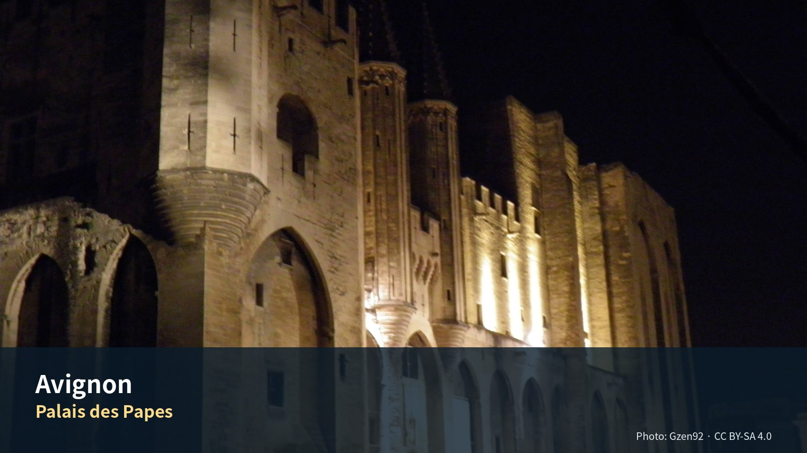

*Palais des Papes — Photo: Gzen92, CC BY-SA 4.0; [원문](https://commons.wikimedia.org/wiki/File:Palais_des_papes_(Avignon)_(9).jpg). 가이드북용으로 크롭·리사이즈.*


# Commercial Guide Module

> **교황도시를 거점으로 시장·로마유산·석회암 마을을 잇는 4박**  
> 성벽도시의 역사와 두 번의 차량일을 균형 있게 배치한 Provence 후반부

## Editor’s Verdict

| 항목 | 평가 |
|---|---|
| 여행 적합도 | ★★★★★ Jason·Julia의 생활형 여행에 최적화 |
| 예산 체감 | 중 |
| 일정 강도 | 차량일 2회로 높음 |
| 예약 핵심 | 숙소주차·Palais·TGV 연결 |
| 우천 전환 | Palais·박물관 중심, Pont·Les Baux 축소 |

## 놓치면 아쉬운 선택

| 등급 | 장소·경험 | 이 가이드북에서 추천하는 이유 |
|---|---|---|
| 필수 | **Les Halles–Palais des Papes–Rhône** | 시장·권력·도시경관을 한 날에 연결하는 Avignon 핵심 코스다. |
| 우선 추천 | **Uzès 토요시장** | 시장 자체가 목적이며 Pont du Gard는 오후의 역사·자연 경험으로 붙인다. |
| 우선 추천 | **Pont du Gard** | 건축물만 보지 말고 강과 지형 속에서 로마 수로의 규모를 본다. |
| 우선 추천 | **Les Baux–Saint-Rémy** | 강한 절벽마을과 생활도시를 대비한다. |
| 선택 | **Glanum 또는 Carrières** | 같은 날 둘 다 넣지 않고 취향과 날씨로 하나만 선택한다. |

## 하루를 완성하는 네 가지 선택

| 시간·역할 | 추천 | 이용법 |
|---|---|---|
| 아침 | **Les Halles 또는 Uzès 시장** | 지역의 생활밀도와 점심 재료를 함께 확보한다. |
| 점심 | **시장·구시가지** | 차량일 저녁 예약을 피하고 귀환지연을 흡수한다. |
| 저녁 | **성벽 안 숙소 생활권** | 도보귀가 가능한 범위에서 Provence 마지막 저녁을 보낸다. |
| 스케치 | **Palais 광장 또는 Rhône 강변** | 기념비의 크기와 열린 공간을 단순한 선으로 잡는다. |

## 이 지역의 Top 10

1. L’Isle 시장
2. Avignon 성벽
3. Les Halles
4. Palais des Papes
5. Rocher des Doms
6. Pont Saint-Bénézet
7. Uzès 시장
8. Pont du Gard
9. Les Baux
10. Saint-Rémy

## 현장 메모

- **대표 촬영 장면:** Palais des Papes 광장의 인물과 건축 스케일
- **기념품 방향:** 시장 식재료·Provence 직물·지역 공예
- **일정 삭제 원칙:** 선택 쇼핑·두 번째 카페·추가 내부관람부터 삭제하고 핵심 예약과 귀환 연결은 유지한다.
- **표시 기준:** 별점은 객관적 품질평가가 아니라 이 여행계획에서의 편집 추천도다.

---

[Provence 차량일 운영 논리](../../ASSETS/85_Editorial_Visuals/05_Provence_Car_Day_Operating_Logic_v1.0.png)

---
title: "Jason과 Julia의 유럽 장기여행 가이드 — 아비뇽·알필유·위제스·퐁뒤가르"
chapter: 09
version: "2.0"
status: "Pass B 문장·구조 편집 및 차량·시장·TGV 실행성 감사 완료"
travel_dates: "2026-09-17 – 2026-09-21"
travelers: "Jason · Julia"
last_web_verification: "2026-08-01"
source_priority: "공식 관광기관·문화부·시설·SNCF·숙박업체·레스토랑 공식자료"
---

# 09. 아비뇽·알필유·위제스·퐁뒤가르 4박 5일
## 교황도시, 토요시장, 로마 수도교와 석회암 마을

> **여행의 역할**: 뤼베롱의 농가와 언덕마을을 떠나 론강 서부 프로방스로 이동하는 구간이다. 아비뇽에서는 교황궁과 성벽도시의 구조를 이해하고, 근교에서는 **위제스의 토요시장과 퐁뒤가르**, **생레미와 레보드프로방스의 알필유 경관**을 경험한다. 박물관을 여러 곳 순회하기보다 도시·시장·마을·유적·경관을 우선한다.

> **여행자 기준**: Jason·Julia는 새로운 도시와 지역을 방문하는 경험을 미술관·박물관보다 선호한다. 따라서 Palais des Papes는 도시 정체성을 이해하는 핵심 기념물로 유지하되, Petit Palais·Collection Lambert·Calvet 등은 비·피로·특별행사에 따른 선택 모듈로 둔다. Julia의 수영은 선택 일정이며 숙소 선정조건이 아니다.

> **차량 운영**: 9월 17일 뤼베롱에서 차량으로 도착하고, 9월 21일 Avignon TGV에서 반납한다. 4박 동안 차량은 **숙소의 확정 주차장 또는 관리형 유료주차장에 넣고**, 아비뇽 성벽 안 관광은 도보로 한다.

> **디자인 메모**: 최종본에는 실제 지도·사진을 넣는다. 현재 작업본에는 삽입 위치와 이미지 제목·설명만 배치한다.

---


## Phase 10 공식정보 원칙

- 운영시간·요금·예약조건은 `OPERATIONS/116_Phase10_Official_Source_Fact_Verification_Register_v1.0.md`를 우선한다.
- 공식 페이지가 충돌하거나 날짜별 예약창이 필요한 항목은 계획가격이 아니라 **재확인**으로 본다.
- 날씨·화재통제·파업·교통은 전날 또는 당일 확인한다.

# Regional Context & Scheduled Place Dossiers

## 이 4박이 여행 전체에서 하는 일

**프로방스의 마지막 구간이자, 렌터카를 놓는 구간이다.**

Day 12에 니스 공항에서 받은 차를 Day 24에 아비뇽 TGV에서 반납한다. **12일간의 자동차 여행이 여기서 끝나고**, 이후 19일은 기차와 도보다. 리옹 4박, 파리 16박이 남는다.

성격도 바뀐다. 뤼베롱 4박이 **농가의 여백**이었다면, 아비뇽 4박은 **밀도**다. 교황궁·로마 수도교·석회암 요새·반 고흐가 나흘에 들어 있다.

## 이 지역을 이해하는 축

### 아비뇽은 예쁜 중세도시가 아니라 정치권력의 도시다

기존 원고의 이 정리가 핵심이다.

68년간 교황청이 여기 있었고, 그동안 인구가 **5,000명에서 3만 명**으로 늘었다. 성벽 4.5km와 유럽 최대 고딕 궁전은 관광용으로 지은 것이 아니라 **행정과 방어의 인프라**였다.

앞 구간의 마을들 — 뤼르마랭, 고르드, 메네르브 — 과 성격이 정반대다. 저쪽이 농업과 방어의 마을이라면 **여기는 수도(首都)의 잔해**다.

### 론 강과 다리가 흥망을 결정했다

다리가 있어 도시가 컸고, 다리가 끊기며 도시의 역할이 줄었다.

건설 당시 리옹과 지중해를 잇는 유일한 연결로였다. 그리고 그 리옹으로 Day 24에 간다. **이 여행이 800년 전 그 축을 그대로 따라간다.**

### 성벽 안은 관광지이면서 생활도시다

성벽 안에 사람이 산다. 학교와 약국과 빨래방이 있다. Les Halles를 먼저 보라는 배치가 그래서 옳다.

### Uzès와 Pont du Gard는 '로마유적 하루'가 아니다

기존 원고의 판단이다. **우제스는 살아 있는 시장도시**이고 퐁 뒤 가르는 유적이다. 둘을 "로마 하루"로 묶으면 우제스가 들러리가 된다.

Day 22의 순서 — **시장(오전) → 유적(오후)** — 가 이 구분을 반영한다.

### Alpilles는 개별 명소가 아니라 산지와 마을의 관계다

레보는 석회암 산 위에, 생레미는 그 기슭에 있다. 같은 산의 위와 아래다.

**반 고흐가 요양원 창으로 본 것이 이 산이다.** 「알피유 풍경」·「생레미의 언덕」이 그 그림이다. 레보에서 산 위를 걷고 생레미에서 그 산을 그린 그림을 보는 순서가 Day 23이다.

## 9월 19–20일은 유럽 문화유산의 날이다

2026년 유럽 문화유산의 날은 9월 19일과 20일에 열린다. 주제는 '사진의 유산'과 '위기의 유산 — 되살리고, 저항하고, 다시 상상하기' 두 가지다.

매년 9월 셋째 주말에 수만 곳의 기념물이 문을 여는데, 그중에는 평소 일반에 공개되지 않는 곳도 있다.

2026년은 43회째다.

**Day 22와 Day 23이 정확히 이 이틀이다.**

### 무엇을 뜻하는가

| 유리한 점 | 불리한 점 |
|---|---|
| 평소 닫힌 건물이 열린다 | **주요 유적이 매우 붐빈다** |
| 무료 개방이 많다 | 주차가 더 어렵다 |
| 특별 가이드 투어 | 사전 예약이 필요한 프로그램이 있다 |

**Pont du Gard(Day 22)와 Les Baux(Day 23)는 프랑스에서 가장 방문객이 많은 유적 축에 든다.** 그 이틀이 문화유산의 날과 겹친다.

> **대응**
> - **더 일찍 출발한다.** 두 날 모두 개장 시각 도착을 목표로
> - 출발 전 각 유적의 문화유산의 날 운영 방침을 확인한다 {{badge:pending|확인 필수}}
> - 무료 개방이면 예약 없이 몰리므로, 유료라도 **사전 예매가 있는 쪽이 유리할 수 있다**

기존 원고의 `18.2 Journées européennes du patrimoine — 9월 19–20일` 항목이 이것이다. **날짜가 확인됐다.**

## 일정에 포함된 장소별 상세 가이드

일자별로 방문지를 싣는다. 각 항목은 무엇인지, 무엇이 핵심인지,
현장에서 어떻게 볼 것인지로 나뉜다. 운영시간과 요금은 표로
분리했고 변동 항목에는 재확인 표시를 달았다.

### Day 21 — 아비뇽 핵심

### Les Halles {{grade:essential|필수}}

아비뇽의 실내 중앙시장이다. 기존 원고가 **"관광 전 아비뇽의 생활부터 보기"** 로 배치한 것이 이 날의 순서를 만든다.

> **교황궁보다 먼저 가라**
> 시장은 오전에 끝나고 교황궁은 하루 종일 연다. 순서가 뒤집히면 시장을 못 본다.
> 그리고 **거대한 권력 건축을 보기 전에 이 도시가 지금 어떻게 사는지**를 보는 편이 인상이 정확해진다.

{{badge:pending|운영 요일·시간 확인 필요 — 월요일 휴장 가능성}}

---

### Palais des Papes {{grade:essential|필수}}

#### 무엇인가 — 교황이 로마를 떠나 있던 68년

1273년부터 교황들은 로마에서 안전하지도 자유롭지도 독립적이지도 못하게 되자 그곳을 떠났다. 1309년 클레멘스 5세가 교황령이던 아비뇽에 정착했다. 이 도시는 당시 기독교 세계에서 중심적 위치에 있었고 교역에 유리했다. 게다가 론 강을 건너는 생베네제 다리가 스페인·프로방스·이탈리아로 가는 통과점이었다.

1309년 클레멘스 5세가 로마보다 교회 행정에 적합하다고 보아 교황 거처를 아비뇽으로 옮겼다. 아비뇽 교황기의 일곱 교황이 모두 프랑스인이었고, 임명된 추기경 134명 중 111명도 프랑스인이었다. 교황청은 1377년 그레고리우스 11세가 로마로 돌아갈 때까지 아비뇽에 있었다.

#### 핵심 — 도시가 여섯 배로 커졌다

이 시기에 아비뇽은 세계의 주요 수도가 됐고 인구가 약 5,000명에서 3만 명 이상으로 늘었다.

**68년 만에 인구가 여섯 배가 됐다.** 성벽도 궁전도 그 압력의 산물이다.

4.5km의 옛 성벽에 둘러싸인 이 궁전은 베네딕토 12세와 클레멘스 6세의 교황 재위 기간에 걸쳐 거의 20년간 지어졌고, 유럽에서 가장 큰 고딕 궁전이다.

여덟 개의 탑을 가진 요새로, 도시에서 58m 높은 바위 위에 서 있다. 실제로는 두 개의 건물이다 — 1334–42년에 지은 옛 궁전(Palais Vieux)과 1342–52년에 세운 새 궁전(Palais Nouveau).

> **두 궁전의 차이를 보라**
> 베네딕토 12세의 옛 궁전은 **수도원 출신 교황의 검소함**이, 클레멘스 6세의 새 궁전은 **군주로서의 화려함**이 드러난다고 알려져 있다 {{badge:pending|교차 확인 권장}}. 두 부분의 성격 차이를 의식하고 걸으면 8년 사이의 노선 변화가 보인다.

#### 실내가 비어 있다는 것

1377년 교황들이 떠난 뒤 궁전은 점차 황폐해졌고, 나폴레옹 시대에는 병영과 감옥으로도 쓰였다. 지금은 연중 공연과 콘서트가 열리는 전시 공간이자 관람 가능한 박물관이다.

가구 면에서는 내부가 상당히 휑하지만, 큰 홀들과 24개의 방은 그럼에도 인상적이다.

> **가구를 기대하지 마라**
> 이 건물은 **비어 있는 것이 정상**이다. 혁명과 군용 전용을 거치며 내용물이 사라졌다. 남은 것은 공간의 규모와 벽화 일부다.
> **"권력건축을 걷는 경험"** 이라는 기존 원고의 정리가 정확하다. 전시물이 아니라 **크기와 동선**을 보는 곳이다.

#### 실용

| 항목 | 값 |
|---|---|
| 요금·운영 | {{badge:pending|재확인}} |
| 보조 | 히스토패드(디지털 태블릿) 제공 {{badge:pending|현행 여부 확인}} |
| 체류 | 90–120분 |
| ⚠ 주의 | 특별 행사로 관람이 제한되는지 미리 확인할 것 |
| 정원 | 가이드 투어에는 궁전 정원이 포함되지 않는다. 정원 입장권을 따로 살 수 있다 |

---

### Rocher des Doms · Pont Saint-Bénézet {{grade:essential|필수}}

기존 원고가 **"지형을 이해하는 한 세트"** 로 묶은 이유가 있다. 따로 보면 의미가 반감된다.

#### Rocher des Doms

교황궁이 올라앉은 바위다. 도시에서 58m 높다. 지금은 정원이다.

> **여기서 다리를 내려다보라**
> 위에서 보면 **다리가 왜 끊겼는지**가 지형으로 이해된다. 론 강의 폭과 유속, 그리고 다리가 향하던 반대편이 한눈에 들어온다.

#### Pont Saint-Bénézet — 끊어진 것이 본질이다

12세기부터 지어졌고 한때 론 강의 양안을 이었다. 원래 22개의 아치 중 오늘날 남은 것은 4개뿐이다.

다리 길이는 920m였고 22개의 아치가 론 강 양안을 이었다.

건설 당시 리옹과 지중해를 잇는 유일한 연결로였고, 존속 기간 대부분 양쪽에서 삼엄하게 지켜졌다.

#### 왜 끊겼는가 — 전설과 실제

전설에 따르면 12세기에 비바레 출신의 젊은 목동 베네제가 신의 명령으로 다리를 지었다. 목동이 거대한 바위를 들어 론 강에 던지려 하자 마을 사람들이 아무도 믿지 않고 비웃었는데, 신의 개입으로 목동이 바위를 들어 던지는 데 성공했고 거기서 다리 건설이 시작됐다는 이야기다.

**실제는 다르다.** 다리 건설은 여러 세기에 걸친 진행형 사업이었다. 15세기 이후의 기후 변화에 따른 하천 수문 변화가 파괴의 원인이었다. 17세기부터는 더 이상 쓰이지 않았다.

론 강의 홍수에 여러 차례 쓸려 나갔고 결국 17세기에 버려졌다.

> **이 다리의 이야기는 기후사다**
> 기적으로 시작해 홍수로 끝났다. 15세기 이후 강의 성질이 바뀌면서 인간이 유지를 포기한 구조물이다.
> **"Rhône 강과 다리가 도시의 흥망을 결정했다"** 는 기존 원고의 정리가 정확하다.

#### 노래에 대하여

「쉬르 르 퐁 다비뇽」이라는 유명한 동요 덕분에 전 세계에 알려져 있다. 1995년 유네스코 세계유산으로 등재됐다.

이 동요는 19세기에 아돌프 아당이 작곡한 것이다.

> **다리 위에서 춤춰도 된다**
> 유네스코 세계유산이지만 그 위에서 춤추는 것은 허용된다. 연중무휴 개방한다.

### Day 22 — Uzès와 Pont du Gard

**⚠ 문화유산의 날 첫째 날이다.** 위 경고 참조.

### Uzès 토요시장 {{grade:essential|필수}}

우제스는 수요일과 토요일 오전 시장으로 유명하다. 수요일은 7:30–14:00에 마을 중심에서, **토요일은 7:30–13:00에 플라스 오 제르브**에서 열린다.

**9월 19일이 토요일이다.**

#### 무엇인가 — 공작령 도시

우제스의 첫 정착은 1세기로 거슬러 올라간다. 님으로 물을 보내는 로마 수도교 퐁 뒤 가르가 근처에 지어지면서 우제스와 님이 함께 번성했다. 1088년 크뤼솔 다제스 가문에 '세뇌르 다제스' 칭호가 주어졌고, 이후 자작·백작을 거쳐 1565년 마침내 공작이 됐다.

#### Place aux Herbes

플라스 오 제르브는 구시가지의 심장이며 남프랑스에서 가장 아름다운 시장 광장 중 하나다. 수백 년 된 석회암 아케이드가 둘러싸고, 거대한 플라타너스가 그늘을 드리우며, 의도적으로 느긋한 속도로 운영되는 카페들이 늘어서 있다.

#### 왜 우제스인가

우제스는 가르 데파르트망에 있어 프로방스 서쪽, 공식적으로는 옥시타니에 속한다. 석회암은 꿀빛이고 덧창은 바랜 파스텔이며 자갈길은 차가 다니지 않고 조용하다. 상상하던 프로방스 그대로인데 인파와 관광버스만 없다.

님에서 35분, 아비뇽에서 45분, 몽펠리에에서 약 1시간이다. 구시가지 외곽 순환로에 주차하고 걸어 다닐 수 있다. 중세 중심가는 차량 통행이 막혀 있고, 그것이 이 도시가 여전히 제 모습인 이유다.

> **이것이 이 여행의 마지막 프로방스 시장이다.** Day 24에 리옹으로 간다. 장을 볼 생각이면 여기가 마지막이다 — 다만 다음 날 새벽 이동이 아니므로 부피는 절제할 것.

#### 실용

| 항목 | 값 |
|---|---|
| 시장 | 토 7:30–13:00 · Place aux Herbes |
| 주차 | 구시가지 외곽 순환로 |
| 아비뇽에서 | 약 45분 |
| ⚠ | **문화유산의 날 + 토요시장** = 이날 최대 혼잡 요인 |

---

### Pont du Gard {{grade:essential|필수}}

#### 무엇인가 — 다리가 아니라 수도교의 한 조각

사실 이것은 다리가 아니라, 우제스의 외르 수원에서 고대 로마 도시 '네마우수스'(오늘날의 님)로 물을 나르던 수도교의 잔해다.

옥시타니 지역에 있으며, 1세기 중반에 지어진 50.02km 수도교의 핵심 요소다. 우제스 인근 외르 수원에서 로마 식민도시 네마우수스, 즉 님에 물을 공급했다.

#### 핵심 — 숫자보다 비례를 보라

기존 원고의 **"숫자보다 비례를 보는 유적"** 이라는 정리가 정확하다. 다만 숫자를 알면 비례가 보인다.

| 항목 | 값 |
|---|---|
| 높이 | 48.8m (총) — 세계에서 가장 높은 고대 수도교 |
| 층 | 3층 |
| 아치 | 1층 6개 · 2층 11개 · 3층 35개 |
| 길이 | 상단 273m (원래 12개 아치가 더 있어 360m였다) |
| 수도교 전체 | 약 50km |
| **경사** | 전 구간 34cm/km. 총 길이에서 수직으로 17m만 내려간다 |
| 수량 | 하루 약 40,000㎥ |

> **경사가 이 유적의 핵심이다**
> 50km를 흘러가며 **1km당 34cm씩만** 내려간다. 이 정밀도를 2천 년 전에 측량으로 맞췄다.
> 높이 48.8m는 눈으로 압도하지만, **진짜 기술은 눈에 안 보이는 기울기에 있다.**

> **회반죽이 없다**
> 전부 회반죽 없이 지었다. 어떤 돌은 6톤에 이르는데, 정확히 재단해 딱 맞물리게 함으로써 회반죽이 필요 없게 만들었다.
> 정밀하게 잘린 석회암 블록이 겹쳐진 아치 구조로 건식 조립돼 있고, 그것이 이 거대한 무게를 지탱한다.
>
> **이음새를 가까이서 보라.** 이 유적에서 만져 볼 수 있는 유일한 기술이다.

#### 왜 살아남았는가

로마 제국이 무너지고 수도교가 쓰이지 않게 된 뒤에도 퐁 뒤 가르는 통행료를 받는 다리라는 부차적 기능으로 거의 온전하게 남았다.

1400년대에는 인근 우제스의 주교와 공작이 다리 유지를 맡았다.

> **쓸모가 있었기 때문에 남았다.** 로마 유적 대부분이 채석장이 된 시대에, 이것은 계속 다리였다.

#### 실용

| 항목 | 값 |
|---|---|
| 위치 | Vers-Pont-du-Gard (님과 우제스 사이) |
| 지정 | 1840년 프랑스 최초의 역사기념물 중 하나 · 1985년 유네스코 |
| 요금·운영 | {{badge:pending|재확인}} |
| 체류 | 90–150분 (박물관 포함 시 더) |
| ⚠ | **문화유산의 날 겹침.** 프랑스에서 가장 방문객이 많은 고대 기념물이다 |
| 조명 | 기존 원고에 야간 조명 항목 있음 {{badge:pending|2026 운영 확인}} |

### Day 23 — Alpilles

**⚠ 문화유산의 날 둘째 날이다.**

### Les Baux-de-Provence {{grade:essential|필수}}

석회암 바위산 위의 요새 마을이다. 기존 원고의 **"절벽이 도시가 된 장소"** 가 정확한 요약이다.

> **바위와 건물의 경계를 보라**
> 어디까지가 자연 암반이고 어디부터가 사람이 쌓은 것인지 구분이 안 되는 구간이 있다. Day 18에 본 **페라타야다(암반을 깎아 해자를 만든 마을)** 와 같은 원리인데 규모가 훨씬 크다.

⚠ 마을과 성(Château des Baux)의 상세는 조사가 부족하다 {{badge:pending|보완 필요}}.

---

### Carrières des Lumières {{grade:priority|우선추천}}

#### 2026년 프로그램이 확인됐다

2026년 2월 13일부터 카리에르 데 뤼미에르는 두 개의 새 몰입형 전시를 선보인다 — **「피카소, 움직이는 예술」**, 큐비즘 공동 창시자의 예술 여정을 다시 보게 만드는 몰입 경험. 그리고 **「프리다 칼로, 한복판에서」**, 멕시코에서 가장 유명한 화가의 여정을 대표작과 자화상으로 따라가는 짧은 프로그램이다.

> **⚠ 반 고흐 프로그램이 아니다**
> 이 시설은 예전에 반 고흐를 다룬 적이 있어 그렇게 알려져 있는데, **2026년은 피카소와 프리다 칼로다.**
> Day 23에 생레미에서 반 고흐를 보는 일정과 **주제가 이어지지 않는다.** 그 사실을 알고 가야 한다.

#### 무엇인가

알피유 한복판의 거대한 카리에르 데 뤼미에르는 세계에서 유일한 멀티미디어 쇼를 연다. 바위의 모든 표면에 투사되는 이미지에 관객이 완전히 둘러싸인다. 바닥까지 전부 덮여 거대한 이미지 카펫이 된다.

벽 높이가 15m가 넘는다.

2012년 레보드프로방스 시가 컬처스페이스와 민관 협약을 맺고 채석장 운영을 맡겼다.

#### 실용

| 항목 | 값 |
|---|---|
| 2026 운영 | 2/13–12/31 매일. **9월은 9:30–19:00.** 폐장 1시간 전 마지막 입장 |
| 2026 요금 | 성인 €13–16.50 (시니어 €15.50 / 할인 €14.00 / 청년 €13.00) |
| 체류 | 60–90분 |
| 온도 | 채석장 내부는 서늘하다 {{badge:pending|확인 권장}} |

> **오전에 가라**
> 권장 일정은 오전에 카리에르 데 뤼미에르로 시작하고(시원해서 좋다), 이어 25분 거리(20km)의 생레미드프로방스로 가서 글라눔 유적과 생폴드모졸을 도는 것이다.
> **기존 원고의 Day 23 순서와 정확히 일치한다.**

---

### Saint-Rémy-de-Provence {{grade:essential|필수}}

기존 원고가 **"유명인보다 생활도시로 보기"** 로 정리한 곳이다. 다만 그 유명인의 밀도가 매우 높다.

### Saint-Paul-de-Mausole {{grade:essential|필수}}

#### 무엇인가 — 수도원이 병원이 된 곳

알피유 기슭, 글라눔 로마 유적 옆에 서기 1000년경부터 수도원과 로마네스크 회랑이 있었고 여러 수도회가 이어졌다. 각 수도회는 무엇보다 광기에 빠진 이들을 돌보는 일에 헌신했다.

1789년 혁명이 수도원을 국유화했고 곧 생레미의 세 평신도에게 팔렸다가 1807년 메르퀴랭 박사에게 다시 팔렸다.

이름은 인근 글라눔의 마우솔레움에서 왔다. 글라눔의 개선문과 함께 전통적으로 '생레미의 고대 유물(Antiques)'이라 불리는 한 쌍을 이룬다.

#### 반 고흐가 여기 있었다

화가 빈센트 반 고흐는 1889년 5월 8일부터 1890년 5월 16일까지 이곳에 입원했다. 페롱 박사와 생조제프 수녀들의 인간적이고 혁신적인 돌봄 방식 덕분에 이 예술가는 생폴 요양원에 머무는 동안 방대한 작업을 이어 가고 강화할 수 있었다.

> ⚠ **입원 시작일이 자료에 따라 5월 3일과 5월 8일로 갈린다.** 본 문서는 시설 공식 사이트를 따라 **5월 8일**로 적었다. {{badge:pending|확인 권장}}

그는 여기서 매우 많은 작품을 그렸다 — 자화상, 「별이 빛나는 밤」, 「붓꽃」, 「사이프러스」, 「수확하는 사람이 있는 밀밭」, 「생폴드모졸 교회 풍경」, 「요양원 정원의 분수」, 「요양원 정원」, 「요양원 입구」, 「요양원의 빈센트 방」, 「생폴 요양원 복도」, 「알피유 풍경」, 「생레미의 언덕」, 「생폴 요양원 공원의 나무들」….

#### 무엇을 보는가

관람에는 11세기 수도사들이 지은 등록 로마네스크 회랑, 반 고흐가 1889년 5월부터 1890년 5월까지 머물던 당시 모습으로 일부 복원·재현한 요양원, 발레투도 아트 갤러리, 그가 창문으로 바라보던 '반 고흐 밭', 회랑 산책로와 식물 코스, 생조제프 수녀회의 역사, 그리고 이곳에서 그린 반 고흐 작품들의 확대 복제가 포함된다.

반 고흐의 방과 치료·생활 공간, 정원과 작품이 만들어진 자리의 복제화, 11–12세기 회랑과 로마네스크 교회를 볼 수 있다.

> **핵심은 창문이다**
> 「별이 빛나는 밤」이 이 건물의 창에서 나왔다. **그 방에서 그 창밖을 보는 것**이 이 방문의 전부다. 원작은 뉴욕에 있고 여기에는 복제만 있다.
> 그리고 **여기는 지금도 병원이다** (현재 명칭 '생폴 요양의 집'). 관람 구역과 진료 구역이 분리돼 있다. 조용히 다녀야 하는 이유가 예의 이상의 것이다.

#### 실용

| 항목 | 값 |
|---|---|
| 운영 | 3월 1일–12월 31일 연중무휴. 봄·가을·여름 9:30–18:45 {{badge:pending|재확인}} |
| 2026 | 2026/2/9–2027/1/3 매일 |
| 체류 | 60–75분 |
| 요금 | {{badge:pending|재확인}} |

---

### Glanum {{grade:optional|선택}}

생폴드모졸 바로 옆의 갈로로마 도시 유적이다. 마우솔레움과 개선문이 '생레미의 고대 유물'로 불린다.

기존 원고가 **선택**으로 두고 '글라눔 판단' 항목을 별도로 만든 이유가 있다. **Day 22에 이미 퐁 뒤 가르에서 로마 공학을 봤다.** 이틀 연속 로마 유적이 되면 밀도가 떨어진다.

> **넣는 기준**
> 시간과 체력이 남고, 로마 도시의 **평면 구조**(포룸·신전·주거)를 보고 싶을 때. 퐁 뒤 가르가 토목이라면 글라눔은 도시다.
> 반대로 피로하면 **첫 번째 삭제 대상**이다.

⚠ 개선문과 마우솔레움은 유적 밖 도로변에 있어 **입장 없이 볼 수 있다** {{badge:pending|확인 권장}}.

{{badge:pending|운영·요금 확인 필요}}

### Day 24 — 리옹으로

### Avignon TGV 렌터카 반납 {{badge:p0|P0 연결}}

**이 여행에서 렌터카를 놓는 날이다.** Day 12 니스 공항에서 받아 12일을 몰았다.

| 항목 | 내용 |
|---|---|
| 반납 | Avignon TGV 역 |
| 완충 | **90분 이상** — 주유·세차 확인·손상 점검·서류 |
| 주유 | **반납 전 만유.** 역 인근 주유소 위치를 미리 확인 |
| 점검 | 반납 시 **차량 상태를 영상으로 촬영** |
| 열차 | 기존 원고의 '열차 선택 원칙' 참조 |

> **아비뇽에는 역이 둘이다**
> **Avignon TGV**(고속철, 시 외곽)와 **Avignon Centre**(시내)가 다르다. 두 역 사이는 셔틀로 연결된다 {{badge:pending|소요·운행 확인}}.
> **반납지와 승차역이 같은지 반드시 확인할 것.** 이 혼동이 이 날 가장 큰 위험이다.

## 실행지도 · 현장 사용

- [대화형 HTML 지도](../../ASSETS/75_Execution_Maps/Avignon_Execution_Map_v0.2.html)
- [GeoJSON](../../ASSETS/75_Execution_Maps/Avignon_Execution_Map_v0.2.geojson)
- [KML](../../ASSETS/75_Execution_Maps/Avignon_Execution_Map_v0.2.kml)
- 대상 일정: **Day 20–24**
- 숙소 핀은 현재 **후보 위치**이며 실제 예약주소가 아니다.
- 연결선은 일정상의 기준점 순서를 보여주는 개략선이다. 실제 도보·운전은 Google Maps에서 다시 계산한다.
- HTML 배경지도와 Google Maps 링크는 인터넷 연결이 필요하다.

# Layer 1. Quick Reference · 확정 일정 · 실행표

## 1. 한눈에 보는 실행 요약

| 항목 | 확정·권장 내용 |
|---|---|
| 체류 | 2026년 9월 17일 목요일 체크인 → 9월 21일 월요일 체크아웃, 4박 |
| 기본 일정 | 9/17 L’Isle-sur-la-Sorgue→Avignon 정착 / 9/18 Avignon 핵심 / 9/19 Uzès 토요시장+Pont du Gard / 9/20 Alpilles / 9/21 차량반납·Lyon TGV |
| 여행 주제 | 교황도시·성벽·론강 / 시장과 생활도시 / 로마 수도교 / 알필유 석회암 경관·마을 |
| 최우선 숙소권 | **Porte Saint-Michel–Gare Centre–Corps Saints** 1순위. **Carmes–Université 동쪽 성벽권** 2순위 |
| 숙박 형태 | 주방·세탁이 있는 아파트호텔 또는 주차가 확정되는 호텔. 성벽 깊숙한 곳보다 차량진입·야간귀가·TGV 이동 편의 우선 |
| 계획 숙박예산 | 2인 4박 **€520–900** 실속·중간급 목표. 넓은 4성급 객실·프리미엄 아파트는 €900–1,250 범위 가능. 실시간 총액은 예약 시 재확인 |
| 필수 | Les Halles·Palais des Papes·Place du Palais·Rocher des Doms·Pont Saint-Bénézet·Uzès 토요시장·Pont du Gard·Les Baux·Saint-Rémy |
| 선택 | 9/17 Muséum Requien 야간개장 / Villeneuve-lès-Avignon / Glanum / Carrières des Lumières |
| 음식 | Halles 장보기·간단 점심, 저녁은 Avignon intra-muros 레스토랑. 당일치기 날 점심은 시장·피크닉·마을 비스트로 |
| 운동 | Jason: 성벽 남쪽·Rhône·Île de la Barthelasse 러닝 1회. Julia: 시립수영장 선택, 숙소 조건과 분리 |
| 행사 | 9/17 Avignon Musées 야간개장 18:00–21:00, 9/19–20 Journées européennes du patrimoine |
| 피로도 | 도시일 3, Uzès·Pont 4, Alpilles 4, 이동일 4 |
| 주요 위험 | 성벽 내부 차량진입·주차, 주말 JEP 혼잡, 당일치기 차량 내 짐, 강한 미스트랄, 유적지 노출·계단, TGV역 반납 지연 |

### 일정의 핵심 논리

```text
9/17 L’Isle-sur-la-Sorgue 목요시장 → Avignon 체크인·생활권 적응
        ↓
9/18 Les Halles → Palais des Papes → Rocher des Doms → Pont Saint-Bénézet
        ↓
9/19 Uzès 토요시장 → 구시가지 → Pont du Gard → 일몰조명 선택
        ↓
9/20 Les Baux-de-Provence → Alpilles 경관 → Saint-Rémy → Glanum 선택
        ↓
9/21 Avignon TGV 렌터카 반납 → Lyon Part-Dieu
```

---

## 2. 시각요소 자리표시자

### 시각자료 설계 — 아비뇽 4박 전체 지역 동선 지도
- 설명: Avignon 숙소권, L’Isle-sur-la-Sorgue, Uzès, Pont du Gard, Les Baux, Saint-Rémy, Glanum, Avignon TGV를 한 장에 표시한다.

### 시각자료 설계 — 아비뇽 성벽도시 도보 핵심 지도
- 설명: Les Halles, Place Pie, Palais des Papes, Rocher des Doms, Pont Saint-Bénézet, Rue des Teinturiers, Corps Saints, 추천 식당과 주차장을 표시한다.

### 시각자료 설계 — 숙소 생활권·주차·TGV 연결 지도
- 설명: Porte Saint-Michel, Gare Centre, Jean Jaurès·Centre Gare·Halles·Palais 주차장, Sainte-Marthe, TGV 셔틀축을 정리한다.

### 시각자료 설계 — Uzès–Pont du Gard 토요일 동선 지도
- 설명: Avignon 출발, Uzès 외곽주차, Place aux Herbes 시장, 중세구역, Pont du Gard 좌·우안과 귀환축을 표시한다.

### 시각자료 설계 — Alpilles 일요일 드라이브 지도
- 설명: Avignon→Les Baux→Saint-Rémy→Glanum 선택→Avignon의 일방향 동선과 주차·삭제 기준을 보여준다.

### {{VISUAL:VIS-FIGURE-007|type=diagram|status=editorial-ready|strategy=generated-diagram}} 아비뇽의 도시구조와 교황청 시대 도식
- 설명: 론강·다리·성벽·교황궁·상업거리·기차역이 어떻게 연결되는지 간단한 평면도와 연대표로 설명한다.

---

## 3. 날짜별 확정 일정

| 날짜 | 테마 | 핵심 방문지 | 피로도 |
|---|---|---|---:|
| 9/17 목 | 뤼베롱에서 교황도시로 | L’Isle 목요시장·체크인·성벽·Nocturne 선택 | 3/5 |
| 9/18 금 | 아비뇽 핵심도시일 | Les Halles·Palais·Rocher·Pont·구시가지 | 3/5 |
| 9/19 토 | 가르 지방의 시장과 로마공학 | Uzès 토요시장·구시가지·Pont du Gard | 4/5 |
| 9/20 일 | 알필유의 마을과 경관 | Les Baux·Saint-Rémy·Glanum 선택 | 4/5 |
| 9/21 월 | 차량반납과 리옹 이동 | Avignon TGV·Lyon Part-Dieu | 4/5 |

---

## 4. Day 1 — 9월 17일 목요일
### L’Isle-sur-la-Sorgue 목요시장, Avignon 체크인과 첫 저녁

### 사진 에셋 브리프 — L’Isle-sur-la-Sorgue 수로와 목요시장
- 설명: 수차·운하·시장 노점이 겹치는 뤼베롱 마지막 아침의 대표 이미지.

### 사진 에셋 브리프 — 아비뇽 성벽의 늦은 오후
- 설명: Porte Saint-Michel 또는 남쪽 성벽을 따라 도시로 진입하는 첫 장면.

| 시간 | 일정 | 실행 포인트 |
|---|---|---|
| 07:30–08:30 | 농가 아침·체크아웃 | 냉장식품 정리, 차량 짐 완전 은폐 |
| 09:15–11:00 | **L’Isle-sur-la-Sorgue 목요시장** | 채소·치즈·빵·작은 식재료 중심. 일요일 대시장보다 규모는 작아 이동일에 적합 |
| 11:00–12:00 | 운하·수차 산책 | 골동품점 장기쇼핑은 피하고 마을 풍경에 집중 |
| 12:00–13:00 | 가벼운 점심 | 시장 구매식 또는 샐러드·타르틴 |
| 13:00–13:45 | Avignon 이동 | 숙소 주차지침을 먼저 확인하고 성벽 안 무작정 진입 금지 |
| 14:00–15:00 | 체크인·주차·짐 정리 | 주차장 출입시간·차량 높이·재출차·21일 반납동선 확인 |
| 15:15–16:15 | 숙소 생활권 장보기 | 물, 빵, 과일, 햄·치즈, 아침재료. 다음 날 Halles를 보므로 소량 |
| 16:30–17:45 | **Porte Saint-Michel→Corps Saints→Rue des Teinturiers** 산책 | 첫날은 교황궁까지 가지 않고 남동부 생활권과 귀가로 파악 |
| 18:00–19:00 | 선택 A: **Muséum Requien Nocturne** | 공식 2026 일정: 18:00–21:00, 무료. 자연사 관심이 낮으면 45–60분만 |
| 18:00–19:00 | 선택 B: 성벽·Rhône 방향 산책 | 박물관보다 도시경험을 우선할 경우 이쪽이 기본 |
| 19:30–21:00 | 첫 저녁 | **Fou de Fafa** 또는 **Les Cocottes Saint-Louis** |
| 21:00 이후 | 숙소 복귀 | 9/18 Palais 티켓·날씨·주차상태 최종 확인 |

**오늘의 피로도: 3/5.** 이동일이므로 L’Isle와 Avignon 첫 산책이면 충분하다.

### 꼭 해볼 것

- L’Isle 시장에서 농가체류 마지막 식재료와 아비뇽 아침용 과일을 소량 구매하기
- 아비뇽 성벽의 실제 규모와 출입문 위치를 도착일에 익히기
- Rue des Teinturiers 수로와 플라타너스 거리에서 축제도시의 일상적 얼굴 보기

### 지연 시 삭제 순서

1. Nocturne
2. Rue des Teinturiers 연장산책
3. 외식은 숙소권 간단식으로 전환

---

## 5. Day 2 — 9월 18일 금요일
### Les Halles, 교황궁, 론강과 성벽도시

### 사진 에셋 브리프 — Les Halles의 녹색 외벽과 시장 내부
- 설명: 수직정원 외관과 치즈·올리브·생선 진열이 함께 보이는 생활도시 이미지.

### 사진 에셋 브리프 — Place du Palais와 Palais des Papes 전경
- 설명: 광장에 서서 교황궁의 방어적 규모와 주변 도시조직을 파악하는 대표 장면.

### 사진 에셋 브리프 — Pont Saint-Bénézet와 Rhône 강
- 설명: 끊어진 다리, 강, Villeneuve 언덕이 함께 보이는 아비뇽의 상징 이미지.

| 시간 | 일정 | 실행 포인트 |
|---|---|---|
| 07:30–08:20 | 숙소 아침 또는 Jason 짧은 러닝 | 러닝은 성벽 남쪽 4–5km, 전날 피로가 있으면 생략 |
| 08:30–09:20 | **Les Halles d’Avignon** | 2026년 화–일 06:00–14:00. 치즈·올리브·빵·점심재료 구매 |
| 09:20–09:40 | Place Pie→Palais 이동 | Rue des Marchands·Place de l’Horloge를 통과 |
| 09:45–12:00 | **Palais des Papes** | 9월 공식 운영 09:00–19:00, 마지막 입장 1시간 전. 2026 새 방문해설·WebApp 활용 |
| 12:05–13:00 | Place du Palais·구시가지 점심 | 시장 샌드위치 또는 가벼운 비스트로. 긴 코스요리 금지 |
| 13:00–14:00 | 숙소 또는 그늘카페 휴식 | 교황궁 2시간 뒤 휴식 필수 |
| 14:10–15:00 | **Rocher des Doms** | Rhône·Villeneuve·Mont Ventoux 방향 조망, 정원 벤치 휴식 |
| 15:05–16:00 | **Pont Saint-Bénézet** | Palais+Pont 결합권이 합리적. 다리 위보다 강과 도시관계 이해가 핵심 |
| 16:10–17:15 | Rhône 강변 또는 Île de la Barthelasse 시점 | 무료 강나룻배 운항 여부·바람 확인. 운항 불확실하면 강변만 |
| 17:30–18:30 | 숙소 휴식·샤워 | 저녁 전 정식 휴식 |
| 19:30–21:00 | **La Fourchette** 또는 **Le Goût du Jour** | 금요일 휴무 가능성이 있는 식당은 예약 전 영업일 재확인. 대체는 Cocottes |

**오늘의 피로도: 3/5.** 예상 보행 7–9km, 실내 관람 2시간.

### Palais des Papes 실용정보

- **운영**: 3월 1일–11월 1일 매일 09:00–19:00, 마지막 입장 18:00.
- **요금**: 공식 페이지 기준 Palais+Pont 성인 결합권 약 €17, Palais 단독 약 €14.50. 예약 화면에서 최종 확인.
- **권장시간**: 1시간 45분–2시간 15분.
- **관람법**: 방을 전부 기억하려 하지 말고, 대예배당·대중정치공간·교황 사적공간·벽화·요새적 외관의 대비를 본다.
- **2026 변화**: 5월부터 새 해설과 일부 새 공개공간이 단계적으로 도입되며 공사는 2027년까지 이어질 수 있다. 폐쇄구간을 당일 확인한다.

### 오늘의 필수·선택

- **필수**: Les Halles, Palais, Rocher, Pont
- **우선 추천**: Place de l’Horloge·Rue des Marchands, Rhône 강변
- **선택**: Petit Palais 60분, Barthelasse 나룻배, Villeneuve 전망
- **삭제 1순위**: 추가 박물관

### 꼭 해볼 것

- Palais 앞 광장에서 건물의 규모와 비대칭 파사드를 먼저 본 뒤 입장하기
- Histopad·WebApp은 모든 방에서 사용하지 말고 복원효과가 큰 3–4곳에 집중하기
- Rocher des Doms에서 Pont, Rhône, Villeneuve의 방향을 비교하기
- 저녁은 관광광장 바로 앞보다 Corps Saints·Vernet·Teinturiers 주변으로 이동하기

---

## 6. Day 3 — 9월 19일 토요일
### Uzès 토요시장과 Pont du Gard — 생활도시와 로마공학

### 사진 에셋 브리프 — Uzès Place aux Herbes 토요시장
- 설명: 플라타너스 그늘, 아케이드와 200여 노점이 어우러지는 대표 시장풍경.

### 사진 에셋 브리프 — Uzès 구시가지와 Tour Fenestrelle
- 설명: 석회암 골목과 둥근 종탑으로 도시의 독특한 성격을 보여주는 이미지.

### 사진 에셋 브리프 — Pont du Gard 전경
- 설명: 가르동 강과 3층 아치가 함께 보이는 로마공학의 대표 이미지.

| 시간 | 일정 | 실행 포인트 |
|---|---|---|
| 07:15–08:00 | 숙소 아침·출발준비 | 시장가방, 물, 모자, 차량에 아무것도 보이지 않게 정리 |
| 08:00–08:55 | Avignon→Uzès | 토요일 혼잡 때문에 09:00 이전 도착 목표 |
| 09:00–09:25 | 외곽주차→Place aux Herbes | 중심부 진입보다 외곽 관리주차장 후 도보 |
| 09:25–11:00 | **Uzès 토요시장** | 공식 2026 토요일 07:30–13:30, 약 200개 노점. 식품+공예 모두 운영 |
| 11:00–12:00 | **Uzès 구시가지** | Place aux Herbes 아케이드→Duché 외관→Tour Fenestrelle→골목 |
| 12:00–13:00 | 시장 점심 | fougasse, chèvre, charcuterie, 과일 또는 가벼운 비스트로 |
| 13:00–13:35 | Uzès→Pont du Gard | 시장 구매품은 차량 안에서 보이지 않게 보관 |
| 13:45–16:30 | **Pont du Gard** | 좌안 전망→다리 하부·상류/하류 시점→우안 또는 Mémoires de Garrigue 선택 |
| 16:30–17:15 | 강변 카페·휴식 | 더위·바람에 따라 체류 조절 |
| 17:15–18:15 | 선택: 일몰 전 추가산책 | 9/20까지 해질녘 조명 안내가 있으나 귀환과 피로 고려 |
| 18:15–19:15 | Avignon 귀환 | JEP 주말 교통 혼잡 고려 |
| 20:00 전후 | 가벼운 저녁 | 숙소식 또는 Fou de Fafa·Cocottes 중 예약된 곳 |

**오늘의 피로도: 4/5.** 시장 혼잡+운전+노출된 유적지 보행이 겹친다.

### Uzès를 추천하는 이유

Uzès는 프로방스의 유명 관광마을과 달리 **가르 지방의 실제 생활도시**다. Place aux Herbes의 시장, 아케이드, 공작궁 외관, 좁은 석회암 거리와 카페가 결합되어 있어 Jason·Julia가 선호하는 “새로운 도시의 성격”을 충분히 느낄 수 있다.

### Uzès에서 꼭 해볼 것

- Place aux Herbes를 한 바퀴 돌기 전에 카페 테이블에서 시장 전체를 먼저 관찰하기
- 올리브·염소치즈·빵·과일 중 실제 먹을 수 있는 양만 사기
- 관광상품 노점보다 지역 식품·바구니·도자기·직물 노점을 비교하기
- Duché 내부는 특별한 관심이 있을 때만 선택하고 골목·광장을 우선하기

### Pont du Gard 실용정보

- **사이트·주차장**: 연중 08:00–24:00.
- **문화공간**: 9월 공식 안내 09:00–19:00, 매주 월요일 오전 유지보수 가능.
- **조명**: 2026년 5월 15일–9월 20일 매일 해질녘 조명 예정.
- **권장 체류**: 경관만 1시간 30분, 전시·산책 포함 2시간 30분.
- **핵심**: 박물관보다 강변에서 3층 아치의 비례와 수로 높이를 직접 보는 것이 우선.

### 선택모듈

- **A 경관형**: 다리 양측 시점+강변만, 1시간 30분
- **B 이해형**: 박물관·수로 설명 추가, 2시간 30분
- **C 저녁형**: 조명까지 대기하되 Avignon 귀환 20:30 이후 허용
- **우천형**: Uzès 시장 축소+Pont 실내공간 후 조기귀환

---

## 7. Day 4 — 9월 20일 일요일
### Alpilles — Les Baux, Saint-Rémy와 Glanum 선택

### 사진 에셋 브리프 — Les Baux-de-Provence 성채마을 전경
- 설명: 석회암 절벽과 마을 건물이 하나로 이어지는 알필유의 대표 장면.

### 사진 에셋 브리프 — Saint-Rémy 구시가지의 플라타너스와 석조상점
- 설명: 과도한 관광마을보다 생활감이 남아 있는 알필유 중심도시 이미지.

### 사진 에셋 브리프 — Glanum의 로마유적과 Alpilles 산지
- 설명: 유적 뒤로 석회암 산지가 보이며 고대도시 입지를 설명하는 장면.

| 시간 | 일정 | 실행 포인트 |
|---|---|---|
| 07:30–08:15 | 숙소 아침 | 9/21 이동 준비를 70% 완료 |
| 08:15–09:00 | Avignon→Les Baux | 일요일·JEP 혼잡 전 도착 목표 |
| 09:00–09:25 | 유료주차·마을 입구 이동 | PayByPhone/PrestoPark 활용, 차량 내 물품 노출 금지 |
| 09:25–11:15 | **Les Baux 마을·전망** | 골목·성채 전망. Château 내부는 관심·날씨에 따라 선택 |
| 11:20–12:20 | 선택: **Carrières des Lumières** | 9월 09:30–19:00. 2026 일요일 Picasso+Frida Kahlo 프로그램. 지역체험 우선이면 생략 |
| 12:20–13:00 | Les Baux→Saint-Rémy | 알필유 석회암 도로 풍경 자체가 핵심 |
| 13:00–14:10 | Saint-Rémy 점심 | 샐러드·생선·타르틴. 긴 미식코스는 피함 |
| 14:10–15:30 | **Saint-Rémy 구시가지 산책** | Place Favier·Boulevard Victor Hugo·골목·카페 |
| 15:40–17:10 | 선택 A: **Glanum** | 9월 09:30–18:00, 성인 €9. 유적과 지형 중심 70–90분 |
| 15:40–17:10 | 선택 B: Saint-Rémy 생활시간 | 카페·스케치·상점·휴식. 박물관보다 마을 선호 시 기본 |
| 17:15–18:15 | Avignon 귀환 | 다음 날 차량반납용 주유지 확인 |
| 19:30–21:00 | 마지막 저녁 | **Restaurant SEVIN** 특별식 또는 Le Goût du Jour·Cocottes |
| 21:00 이후 | 짐 정리 | TGV 티켓·렌터카 영수증·주유·반납지 재확인 |

**오늘의 피로도: 4/5.** Les Baux 주차·경사와 Glanum 노출구간이 변수다.

### Les Baux를 추천하는 이유

뤼베롱의 석조마을과 겹치는 면이 있지만, Les Baux는 **절벽 위 요새도시와 알필유 석회암 지형**이 결합되어 공간적 성격이 다르다. 마을 내부 상점보다 외부 전망과 바위에 붙은 도시 형태가 핵심이다.

### Les Baux에서 꼭 해볼 것

- 마을 입구에서 건물과 절벽이 하나처럼 이어지는 재료감을 관찰하기
- 전망대에서 Crau 평야와 Alpilles의 방향을 비교하기
- 기념품점 전부를 보지 말고 골목·문·창·석벽의 질감에 집중하기
- Jason은 전망지에서 15–25분 펜스케치 선택

### Saint-Rémy에서 꼭 해볼 것

- 시장 없는 일요일에는 관광 “체크리스트”보다 카페·골목·광장의 생활리듬을 느끼기
- Van Gogh 흔적은 표지판·풍경을 가볍게 보고, 정신병원·미술서사를 과도하게 넣지 않기
- 현지 올리브오일·과자·빵을 마지막 프로방스 구매품으로 선택하기

### Glanum 판단

- **가야 하는 경우**: 로마도시·고대 수로·도시입지에 관심, 날씨가 선선함, JEP 특별프로그램 확인.
- **생략할 경우**: 전날 Pont du Gard에서 로마유적 만족도가 충분함, 더위·피로, Saint-Rémy 생활시간을 늘리고 싶음.
- **JEP 주의**: 9/19–20은 유럽문화유산의 날이다. 무료·특별개방 가능성과 동시에 주차·입장 혼잡이 커질 수 있으므로 최종 프로그램과 예약조건을 확인한다.

---

## 8. Day 5 — 9월 21일 월요일
### 체크아웃, Avignon TGV 차량반납, Lyon 이동

### 사진 에셋 브리프 — Avignon TGV역의 유리 지붕과 출발장
- 설명: 프로방스 자동차 여행을 끝내고 철도 중심 도시여행으로 전환하는 장면.

| 목표시간 | 일정 | 실행 포인트 |
|---|---|---|
| 06:45–07:45 | 기상·아침·최종짐 | 냉장고 비우기, 쓰레기·세탁·충전기 확인 |
| 07:45–08:15 | 체크아웃 | 숙소 주차정산·영수증 확인 |
| 08:15–08:35 | 주유 | Avignon TGV 인근 업체 영업시간과 연료규칙 확인 |
| 08:35–09:15 | 렌터카 반납 | 차량 외관·연료계·주행거리 사진, 직원 검수·영수증 확보 |
| 09:15 이후 | TGV역 대기 | 큰 짐은 시야 안에 두고 카페·화장실 이용 |
| 10시 전후–11시대 | **Avignon TGV→Lyon Part-Dieu** | Part-Dieu 도착 직행 TGV 우선. Lyon Saint-Exupéry행 OUIGO는 도심 재이동 때문에 후순위 |
| 도착 후 | Lyon 숙소 이동 | 다음 챕터와 연결 |

**오늘의 피로도: 4/5.** 차량반납과 대형짐 이동이 핵심 변수다.

### 열차 선택 원칙

- Avignon TGV–Lyon은 공식 노선 안내상 직행이 다수이며 평균 약 1시간대.
- **Lyon Part-Dieu 도착편**을 우선한다.
- Lyon Saint-Exupéry TGV 도착 OUIGO는 표면시간이 짧아도 도심 환승이 추가되므로 피한다.
- 목표 열차 출발 **최소 75–90분 전 렌터카 영업소 도착**.

---

## 9. 피로도·삭제 우선순위

| 날짜 | 피로도 | 삭제 1순위 | 삭제 2순위 |
|---|---:|---|---|
| 9/17 | 3 | Nocturne | Rue des Teinturiers 연장 |
| 9/18 | 3 | 추가 미술관 | Barthelasse 확장 |
| 9/19 | 4 | Pont 실내전시 | 일몰조명 대기 |
| 9/20 | 4 | Carrières | Glanum |
| 9/21 | 4 | 아침 산책 | 외부 아침식사 |

---

# Layer 2. 지역 이해 · 동네 · 추천등급 · 방문지 설명

## 10. 아비뇽과 서부 프로방스를 이해하는 다섯 가지 열쇠

### 10.1 아비뇽은 “예쁜 중세도시”보다 정치권력의 도시다

14세기 교황들이 로마를 떠나 아비뇽에 머물며 거대한 궁전·행정조직·방어시설을 구축했다. Palais des Papes는 화려한 왕궁보다 **요새·관청·교회가 결합한 권력건축**으로 보는 편이 정확하다.

### 10.2 Rhône 강과 다리가 도시의 흥망을 결정했다

Pont Saint-Bénézet는 현재 일부 아치만 남았지만, 중세에는 론강 교역과 교황령 접근을 통제하는 통로였다. Rocher des Doms와 다리를 함께 보면 아비뇽이 왜 이 위치에 형성됐는지 이해된다.

### 10.3 성벽 안은 하나의 관광지이면서 실제 생활도시다

Palais·Place de l’Horloge 주변은 관광밀도가 높지만, Carmes·Teinturiers·Corps Saints·Vernet로 이동하면 시장, 학교, 식당, 주거 골목이 드러난다. 숙소와 저녁은 이 생활권을 활용하는 편이 좋다.

### 10.4 Uzès와 Pont du Gard는 ‘로마유적 하루’가 아니다

Uzès는 시장과 공작도시의 생활축이고, Pont du Gard는 로마 수도교라는 기술유산이다. 시장→구시가지→강과 수도교 순서로 연결하면 도시생활과 고대 인프라가 대비된다.

### 10.5 Alpilles는 개별 명소보다 석회암 산지와 마을의 관계가 핵심이다

Les Baux, Saint-Rémy, Glanum을 모두 “관광지 세 곳”으로 보지 말고, **산지 방어마을–평지 생활도시–고대도시**라는 세 유형으로 비교한다.

---

## 11. 동네·숙소 생활권 비교

| 생활권 | 성격 | 장점 | 단점 | 숙소 적합성 |
|---|---|---|---|---:|
| **Porte Saint-Michel–Gare Centre–Corps Saints** | 남쪽 성벽·역·생활권 | 차량진입·TGV 연결·도보관광·식당 균형 최고 | Palais까지 15–20분 | **1순위** |
| **Carmes–Université·동쪽 성벽권** | 생활형·카페·Rue des Teinturiers | 조용한 골목, 주방형 숙소, 슈퍼 접근 | Gare Centre와 TGV 이동 한 단계 추가 | **2순위** |
| **Vernet–Oratoire 서부** | 조용한 고급주거·갤러리 | Palais·Pont·식당 접근, 비교적 차분 | 숙박비 높고 주방형 적음 | 2순위 |
| Place Pie–Halles | 시장·식당·중심 | 아침시장과 구시가지 이동 최고 | 야간소음·차량진입·주차 불편 | 조건부 |
| Palais·Horloge 바로 주변 | 관광중심 | 핵심명소 접근 최고 | 관광혼잡·식당가격·주차·소음 | 후순위 |
| Avignon TGV·Courtine | 교통·신개발 | 차량반납·열차 편리 | 성벽도시 생활감 약함 | 이동편의 특화 |
| Le Pontet·Montfavet | 외곽 생활권 | 주차·대형슈퍼·가격 | 4박 도심관광에 매일 이동 필요 | 비추천 |

### 최종 권고

> **1순위**: Porte Saint-Michel에서 Gare Centre 사이, 성벽 안 남부 또는 성벽 바로 밖. 주차를 확정하고 Palais까지 도보 15–20분 범위를 허용한다.
> **2순위**: Sainte-Marthe·Université 주변 아파트호텔. 주방·세탁·차량진입을 우선할 때 유리하다.

---

## 12. 추천등급

| 장소 | 등급 | Jason·Julia에게 추천하는 이유 |
|---|---|---|
| Palais des Papes | **필수** | 아비뇽의 도시정체성과 권력구조를 이해하는 핵심 |
| Les Halles | **필수** | 관광도시 안의 실제 식문화와 장보기 |
| Rocher des Doms | **우선 추천** | Rhône·Pont·Villeneuve를 한 번에 조망 |
| Pont Saint-Bénézet | **우선 추천** | 도시·강·교역의 관계를 상징 |
| Rue des Teinturiers | **우선 추천** | 축제도시 이전의 수공업·생활골목 |
| Uzès 토요시장 | **필수에 가까운 우선 추천** | 새로운 지역도시와 남부시장 경험 |
| Pont du Gard | **필수에 가까운 우선 추천** | 로마공학과 자연경관의 결합 |
| Les Baux | **우선 추천** | 알필유 절벽요새라는 독자적 지형 |
| Saint-Rémy | **우선 추천** | 마을생활·카페·상점·알필유 중심도시 |
| Glanum | 선택 | Pont du Gard와 중복될 수 있으나 도시입지 이해에 좋음 |
| Carrières des Lumières | 선택 | 몰입형 전시 관심 시, 지역 마을시간과 교환 |
| Petit Palais | 대체 | 비·폭염 시 중세회화 60분 |
| Collection Lambert | 대체 | 현대미술 관심이 강할 때만 |
| Arles 추가 | 비추천 | 4박에 Avignon·Uzès·Alpilles를 모두 유지하면 과밀 |
| Nîmes 추가 | 비추천 | Pont du Gard와 함께 넣으면 도시수집형 일정이 됨 |

---

## 13. 주요 방문지 상세 소개

### 13.1 Les Halles — 관광 전 아비뇽의 생활부터 보기

### 사진 에셋 브리프 — Halles 내부의 치즈·올리브·샤퀴테리
- 설명: 아비뇽 저녁식사와 숙소 점심을 연결하는 실제 장보기 장면.

**왜 추천하는가**
- Palais 방문 전에 도시가 오늘도 살아 있는 생활권임을 보여준다.
- 아침·점심·피크닉 재료를 현실적으로 해결한다.
- 9월 무화과·포도·토마토·치즈를 한곳에서 비교할 수 있다.

**꼭 해볼 것**
- 외벽의 Patrick Blanc 수직정원 보기
- 염소치즈·올리브·빵·제철과일 소량 구매
- 조리식품 1개를 점심 또는 저녁 보조로 사용

**적정 체류**: 45–60분

---

### 13.2 Palais des Papes — 권력건축을 걷는 경험

### 사진 에셋 브리프 — Palais 안뜰과 거대한 석벽
- 설명: 화려한 장식보다 요새·행정궁전의 규모를 보여주는 이미지.

**왜 추천하는가**
- 아비뇽이 14세기 유럽 정치의 중심이 된 이유를 직접 체감한다.
- 건축규모·벽화·의전동선이 도시의 다른 명소보다 압도적이다.

**꼭 해볼 것**
- 입장 전 광장에서 외벽·탑·대예배당의 덩어리를 보기
- 복원화면은 주요 방 3–4곳에만 집중
- 출구 후 Place du Palais에서 건물과 도시를 다시 비교

**적정 체류**: 1시간 45분–2시간 15분

---

### 13.3 Rocher des Doms·Pont Saint-Bénézet — 지형을 이해하는 한 세트

### 사진 에셋 브리프 — Rocher des Doms에서 본 Rhône와 Villeneuve
- 설명: 강·다리·교황궁·맞은편 요새도시의 관계를 보여준다.

**꼭 해볼 것**
- Pont의 남은 아치를 “미완성 다리”가 아니라 홍수와 교역의 역사로 보기
- Villeneuve-lès-Avignon과 Fort Saint-André 방향 확인
- 강풍이 심하면 다리 위 체류보다 전망지와 강변에 집중

**적정 체류**: Rocher 40–50분 + Pont 45–60분

---

### 13.4 Uzès — 시장과 귀족도시의 균형

### 사진 에셋 브리프 — Place aux Herbes의 아케이드와 카페
- 설명: 시장이 끝나도 도시생활이 이어지는 대표 광장.

**왜 추천하는가**
- 뤼베롱 마을과 달리 규모 있는 지방도시의 기능이 남아 있다.
- 토요일 시장은 식품·공예·사람구경을 동시에 만족시킨다.

**꼭 해볼 것**
- 시장에서 아침 커피 또는 citron pressé 한 잔
- Tour Fenestrelle 외관과 성당권역 보기
- 골목 한 곳은 시장노점이 없는 조용한 길로 선택

**적정 체류**: 시장 포함 2시간 30분–3시간

---

### 13.5 Pont du Gard — 숫자보다 비례를 보는 유적

**왜 추천하는가**
- 기술유산이 자연경관을 훼손하지 않고 오히려 지형과 결합한 드문 장소다.
- Avignon·Nîmes 권역의 로마 도시 인프라를 한 번에 이해할 수 있다.

**꼭 해볼 것**
- 정면 원경→다리 하부→상류 또는 하류의 세 거리에서 보기
- 강변에서 사람 크기와 아치 크기를 비교하기
- 전시관보다 야외 관찰을 우선하기

**적정 체류**: 1시간 30분–2시간 30분

---

### 13.6 Les Baux — 절벽이 도시가 된 장소

**왜 추천하는가**
- Gordes·Roussillon과 달리 방어지형과 성채가 마을의 형태를 결정했다.
- 알필유 산지의 색·바람·평야전망이 강하다.

**꼭 해볼 것**
- 입구와 전망대에서 마을 전체를 먼저 보기
- Château 내부보다 골목과 외부지형을 우선
- 주차기계 주변 카드도난 경고가 있으므로 앱 결제 또는 주변 확인

**적정 체류**: 마을 1시간 30분, Château 포함 2시간 30분

---

### 13.7 Saint-Rémy — 유명인보다 생활도시로 보기

**왜 추천하는가**
- Les Baux의 관광밀도와 대비되는 알필유의 생활중심이다.
- 카페·제과점·식료품점·작은 광장이 장기여행 리듬에 잘 맞는다.

**꼭 해볼 것**
- 중심순환도로 안쪽 골목을 무리 없이 한 바퀴 걷기
- 지역 과자·올리브오일·빵 중 하나 구매
- Jason은 카페 테라스 또는 골목에서 20–30분 스케치

**적정 체류**: 1시간 30분–2시간 30분

---

# Layer 3. 숙소 · 음식 · 시장 · 운동 · 이벤트 · 예약 · 대체안

## 14. 숙소 전략과 실제 후보

### 14.1 숙소 평가 기준

| 항목 | 가중치 |
|---|---:|
| 확정 가능한 안전한 주차·차량진입 | 25 |
| 성벽도시 도보 접근 | 20 |
| 주방·냉장고·세탁 | 15 |
| 야간 귀가·생활권 | 15 |
| 객실 크기·엘리베이터·냉방 | 10 |
| Avignon TGV 반납동선 | 10 |
| 비용 | 5 |

### 14.2 실제 숙소 후보

| 후보 | 위치·형태 | 강점 | 주의·확인 | 적합도 |
|---|---|---|---|---:|
| **Hôtel Le Magnan** | 성벽 안 남부, 호텔 | 조용한 정원, Gare Centre 5분권, 사전예약 보안주차 약 €15/박 | 주방·세탁 없음, 주차 조기예약 | **91/100** |
| **Résidence Les Cordeliers** | 성벽 안 남동, 아파트호텔 | kitchenette, 세탁, Gare Centre 약 600m, 생활골목 | 안뜰주차 사전예약 불가·당일 배정 | **89/100** |
| **Apart’Hôtel Sainte-Marthe** | 동쪽 성벽 밖, 아파트호텔 | 완비 kitchenette, 유료주차, 세탁실, 슈퍼, 차량진입 용이 | Palais까지 약 15–20분, 프런트 종료시간 | **88/100** |
| **Avignon Grand Hotel** | 남쪽 성벽 밖·Gare Centre 앞, 4성급 | 35㎡ 이상 넓은 객실, 24시간 프런트, 공영주차 직접접근, TGV연결 우수 | kitchenette 없음, 가격 상단 | **87/100** |
| **Novotel Avignon Centre** | 남서 성벽 밖, 4성급 | 보안 지하주차, 역·구시가지 접근, 프런트·편의시설 안정 | 주방 없음, 비즈니스호텔 분위기 | **85/100** |
| **ibis budget Avignon Centre** | 서남 성벽 밖, 예산호텔 | 예약형 유료주차 가능, 24시간 프런트, 예산관리 | 객실·생활공간 작음, 장기체류감 약함 | **78/100** |
| **Hôtel Cloître Saint-Louis** | 성벽 안 남부, 역사호텔 | 수도원 건축·정원, Gare Centre 접근, 저녁식당 편리 | 주차·객실 리노베이션 상태·엘리베이터 재확인 | **조건부** |

### 14.3 최종 선택순서

1. **주방·생활형 우선**: Les Cordeliers → Sainte-Marthe
2. **주차·역·편안함 우선**: Le Magnan → Avignon Grand Hotel → Novotel
3. **분위기 우선**: Cloître Saint-Louis, 단 주차와 객실후기 확인
4. **가격 최우선**: ibis budget 또는 유사 성벽 외곽 호텔

### 14.4 계획예산

- 실속형 아파트·호텔: 4박 €520–700
- 중간급·주차 포함: €700–900
- 넓은 4성급·취소가능: €900–1,250
- 별도: 관광세, 주차 €15–20/박 수준, 조식

> **가격 메모**: 숙소 공식사이트의 ‘최저가’는 실제 9/17–21 총액이 아니다. 취소가능요금·주차·관광세·세탁을 포함한 결제총액으로 비교한다.

---

# 먹거리 — 이 구간은 사서 먹는다

## 이 구간의 성격 — 다시 사 먹는 구간이다

뤼베롱은 농가 주방이 있었다. **아비뇽은 도시 숙소다.** 시장에서 사도 조리 여건이 다르다.

기존 원고의 '15.2 당일치기 점심전략'이 이 구간의 실질 과제다. **Day 22·23은 종일 밖에 있다.**

## 아비뇽·가르 지역에서 먹어야 할 것

| 이름 | 정체 | 비고 |
|---|---|---|
| **Papeton d'Aubergine** | 가지 요리. 이름이 '교황'에서 왔다 | 아비뇽 향토음식 {{badge:pending|교차 확인 권장}} |
| **Daube avignonnaise** | 프로방스 도브의 아비뇽식. 양고기를 쓰는 판본이 있다 | {{badge:pending|확인 권장}} |
| **Tapenade · Anchoïade** | 올리브·안초비 페이스트 | 전채 |
| **Brandade de Nîmes** | 소금대구를 올리브유·우유로 으깬 것 | **님 특산.** 우제스 인근 |
| **Fougasse** | 프로방스 납작빵 | 시장·빵집 |
| **Calisson** | 엑상 특산 | 여기서도 팔지만 원산지는 엑상 |
| **Melon · figue · raisin** | 9월 제철 | 시장 |
| **Olives de Nyons · huile d'olive** | | 레보 인근이 올리브유 산지 |

## 와인 — 이 구간이 이 여행의 와인 중심지다

아비뇽 주변은 **론 남부**다. 샤토뇌프뒤파프가 차로 20분 거리다 {{badge:pending|정확한 거리 확인}}.

| 유형 | 특징 |
|---|---|
| **Châteauneuf-du-Pape** | 교황이 심게 한 포도밭에서 유래한 이름 |
| Côtes du Rhône | 폭이 넓고 접근하기 쉽다 |
| Tavel | **로제 전용 AOC.** 프로방스 로제와 성격이 다르다 |
| Lirac | Tavel 인근 |

> **운전이 있는 날은 마시지 않는다**
> Day 21은 도보 도시일이라 저녁에 마셔도 된다. **Day 22·23은 운전한다.**
> Day 23 저녁이 프로방스 마지막 밤이다. 이 날 저녁을 와인의 날로 잡는 것이 합리적이다.

> **사서 옮길 것인가**
> 이후 리옹 4박, 파리 16박이 남았고 **Day 24는 TGV 이동일**이다. 병을 들고 기차를 타는 것은 가능하지만 무겁다. **파리에서 사는 편이 낫다.**

## 날짜별 배치

| Day | 날짜 | 점심 | 저녁 |
|---|---|---|---|
| 20 | 9/17 목 | **L'Isle 시장 조달** | 아비뇽 첫 저녁 |
| 21 | 9/18 금 | **Les Halles** | 성벽 안 식당 |
| 22 | 9/19 토 | **Uzès 시장 조달** 또는 우제스 식당 | 아비뇽 |
| 23 | 9/20 일 | 생레미 | **프로방스 마지막 저녁** |
| 24 | 9/21 월 | 이동 중 또는 TGV | 리옹 도착 후 |

> **Day 22·23 점심은 미리 정하라.** 종일 밖에 있고, 일요일(Day 23)에는 문 닫는 곳이 많다.

---

## 15. 레스토랑·카페·주문 가이드

### 사진 에셋 브리프 — Avignon의 프로방스 저녁식사
- 설명: 토마토·허브·염소치즈·생선 또는 양고기가 담긴 지역식 한 상.

### 15.1 Avignon 저녁식당

| 식당 | 성격 | 추천 주문·이용법 | 계획가격/인 | 예약 |
|---|---|---|---:|---|
| **Fou de Fafa** | 작은 창작 비스트로 | 계절메뉴에서 생선·오리·채소요리 2–3개 공유 | €35–55 | 강권 |
| **Le Goût du Jour** | 정제된 지역재료 코스 | Inspiration 또는 dégustation, 특별저녁 1회 | €55–95 | 강권 |
| **Restaurant SEVIN** | Palais 인근 고급식 | 2026 계절메뉴, 토마토·남프랑스 재료 중심 | €90–160+ | 필수 |
| **Les Cocottes Saint-Louis** | 수도원정원 캐주얼 프렌치 | 2026 메뉴 €33–38, rouget·ravioles·채소 | €35–55 | 권장 |
| **La Fourchette** | 전통 남부 비스트로 | 남부풍 생선·고기·지역전통, 영업일 제한 큼 | €35–60 | 필수·휴무확인 |
| **Les Halles 조리식품** | 피로한 날 포장 | roast chicken·ratatouille·샐러드·치즈 | €12–25 | 불필요 |

### 15.2 당일치기 점심전략

| 지역 | 기본 | 특별식 선택 | 피할 것 |
|---|---|---|---|
| Uzès | 시장 빵·치즈·과일·타르틴 | Place aux Herbes 비스트로 | 토요일 2시간 코스요리 |
| Pont du Gard | Uzès에서 산 피크닉 | 사이트 카페 | 차량에 냉장식품 오래 방치 |
| Les Baux | 이른 샐러드·타르틴 | 전망 레스토랑은 예약·가격 확인 | 관광객 몰리는 12:30 무예약 |
| Saint-Rémy | 구시가지 비스트로·제과점 | 지역 생선·채소·양고기 | Glanum까지 무리한 코스식사 |

### 15.3 꼭 먹어볼 것

- **daube provençale**: 와인·허브로 오래 익힌 쇠고기
- **agneau de Provence**: 양고기, 한 번만 선택
- **aïoli**: 마늘소스와 채소·생선 구성
- **tapenade**: 숙소 aperitif 또는 샌드위치
- **chèvre·pélardon**: Uzès·Gard에서 특히 적합
- **fougasse**: 당일치기 점심용
- **papalines d’Avignon**: 오레가노 리큐어가 든 지역 초콜릿, 소량 구매
- **Côtes du Rhône**: 운전 없는 Avignon 저녁에만 1잔

---

## 16. 시장·슈퍼·제철 식재료

### 16.1 시장

| 장소 | 운영·일정 | 역할 |
|---|---|---|
| **Les Halles d’Avignon** | 2026 화–일 06:00–14:00 | 아침장보기·점심·숙소식 |
| **Uzès 토요시장** | 매주 토 07:30–13:30 | 지역도시·공예·식품 체험 |
| L’Isle 목요시장 | 9/17 오전 | 이동일 전환시장 |
| Saint-Rémy 수요시장 | 이번 체류와 불일치 | 일정에 억지로 넣지 않음 |

### 16.2 살 것

- 무화과, 포도, 배, 자두
- 토마토, 샐러드채소, 멜론 잔여물량
- chèvre, pélardon, tomme
- jambon cru·saucisson
- fougasse·campagne 빵
- tapenade·올리브오일
- Côtes du Rhône half bottle 또는 작은 병

### 16.3 슈퍼전략

- 성벽 안 소형 Monoprix·Carrefour City류: 물·요거트·아침재료
- 차량으로 대형슈퍼 방문은 9/17 체크인 전후 1회만
- 9/20 저녁 이후 냉장식품 추가구매 금지: 다음 날 리옹 이동

---

## 17. 운동·Julia 선택 수영

### 17.1 Jason 러닝

**코스 A — 성벽 남쪽·Rhône**

```text
Porte Saint-Michel
→ Boulevard Saint-Roch
→ Porte de l’Oulle
→ Rhône 강변
→ 회차
```

- 5–7km 조절 가능
- 9/18 아침 또는 9/20 피로가 적을 때
- 성벽 인접 교차로·자전거 통행 주의

**코스 B — Barthelasse 전망형**
- 바람·나룻배·교량동선 확인 후 선택
- 일몰 후 단독러닝보다 아침 권장

### 17.2 Julia 수영 선택

- Avignon 시립수영장의 2026 9월 자유수영 시간과 비거주자 입장을 숙소 확정 후 조사한다.
- 이번 4박은 차량 당일치기 2회가 있어 정식 수영을 필수로 넣지 않는다.
- 가장 현실적인 블록은 **9/18 오후 추가박물관 대신** 또는 9/17 체크인 후 휴식시간이다.

---

## 18. 2026 행사·특별운영

### 18.1 Avignon Musées Nocturne — 9월 17일

- 공식 일정: 2026년 9월 17일 18:00–21:00
- 장소: **Muséum Requien**
- 요금: 무료
- 판단: 도착시간이 맞고 비가 오거나 자연사·건물에 관심이 있을 때 45–60분. 기본관광보다 우선하지 않음.

### 18.2 Journées européennes du patrimoine — 9월 19–20일

- 2026 공식 날짜: 9월 19일 토요일·20일 일요일
- 주제: 사진유산 및 위험에 처한 유산
- 가능성: Avignon·Uzès·Glanum·Les Baux 권역의 특별개방·해설·무료 또는 할인
- 주의: 프로그램은 변동되며 예약이 필요한 장소가 있다. 출발 전 Avignon·Gard·Bouches-du-Rhône 필터로 재검색한다.

### 18.3 Pont du Gard 조명

- 공식 안내: 2026년 5월 15일–9월 20일 매일 해질녘 조명
- 9/19 방문은 일정상 마지막 이틀에 해당
- 판단: 당일 피로와 운전안전을 우선하고, 조명 때문에 2시간을 무조건 대기하지 않는다.

### 18.4 Carrières des Lumières 2026

- 9월 운영: 매일 09:30–19:00, 마지막 입장 1시간 전
- 일요일 주간 프로그램: Picasso·Frida Kahlo 계열 안내
- 판단: 지역·마을 경험보다 우선하지 않으며, 악천후 또는 몰입형전시 선호 시 Les Baux 체류에 추가

---

# 교통 — 이 구간의 이동 구조

## 이 구간의 성격 — 차를 쓰다가 놓는다

| Day | 차량 |
|---|---|
| 20 | 뤼베롱 → 아비뇽 이동 · 숙소 주차장에 |
| 21 | **쓰지 않는다.** 성벽 안은 전부 도보 |
| 22 | 우제스·퐁 뒤 가르 왕복 |
| 23 | 알피유 왕복 |
| 24 | **Avignon TGV 반납** {{badge:p0|P0 연결}} |

## 아비뇽 주차 — 성벽 안에 넣지 마라

성벽 안은 좁고 일방통행이 많다. **숙소에 주차장이 있는지가 숙소 선택의 핵심 조건**이다.

| 원칙 | 내용 |
|---|---|
| 기본 | 숙소 주차장 또는 지정 공영주차 |
| 대안 | 성벽 밖 주차 + 도보 |
| 야간 | **차 안에 보이는 짐을 남기지 않는다** |
| Day 21 | 차를 뺄 생각을 하지 않는다 |

{{badge:pending|공영주차 명칭·요금 확인 필요}}

## Day 22·23 주차

| 목적지 | 요령 |
|---|---|
| **Uzès** | 구시가지 외곽 순환로에 주차하고 걸어 다닌다. 중세 중심가는 차량 통행이 막혀 있다 · **토요시장 + 문화유산의 날이라 조기 도착 필수** |
| **Pont du Gard** | 공식 주차장 이용 {{badge:pending|요금·위치 확인}} · 좌안·우안 두 곳이 있다고 알려져 있다 {{badge:pending|확인}} |
| **Les Baux** | 마을 진입 불가. 외곽 주차 후 오르막 도보 {{badge:pending|주차장 확인}} |
| **Saint-Rémy** | 중심 외곽 |

## Day 24 — 렌터카 반납과 TGV {{badge:p0|P0 연결}}

**이 여행에서 가장 실수하기 쉬운 이동이다.**

### 역이 둘이다

| 역 | 성격 |
|---|---|
| **Avignon TGV** | 고속철 전용. **시 외곽** |
| **Avignon Centre** | 시내. 지역열차(TER) 중심 |

두 역은 셔틀로 연결된다 {{badge:pending|소요·운행 간격 확인 필요}}.

> **반납지와 승차역이 같은지 확인하라.** 기존 원고는 Avignon TGV 반납을 전제한다. 표를 Avignon Centre 출발로 끊으면 셔틀 이동이 추가된다.

### 반납 절차

| 순서 | 내용 | 완충 |
|---:|---|---|
| 1 | **주유** — 만유 반납 조건 확인 | 30분 |
| 2 | 차내 소지품 전수 확인 | 10분 |
| 3 | 반납·손상 점검·서류 | 30분 |
| 4 | 역 이동·플랫폼 | 30분 |
| | **합계 완충** | **90분+** |

> **반납 시 차량 외관을 영상으로 촬영하라.** 인수 때 찍은 영상과 대조할 수 있어야 한다.
> **주유소 위치를 전날 확인하라.** 역 인근에서 급하게 찾으면 늦는다.

### 열차

기존 원고의 '열차 선택 원칙'을 따른다. 아비뇽–리옹은 TGV로 1시간대다 {{badge:pending|소요·편수 확인}}.

- **좌석 지정제**다. 표에 차량 번호와 좌석이 있다
- 대형 짐은 객차 끝 짐칸. 일찍 타는 편이 자리를 잡는다
- 플랫폼은 출발 20분 전쯤 공지된다

---

## 19. 교통·주차·차량안전

### 19.1 Avignon 주차 기본

- 성벽 안 노상주차는 시간제한과 진입제약이 있어 4박 보관에 부적합.
- 숙소주차가 없으면 **Centre Gare, Jean Jaurès, Halles, Palais des Papes** 등 24시간 관리주차장을 검토.
- 공식 안내상 다수 주차장은 7일 pass 약 €50 수준(9월 기준·공간상황 확인).
- 무료 P+R Italiens·Piot도 있으나 수하물·새벽반납·야간귀가를 고려하면 숙소 인접 관리주차가 더 편하다.

### 19.2 차량 내 짐

- 9/17 L’Isle 방문 때 모든 장기짐은 트렁크·가림막 아래에 완전히 숨김.
- 9/19–20에는 큰 짐을 숙소에 두고 당일가방만 휴대.
- Les Baux 공식 관광안내도 차량 내 물건 노출 금지와 주차기계 주변 카드도난 주의를 안내한다.

### 19.3 Uzès·Pont·Alpilles 주차

- Uzès: 중심부 외곽주차 후 Place aux Herbes 도보 진입.
- Pont du Gard: 공식 사이트 주차장 사용, 자정 이후 주차 금지.
- Les Baux: 유료주차가 사실상 필수, 앱결제 사용 가능.
- Saint-Rémy: 순환도로 외곽주차 후 도보.

### 19.4 Avignon TGV 반납

- 주유·사진·직원검수 포함 최소 40분 배정.
- 영업소가 열기 전 반납이면 key drop 조건과 최종정산 위험을 사전 확인.
- 열차는 Part-Dieu 도착 직행편 우선.

---

## 20. 우천·미스트랄·지연·피로 대체안

### 20.1 9/17 도착일

- 늦은 도착: Nocturne·Teinturiers 삭제, 체크인·장보기·저녁만.
- 비: Muséum Requien Nocturne 활용.

### 20.2 9/18 Avignon 핵심일

- 비: Les Halles→Palais→Petit Palais 또는 Calvet, Pont·Rocher는 짧게.
- 강풍: Rocher와 Pont 체류 축소, 성벽 안 골목 중심.
- 피로: Pont 내부입장 삭제하고 강변 외관만.

### 20.3 9/19 Uzès·Pont

- 폭우: Uzès 아케이드·시장 축소, Pont 실내공간 후 조기귀환.
- 시장 주차지연 45분 이상: Uzès 체류를 2시간으로 고정.
- 피로: 조명 대기 삭제.

### 20.4 9/20 Alpilles

- 비: Carrières des Lumières 선택, Les Baux 골목 축소, Glanum 삭제.
- 강풍·산불통제: Alpilles 전체를 Avignon JEP·Villeneuve 일정으로 전환.
- 과밀: Les Baux 또는 Glanum 중 하나만 선택.

### 20.5 9/21 이동일

- 렌터카 반납지연: 예약열차 변경규정 확인, 역에서 별도 조식 금지.
- 차량 손상분쟁: 출발 전후 사진·동영상·직원확인서 확보.

---

# 경비 — 예산 설계

> 예산 설계용 기준값이다. 확정값은 트래커에서 관리한다.

## 4박 5일 구조 (2인)

| 항목 | 특징 |
|---|---|
| 숙소 4박 | 성벽 안 vs 밖. **주차 포함 여부가 결정적** |
| 연료 | 우제스·알피유 왕복 + **반납 전 만유** |
| 통행료 | 아비뇽↔우제스·알피유. 국도 이용 가능 |
| 주차 | 숙소 + 3개 목적지 |
| **입장료** | **이 구간에서 가장 크다** — 교황궁·다리·퐁 뒤 가르·카리에르·생폴드모졸·(글라눔) |
| 식사 | 점심 4 · 저녁 4. 종일 외출일 2회 |
| **TGV** | Day 24. 사전 예매가 크게 싸다 |

## 입장료 — 확인된 값

| 대상 | 요금 | 상태 |
|---|---|---|
| **Carrières des Lumières** | **성인 €13–16.50** (2026) | 확인 |
| Palais des Papes | — | {{badge:pending|재확인}} |
| Pont Saint-Bénézet | — | {{badge:pending|재확인}} · 통합권 가능성 |
| Pont du Gard | — | {{badge:pending|재확인}} |
| Saint-Paul-de-Mausole | — | {{badge:pending|재확인}} |
| Glanum | — | {{badge:pending|재확인}} |
| **Les Halles · Uzès 시장 · 성벽 · Rocher des Doms** | **무료** | — |

> **통합권을 확인하라.** 아비뇽은 교황궁+다리 통합권이 있는 것으로 알려져 있다 {{badge:pending|확인 필요}}.

> **⚠ 문화유산의 날 변수** — 9/19–20에 무료 개방되는 유적이 있을 수 있다. 반대로 **사전 예약이 필요한 프로그램**도 있다. **출발 전 확인이 예산과 일정 양쪽에 영향을 준다.**

## 절감 여지

| 항목 | 방법 | 주의 |
|---|---|---|
| **TGV 사전 예매** | 가장 큰 절감 | Day 24. **가장 먼저 잡을 것** |
| 글라눔 | 선택 등급. 삭제 가능 | 퐁 뒤 가르와 중복감 |
| 점심 | 시장 조달 2회 | Day 20·22 |
| 통행료 | 국도 이용 | 우제스는 45분 거리라 여유가 있다 |

## 예약 우선순위

| 순위 | 대상 | 이유 |
|---:|---|---|
| 1 | **TGV (Day 24)** | 가격이 시점에 따라 크게 다르다 |
| 2 | **렌터카 반납 시각 확인** | {{badge:p0|P0}} |
| 3 | Palais des Papes | 문화유산의 날 인근 혼잡 |
| 4 | Carrières des Lumières | 시간지정제 여부 확인 |
| 5 | Pont du Gard | 문화유산의 날 |

---

## 21. 예약카드

| 우선순위 | 항목 | 목표 | 확인사항 |
|---:|---|---|---|
| P0 | Avignon 숙소 | 9/17–21 | 주차 확정·주방·세탁·엘리베이터·취소조건 |
| P0 | 렌터카 반납 | 9/21 Avignon TGV | 영업시간·주유·보증금·반납지 |
| P0 | Avignon TGV→Lyon | 9/21 | Part-Dieu 직행, 변경조건, 수하물 |
| P1 | Palais+Pont 티켓 | 9/18 09:45 | 공사구간·시간지정·결합권 |
| P1 | 특별저녁 1회 | 9/18 또는 9/20 | Fou de Fafa·SEVIN·Le Goût du Jour |
| P1 | JEP 예약 | 9/19–20 | Avignon·Glanum·Les Baux 특별개방 |
| P2 | Carrières | 9/20 선택 | 프로그램·시간지정·환불 |
| P3 | Pont du Gard | 9/19 | 주차·문화공간·조명·날씨 |

---

## 22. 출발 전 확인목록

- [ ] Avignon 숙소 주차장 주소·차량높이·출입시간 확인
- [ ] 숙소까지 성벽 진입경로를 오프라인 지도에 저장
- [ ] Palais des Papes 결합권 예약
- [ ] 9/17 Requien Nocturne 프로그램 최종 확인
- [ ] 9/19 Uzès 시장·Pont du Gard 날씨와 주차 확인
- [ ] 9/19–20 JEP 예약 필요행사 확인
- [ ] 9/20 Les Baux 주차앱 설치 또는 카드결제 준비
- [ ] Carrières를 넣을지 전날 최종 결정
- [ ] 9/21 TGV Part-Dieu 도착편과 차량반납시간 확정
- [ ] 렌터카 주유소 2곳 오프라인 저장
- [ ] 차량 외관사진 촬영 체크리스트 준비
- [ ] 식당 2곳만 예약하고 나머지는 탄력운영
- [ ] Jason 러닝화, 모자, 강풍용 얇은 재킷 준비

---

---

## 편집자 큐레이션 — 권력도시, 시장도시, 로마공학과 알필유 마을

### 핵심 방문지 소개 보강

#### Palais des Papes — 방의 장식보다 ‘거대한 행정기계’로 본다

교황궁은 성당도 왕궁도 아닌, 종교권력·외교·행정·거주가 한꺼번에 작동한 요새형 복합건물이다. 방마다 설명을 읽기보다 대회랑, 예배공간, 연회·집무공간의 규모와 동선을 비교한다.

- **놓치지 말 것:** Place du Palais에서 전체 외관, 큰 예배공간, 벽화가 남은 방, 옥상·전망 가능구간
- **적정 체류:** 2–2.5시간
- **피로 시:** Histopad 세부기능을 모두 사용하지 말고 핵심방만

#### Les Halles — 관광 전에 아비뇽 주민의 아침을 본다

외벽의 수직정원보다 내부의 치즈·생선·샤퀴테리·조리식품이 중요하다. 금요일 오전에 아침재료와 이동일 간식을 사고, 한 점포에서 바로 먹을 수 있는 작은 접시를 선택한다.

#### Uzès — 시장이 광장을 도시의 거실로 바꾸는 날

토요일 Place aux Herbes는 아름답지만 매우 붐빈다. 시장을 ‘완주’하지 말고 식품구역, 공예구역, 주변 아케이드 중 관심영역을 고른다. 시장 뒤에는 Tour Fenestrelle와 조용한 골목을 30분 걸어 혼잡을 벗어난다.

#### Pont du Gard — 다리를 가까이 보기 전에 물의 길을 상상한다

수도교는 계곡을 건너는 일부일 뿐이다. 왜 이 높이와 경사가 필요했는지, 돌 블록과 아치가 무게를 어떻게 나누는지, 강·보행로·문화공간을 함께 본다.

- **꼭 해볼 것:** 강변에서 전체 3단 구조 보기, 반대편 전망, 박물관의 수도망 도식 선택
- **적정 체류:** 2–3시간

#### Les Baux-de-Provence — 성채보다 석회암 능선의 전략적 위치

마을이 왜 이곳에 세워졌는지 먼저 본다. 폐허를 모두 오르기보다 성채 전망, 좁은 길, 아래 올리브밭과 Alpilles 능선을 연결해 본다.

#### Saint-Rémy — 유명인 서사보다 실제 프로방스 소도시의 오후

시장 없는 일요일에는 오히려 플라타너스 거리, 제과점, 카페와 작은 상점의 생활감이 보인다. Glanum을 넣을지 여부는 전날 Pont du Gard에서 로마유적을 얼마나 봤는지에 따라 결정한다.

### 꼭 체험할 것

1. **성벽 안 저녁산책:** 관광객이 빠진 Rue des Teinturiers와 작은 광장을 걷는다.
2. **Les Halles에서 숙소식 한 끼 구입:** roast chicken, ratatouille, 치즈와 빵.
3. **Uzès 시장 피크닉 준비:** Pont du Gard에서 먹을 빵·치즈·과일을 산다.
4. **Pont du Gard에서 15분 아무것도 하지 않기:** 전체 아치를 바라보며 규모를 체감.
5. **Alpilles의 돌과 올리브 관찰:** Les Baux 전망에서 지형과 농업의 관계를 본다.

### 식당 소개 보강

#### Fou de Fafa — 작은 비스트로의 친밀한 저녁

코스가 과도하게 길지 않고 계절메뉴를 공유하기 좋아, 아비뇽 첫 정식저녁에 적합하다. 인기와 좌석수 때문에 예약을 우선한다.

#### Le Goût du Jour — 이번 구간의 한 번뿐인 특별식 후보

정제된 코스를 선택한다면 Palais 관람일 저녁보다 생활일 또는 다음 날 운전이 짧은 날에 배치한다. 와인페어링은 운전 일정과 분리한다.

#### Restaurant SEVIN — 교황궁 권역의 고급식은 목적을 분명히

위치와 서비스, 코스경험을 위해 가는 곳이다. 여행 전체에 이미 특별식이 많다면 생략해도 된다. 선택할 경우 다른 비스트로를 줄여 총예산과 식사피로를 조정한다.

#### Les Cocottes Saint-Louis — 정원과 건축을 함께 누리는 안정적 선택

숙소권과 가까우며 메뉴가 비교적 이해하기 쉽다. 도착일 또는 TGV 전날처럼 예측 가능한 저녁이 필요할 때 좋다.

#### Les Halles 조리식품 — 피로한 날의 가장 현명한 식사

상용 가이드북의 ‘맛집’보다 실제 장기여행 만족도가 높을 수 있다. 포장식과 샐러드, 빵을 숙소에서 먹고 세탁·짐정리를 병행한다.

### 현장 선택 규칙

- **유산의 날 혼잡이 크면:** Palais 입장시간 유지, 무료 특별개방은 포기
- **Pont du Gard 날씨가 나쁘면:** Uzès 체류 연장 + Avignon 박물관
- **로마유적이 반복되면:** Glanum 삭제
- **특별식:** Fou de Fafa 또는 Le Goût du Jour 중 하나
- **가장 중요한 장면:** Palais 광장의 저녁빛 또는 Pont du Gard 강변의 전체전망

# 대안 루트 — 이번 일정에서 배제한 경로

> 비가 오거나 계획이 깨졌을 때 쓰는 자료다.

## 우선순위

| 순위 | 대안 | 빼야 할 것 | 추가 | 난이도 |
|---:|---|---|---|---|
| 1 | **Arles** | Day 23 알피유 축소 | 반나절 | 중간 |
| 2 | **Châteauneuf-du-Pape** | Day 22 오후 | 2h | 낮음 |
| 3 | **Villeneuve-lès-Avignon** | Day 21 오후 | 2h | 낮음 |
| 4 | **Nîmes** | Day 22 우제스 대체 | 반나절 | 중간 |
| 5 | Fontaine-de-Vaucluse | Day 20 경로상 | 1.5h | 낮음 |
| 6 | Orange 고대극장 | 하루 | 반나절 | 중간 |

## Arles {{badge:rest|1순위}}

**Aix 구간에서 이월된 항목이다.** 그쪽에서는 너무 멀었고, 아비뇽에서는 가깝다.

아를은 두 개의 층이 겹친 도시다.

- **로마** — 원형경기장, 고대극장 등 유적군
- **반 고흐** — 1888년 2월부터 1889년 5월까지 살았다. 생레미 요양원에 들어가기 **직전** 시기다

> **Day 23과 서사가 이어진다**
> 생폴드모졸이 반 고흐의 **1889년 5월 이후**라면, 아를은 **그 직전**이다. 「밤의 카페 테라스」·「노란 집」·「아를의 침실」이 아를 시기다.
> **아를 → 생레미** 순서로 보면 한 사람의 붕괴와 회복이 시간 순으로 읽힌다.

**넣는 법** — Day 23을 재구성한다. 카리에르 데 뤼미에르를 포기하고 아를 반나절 + 생레미로.
**빼는 이유** — 알피유 하루에 아를을 더하면 이동만 하다 끝난다. 그리고 아를도 반나절로는 부족하다.

{{badge:pending|아를 유적 운영·요금·반 고흐 관련 시설 확인 필요}}

## Châteauneuf-du-Pape

교황의 이름이 붙은 와인 마을이다. 아비뇽 북쪽으로 가깝다.

**왜 뺐나** — Day 22·23이 운전일이라 시음이 어렵다. 그리고 이 여행은 와인 여행이 아니다.
**넣는 법** — Day 22 오후에 퐁 뒤 가르 대신. 다만 **퐁 뒤 가르를 빼는 것은 손실이 크다.**

**현실적 대안** — 마을에 가지 말고 **아비뇽 시내 와인숍에서 한 병 사서 숙소에서 마신다.** 이동 0분이다.

{{badge:pending|거리·시음 예약 조건 확인 필요}}

## Villeneuve-lès-Avignon

론 강 건너편 마을이다. **아비뇽 교황청 시대에 추기경들이 살던 곳**으로 알려져 있다 {{badge:pending|확인 권장}}.

**왜 언급하는가** — 여기서 아비뇽을 건너다보는 조망이 있다. **끊어진 다리가 향하던 반대편**이 여기다.

**넣는 법** — Day 21 오후. 성벽 도시를 밖에서 보는 마무리가 된다.

{{badge:pending|생탕드레 요새·필리프 르 벨 탑 등 시설 확인 필요}}

## Nîmes

로마 원형경기장과 메종 카레가 있다. 퐁 뒤 가르 수도교의 **종착점**이 님이다.

**왜 뺐나** — 우제스와 같은 방향인데 도시라 반나절이 필요하다.
**넣는 법** — Day 22의 우제스를 님으로 교체. 다만 **토요시장을 포기하게 된다.**

> **서사적으로는 매력적이다.** 퐁 뒤 가르의 물이 어디로 갔는지를 보는 것이니까. 하지만 이 일정에서는 시장이 우선이다.

## Fontaine-de-Vaucluse

**Luberon 구간에서 이월된 항목이다.** 소르그 강 발원지다.

Day 20 경로상에 있다. 리슬쉬르라소르그(하류)에서 발원지까지 차로 가깝다.

**넣는 법** — Day 20 시장을 짧게 끊고 들른 뒤 아비뇽 체크인.
**주의** — 체크인 시각을 침범하면 안 된다.

## Orange

로마 고대극장이 남아 있다. 아비뇽 북쪽이다.

**왜 뺐나** — Day 22에 퐁 뒤 가르, Day 23에 (선택 시) 글라눔이 있다. **로마 유적이 세 개가 되면 과하다.**
**다음 여행 후보로 기록해 둔다.**

## 넣지 말아야 할 것

| 항목 | 이유 |
|---|---|
| 마르세유 | 방향이 반대. Aix 구간의 대안이었다 |
| 카마르그 | 반나절 이상 필요. 성격이 완전히 다르다 |
| **Day 24 오전 관광** | 렌터카 반납 + TGV. **아무것도 넣지 마라** |

---

## 23. 공식자료

### Avignon

- [Palais des Papes — horaires et tarifs](https://palais-des-papes.com/tarifs/)
- [Palais des Papes — informations pratiques](https://palais-des-papes.com/informations-pratiques/)
- [Les Halles d’Avignon](https://avignon-tourisme.com/offres/les-halles-marche-couvert-avignon-fr-4194968/)
- [Avignon — stationnement et P+R](https://avignon-tourisme.com/informations-pratiques/ou-se-garer-a-avignon/)
- [Nocturnes d’Avignon Musées 2026](https://avignon-tourisme.com/offres/les-nocturnes-davignon-musees-avignon-fr-6385092/)

### Uzès·Pont du Gard

- [Marché hebdomadaire du samedi à Uzès](https://www.uzes-pontdugard.com/fete-manifestation/marche-hebdomadaire-du-samedi-a-uzes/)
- [Pont du Gard — practical information](https://pontdugard.fr/en/getting-here)

### Alpilles

- [Glanum — practical information](https://www.site-glanum.fr/en/visit/informations-pratiques)
- [Les Baux — access and parking](https://www.lesbauxdeprovence.com/en/prepare-you-visit/getting-here/)
- [Carrières des Lumières — opening times](https://www.carrieres-lumieres.com/en/plan-visit/opening-times-rates)
- [Carrières des Lumières — programme 2026](https://www.carrieres-lumieres.com/fr/programmation)

### 행사·철도

- [Journées européennes du patrimoine 2026](https://journeesdupatrimoine.culture.gouv.fr/)
- [SNCF Connect — Avignon TGV to Lyon](https://www.sncf-connect.com/train/horaires/avignon-tgv/lyon)

### 숙소·식당

- [Hôtel Le Magnan — parking](https://www.hotel-magnan.com/parking)
- [Résidence Les Cordeliers](https://www.cordeliers-avignon.com/en/appartement-hotel-residence-avignon-centre)
- [Apart’Hôtel Sainte-Marthe](https://www.aparthotel-avignon.com/)
- [Avignon Grand Hotel](https://www.avignon-grand-hotel.com/en/)
- [Novotel Avignon Centre](https://all.accor.com/hotel/7571/index.en.shtml)
- [Fou de Fafa](https://www.restaurantfoudefafa.com/)
- [Le Goût du Jour](https://legoutdujour84.com/)
- [Restaurant SEVIN](https://www.restaurantsevin.fr/)
- [Les Cocottes Saint-Louis](https://www.hotel-cloitre-saintlouis-avignon.fr/en/restaurant/the-cocottes-saintlouis)

> **최종 검증 메모**: 운영시간·가격·JEP 프로그램·열차편·식당휴무·숙소 총액은 2026년 9월 출발 직전에 다시 확인한다. 특히 JEP 주말은 특별개방과 동시에 혼잡·예약조건이 발생할 수 있다.

# Pass B. 일자별 실행성 감사

## 9/17 L’Isle-sur-la-Sorgue → Avignon

L’Isle 시장은 오전에 집중해 12:00 전후 출발한다. Avignon에는 14:00 전후 도착해 숙소 또는 관리형 주차장에 차량을 고정한다. 체크인 뒤에는 Place des Corps Saints·Rue des Teinturiers 정도의 생활권 산책만 하고, 박물관 야간개장은 체력이 남을 때만 실행한다.

## 9/18 Avignon 핵심

08:30 Les Halles, 10:00 Palais des Papes 예약, 12:30 점심, 14:00 Rocher des Doms, 15:30 Pont Saint-Bénézet가 안정적이다. 대형 실내관람은 교황궁 하나로 제한하며, 추가 미술관은 비·강풍 때만 교체한다. 이날 차량은 사용하지 않는다.

## 9/19 Uzès 토요시장 → Pont du Gard

07:45 출발, 08:45 Uzès 외곽 또는 예약주차, 09:00–11:45 시장·구시가지, 12:00 점심, 13:30 출발, 14:15–17:00 Pont du Gard를 권장한다. 공식 관광정보상 Uzès 토요시장은 07:30–13:30 운영되고, Pont du Gard 주차장은 08:00–자정 운영이다. 시장 혼잡이 심하면 Duché 내부·쇼핑을 삭제하고 12:30 전에 출차한다. Pont du Gard에서는 박물관과 강변 산책 중 하나를 우선하며, 일몰까지 기다리는 것은 선택이다.

## 9/20 Les Baux → Saint-Rémy

08:30 출발, 09:30 Les Baux 주차, 09:45–12:00 마을·전망, 12:15 점심, 14:00 Saint-Rémy, 16:30 귀환을 기본으로 한다. Carrières des Lumières와 Glanum은 둘 다 넣지 않고 하나만 선택한다. 미스트랄이 강하면 절벽 노출구간과 성채 체류를 줄이고 Saint-Rémy 생활권을 늘린다.

## 9/21 렌터카 반납 → TGV → Lyon

열차 출발 90분 전 Avignon TGV 도착을 목표로 한다. 숙소에서 역까지 정상 운전시간에 30분의 교통완충을 더하고, 주유·차량사진·수하물하역·반납서류에 30–40분을 별도로 둔다. Lyon 도착 후 일정은 체크인·장보기·Bellecour 주변 45분 산책으로 제한한다.

---

# 검증 상태 — 보강본 근거

| 항목 | 상태 |
|---|---|
| **문화유산의 날 2026 = 9월 19–20일** | **복수 출처 확인** (교육부·파리시) · 43회 · 주제 2종 |
| 아비뇽 교황기 (1273 로마 이탈·1309 클레멘스 5세·7명 전원 프랑스인·추기경 134 중 111·1377 그레고리우스 11세 귀환·인구 5천→3만·성벽 4.5km·58m 바위·8개 탑·구궁 1334–42/신궁 1342–52·유럽 최대 고딕 궁전·나폴레옹 시대 병영과 감옥·24개 방) | 복수 출처 확인 |
| Pont Saint-Bénézet (12세기·22개 중 4개·920m·베네제 전설·아돌프 아당 19세기 작곡·15세기 이후 수문 변화·17세기 폐기·1995 유네스코·춤 허용) | 복수 출처 확인 |
| Pont du Gard (1세기 중반·50.02km·외르 수원→님·48.8m·3층·아치 6/11/35·상단 273m 원래 360m·경사 34cm/km·17m 낙차·하루 4만㎥·회반죽 없음·6톤 석재·1840 역사기념물·1985 유네스코·통행료 다리로 존속·1400년대 우제스 주교와 공작이 유지) | 복수 출처 확인 |
| Uzès (1세기 정착·1088 세뇌르·1565 공작·수 7:30–14:00 / 토 7:30–13:00 Place aux Herbes·아비뇽에서 45분·중세 중심가 차량 통제) | 확인 |
| **Carrières des Lumières 2026** | **확인** — 피카소 + 프리다 칼로, 2/13부터 · 9월 9:30–19:00 · 성인 €13–16.50 |
| Saint-Paul-de-Mausole (1000년경 수도원·1789 국유화·1807 메르퀴랭·페롱 박사·생조제프 수녀회·관람 구성·2026/2/9–2027/1/3·봄가을여름 9:30–18:45) | 복수 출처 확인 |
| **반 고흐 입원 시작일** | **자료 불일치** — 5월 3일 vs 5월 8일. 공식 사이트 따라 8일 채택, 본문 명시 |
| **Les Halles 운영 요일** | **[확인 필요]** |
| **Palais des Papes 요금·히스토패드 현행** | **[확인 필요]** |
| **Pont du Gard 요금·운영·야간 조명 2026** | **[확인 필요]** |
| **Les Baux 마을·성 상세** | **[보완 필요]** — 조사 부족 |
| **Glanum 운영·요금·외부 관람 가능 여부** | **[확인 필요]** |
| **문화유산의 날 각 유적 운영 방침** | **[확인 필수]** — 무료 여부·예약·혼잡 |
| 구궁/신궁 성격 차이 | **[교차 확인 권장]** — 일반적 서술 |
| Avignon TGV ↔ Centre 셔틀 | **[확인 필요]** |
| Uzès 주차·시장 | 확인 |
| Carrières des Lumières 2026 요금 | 확인 |
| **아를 반 고흐 시기 (1888.2–1889.5)** | **[확인 권장]** — 일반 지식 기반 |
| **Châteauneuf-du-Pape 거리** | **[확인 필요]** |
| **Villeneuve-lès-Avignon 추기경 거주** | **[확인 권장]** |
| **아비뇽 공영주차·통합권** | **[확인 필요]** |
| **TGV 아비뇽–리옹 소요·편수** | **[확인 필요]** |
| **Papeton d'Aubergine · Daube avignonnaise** | **[교차 확인 권장]** — 향토음식 서술 미검증 |
| Brandade de Nîmes | 일반 지식 |
| Tavel 로제 전용 AOC | 일반 지식. **[교차 확인 권장]** |
| Pont du Gard 좌안·우안 주차 | **[확인 필요]** |
| Les Baux · Saint-Rémy 주차 | **[확인 필요]** |
