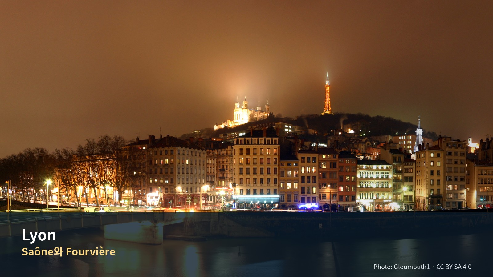

*Saône와 Fourvière — Photo: Gloumouth1, CC BY-SA 4.0; [원문](https://commons.wikimedia.org/wiki/File:Panoramics_Lyon_Sa%C3%B4ne_Fourvi%C3%A8re.jpg). 가이드북용으로 크롭·리사이즈.*

# Commercial Guide Module

> **두 강과 언덕의 도시를 미식·산책·철도로 경험하는 4박**  
> Provence 차량여행을 끝내고 대중교통과 도시생활의 리듬으로 전환하는 장

## Editor’s Verdict — 이 지역에 시간을 쓸 가치와 한계

| 항목 | 평가 |
|---|---|
| 여행 적합도 | ★★★★★ Jason·Julia의 생활형 여행에 최적화 |
| 예산 체감 | 중 |
| 일정 강도 | 보통, Annecy day 높음 |
| 예약 핵심 | TGV·TER·숙소체크인 |
| 우천 전환 | Vieux Lyon·Halles 중심, Annecy 취소 |

> **여행의 역할**: 프로방스의 자동차 여행을 마치고 철도·도보 중심의 도시생활로 전환하는 구간이다. 리옹에서는 박물관을 많이 보는 대신 **도시 지형, 르네상스 구시가지, 프레스킬의 광장, 크루아루스의 비단노동자 동네, 시장과 부숑 음식**을 경험한다. 하루는 안시로 당일치기하여 알프스 호수도시라는 완전히 다른 지역성을 추가한다.

> **여행자 기준**: Jason·Julia는 새로운 도시와 지역을 방문하는 경험을 미술관·박물관보다 우선한다. 따라서 Musée des Beaux-Arts, Musée des Confluences, Institut Lumière 등은 기본 일정이 아니라 비·피로·관심도에 따른 선택 모듈로 둔다. Julia의 수영도 선택 일정이며 숙소 선정조건이 아니다.

## 꼭 경험할 세 장면

1. **푸니쿨라로 올라 걸어서 내려오기:** 지형을 몸으로 이해한다.
2. **공개 traboule 2–3개만 조용히 통과:** 개수보다 구조 이해.
3. **두 강 비교산책:** Saône의 역사적 경관과 Rhône의 현대적 보행축 비교.

## 생략해도 되는 것

| 항목 | 이유 |
|---|---|
| **Day 23 오후 관광** | 아비뇽 반납 + TGV 이동일 |
| **Day 27 오전 관광** | 파리행. 짐이 있다 |
| 제네바 당일치기 | 국경을 넘는다. 안시보다 멀다 |
| **하루 두 도시** | 안시 하나로 충분하다 |

> 비가 오거나 계획이 깨졌을 때 쓰는 자료다.

## 한눈에 보기 — 우선순위·권역·소요시간

| 장소 | 등급 | 이유 |
|---|---|---|
| Fourvière 전망·성당 | **필수** | 도시 지형과 2,000년 역사를 한 번에 이해 |
| Vieux Lyon·traboules | **필수** | 르네상스 상업도시의 공간구조 |
| Presqu’île·Bellecour·Jacobins | **필수** | 리옹의 현재 중심과 강 사이 도시체험 |
| Croix-Rousse 시장·동네 | **우선 추천** | 비단노동자 역사와 생활시장 |
| Halles Paul Bocuse | **우선 추천** | 미식도시를 음식점이 아니라 재료로 이해 |
| Parc de la Tête d’Or | **우선 추천** | 장기여행의 운동·휴식·스케치 완충지 |
| Annecy | **필수에 가까운 우선 추천** | 리옹과 성격이 완전히 다른 알프스 호수도시 |
| Saône·Rhône 강변 | **우선 추천** | 도시의 두 강과 생활동선을 경험 |
| Confluence·Navigône | 선택 | 현대도시·수변재생에 관심 있을 때 |
| Musée des Beaux-Arts | 대체 | 우천 시 2시간, 종합미술관 관심이 있을 때만 |
| Musée des Confluences | 대체 | 비·현대건축·인류학 관심 시 |
| Institut Lumière | 선택 | 영화사 관심이 클 때 |
| Beaujolais 당일치기 | 비추천 | 4박에서 Annecy와 리옹 자체를 약화 |
| 역 주변 야간산책 | 비추천 | 여행가치 없이 피로·체감불안만 증가 |

## 두 강의 도시, 르네상스 골목, 비단언덕과 알프스 호수

> **치안에 대한 결론**: 인터넷에서 보이는 “리옹은 프랑스 범죄율 1위 도시”라는 표현은 **프랑스 정부가 발표한 공식 순위가 아니다.** 프랑스 내무부 SSMSI의 2025년 시·구 단위 자료는 14개 주요 범죄·위반 지표를 각각 공개하며, 리옹·파리·마르세유는 구별 자료도 제공한다. 정부는 하나의 ‘도시 위험 총점’을 발표하지 않으므로, 민간사이트가 서로 다른 범주의 건수를 합산한 순위는 포함 범주·인구기준·관광객·통근인구 처리방식에 따라 결과가 달라진다. 리옹 관광청은 리옹권을 안전한 여행지로 안내하면서도 Vieux Lyon과 혼잡한 대중교통의 소매치기를 특히 경고한다. 이번 일정은 강력범죄 공포보다 **관광지 소매치기, Part-Dieu 수하물 관리, 야간 귀가와 숙소 입지**를 현실적으로 관리하도록 설계한다.

# Regional Context & Scheduled Place Dossiers

## 여행 전체에서의 역할

**차 없이 도시에 머무는 첫 구간이다.**

Day 23에 아비뇽에서 렌터카를 반납했다. 이후 20일 — 리옹 4박, 파리 15박 — 은 전부 기차와 도보와 지하철이다. **여행의 성격이 여기서 바뀐다.**

그리고 **프로방스가 끝났다.** Barcelona부터 Avignon까지 23일이 지중해와 남프랑스였다면, 리옹부터는 다르다. 기후도 음식도 건축도 바뀐다.

## 추천 체류 리듬

```text
9/20 Avignon TGV 차량반납 → Lyon Part-Dieu → Ainay·Presqu’île 적응
        ↓
9/21 Fourvière → Vieux Lyon → traboules → Saône·Presqu’île
        ↓
9/22 Croix-Rousse 시장·비단동네 → Halles Paul Bocuse → Parc de la Tête d’Or
        ↓
9/23 Lyon Part-Dieu ↔ Annecy — 구시가지·호숫가·크루즈
        ↓
9/24 아침 생활권 산책 → Part-Dieu → Paris
```

| Day | 날짜 | 요일 | 성격 | 권장 |
|---|---|---|---|---|
| 23 | 9/20 | 일 | 도착일 | 숙소 근처 가볍게 |
| 24 | 9/21 | 월 | 도시 역사축 · 월요일 휴관 주의 | 영업 확인한 숙소권 식당 |
| 25 | 9/22 | 화 | 시장·공원일 | **부숑 한 번** |
| 26 | 9/23 | 수 | 안시 당일치기 | 안시 점심에 무게. 저녁은 가볍게 |
| 27 | 9/24 | 목 | 파리 이동 | — |

**대표 저녁은 Day 25 한 번이 현실적이다.** 화요일 휴무를 확인한 뒤 예약한다.

## 구역별 이해와 숙소 생활권

### 두 강과 반도

론 강과 손 강이 리옹에서 만난다. 두 강 사이의 좁고 긴 땅이 **프레스킬(Presqu'île, 반도)** 이고 도시의 중심이다.

그 양옆으로 언덕이 둘 있다.

| 언덕 | 별칭 | 성격 |
|---|---|---|
| **Fourvière** | 기도하는 언덕 | 로마 도시의 시작 · 대성당 |
| **Croix-Rousse** | 일하는 언덕 | 비단 노동자의 터전 |

**이 대비가 리옹의 전부다.** 종교와 노동, 위와 위, 그리고 그 사이의 상업.

### 도시가 언덕에서 내려왔다

수도교가 망가지자 루그두눔 주민들은 푸르비에르 언덕에서 손 강변으로 내려가야 했다.

**즉 지금의 구시가지는 실패의 결과다.** 물을 끌어올리지 못해 물가로 내려온 것이다. Day 22에 퐁 뒤 가르에서 본 로마 수도 기술이 여기서는 무너졌다.

### 트라불은 지형이 만든 것이다

비외리옹에서는 거리 대부분이 강과 나란히 뻗어 있어, 트라불 없이는 한 거리에서 다른 거리로 가려면 크게 돌아야 한다.

언덕과 강 사이의 좁은 땅에 도시를 욱여넣은 결과, **건물을 관통하는 길**이 생겼다. 지형이 건축을 만들고 건축이 노동을 만들고 노동이 반란을 만들었다.

### 비단이 이 도시를 만들고 부쉈다

1830년대 리옹에는 카뉘가 2만 5천 명에 이르렀다. 첫 반란은 1831년 11월이었고, 유럽 산업혁명기 최초로 기록된 봉기였을 가능성이 높다.

**리옹은 산업혁명 노동사의 출발점 중 하나다.** 크루아루스를 걷는 것이 그 현장을 걷는 것이다.

### 확정 숙소와 운영조건

| 항목 | 내용 |
|---|---|
| 숙소 | **확정(2026-08-14)** — Lagrange Aparthotel Lyon Lumière · 81-85 Cours Albert Thomas, 69003 Lyon · +33 4 81 76 28 00 · €433.82 (시티택스 포함) · booking.com 5882.730.884 · 스튜디오 2인, 간이주방, 조식 불포함 |
| 숙소 예약조건 (2026-08 예약서) | **보증금 €300 카드 (체크인 시, 체크아웃 시 반환)** · 주차 현장 €15/일 — 사전예약 불가 · **취소·변경·노쇼 시 전액 부과** · 도착 예정시간 사전 통지 요망 · 체크인 시 결제카드+사진 신분증 제시 |
| 실제 숙소권 | **Monplaisir (3구 동쪽)** — 아래 1·2순위 권역이 아니다. 메트로 D 의존 동선으로 운영한다 |
| 숙박 형태 | 아파트호텔(주방 포함)로 확정. 야간 프런트·엘리베이터·객실금고·밝은 귀가동선은 체크인 때 확인 {{badge:pending|현장 확인}} |
| 숙박비 | **확정(2026-08-14)** €433.82 (2인 4박). 계획범위 €500–900 아래다 |

> **확정 숙소는 이 권역들 밖이다 (2026-08-14).**
> Lagrange Aparthotel Lyon Lumière 는 **3구 Monplaisir**, Cours Albert Thomas 다.
> 아래 1·2순위는 선정 과정의 기준이었고, 지금은 **다음 세 가지가 실제 운영조건**이다.
>
> - **메트로 D 두 역이 도보권이다** — Sans Souci 약 300m, Monplaisir-Lumière 약 250m.
>   D 선은 Bellecour 와 Vieux Lyon 을 **환승 없이** 잇는다 (OSM 노선 확인, 2026-08-14).
> - **Part-Dieu 는 환승이 필요하다** — D선 Saxe-Gambetta 에서 B선으로 갈아탄다.
>   9/20 도착일과 9/24 출발일은 짐이 크므로 **택시를 먼저 고려한다.**
> - **Institut Lumière 가 도보 600m 안이다** — 영화 탄생지가 숙소 동네다.
>   비·피로로 계획이 무너진 날의 선택 모듈로 가장 가깝다 {{badge:pending|운영시간 확인}}.

### 권역별 성격과 야간 안전

| 권역 | 성격과 장점 | 밤·안전 고려 | Jason·Julia 적합성 | 추천 |
|---|---|---|---|---|
| **Ainay–Ampère** | 조용한 2구 생활권, Bellecour·Perrache 사이, Saône 산책 | 대체로 차분. Perrache 하부통로는 늦은 밤 불필요하게 걷지 않음 | 생활·식당·교통 균형 | **1순위** |
| **Bellecour 남부–Célestins** | 중심관광·식당·광장 접근 최고 | 혼잡·소매치기·주말 소음, 안뜰객실 선호 | 짧은 체류 매우 편리 | **1.5순위** |
| **Brotteaux–Masséna–Foch** | 6구 주거환경, Parc·Part-Dieu 접근 | 비교적 안정적, 역까지 밝은 길 선택 | 조용함·운동 우수 | **2순위** |
| **Part-Dieu 서·북서** | TGV·Halles·교통 편리 | 역 주변 혼잡. 24h 프런트와 큰길 동선 필수 | 당일치기·파리 이동 최적 | **조건부** |
| **Confluence** | 현대적·수변·상대적으로 조용 | 중심관광까지 이동, 늦은 밤 수변 외진 구간 피함 | 아파트호텔·휴식형 | 선택 |
| **Vieux Lyon 내부** | 역사적 분위기 최고 | 관광혼잡·소음·계단·소매치기 | 관광은 좋지만 숙박은 불리 | 후순위 |
| **Gabriel-Péri 바로 주변** | 교통·다문화 음식·야간활기 | 노상혼잡과 체감불안에 대한 현지 우려가 반복됨 | 조용한 장기여행 숙소에는 부적합 | 비추천 |

- 22시 이후 현관 출입방식과 야간 프런트
- 객실금고와 캐리어 보관공간
- 안뜰 또는 고층 조용한 객실
- 엘리베이터와 계단 수
- Metro 역에서 숙소까지 조명이 밝은 5–10분 동선
- 9/25 체크아웃 후 짐 보관 또는 택시 호출 지원

## 도착·출발·지역 내 교통

### 도착 — Avignon TGV에서 Lyon Part-Dieu

Avignon TGV에서 렌터카를 반납한 뒤 Lyon Part-Dieu행 직행 TGV를 탄다.

**확정 열차 (2026-08 발권)** — **TGV INOUI 12176 · 10:22 Avignon TGV → 11:28 Lyon Part-Dieu** (1시간 6분) · 1등석 3호차 307(Jungah)·308(Jeongjae) Duo Côte à Côte · 예약번호 **4YMAGT** · €42/인 (Trip.com).

> **⚠ 반납은 전날이다.** 일요일은 Hertz Avignon TGV 가 10:00 에 열어 TGV 10:22 에 댈 수 없다. 그래서 **9/19(토) 18:15까지 조기 반납**한다(DEC-A08). 주차는 Parking Loueurs P0. 주유 영수증·차량 상태 사진·주차 위치 기록을 남긴다.

### 출발 — Part-Dieu에서 파리로

**리옹 파르디외 역에서 파리행 TGV를 탄다.**

| 항목 | 내용 |
|---|---|
| 역 | Gare de Lyon-Part-Dieu |
| 열차 | **확정 (두 사람) — TGV INOUI 6618 · 9/24 목 13:04 Part-Dieu → 15:00 Paris Gare de Lyon** (1시간 56분) |
| 좌석 | 1등석 · 13호차(위층) 356(Jeongjae)·357(Jungah) · Duo Côte à Côte · 예약번호 **X6CVW5** 공통 · €64/인 (Trip.com 발권) |
| ⚠ | 리옹에는 **Part-Dieu**와 **Perrache** 두 주요 역이 있다. 승차역 확인 |
| 짐 | 4박치 + 43일 여행 누적. 1인 최대 캐리어 2개(90×70×50cm) + 손가방 1개, **이름표 부착 의무** (SNCF). 출발 2분 전 탑승 마감 |
| 환불·변경 | D-7까지 무료 환불·교환, D-6부터 출발 전까지 수수료 €19 (발권서 기준) |
| 완충 | 60분 이상 |

> **알 폴 보퀴즈가 파르디외 역에서 도보 5분이다.**
> 파르디외 역에서 도보 5분 거리다.
> Day 5 출발 전에 시간이 남으면 여기서 파리행 기차 안에서 먹을 것을 산다.

### 리옹 시내 — TCL

리옹 대중교통 이름이 **TCL**이다. 지하철·트램·버스·푸니쿨라를 포함한다.

| 수단 | 용도 |
|---|---|
| **지하철** | 프레스킬↔파르디외↔크루아루스 |
| **푸니쿨라** | 비외리옹 → 푸르비에르 언덕 |
| **트램** | 파르디외·공원 방면 |
| 도보 | 프레스킬·비외리옹 내부 |

> **푸니쿨라는 TCL 유효권에 포함된다.** Day 24에 푸르비에르를 오를 때 쓴다. 2026 요금은 출발 전 재확인한다.

> **회수권·1일권**을 확인한다 {{badge:pending|요금 체계 확인 필요}}. 4박 동안 지하철을 자주 탄다.

### 역이 둘이다 — Part-Dieu와 Perrache

| 역 | 성격 |
|---|---|
| **Part-Dieu** | 주요 고속철 역. 알 폴 보퀴즈 인접 |
| **Perrache** | 프레스킬 남단. 일부 노선 |

**Day 27 파리행은 파르디외 출발이 기본이다.** 표의 출발역을 확인할 것.

### 문전 이동 실행표

| 구간 | 표면 이동 | 현실적 문전시간 | 권장방식 |
|---|---:|---:|---|
| Avignon TGV→Lyon Part-Dieu | 직행 최단 약 1시간 | 반납·대기 포함 2.5–3.5시간 | TGV 직행 |
| Part-Dieu→Ainay 숙소 | 차 15–25분 | 택시대기 포함 25–40분 | 수하물 있는 날 택시 |
| Ainay→Vieux Lyon | Metro D 또는 도보 | 20–35분 | 낮에는 대중교통·도보 |
| Vieux Lyon→Fourvière | 푸니쿨라 수분 | 대기 포함 15–25분 | F2 기본 |
| 숙소→Croix-Rousse | 메트로 A+C | 30–45분 | 출근혼잡 피함 |
| 숙소→Part-Dieu | 메트로·트램 20–35분 | 짐 있으면 35–50분 | 출발일 택시 |
| Lyon→Annecy | 열차 약 1시간 50분–2시간 20분 | 숙소 문전 약 2시간 30분 | 직행 TER 우선 |

### TCL 이용 판단

- Zone 1+2 1회권 약 €2.10 — 계획가(2026-08 조사)
- 24시간권 약 €6.90 — 계획가(2026-08 조사)
- 컨택트리스 은행카드로 여러 번 탑승하면 일일 상한이 적용되는 방식이 편리할 수 있다.
- Fourvière 푸니쿨라는 Zone 1 유효권·패스에 포함되는 방식이 기본이다.
- 하루 3회 이상 타는 날은 24시간권 또는 컨택트리스 상한이 편하다.

### Annecy 왕복

| 항목 | 내용 |
|---|---|
| 수단 | 기차 {{badge:pending|소요·편수·직통 여부 확인 필요}} |
| 출발 | 이른 시각. 당일치기다 |
| 복귀 | 저녁. **마지막 열차 시각을 반드시 확인** |
| 대안 | 버스 또는 투어 {{badge:pending|확인}} |

> **당일치기의 위험은 돌아오는 열차다.** 안시에서 저녁을 먹고 늦게 출발하려다 막차를 놓치면 대안이 없다. **복귀 시각을 먼저 정하고 일정을 역산한다.**

## 핵심 셀프가이드

일자별로 방문지를 싣는다. 각 항목은 무엇인지, 무엇이 핵심인지,
현장에서 어떻게 볼 것인지로 나뉜다. 운영시간과 요금은 표로
분리했고 변동 항목에는 재확인 표시를 달았다.

### 리옹을 읽는 한 문장

19세기 이래 크루아루스는 현지인들 사이에서 **'일하는 언덕(la colline qui travaille)'** 으로 불려 왔다. **푸르비에르, '기도하는 언덕(la colline qui prie)'** 과 대비되는 이름이다.

**두 언덕 사이에 두 강과 반도가 있다.** 이 구조를 알면 리옹이 하루에 이해된다.

---

### Fourvière {{grade:essential|필수}}

> **요금** {{fact:fourviere-lugdunum.price_adult}} · **운영** {{fact:fourviere-lugdunum.hours}} · **휴관** {{fact:fourviere-lugdunum.closed}}
> **예약** {{fact:fourviere-lugdunum.booking}} · **소요** {{fact:fourviere-lugdunum.duration}} · **가는 법** {{fact:fourviere-lugdunum.getting_there}}

#### 무엇인가 — 로마 도시가 시작된 자리

리옹의 로마 시대 이름은 **루그두눔(Lugdunum)** 이고, 갈리아 로마의 수도였다.

로마 제국이 무너지면서 초기 리옹 주민들은 수도교가 망가지기 시작하자 푸르비에르 언덕에서 손 강변으로 내려가야 했다.

**즉 이 언덕은 도시가 시작된 곳이자 버려진 곳이다.** 아래 구시가지는 그 결과로 생겼다.

**리옹을 보기 전에 도시를 읽는 곳이다.**

> **먼저 올라가라**
> Day 24의 동선이 **위에서 아래로** 설계돼 있다. 푸르비에르 → 구시가지 → 강. 이것은 관광 편의가 아니라 **도시가 실제로 내려온 순서**다.
> 언덕에서 두 강과 반도, 그리고 맞은편 크루아루스 언덕을 한눈에 확인하고 내려가면 이후 사흘이 지도 위에서 정리된다.

#### 볼 것

- **바실리카** — 언덕 꼭대기의 대성당
- **로마 극장** — 고대 원형극장 유적
- **갈로로마 문명 박물관** — 전위적 건축과 엄선된 전시로 방문자를 놀라게 한다
- **전망대(에스플러네이드)** — 여기서 보는 조망이 압도적이다

⚠ 바실리카의 건축 연대·건축가, 푸니쿨라 운행, 박물관 운영은 조사가 부족하다 {{badge:pending|조사 필요}}.

바실리카는 1870년 보불전쟁 때 "프로이센군이 리옹을 침공하지 않으면 성모에게 성당을
바치겠다"는 서원의 결과물로, 1872–96년에 세워졌다. 흰 대리석의 비잔틴·로마네스크 절충
양식이 화려하다 못해 과하다는 평과 함께 '거꾸로 선 코끼리'라는 별명을 얻었지만, **모자이크로
덮인 내부는 취향 논쟁과 무관하게 압도적이다.** 매년 12월 8일 빛 축제(Fête des Lumières)의
기원이 이 언덕의 성모상 봉헌 행사라는 것도 리옹과 이 언덕의 관계를 말해 준다.

로마 극장 두 곳(대극장·오데옹)은 무료로 개방된 야외 유적이라 바실리카와 묶어 한 동선이
된다 — 기원전 15년경의 대극장은 여전히 여름 공연장으로 쓰인다.

---

### Vieux Lyon · 트라불 {{grade:essential|필수}}

> **요금** {{fact:vieux-lyon-traboules.price_adult}} · **운영** {{fact:vieux-lyon-traboules.hours}} · **휴관** {{fact:vieux-lyon-traboules.closed}}
> **예약** {{fact:vieux-lyon-traboules.booking}} · **소요** {{fact:vieux-lyon-traboules.duration}} · **가는 법** {{fact:vieux-lyon-traboules.getting_there}}

#### 무엇인가 — 골목이 아니라 건물 안을 지나는 길

**트라불(traboule)** 은 건물과 건물을 관통해 두 거리를 잇는 통로다.

'트라불'이라는 말은 라틴어 trans ambulare, 즉 '가로질러 걷다'에서 왔다.

#### 왜 생겼는가 — 두 번의 이유

**첫 번째, 물 때문에.**

최초의 트라불은 4세기에 지어졌다고 전해진다. 물이 부족하고 수도교가 망가지자 루그두눔 주민들은 푸르비에르 언덕 기슭의 손 강변 아래쪽 도시에 자리 잡아야 했다. 트라불은 주민들이 집에서 강까지 빠르게 오갈 수 있도록 만들어졌다.

비외리옹에서는 거리 대부분이 강과 나란히 뻗어 있어, 트라불 없이는 한 거리에서 다른 거리로 가려면 크게 돌아야 한다.

**두 번째, 비단 때문에.**

이후 트라불은 19세기 비단 교역의 심장부였던 크루아루스의 비단 노동자 '카뉘(canuts)'들이 쓰게 됐다. 언덕 위 작업장에서 언덕 아래 직물 상인에게 무거운 짐을 나르는 데, 그리고 노동자 집회에도 쓰였다.

덮인 통로가 빠른 길이었고, 귀한 물건을 비바람에서 지킬 수 있다는 이점도 있었다.

**세 번째, 전쟁 때.**

2차 세계대전 중 프랑스 레지스탕스 대원들이 눈에 띄지 않고 도시를 이동하는 데 이 숨겨진 통로를 썼다.

#### 관람 요령

> **몇 개 있는지 알고 가라**
> 리옹 전역에 약 400개의 트라불이 있고, 그중 대략 절반이 비외리옹에 있다. 나머지 대부분은 크루아루스와 프레스킬에 있다. 모든 트라불이 개방된 것은 아니다.

> **⚠ 대부분이 사유지다**
> 지금은 관광 명소가 됐고 몇 곳은 무료 개방돼 있다. 그러나 대부분은 사유지이며 실제 아파트 출입구다.
> **조용히 통과한다.** 주민이 산다.

> **긴 것과 인상적인 것**
> 가장 긴 트라불은 54 Rue Saint-Jean과 27 Rue du Bœuf 사이를 지난다.
> 27 Rue St Jean과 6 Rue des Trois Maries를 잇는 것은 혼자서도 찾아볼 만하다.

> **입구를 알아보는 법**
> 겉으로는 그냥 건물 문이다. 관광안내 표지가 붙은 곳도 있지만 없는 곳이 더 많다. **문을 밀어 보는 용기가 필요하고, 동시에 예의도 필요하다.**

#### 실용

| 항목 | 값 |
|---|---|
| 요금 | 대부분 무료 |
| 가이드 투어 | 비외리옹 트라불 예약 +33 (0)4 72 77 69 69 {{badge:pending|현행 확인}} |
| 지도 | 리옹 지도를 이용해 전부 찾아볼 수 있다 |
| 체류 | 비외리옹 산책 포함 2–3시간 |

---

### Croix-Rousse {{grade:essential|필수}}

#### 무엇인가 — 천장이 높은 이유

언덕을 따라 줄지어 선 건물들이 놀라운 광경을 만든다. 19세기 리옹 비단 노동자들의 터전이었고, 언덕에는 직조기를 부르던 지역 별칭 '비스탕클라크(Bistanclaques)'의 소리가 울렸다.

**핵심은 자카르 직조기다.**

직조공 조제프 마리 자카르가 1805년에 발명한 자카르 직조기가 산업을 바꿨다. 실을 꿴 바늘과 천공 카드로 정교한 무늬를 만들었고, 카뉘 한 사람이 손으로 조작할 수 있었다.

약 13피트 높이에 이르는 거대한 자카르 직조기를 들이려고 천장이 높은 집들이 지어졌다.

> **건물을 올려다보라**
> 크루아루스의 층고가 유별나게 높은 것은 미학이 아니라 **기계 높이** 때문이다. 4m짜리 직조기가 들어가야 했다.
> 지금 이 집들은 리옹의 세련된 보보(부르주아-보헤미안) 동네가 됐다. **같은 방인데 용도가 정반대로 바뀌었다.**

#### 카뉘의 반란

비단 노동자들은 카뉘라 불렸고 그들의 일이 리옹의 얼굴을 영영 바꿨다. (카뉘는 실패를 뜻하는 canette에서 왔을 수 있다.)

1830년대 리옹에는 카뉘가 2만 5천 명에 이르렀다. 새 작업장이 늘면서 상인들이 임금과 처우를 깎아 장인 직조공을 착취하기 시작했다. 경쟁 심화·신기술·불안정한 경제·상인의 착취가 겹치자 노동자들은 봉기하기로 했다.

트라불은 카뉘 반란에서 역할을 했고, 첫 반란은 1831년 11월에 터졌다. 착취당한 리옹 비단 노동자들의 이 폭동은 유럽 산업혁명기 최초로 기록된 봉기였을 가능성이 높다.

1834년에는 참혹한 학살이 있었다. 카뉘들은 작업장을 닫고 도시를 행진하며 무기고에서 무기를 모아, 고정 임금이 합의될 때까지 산업을 인질로 잡으려 했다. 그러나 봉기는 폭력적으로 진압됐다. 1만 명의 카뉘가 파리에서 재판을 받고 추방됐다고 전한다.

> ⚠ **카뉘 인원 수에 자료 간 편차가 크다.** 2만 5천(1830년대) / 3만 / 9만이라는 서술이 각각 존재한다. 본문은 가장 구체적인 출처의 **1830년대 2만 5천 명**을 채택했다. {{badge:pending|확인 권장}}

#### Cour des Voraces

가장 유명한 것은 크루아루스 지구의 '보라스의 안뜰(Cour des Voraces)'이다. 카뉘 반란의 상징 중 하나이고, 리옹에서 가장 오래된 철근콘크리트 계단실이기도 하다.

'보라스의 안뜰' 또는 '공화국의 집'이라 불리며, 9 Place Colbert에서 29 rue Imbert-Colomès와 14 bis montée St Sébastien으로 이어진다. 이름은 1848년에 매우 활발했던 혁명적 카뉘 집단에서 왔다. 6층 높이의 기념비적인 외부 계단이 있다.

1831년 대반란 때 카뉘들의, 그리고 2차 대전 때 리옹 레지스탕스의 은밀한 왕래를 감췄다.

> **여기가 이 언덕의 핵심이다.** 6층 외부 계단을 올려다보는 것이 크루아루스 방문의 절정이다.

#### 시장

크루아루스 시장은 리옹에서 가장 붐비는 시장 중 하나로, 리옹 유네스코 세계유산 구역의 일부인 크루아루스 대로를 따라 늘어선다.

아마도 리옹이 가장 아끼는 시장이며, 화요일부터 일요일 오전까지 크루아루스 지하철역에서 시작한다.

**9월 22일은 화요일이다. 정상 운영이다.**

⚠ 운영 시간에 자료 간 편차가 있다 {{badge:pending|공식 확인 필요}}.

#### 볼 것

| 시설 | 내용 |
|---|---|
| **La Maison des Canuts** | 전성기 모습으로 보존된 작업장 박물관 |
| Soierie Vivante | 시립 직조·장식끈 작업장 |
| L'Atelier de Soierie | 비단 공방 |
| Montée de la Grande Côte | 언덕을 오르내리는 길 |

---

### Halles de Lyon Paul Bocuse {{grade:essential|필수}}

> 📍 {{fact:halles-de-lyon-paul-bocuse.address}} · 🚶 {{fact:halles-de-lyon-paul-bocuse.getting_there}} · 🕐 {{fact:halles-de-lyon-paul-bocuse.hours}} · 휴무 {{fact:halles-de-lyon-paul-bocuse.closed}} · {{fact:halles-de-lyon-paul-bocuse.booking}} · {{fact:halles-de-lyon-paul-bocuse.price_range}}

#### 무엇인가

1859년 리옹은 프레스킬 중심가 코르들리에 광장에 커다란 금속 구조물로 첫 실내 식료품 시장을 열었다. 100년 뒤 이 도시는 미식에 대한 헌신을 상징하는 새 실내 시장을 짓기로 했다. 1971년 파르디외 지구에, 리옹 중앙역 가까이에 알이 문을 열었다. 2004년의 대대적 개보수로 지금은 3개 층 13,000㎡에 식품 상인들이 들어서 있다.

마지막 방점은 명장 폴 보퀴즈가 시장 이름에 자기 이름을 얹으며 명성을 굳힌 것이다.

전통 상인들과 '프랑스 최고 장인(MOF)' 칭호 보유자들의 진열이 이어진다.

#### 관람 요령

> **관광지가 아니라 조달처다**
> 알은 조리된 음식과 카운터에서 먹는 곳이고, 노천시장은 농산물·치즈·일상 식재료에 더 낫다.
> **크루아루스에서 사고, 알에서 먹는다.** 같은 날 배치한 이유가 이 역할 분담이다.

> **앉을 자리가 적다**
> 일부 방문자가 시장 안 좌석이 제한적이라고 지적했다. 여기서 사서 다른 곳에서 먹는 편이 나을 수 있다.
> **Parc de la Tête d'Or가 그 다른 곳이다.** Day 25 동선이 이미 그렇게 잡혀 있다.

> **쿠생 드 리옹**
> 작은 청록색 사탕 '쿠생(쿠션)'은 초콜릿·아몬드 페이스트·퀴라소를 섞은 것이다. 1643년부터 9월 8일에 기려 온 '에슈뱅 축제'를 기념해 만들었다. 역병의 위협을 받던 도시를 성모께 맡긴 리옹 사람들의 서약에서 비롯됐다.
> **9월에 가는 여행에서 이 유래를 알고 사면 다르다.**

#### ⚠ 운영 시간 — 자료가 심하게 엇갈린다

| 출처 | 내용 |
|---|---|
| A | 화–토 7시 개장, 식품 상인 19시 마감, 바·식당 22:30까지. 일요일은 7시 개장 상인 13시 마감, 식당 16:30까지. **월요일은 굴만 판매** |
| B | 화요일–일요일. **월요일 휴무** |
| C | 연중 화·수·목·금·주말 7시–22:30 |

**Day 25(화요일)은 어느 출처로도 정상 운영이다.** 다만 **정확한 마감 시각은 출발 전 공식 확인이 필요하다** {{badge:pending|확인 필수}}.

월요일은 피하라. 프랑스에서 월요일은 때때로 일요일과 비슷하다. 화·수·일요일 오후도 일부 폐점 때문에 피하는 편이 좋다. 평일 오전이 가장 좋다.

| 항목 | 값 |
|---|---|
| 위치 | 102 cours Lafayette · 파르디외 역에서 도보 5분 |
| 교통 | 가장 가까운 지하철역은 Place Guichard · 트램 T1 Mairie du 3ème |
| 체류 | 60–90분 |

---

### Parc de la Tête d'Or {{grade:priority|우선추천}}

> **요금** {{fact:parc-de-la-tete-d-or.price_adult}} · **운영** {{fact:parc-de-la-tete-d-or.hours}} · **휴관** {{fact:parc-de-la-tete-d-or.closed}}
> **예약** {{fact:parc-de-la-tete-d-or.booking}} · **소요** {{fact:parc-de-la-tete-d-or.duration}} · **가는 법** {{fact:parc-de-la-tete-d-or.getting_there}}

**19세기에 조성된 117ha 도시공원으로, 파리의 불로뉴 숲과 같은 세대의 작품이다.** 이름은
공원 땅에 황금 예수 두상이 묻혀 있다는 전설에서 왔다. 호수·장미원·온실·무료 동물원이
한 공원 안에 있고, 리옹 사람들의 주말 사용법(조깅·보트·잔디 피크닉)을 관찰하는 것이
관광 항목보다 큰 볼거리다. 우리 일정에서는 9/22 화요일 오후, Halles 점심 뒤의 소화 산책 격이라 장미원과 호수 한 바퀴면 충분하다. 정문(황금빛 철문)이 그 자체로 기념사진 지점이다. Rhône 강변 자전거길과 이어져 있어 숙소에서 접근도 강변 산책을
겸한다.


**43일 중 26일차다.** 이 시점에 공원이 일정에 들어 있는 것은 관광이 아니라 **회복 설계**다.

> **알에서 산 것을 여기서 먹는다.** 좌석 부족 문제가 이렇게 풀린다.

**꼭 해볼 것**
- 호수 주변 평지산책
- Jason은 20–40분 스케치 또는 러닝
- 벤치에서 30분 이상 아무 일정 없이 쉬기

**적정 체류**: 1.5–2시간

정원목록을 채우기보다 호수와 큰 산책로를 이용한다. Jason은 5–8km 러닝, Julia는 산책·카페·식물원 선택으로 분리했다가 합류할 수 있다.

⚠ 면적·개장 시간·러닝 코스 상세는 조사가 부족하다 {{badge:pending|조사 필요}}.

---

### Annecy 구시가지 {{grade:essential|필수}}

> **요금** {{fact:annecy.price_adult}} · **운영** {{fact:annecy.hours}} · **휴관** {{fact:annecy.closed}}
> **예약** {{fact:annecy.booking}} · **소요** {{fact:annecy.duration}} · **가는 법** {{fact:annecy.getting_there}}

#### 무엇인가 — 알프스의 베네치아

티우 강이 먹이는 그림 같은 운하를 따라 걷는다. 색색의 건물과 매력적인 다리, 화분이 안시에 '알프스의 베네치아'라는 별명을 준다.

#### Palais de l'Île

뱃머리처럼 생긴 탑 모양 파사드로 티우 강을 두 갈래 운하로 가른다. 지금은 지역 역사 박물관이고, 12세기에 지어졌으며 한때 감옥·조폐소·법원·영주 거처였다.

삼각형 벽이 티우 강으로 튀어나온 12세기 요새다. 눈에 보이는 것은 그 부분이고, 건물은 뒤로 더 뻗어 있다. 감옥이자 조폐소였고(동시는 아니다), 법원과 행정 건물이기도 했다.

프랑스에서 가장 많이 사진 찍히는 장소 중 하나다.

> **강 한가운데 서 있는 건물이라는 것**
> 섬이 아니라 **강물이 이 건물을 피해 갈라진다.** 그래서 사진의 구도가 늘 같다 — 물이 양쪽으로 흐르고 건물이 뱃머리처럼 서 있다.

{{badge:pending|운영시간·휴무일·요금 확인 필요 — 화요일 휴관 서술이 있으나 미검증}}

#### Château d'Annecy

제네바 백작과 느무르 공작의 거처였던 중세 성이다. 지금은 박물관으로 지역 미술·역사·자연사 전시를 하고, 구시가지와 호수를 내려다보는 파노라마를 제공한다.

성까지 오르는 길이 가파를 수 있으니 편한 신발을 신어라. 위에서 보는 조망이 그 수고에 값한다.

성 테라스에서 보는 구시가지 지붕 너머 조망이 진짜 볼거리다. 알프스 미술과 자연사 전시는 관심이 있으면 45분, 차라리 먹는 데 시간을 쓰고 싶으면 건너뛰어도 된다.

#### 호수

호수 유람선부터 산악 활동까지 다양하다.


> **구시가지는 작다**
> 비에유 빌은 매우 작아서 끝에서 끝까지 10분이고, 호숫가 산책로는 유럽 정원(Jardins de l'Europe)에서 바로 시작된다.
> **당일치기로 충분한 규모다.** 대신 호수에 시간을 쓴다.

#### 먹을 것

안시의 대표 요리는 **농어 필레(filets de perche)** 로 버터 소스를 곁들인다.

사부아 지방 음식이 리옹과 다르다 — 르블로숑 치즈, 타르티플레트 등 {{badge:pending|교차 확인 권장}}.

#### 실용

| 항목 | 값 |
|---|---|
| 리옹에서 | 기차 또는 차 {{badge:pending|소요·편수 확인}} |
| 시장 | **목요일 구시가 시장 없음** |
| 체류 | 종일 |
| 신발 | 성까지 오르막 |

---

### Bellecour {{grade:optional|선택}}

**유럽에서 가장 넓은 순수 보행 광장 중 하나이고, 리옹 지형의 원점이다.** 약 6ha 의 붉은 흙
광장 한가운데 루이 14세 기마상이 서 있다 — 원본은 혁명 때 녹여져 대포가 됐고 지금 것은
1825년 재주조본이다. 광장 서쪽 너머로 Fourvière 언덕과 성당이 정면으로 보여서, **도착일에
여기 서면 도시의 축(Saône–Presqu'île–Rhône)이 몸에 들어온다.**

리옹 사람들에게는 만남의 장소이자 거리 시위와 축제가 시작되는 자리다. 관광 항목이라기보다
**도시의 영점**이라, 이 여행에서는 목적지가 아니라 매일 지나는 기준점으로 쓴다. 광장 남서쪽 모퉁이에는 생텍쥐페리(리옹 출신)와 어린 왕자의 동상이 있다.

- **체류:** 15–30분. 도착일(9/20) 적응 산책의 중심이다
- **요금:** 무료 (개방 광장)
- **가장 좋은 시간:** 해질 무렵 — 광장 너머 Fourvière 에 조명이 들어온다
- **주의:** 그늘이 없다. 한낮에는 광장을 가로지르기보다 가장자리 아케이드를 걷는다
- **메트로:** A·D 선 Bellecour 역 — 숙소(D선 Sans Souci)에서 환승 없이 온다

## 음식·시장·카페·생활체험

**"내장과 크림과 돼지."**

프로방스가 올리브유·채소·허브였다면, 리옹은 **버터·크림·돼지고기·내장**이다. 23일간의 남프랑스 식단과 정반대다.

이 변화가 몸에 부담이 될 수 있다. **43일 중 24일차**라는 것을 감안해 강도를 조절해야 한다.

### 부숑(bouchon)이란 무엇인가

리옹 전통 식당의 형식이다. 작고, 붐비고, 메뉴가 고정돼 있고, 양이 많다.

> **⚠ 관광용 부숑이 있다**
> 리옹 관광 상권에 부숑을 표방한 식당이 많다. 공식 인증 제도가 있다고 알려져 있다 {{badge:pending|명칭·인증 기준 확인 필요}}. 예약과 사전 조사가 필요하다.

### 먹어야 할 것

| 이름 | 정체 | 난이도 |
|---|---|---|
| **Quenelle de brochet** | 강꼬치고기 반죽을 삶아 소스에 낸 것 | 낮음 · **입문용** |
| **Saucisson de Lyon** | 리옹식 소시지. 브리오슈에 싸기도 | 낮음 |
| **Salade lyonnaise** | 상추·베이컨·수란·크루통 | 낮음 |
| **Gratin dauphinois** | 감자 크림 그라탱 | 낮음 |
| **Cervelle de canut** | '카뉘의 뇌' — 실제로는 허브 프로마주 블랑 | 낮음 · **이름만 무섭다** |
| **Andouillette** | 돼지 내장 소시지 | **높음** |
| **Tablier de sapeur** | 소 위(양)를 튀긴 것 | **높음** |
| **Praline rose · tarte aux pralines** | 분홍 프랄린 타르트 | 디저트 |
| **Coussin de Lyon** | 초콜릿·아몬드 페이스트·퀴라소 | 선물 |

> **cervelle de canut의 이름**
> 직역하면 '비단공의 뇌'다. 카뉘를 멸시하던 표현에서 왔다는 설이 있다 {{badge:pending|확인 권장}}. 실제로는 허브를 섞은 부드러운 치즈이고 순하다.

> **andouillette과 tablier de sapeur는 각오가 필요하다**
> 둘 다 내장 요리이고 향이 강하다. **모험을 원하면 하나만, 2인이 나눠서.** 43일 여행 중반에 위장을 걸 이유는 없다.

### 저녁식당

> 가격은 **계획가(2026-08 조사)** — 메뉴·구성과 요금은 현장에서 달라질 수 있다. 확정가는 방문 당일 확인한다.

| 식당 | 성격 | 추천메뉴 | 계획가격 | 예약 |
|---|---|---|---:|---|
| **Café Comptoir Abel** | Ainay 인근 역사적 전통식당 | quenelle, poulet aux morilles, cervelle de canut | 메인 €20–30대 | 권장 |
| **Daniel et Denise Part-Dieu** | Joseph Viola의 정통 bouchon | pâté en croûte, quenelle Nantua, praline 디저트 | 점심 €21, 계절메뉴 약 €41 — 계획가(2026-08 조사) | **권장** |
| **Daniel et Denise Croix-Rousse** | 시장·언덕 일정과 연결 | 전통 리옹 메뉴 | 메뉴 약 €33, 시식메뉴 약 €41 — 계획가(2026-08 조사) | 권장 |
| **Halles Paul Bocuse 점포** | 시장형 점심 | Giraudet quenelle, Sibilia charcuterie, Mère Richard 치즈 | 2인 €35–70 | 불필요·혼잡 대비 — 계획가(2026-08 조사) |
| **L’Artichaut** | Hôtel de l’Abbaye 내 현대 비스트로 | 제철 프랑스요리 | 공식메뉴 재확인 | 숙박 시 권장 |

#### 식당 카드 — Café Comptoir Abel {{badge:p0|9/21 확정 저녁}}

> 📍 {{fact:cafe-comptoir-abel.address}} · 🚶 {{fact:cafe-comptoir-abel.getting_there}} · 🕐 {{fact:cafe-comptoir-abel.hours}} · 휴무 {{fact:cafe-comptoir-abel.closed}} · {{fact:cafe-comptoir-abel.booking}} · {{fact:cafe-comptoir-abel.price_range}}

| 필드 | 내용 |
|---|---|
| 역할 | 특별저녁 (Day 24 · 9/21 월 19:30) |
| 가격대 | €€ — 메인 €20–30대, 계획가(2026-08 조사) |
| 대표메뉴 | quenelle de brochet, poulet aux morilles, cervelle de canut |
| 분위기 | 1726년부터의 건물, 리옹에서 가장 오래된 축의 비스트로 — 나무 카운터·옛 벽화 |
| 예약난이도 | 중 — 전화 예약 권장 (+33 4 78 37 46 18) |
| 추천시간 | 저녁 첫 회전 19:30 |
| 숙소·동선 | Ainay 권역 — 메트로 D Bellecour 하차 후 도보. 숙소(Sans Souci)에서 환승 없이 접근 |
| 휴무·재확인 | **매일 영업 (maisonabel.fr · 2026-08-15 확인)** — 9/21(월) 정상. 취소정책만 예약 시 확인 |
| 대체 후보 | 숙소권 간단식 또는 Bellecour 권역 브라세리 |

#### 식당 카드 — Daniel et Denise Créqui {{badge:p0|9/22 확정 저녁}}

> 📍 {{fact:daniel-et-denise-crequi.address}} · 🚶 {{fact:daniel-et-denise-crequi.getting_there}} · 🕐 {{fact:daniel-et-denise-crequi.hours}} · 휴무 {{fact:daniel-et-denise-crequi.closed}} · {{fact:daniel-et-denise-crequi.booking}} · {{fact:daniel-et-denise-crequi.price_range}}

| 필드 | 내용 |
|---|---|
| 역할 | 특별저녁 (Day 25 · 9/22 화 19:30) — 이 체류의 부숑 대표 경험 |
| 가격대 | €€–€€€ — 점심 €21 · 계절메뉴 약 €41, 계획가(2026-08 조사) |
| 대표메뉴 | pâté en croûte(세계 챔피언 타이틀), quenelle de brochet sauce Nantua, tarte praline |
| 분위기 | MOF 셰프 Joseph Viola 의 정통 부숑 — 체크 테이블보, 좁고 활기찬 홀 |
| 예약난이도 | 중상 — 온라인·전화 (+33 4 78 60 66 53), 1주 전 권장 |
| 추천시간 | 저녁 첫 회전 19:00–19:30 |
| 숙소·동선 | 3구 Créqui 지점 기준 — **숙소(Cours Albert Thomas)에서 도보·버스권**, 시내 지점보다 가깝다 |
| 휴무·재확인 | **월–금 영업 · 토일 휴무 (danieletdenise.fr · 2026-08-15 확인)** — 9/22(화) 정상 |
| 대체 후보 | Daniel et Denise Croix-Rousse 지점 또는 Halles 내 식당 |

3. **Halles에서 작은 시식점심:** 과식하지 않는다.

5. **bouchon 한 번만 제대로:** 나머지 저녁은 가벼운 비스트로·숙소식.

### 시장 전략

> 가격은 **계획가(2026-08 조사)** — 메뉴·구성과 요금은 현장에서 달라질 수 있다. 확정가는 방문 당일 확인한다.

| 시장 | 요일 | 역할 |
|---|---|---|
| **Croix-Rousse** | 화–일 오전 | **사는 곳.** 농산물·치즈 |
| **Halles Paul Bocuse** | 화–일 | **먹는 곳.** 조리된 것·카운터 |
| Saint-Antoine | 화–일 오전, 손 강변 | 리옹 최대 노천시장 |

시장은 리옹식 피크닉을 꾸리는 가장 좋고 싼 방법이다 — 빵·치즈·소시송·과일로 1인당 €5–12 — 계획가(2026-08 조사).

토요일 오전이 도시 전역에서 최고의 시장일이고, 8시 30분에서 11시 사이에 가는 것이 좋다.

> **다만 이 일정에 토요일이 없다.** Day 25 화요일이 기본 시장일이다.

### 숙소에서 살 것

- baguette 또는 pain de campagne
- jambon cru·rosette de Lyon 소량
- Saint-Marcellin 또는 지역 chèvre
- 토마토·샐러드·포도·배·무화과
- 요거트·물·견과류
- Annecy 열차용 샌드위치 재료

### 9월 제철과 사부아 음식

프로방스와 다르다. 알프스 문턱이라 **버섯·치즈·사과**가 들어온다 {{badge:pending|교차 확인 권장}}.

사부아 지방이다. 안시의 대표 요리는 버터 소스를 곁들인 농어 필레(filets de perche)다.

호수 생선과 산악 치즈가 축이다. **리옹과 하루 만에 다른 음식권으로 넘어간다.**

## 당일치기·우천·피로 대안

| 상황 | 기본 대체안 |
|---|---|
| 9/21 비 | Fourvière는 푸니쿨라 왕복, Vieux Lyon 축소, 월요일 개관 실내시설 1곳만 |
| 9/22 비 | **Halles Paul Bocuse 체류 연장**(실내) — Beaux-Arts 는 {{fact:musee-des-beaux-arts-lyon.closed}} 이라 이 날 불가. Croix-Rousse 시장은 노천이라 우천 대안이 못 된다. 2순위는 실내 시설인 **Musée des Confluences** {{badge:unverified|운영·요금 S2 조사}} |
| Annecy 비 | Vieille Ville·Palais de l’Île·긴 점심, 크루즈 운항 시만 탑승 |
| Annecy 철도장애 | Lyon Confluence·Navigône·Parc 생활일 |
| 강한 피로 | Croix-Rousse와 Halles만 진행, Parc 삭제 |
| 소매치기·분실 | 즉시 카드 정지, 17 신고, 가까운 경찰서에서 신고서 작성 |
| 야간 체감불안 | 큰길·메트로 고집하지 않고 택시로 숙소 복귀 |

### 배제한 대안 루트

| 순위 | 대안 | 빼야 할 것 | 추가 | 난이도 |
|---:|---|---|---|---|
| 1 | **Musée des Confluences** | Day 25 공원 | 2h | 낮음 |
| 2 | **Musée des Beaux-Arts** | Day 24 오후 | 2h | 낮음 |
| 3 | **Musée des Tissus** | Day 25 크루아루스 대체 | 1.5h | **비엔날레 예외 개관 기간 안** |
| 4 | **Pérouges** | Day 26 안시 대체 | 반나절 | 중간 |
| 5 | Vienne | Day 26 대체 | 반나절 | 중간 |
| 6 | Beaujolais 와인 | 하루 | 하루 | 높음 (운전) |

## Musée des Confluences {{badge:rest|1순위}}
**왜 1순위인가** — 이 구간이 **로마·르네상스·19세기 산업**으로 구성돼 있는데 **현대가 빠져 있다.** 콩플뤼앙스가 그 자리를 채운다. 건물 자체가 볼거리로 알려져 있다.

**넣는 법** — Day 25 오후. 공원 대신. 다만 **회복일의 성격을 잃는다.**

{{badge:pending|운영·요금·소요·건축가 확인 필요}}

## Musée des Beaux-Arts

프레스킬의 미술관이다. 프랑스에서 손꼽히는 규모로 알려져 있다 {{badge:pending|확인 권장}}.

**왜 뺐나** — 이 여행에는 파리 15박이 남아 있다. **미술관은 파리에서 충분하다.**
**넣는 법** — 우천 시 Day 24 오후. 월요일 개관 여부를 먼저 확인한다.

## Musée des Tissus (직물박물관)

리옹 비단의 실물을 보는 곳이다.

**왜 언급하는가** — Day 25에 크루아루스에서 **노동의 공간**을 보는데, 여기는 **생산물**을 본다. 짝이 맞는다.

✓ **2018년부터 폐관 중이고, 전면 재개관은 2029년 목표다.** 그런데 **2026년 리옹 비엔날레 기간(9/19–12/13)에 예외적으로 문을 연다.** 9년 만이다. **리옹 체류 9/20–9/24가 이 기간 안에 든다** — 정확한 개관일·시간은 출발 전 재확인한다.

비엔날레 전시 동선의 일부로 여는 것이라 상설 전시를 보는 것과는 다르다. 개관 요일·시각·요금·예약 여부는 출발 전에 확인해야 한다 {{badge:pending|2026-08 확인 · 출발 전 재확인}}. 출처: 오베르뉴론알프 지역 · Lyon Capitale · museedestissus.fr · 리옹 관광청 비엔날레 안내.

## Pérouges

리옹 인근의 중세 성곽 마을이다.

**왜 뺐나** — 안시가 이 자리를 차지했다. 그리고 **이 여행은 이미 중세 마을을 열 곳 넘게 봤다.**
**넣는 법** — 안시가 부담스러울 때. 훨씬 가깝고 반나절이면 된다.

{{badge:pending|접근·소요 확인 필요}}

## Vienne

리옹 남쪽의 로마 유적 도시다.

**왜 뺐나** — Day 21에 퐁 뒤 가르, Day 22에 Arles 로마유적을 봤다. **로마가 충분하다.**

## Beaujolais

리옹 북쪽 와인 산지다.

**왜 뺐나** — **차가 없다.** Day 23에 반납했다. 투어를 쓰면 가능하지만 하루가 든다.
**대안** — 알 폴 보퀴즈나 시내 와인숍에서 보졸레를 사서 숙소에서 마신다. 이동 0분이다.

### 현장 선택 규칙

- **안시 날씨가 좋으면:** 크루즈 추가
- **비가 오면:** 구시가지 + Château/Museum 선택, 호숫가 축소
- **리옹 도시일이 피곤하면:** Croix-Rousse 또는 Parc 중 하나만
- **대표식:** quenelle 1회, praline 디저트 1회
- **가장 중요한 장면:** Fourvière의 도시전망과 Annecy 호수의 열린 수평선

## 예약·비용·안전·주차·귀가

### 예약 우선순위

| 우선순위 | 항목 | 권장일시 | 확인사항 |
|---:|---|---|---|
| P0 | Lyon 숙소 | 9/20–9/24 | 동네·야간 프런트·엘리베이터·냉방·소음·총액 |
| P0 | Avignon TGV→Lyon | 9/20 오전 | 차량반납 여유 60–90분, 직행편 |
| P0 | Lyon→Paris | 9/24 | 숙소 체크아웃과 Part-Dieu 도착 여유 |
| P1 | Lyon↔Annecy | 9/23 | 직행·좌석·마지막 귀환편·공사 |
| P1 | Daniel et Denise Créqui | 9/22 19:30 | **화요일 정상 영업** (월–금 영업 · 토일 휴무 — danieletdenise.fr · 2026-08-15 확인) · 메뉴·지각정책만 재확인 |
| P1 | Annecy 점심 | 9/23 11:50–12:00 | Chez Mamie Lise 또는 Le Freti |
| P2 | Annecy 크루즈 | 9/23 14:30 전후 | 계절 운항·날씨·선착장 |
| P2 | Café Comptoir Abel | 9/21 19:30 | **월요일 정상 영업** (매일 영업 — maisonabel.fr · 2026-08-15 확인) · 취소정책만 재확인 |
| P3 | LOU Piscine | 선택 | 자유수영 레인·운영시간·수영모 규정 |

### 경비 구조

> 예산 설계용 기준값이다. 확정값은 트래커에서 관리한다.

| 항목 | 특징 |
|---|---|
| 숙소 4박 | 도시 숙소. **주차 불필요** — 렌터카가 없다 |
| **교통** | TCL 4일 + **안시 왕복** + **파리행 TGV** |
| 입장료 | 낮다. 트라불·시장·공원이 무료 |
| **식사** | **이 구간 최대 변수.** 대표 저녁 1회가 예산을 좌우 |
| 렌터카 | **없다.** 연료·주차·통행료 0 |

**이 구간부터 렌터카 비용이 사라진다.** 대신 **열차와 외식**이 커진다.

### 입장료

| 대상 | 요금 | 상태 |
|---|---|---|
| **트라불** | 대부분 **무료** | — |
| **시장 3곳** | **무료** | — |
| **Parc de la Tête d'Or** | **무료** {{badge:pending|확인}} | — |
| Fourvière 바실리카 | {{badge:pending|재확인}} | |
| 갈로로마 박물관 | {{badge:pending|재확인}} | |
| Maison des Canuts | {{badge:pending|재확인}} | |
| Palais de l'Île (안시) | {{badge:pending|재확인}} | |
| Château d'Annecy | {{badge:pending|재확인}} | |
| Annecy 크루즈 | {{badge:pending|재확인}} | |

### 절감 여지

> **계획가(2026-08 조사)** — 실제 결제액이 아니라 예산 설계용 범위다.

| 항목 | 방법 | 효과 |
|---|---|---|
| **TGV 사전 예매** | Day 27 파리행 | **가장 크다** |
| 안시 왕복 | 사전 예매 | 큼 |
| 점심 | 시장 조달 (Day 25) | 1인당 €5–12 |
| 대표 저녁 | **1회로 제한** | 리옹 부숑은 비싸지 않지만 양이 많다 |
| 안시 성 | 조망만 보고 박물관 생략 | 45분 아낀다 |

### 치안 판단

프랑스 내무부 산하 SSMSI는 2025년 기준 시·구 단위로 **14개 범죄·위반 범주를 개별 지표**로 공개한다. 이 데이터에는 리옹의 각 arrondissement도 포함되지만, 정부가 범주별 수치를 하나로 합쳐 “가장 위험한 도시” 순위를 발표하지는 않는다. 따라서 특정 민간사이트가 범주를 선택해 합산하거나 인구 1,000명당 비율로 만든 순위는 **그 사이트의 계산방식**이지 공식 판정이 아니다. 특히 리옹처럼 관광객·통근자·철도 이용자가 많은 도시 중심부는 상주인구만 분모로 쓰면 절도 지표가 높게 보일 수 있다.

리옹은 대도시·관광도시·교통허브이므로 재산범죄와 소매치기 위험은 분명 존재한다. 여행자에게 현실적으로 중요한 위험은 다음 순서다.

1. Vieux Lyon, Bellecour, 축제·시장, 혼잡한 메트로·트램에서의 **소매치기와 휴대전화 절도**
2. Part-Dieu·Perrache 같은 큰 역에서 수하물에 집중하지 못하는 순간의 절도
3. 차량을 사용한다면 유리창 파손·차량 내 물품 절도
4. 심야에 낯선 골목이나 역 하부통로를 혼자 오래 걷는 상황

2026년 6월에는 Rhône 주정부와 경찰이 Part-Dieu에서 대규모 집중 단속을 실시했다. 이는 Part-Dieu를 여행금지 지역으로 볼 근거가 아니라, **유동인구가 많은 역·상업 허브라서 수하물과 휴대전화 관리가 특히 필요한 곳**이라는 판단을 뒷받침한다.

- 수하물이 있는 도착·출발일에는 Part-Dieu와 숙소 사이 **택시 또는 공식 호출차량**을 우선한다.
- 일상 관광은 TCL 대중교통을 사용하되, 차량이 붐비면 휴대전화를 손에 들고 출입문 옆에 서지 않는다.
- 저녁식사 후 21시 전후에는 큰길과 메트로를 이용하고, 피곤하거나 와인을 마셨으면 택시로 귀가한다.
- 렌터카는 Avignon TGV에서 반납하여 리옹 시내로 가져오지 않는다. 차량이 있다면 지하주차장에 넣고 아무것도 보이게 두지 않는다.
- 숙소는 24시간 또는 최소 야간 프런트, 엘리베이터, 실내 금고, 밝은 현관을 우선한다.

### 현장 안전 수칙

| 원칙 | 내용 |
|---|---|
| 역 주변 | 파르디외 역 주변은 야간에 주의 |
| 소지품 | 지하철·시장에서 가방을 앞으로 |
| 야간 이동 | 인적 드문 골목 회피. 큰길 이용 |
| 숙소 | 생활권 선택이 이 구간 안전의 90% |

**과도한 공포도 무시도 도움이 되지 않는다.** 대도시 표준 수칙이면 충분하다.

- TCL 메트로·트램·버스는 관광에 충분하다.
- 혼잡한 메트로에서는 가방을 앞으로 돌리고 지퍼를 닫는다.
- 차량문 옆에서 휴대전화를 들고 있지 않는다.
- 늦은 밤 불편함을 느끼면 버스 운전기사에게 정류장 사이 하차 가능 여부를 문의할 수 있다.

- Part-Dieu에는 경찰 관련 시설과 경비인력이 있으나, 규모가 큰 역이므로 혼잡 그 자체가 위험요소다.
- 플랫폼 전광판을 보느라 캐리어를 뒤에 두지 않는다.
- 카페의 의자 뒤에 가방을 걸지 않는다.
- Annecy 귀환 후 20시 이후에는 역에서 숙소로 바로 이동한다.

리옹 시내에서는 차량을 보유하지 않는 것이 원칙이다. 불가피하게 차가 있으면 지하주차장을 사용하고, 트렁크를 포함해 어떤 물건도 외부에서 보이게 두지 않는다.

### 응급·지원

- 경찰: 17
- 유럽 공통 긴급번호: 112
- 구급: 15
- 소방: 18
- 야간에 불안하면 ‘Ask for Angela’ 참여 매장을 찾는 방법을 숙지한다.

## 공식 확인 정보와 재확인 대상

### 출발 전 확인목록

- [ ] “프랑스 범죄율 1위”라는 민간순위 대신 공식 안전수칙을 기준으로 판단
- [ ] 숙소에서 메트로역까지 야간 보행경로를 지도 거리뷰로 확인
- [ ] Avignon 차량반납 시간과 Lyon TGV 시간의 여유 확인
- [ ] Lyon–Annecy 9/23 실제 직행시간과 공사 확인
- [ ] Annecy 크루즈 9월 운항표와 기상 확인
- [ ] 가방은 지퍼형 크로스백, 여권·카드는 분산보관
- [ ] 캐리어용 작은 잠금장치 또는 스트랩 준비
- [ ] Lyon 식당 2곳 이상 예약하지 않기
- [ ] Jason 러닝화 준비
- [ ] Julia 수영을 넣는 경우에만 수영장 시간표·수영모 규정 확인
- [ ] 9/24 Paris TGV 출발 90분 전 Part-Dieu 도착계획 세우기

### 공식자료

- 프랑스 내무부·SSMSI 2025 시·구 단위 범죄지표: https://www.interieur.gouv.fr/actualites/communiques-de-presse/geographie-de-delinquance-a-lechelle-communale-en-2025
- 프랑스 내무부·SSMSI 범죄통계 데이터: https://www.data.gouv.fr/datasets/bases-statistiques-communale-departementale-et-regionale-de-la-delinquance-enregistree-par-la-police-et-la-gendarmerie-nationales
- Rhône 주정부 Part-Dieu 안전강화 작전(2026년 6월): https://www.rhone.gouv.fr/Actualites/Espace-Presse/Les-communiques-de-presse-2026/JUIN-2026/Operation-de-securisation-sur-le-secteur-de-la-Part-Dieu
- Lyon Tourist Office 안전안내: https://en.visiterlyon.com/practical-lyon/safety-first-in-lyon
- Lyon Tourist Office: https://en.visiterlyon.com/
- TCL 요금·교통: https://www.tcl.fr/ 및 https://carte-interactive.tcl.fr/fares
- SNCF Avignon TGV–Lyon: https://www.sncf-connect.com/en-en/train/timetables/avignon-tgv/lyon
- SNCF Lyon–Annecy: https://www.sncf-connect.com/en-en/train/timetables/lyon/annecy
- Lake Annecy Tourist Office 구시가지: https://en.lac-annecy.com/must-sees/the-old-town-of-annecy/
- Lake Annecy 크루즈: https://en.lac-annecy.com/service/compagnie-des-bateaux-du-lac-dannecy-annecy/
- Ville de Lyon 행사·시장·체육시설 공식자료
- 각 숙소와 식당의 공식사이트 또는 Lyon Tourist Office 등재정보

> **최종 실무 메모**: 치안은 과장된 도시랭킹보다 시간·장소·행동별 위험으로 관리한다. 리옹을 피할 필요는 없으며, **Ainay 또는 6구의 안정적인 숙소, 수하물일 택시, 관광지와 대중교통의 소매치기 방지**가 이번 여행에 필요한 현실적 대응이다.

## 검증 상태 — 보강본 근거

| 항목 | 상태 |
|---|---|
| **Annecy 구시가 시장 화·금·일 7–13시** | **복수 출처 확인** — 9/23 수요일은 해당 없음 |
| **Halles Paul Bocuse 월요일 휴무 또는 제한** | **복수 출처 확인** — 건물은 월–토 09:00–22:00 · 일 09:00–16:00. **월요일은 점포별로 휴무·축소가 흔하다**(건물이 닫는 것이 아니다). 출처: 공식 halles-de-lyon-paulbocuse.com · 리옹시. {{badge:pending|2026-08 확인 · 출발 전 재확인}} |
| Croix-Rousse 시장 운영 | {{fact:croix-rousse.hours}} · 휴무 {{fact:croix-rousse.closed}} |
| 트라불 (trans ambulare 어원·4세기 기원·수도교 붕괴·약 400개 중 절반이 비외리옹·사유지·레지스탕스 이용·최장 구간 주소·예약 전화) | 복수 출처 확인 |
| 카뉘 (자카르 1805·직조기 13피트·높은 천장·1831년 11월 첫 반란·1834 학살·1만 명 추방·Cour des Voraces 주소와 6층 계단·1848 집단명 유래·철근콘크리트 계단) | 복수 출처 확인 |
| **카뉘 인원 수** | **자료 불일치** — 2.5만 / 3만 / 9만. 본문에 명시 |
| 두 언덕 별칭 (일하는 언덕 / 기도하는 언덕 · 비스탕클라크) | 확인 |
| Halles (1859 코르들리에·1971 파르디외·2004 개보수·13,000㎡ 3층·MOF·파르디외 역 도보 5분·Place Guichard·쿠생 유래 1643년 9월 8일) | 확인 |
| Annecy (알프스의 베네치아·팔레 드 릴 12세기 감옥·조폐소·법원·성은 제네바 백작과 느무르 공작·구시가 10분·농어 필레) | 복수 출처 확인 |
| **Fourvière 바실리카 연대·건축가·푸니쿨라** | **[보완 필요]** — 조사 부족 |
| **갈로로마 박물관·로마 극장 운영** | **복수 출처 확인** — `Lugdunum – Musée et Théâtres romains`. **박물관은 화–금 11:00–18:00 · 토·일 10:00–18:00**(월요일 휴관). 1/1·5/1·12/25 휴관. **야외 극장은 별도로 매일 열린다** — 4/15–9/15 07:00–21:00, 9/16–4/14 07:00–19:00. 일반 €4~ · 감액 €2.50~ · **18세 미만·65세 이상 무료 · 매월 첫 일요일 무료.** **Day 25(9/22)는 극장이 07:00–21:00 인 마지막 구간 직후다 — 9/16 부터 19:00 마감이다.** 출처: lugdunum.grandlyon.com 공식 · 리옹시 {{badge:pending|2026-08 확인 · 출발 전 재확인}} |
| **Parc de la Tête d'Or 상세** | **[보완 필요]** |
| **Palais de l'Île 운영·휴관일·요금** | **복수 출처 확인 — 화요일 휴관 맞다.** 여름(6/1–9/30) 10:30–18:00 · 겨울(10/1–5/31) 10:00–12:30, 14:00–17:30. **Day 26(9/23)은 여름 시간이다.** 일반 €4(7·8월 €5) · 감액 €2 · 12세 미만 무료. 마지막 입장 폐관 45분 전. 출처: musees.annecy.fr 공식 · 오트사부아 관광청 {{badge:pending|2026-08 확인 · 출발 전 재확인}} |
| **Annecy 크루즈 운항** | **부분 확인 · 주의** — Compagnie des Bateaux du lac d'Annecy 가 1시간·1시간 30분 해설 크루즈를 운항한다. 공개된 비수기 표는 9/20까지만 확인된다. **Day 26(9/23)은 그 이후이므로 크루즈를 확정 일정으로 넣지 않는다.** 출발 전 bateaux-annecy.com에서 9/23 운항 여부를 직접 확인해야 한다 {{badge:pending|출발 전 재확인}} |
| **리옹–안시 소요·편수** | **복수 출처 확인** — TER 로 약 **2시간**(100km). 리옹→안시 하루 약 14편 중 **직행 6편**, 안시→리옹 하루 약 8–9편 중 직행 4편. **직행 편수가 적어 당일치기는 직행 시각에 맞춰 짜야 한다.** 출처: ter.sncf.com · sncf-connect.com {{badge:pending|2026-08 확인 · 출발 전 재확인}} |
| **Lyon 유네스코 등재 연도** | **복수 출처 확인** — **1998년** 등재. `Historic Site of Lyon`, 기준 (ii)·(iv), 목록번호 872. 출처: whc.unesco.org/en/list/872 |
| 사부아 음식 (르블로숑·타르티플레트) | **[교차 확인 권장]** |
| 두 언덕 별칭 | 확인 (방문지 파일) |
| 트라불·카뉘 | 복수 출처 확인 (방문지 파일) |
| 시장 요일 (크루아루스·알·생탕투안) | 확인 |
| 시장 피크닉 €5–12 | 확인 |
| 안시 농어 필레 | 확인 |
| **부숑 인증 제도** | **복수 출처 확인** — 라벨이 **둘** 있다. `Les Bouchons Lyonnais`(2015년 데크레 n°2015-348 근거, 30여 항목 명세서 + 인증기관 감사)와 `Les Authentiques Bouchons Lyonnais`(1997년~, 부숑 보호협회). 출처: fr.wikipedia `Les Bouchons Lyonnais (label)` · lesbouchonslyonnais.org · 리옹 관광청 |
| **cervelle de canut 이름 유래** | **[확인 권장]** — 설로만 서술 |
| **TCL 요금 체계·푸니쿨라 포함 여부** | **복수 출처 확인 — 푸니쿨라는 포함된다.** 단발권은 **1시간 유효, 메트로·트램·버스·푸니쿨라 전부에 환승 무제한**. 존 1–2 €2.10 · 전 존 €3.70. 푸니쿨라만 왕복 이용하면 €3.60. 성인 월정기 €75.90(존 1–2). **2026/9/1부터 존 체계가 붙은 새 요금표가 적용된다 — 체류 9/20–9/24는 새 요금표 구간이다.** 출처: tcl.fr 공식 · 리옹 메트로폴 {{badge:pending|2026-08 확인 · 출발 전 재확인}} |
| **리옹–안시 / 리옹–파리 소요·편수** | **복수 출처 확인** — 리옹–안시 TER 약 **2시간**, 리옹→안시 하루 약 14편 중 **직행 6편**. 리옹–파리는 **Part-Dieu → Paris Gare de Lyon 약 1시간 54분**, Perrache 출발은 2시간 10–15분. 출처: ter.sncf.com · sncf-connect · Trainline {{badge:pending|2026-08 확인 · 출발 전 재확인}} |
| **Part-Dieu / Perrache 출발역** | **복수 출처 확인** — 파리행 TGV는 **두 역 모두**에서 나가고 종점은 **Paris Gare de Lyon**이다. 다만 **Part-Dieu 약 1시간 54분, Perrache 2시간 10–15분**으로 차이가 난다. **Day 27(파리 이동)은 Part-Dieu 출발편이 맞다** {{badge:pending|2026-08 확인 · 출발 전 재확인}} |
| **Musée des Tissus 현행 운영** | **복수 출처 확인** — 2018년부터 폐관, 전면 재개관은 2029년 목표. **단 2026 리옹 비엔날레(9/19–12/13) 기간에 예외 개관한다.** 리옹 체류 9/20–9/24가 이 기간 안에 든다. 출처: 오베르뉴론알프 지역 · Lyon Capitale · museedestissus.fr. 개관 요일·시각·요금은 {{badge:pending|2026-08 확인 · 출발 전 재확인}} |
| **Musée des Confluences 상세** | **복수 출처 확인** — **화–일 10:30–18:30, 월요일 휴관.** 1/1·5/1·12/25 휴관. 매월 첫 목요일 야간 개장. 일반 €12 · 감액 €7 · **18세 미만 무료 · 26세 미만 학생 무료.** 출처: museedesconfluences.fr 공식 {{badge:pending|2026-08 확인 · 출발 전 재확인}} |
| **Musée des Beaux-Arts 규모** | **[확인 권장]** |
| 9월 제철 (버섯·치즈·사과) | **[교차 확인 권장]** |
| 리옹 치안 | 공식 통계 판단 유지 |

## 실행지도 · 현장 사용

- [대화형 HTML 지도](../../ASSETS/75_Execution_Maps/Lyon_Execution_Map_v0.2.html)
- [GeoJSON](../../ASSETS/75_Execution_Maps/Lyon_Execution_Map_v0.2.geojson)
- [KML](../../ASSETS/75_Execution_Maps/Lyon_Execution_Map_v0.2.kml)
- 대상 일정: **Day 23–27**
- 숙소 핀은 **확정 주소**다 — Lagrange Aparthotel Lyon Lumière, 81-85 Cours Albert Thomas (2026-08-14).
- 연결선은 일정상의 기준점 순서를 보여주는 개략선이다. 실제 도보·운전은 Google Maps에서 다시 계산한다.
- HTML 배경지도와 Google Maps 링크는 인터넷 연결이 필요하다.

## 17. Day 1 — 9월 20일 일요일
### Avignon TGV 차량반납, Lyon 도착, Ainay와 Presqu’île 적응

*   **오늘의 결론**: 차량 반납·TGV·큰 짐 이동이 겹치므로 핵심은 체크인, 생활권 파악, 첫 저녁뿐이다.
*   **상태**: **고정**

**오늘의 피로도: 4/5.**

#### 핵심 행동 (최대 3개)

- Bellecour에서 Fourvière 언덕을 올려다보며 다음 날 지형을 미리 이해하기
- Place des Jacobins와 Célestins 주변의 19세기 도심 파사드를 천천히 보기
- 첫 부숑 식사는 2개 요리만 선택하여 남은 리옹 일정의 위장 부담 줄이기

#### 실행 시간표

| 시간대 | 일정 | 실행 포인트 |
|---|---|---|
| 오전 | **전날(9/19) 반납 완료** — 이 날 차량 없음 | 9/20 아침은 TER Virgule 09:13 로 Avignon Centre→TGV 이동(DEC-A08) |
| 10:22→11:28 | TGV 12176 으로 Lyon Part-Dieu 이동 | 열차 20분 전 승강장권 진입, 짐은 시야 안쪽에 둔다 |
| 도착 후 30–45분 | Part-Dieu→숙소 택시 | Cours Albert Thomas 까지 약 4km. 큰 짐을 가지고 메트로 B→D 환승을 하지 않는다 |
| 12:00–15:00 | 짐 보관·가벼운 점심 | **체크인은 15:00부터다.** 도착이 11:28 이므로 짐 보관 가능 여부를 미리 확인한다 {{badge:pending|숙소 확인}} |
| 15:00 | 체크인 | 객실금고·엘리베이터·야간출입·주방 집기 확인 |
| 13:15–14:00 | 가벼운 점심 | 숙소권 빵집·샐러드·샌드위치. 도착일 부숑 코스 금지 |
| 14:30–15:30 | 숙소 휴식 | 차량반납과 기차이동 뒤 1시간 휴식 |
| 15:45–17:45 | **Ainay→Bellecour→Jacobins→Célestins** 산책 | 도시 중심방향과 귀가로를 익힌다 |
| 17:45–18:30 | Saône 강변·카페 | Fourvière·Vieux Lyon을 건너다보기만 하고 깊게 들어가지 않음 |
| 19:30–21:00 | **Café Comptoir Abel** 저녁 | quenelle 또는 poulet aux morilles를 나눠 먹고 과식 금지 |
| 21:00 이후 | 숙소 귀가 | Ainay 숙소면 큰길을 따라 도보, 피로·음주 시 택시 |

#### 오늘 지도

{{VISUAL:VIS-MAP-056|type=map|status=linked|strategy=execution-map}}

#### 삭제 및 단축 순서 (늦었거나 피곤할 때)

1. Jacobins·Célestins 산책
2. Saône 카페
3. 외식은 숙소권 간단식으로 전환

#### 대안 대책 (우천·휴관·교통 장애)

*   열차 지연 시 Bellecour 30분 산책과 숙소식만 유지

---

## 18. Day 2 — 9월 21일 월요일
### Fourvière·Vieux Lyon·traboules — 도시의 2,000년을 아래로 걸어 내려오기

*   **오늘의 결론**: 예상 보행 8–10km, 하산 계단 포함.
*   **상태**: **고정**

**오늘의 피로도: 4/5.**

#### 핵심 행동 (최대 3개)

- Fourvière에서 Rhône과 Saône, Presqu’île, Part-Dieu의 위치를 직접 비교하기
- traboule을 “비밀통로 수집”이 아니라 상업도시와 주거건축의 구조로 이해하기
- Vieux Lyon에서 휴대전화로 지도를 계속 보며 걷지 말고, 안전한 광장에서 동선을 확인한 뒤 이동하기

#### 실행 시간표

| 시간 | 일정 | 실행 포인트 |
|---|---|---|
| 07:45–08:45 | 숙소 아침·준비 | 이날은 오르막 대신 푸니쿨라를 사용하므로 정식 운동 생략 |
| 09:10–09:40 | Metro D → Vieux Lyon → Funicular F2 | TCL 24시간권 또는 컨택트리스 이용 |
| 09:40–10:40 | **Basilique de Fourvière·전망대** | 성당 내부 20–30분, 전망과 도시지형 설명에 더 많은 시간 |
| 10:45–11:30 | **로마극장 외부와 언덕산책 선택** | 고고학박물관 내부는 생략. 극장·도시기원만 확인 |
| 11:35–12:15 | **Jardin du Rosaire 하산** | 계단과 경사 주의. 비가 오면 푸니쿨라로 되돌아감 |
| 12:20–13:10 | Vieux Lyon 가벼운 점심 | salade lyonnaise 또는 샌드위치. 관광지 메인광장보다 골목 외곽 선택 |
| 13:15–15:15 | **Saint-Jean·traboules 자율산책** | 공개된 통로만 이용하고 주민공간에서 조용히 이동 |
| 15:15–16:00 | Saône 강변·Passerelle du Palais de Justice | 구시가지 파사드와 Fourvière를 강 건너에서 조망 |
| 16:00–17:15 | Presqu’île 카페·자유 | 피로하면 숙소 귀환. 쇼핑은 Rue de la République 30분 이내 |
| 17:30–18:45 | 숙소 휴식 | 저녁 전 최소 1시간 휴식 |
| 19:30–21:15 | **Daniel et Denise** 특별 저녁 | pâté en croûte, quenelle de brochet sauce Nantua, tarte praline 중 공유 |
| 21:15 이후 | 택시 또는 메트로 귀가 | 휴대전화·지갑을 지퍼가방 안쪽에 넣는다 |

#### 오늘 지도

{{VISUAL:VIS-MAP-057|type=map|status=linked|strategy=execution-map}}

#### 삭제 및 단축 순서 (늦었거나 피곤할 때)

- **필수**: Fourvière 전망, Vieux Lyon, traboule 2–4개
- **우선 추천**: Jardin du Rosaire 하산, Saône 강변
- **선택**: 로마극장, Saint-Jean 성당 내부
- **대체**: 비가 오면 Fourvière→푸니쿨라 하산→**Musée des Beaux-Arts**(월요일 개관 · {{fact:musee-des-beaux-arts-lyon.closed}}). Gadagne 는 {{fact:musee-gadagne.closed}} 이라 이 날 불가

#### 대안 대책 (우천·휴관·교통 장애)

*   비에는 야외 하산을 취소하고 월요일 개관 시설을 당일 공식 확인
*   Fourvière는 푸니쿨라 왕복, Vieux Lyon 축소, 월요일 개관 실내시설 1곳만

---

## 19. Day 3 — 9월 22일 화요일
### Croix-Rousse 시장·비단동네, Halles Paul Bocuse와 도시공원

> 📍 {{fact:marche-croix-rousse.address}} · 🚶 {{fact:marche-croix-rousse.getting_there}} · 🕐 {{fact:marche-croix-rousse.hours}} · 휴무 {{fact:marche-croix-rousse.closed}} · {{fact:marche-croix-rousse.booking}} · {{fact:marche-croix-rousse.price_range}}

*   **오늘의 결론**: 시장·언덕·실내시장·공원이 성격이 달라 지루하지 않지만, 이동이 많다.
*   **상태**: **고정**

**오늘의 피로도: 3/5.**

#### 핵심 행동 (최대 3개)

- Croix-Rousse를 전망지가 아니라 비단노동자의 주거·작업도시로 보기
- Halles에서는 한 식당에 오래 앉기보다 지역 식재료를 2–3종 비교하기
- Parc de la Tête d’Or에서 장기여행의 완충시간을 확보하기

#### 실행 시간표

| 시간 | 일정 | 실행 포인트 |
|---|---|---|
| 07:15–08:00 | Jason 선택 러닝 | Rhône 강변 5–7km. 전날 무릎피로가 있으면 생략 |
| 08:00–09:00 | 숙소 아침·샤워 | 시장에서 간식·과일 구매 예정 |
| 09:20–10:10 | **Croix-Rousse 시장** | {{fact:croix-rousse.hours}} · 휴무 {{fact:croix-rousse.closed}}. 과일·치즈·빵 소량 구매 |
| 10:15–12:00 | **Croix-Rousse 평지와 slopes** | Place de la Croix-Rousse→Maison des Canuts 외관→Mur des Canuts 선택→경사면 traboule |
| 12:00–12:30 | 대중교통으로 Halles 이동 | C선·메트로·트램 조합, 혼잡 시 택시 |
| 12:35–14:05 | **Halles de Lyon Paul Bocuse 점심** | Giraudet quenelle, Sibilia charcuterie, Mère Richard cheese 등 2–3곳을 나눠 맛봄 |
| 14:15–15:00 | 숙소 또는 카페 휴식 | 과식했으면 공원 이동을 30분 늦춤 |
| 15:15–17:15 | **Parc de la Tête d’Or** | 호수, 장미원·식물원 외부, 벤치 휴식. Jason 짧은 스케치 가능 |
| 17:15–18:00 | Julia 선택 수영 또는 공원 카페 | Julia는 LOU Piscine으로 이동하기보다 이날 공원 휴식을 기본으로 함 |
| 18:30–19:15 | 숙소 귀환·휴식 | 저녁은 가볍게 |
| 19:45–21:00 | 가벼운 저녁 | cervelle de canut·샐러드·생선 등. 부숑 3회째는 피함 |

#### 오늘 지도

{{VISUAL:VIS-MAP-058|type=map|status=linked|strategy=execution-map}}

#### 삭제 및 단축 순서 (늦었거나 피곤할 때)

- **도시경관 우선**: Croix-Rousse에서 Saône 방향으로 천천히 하산
- **현대도시 우선**: 공원 대신 Confluence와 Navigône 수상교통
- **비 오는 날**: Halles 체류 연장 (9/22 화는 Beaux-Arts {{fact:musee-des-beaux-arts-lyon.closed}}). 노천 시장은 우천 대안이 아니다 — 실내는 Musée des Confluences {{badge:unverified|운영·요금 S2 조사}}
- **Julia 수영**: LOU Piscine 25m 실내풀 또는 50m 야외풀의 당일 자유수영 시간을 별도 확인하여 공원 대신 배치

#### 대안 대책 (우천·휴관·교통 장애)

*   Croix-Rousse 시장 짧게, Halles 체류 연장, Beaux-Arts 2시간

---

## 20. Day 4 — 9월 23일 수요일
### Annecy 당일치기 — 운하 구시가지와 알프스 호수

*   **오늘의 결론**: 왕복 철도 약 4시간과 관광 7시간.
*   **상태**: **고정**

**오늘의 피로도: 4/5.**

SNCF Connect의 현재 노선 안내는 Lyon–Annecy에 하루 약 **19편**, 평균 약 **2시간 7분**, 최단 약 **1시간 51분**이 걸린다고 안내한다. 직행편과 환승편이 섞여 있으므로 **2026년 9월 23일에는 07:30–08:30 Part-Dieu 출발의 직행 TER를 우선**하고, 실제 편성·공사·파업 여부를 예약 시점과 전날 다시 확인한다.

#### 핵심 행동 (최대 3개)

- Thiou 운하를 따라 골목과 물길이 도시를 어떻게 나누는지 보기
- Palais de l’Île는 외관을 우선하고, 내부는 비·피로 상황에 따라 선택
- Pont des Amours와 Pâquier에서 호수와 산악지형을 길게 바라보기
- Savoy 음식은 fondue 하나에 집중하기보다 diots·polenta, tartiflette, 지역치즈 중 몸 상태에 맞게 선택
- 날씨가 좋으면 1시간 크루즈로 호수도시의 규모를 체감하기

#### 실행 시간표

| 시간 | 일정 | 실행 포인트 |
|---|---|---|
| 06:40–07:20 | 숙소 아침·Part-Dieu 이동 | 수하물 없이 작은 지퍼가방만 휴대. 택시 또는 메트로로 역 이동 |
| 07:40 이전 | Part-Dieu 도착 | 열차 20–25분 전 플랫폼 확인 |
| 07:30–08:30 출발 목표 | **Lyon→Annecy 직행 TER 우선** | 소요 약 1시간 50분–2시간 10분. 실제 9/23 시간표 재확인 |
| 10:15–11:45 | **Vieille Ville·Thiou 운하** | 역→Rue Sainte-Claire→Palais de l’Île 외관→운하 골목 |
| 11:50–13:05 | **Savoy 점심** | Chez Mamie Lise에서 diots·polenta 또는 일일메뉴. 무거운 fondue는 2인 공유 또는 생략 |
| 13:10–14:10 | **Jardins de l’Europe·Pont des Amours·Pâquier** | 호수와 산의 방향을 이해하는 핵심 산책 |
| 14:30–15:30 | **1시간 호수크루즈 선택** | 공식 안내 계획가 성인 €19. 날씨·운항 확인 |
| 15:40–17:15 | 호숫가 자유시간·카페 | 크루즈를 생략하면 Imperial 방향 평지산책 또는 Palais de l’Île 내부 선택 |
| 17:20–18:00 | 역 이동·간단한 간식 | 귀환열차 20분 전 도착 |
| 18:00–19:00대 | Annecy→Lyon 귀환 | 직행 우선, 실제 시각 재확인 |
| 20:00–21:00 | Lyon 도착·숙소 귀환 | 역에서 바로 택시. 저녁은 숙소권 간단식 |

#### 오늘 지도

{{VISUAL:VIS-MAP-059|type=map|status=linked|strategy=execution-map}}

Annecy **구시가지 시장**은 화·금·일 07:00–13:00에 열리므로 수요일 9월 23일에는 열리지 않는다. 시장을 대신하려고 외곽 생활권으로 우회하지 않고 운하·호숫가·크루즈에 집중한다.

> 가격은 **계획가(2026-08 조사)** — 메뉴·구성과 요금은 현장에서 달라질 수 있다. 확정가는 방문 당일 확인한다.

| 식당 | 성격 | 추천메뉴·계획가격 | 예약 |
|---|---|---|---|
| **Chez Mamie Lise** | 구시가지 Savoy 전통식 | 일일요리 약 €19, 메뉴 약 €32.90, diots 약 €26.80, tartiflette 약 €25.50 | 점심 권장 |
| **Le Freti** | 치즈요리 전문 | fondue, raclette, tartiflette | 점심 예약 권장 |
| 가벼운 대안 | 빵집·샌드위치·샐러드 | 크루즈 전 과식 방지 | 불필요 |

#### 삭제 및 단축 순서 (늦었거나 피곤할 때)

- 비: Vieille Ville→Palais de l’Île 내부→긴 점심→비가 약해지면 호숫가. 크루즈는 운항 시에만
- 강풍·크루즈 취소: Pâquier·Imperial 구간 평지산책과 카페로 대체
- 열차 지연 60분 이상: 크루즈를 삭제하고 구시가지+호숫가만
- 대규모 철도장애: Lyon의 Confluence·Navigône·Parc 생활일로 대체

---

## 21. Day 5 — 9월 24일 목요일
### 생활권의 마지막 아침, Part-Dieu에서 파리 이동

*   **오늘의 결론**: 파리 체크인까지 이어지는 이동일이므로 리옹에서 새로운 관광을 추가하지 않는다.
*   **상태**: **고정**

**오늘의 피로도: 3/5.**

#### 실행 시간표

| 상대시간 | 일정 | 실행 포인트 |
|---|---|---|
| 기차 4시간 전 | 기상·숙소 아침·짐정리 | 여권·티켓·귀중품은 몸에 지닌 작은 가방으로 분리 |
| 기차 3시간 전 | 선택: Saint-Antoine 시장 또는 Rhône 강변 30분 | 열차가 11시 이후일 때만. 시장은 금요일 오전 운영 |
| 기차 2시간 전 | 체크아웃 | 숙소 영수증·분실물 확인 |
| 기차 90분 전 | 숙소→Part-Dieu 택시 | 큰 짐이므로 메트로 환승보다 택시 우선 |
| 기차 30분 전 | 플랫폼 부근 대기 | 카페에 짐을 흩어두지 않고, 캐리어 손잡이를 잡거나 다리 사이에 둔다 |
| 탑승 | Lyon→Paris TGV | 짐 선반이 시야 밖이면 자물쇠·와이어스트랩 사용 고려 |

#### 오늘 지도

{{VISUAL:VIS-MAP-055|type=map|status=linked|strategy=execution-map}}

#### 대안 대책 (우천·휴관·교통 장애)

*   철도지연 시 파리 첫날 저녁 외식 삭제

